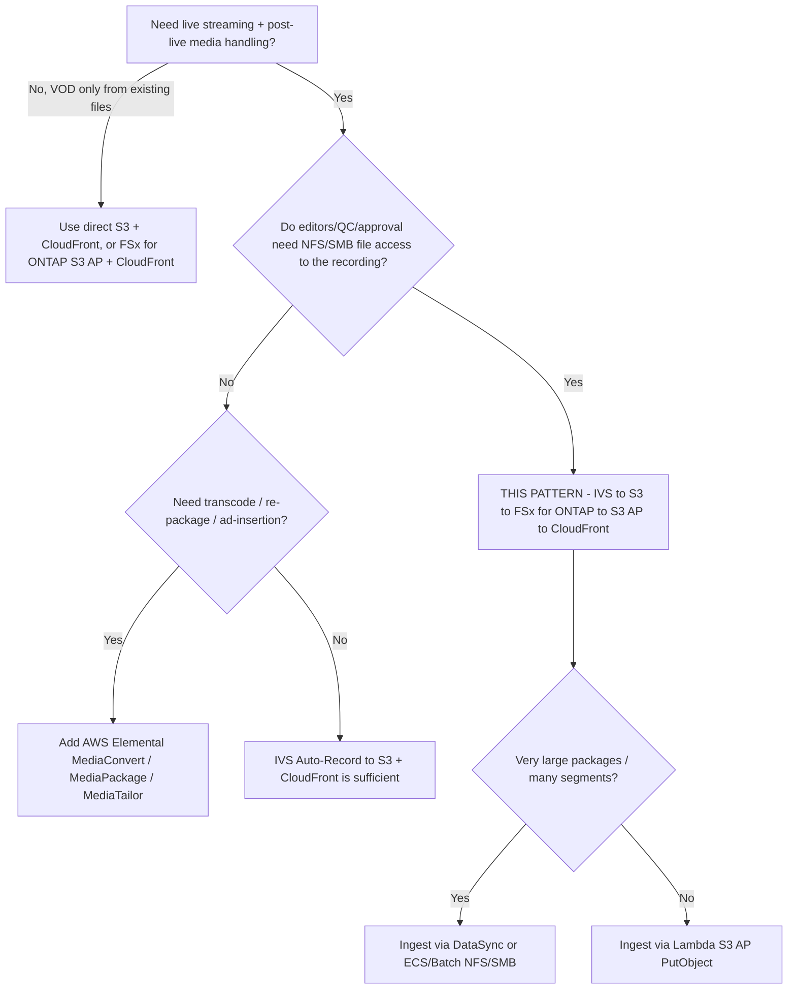

# Architecture — Amazon IVS Live-to-FSx for ONTAP VOD Publishing

🌐 **Language / Langue**: [日本語](architecture.md) | [English](architecture.en.md) | [한국어](architecture.ko.md) | [简体中文](architecture.zh-CN.md) | [繁體中文](architecture.zh-TW.md) | [Français](architecture.fr.md) | [Deutsch](architecture.de.md) | [Español](architecture.es.md)

## Principes de conception

1. **Amazon IVS assure l'expérience live.** Le streaming interactif à faible latence est assuré par
   IVS ; nous ne réimplémentons pas la diffusion live.
2. **Enregistrer vers la destination prise en charge.** IVS enregistre automatiquement vers un
   **bucket Amazon S3 standard** — la seule destination documentée et prise en charge par AWS aujourd'hui.
3. **FSx for ONTAP = espace de travail média post-live.** Une fois l'enregistrement terminé, le
   paquet HLS est publié vers FSx for ONTAP pour que l'édition, le QC et l'approbation opèrent en
   **NFS/SMB** sur les mêmes données que celles consommées par les services d'API S3.
4. **Les S3 Access Points exposent les fichiers résidant sur FSx.** La diffusion VOD et l'analyse
   atteignent les données FSx via l'API S3 par un S3 Access Point (pas de seconde copie dans un
   bucket S3 séparé pour la diffusion).
5. **La limite de diffusion est opérationnelle.** La diffusion publique/contrôlée contourne les ACL
   ONTAP ; ne publier que le contenu approuvé et contrôler l'origine CloudFront.

## Flux de données recommandé

```text
Amazon IVS
  -> Auto-Record to S3 bucket           (supported)
  -> EventBridge "IVS Recording State Change" / "Recording End"
  -> Step Functions
  -> Lambda / ECS / Batch / DataSync    (copy/sync HLS package)
  -> FSx for ONTAP volume               (NFS/SMB workspace + S3 AP surface)
  -> S3 Access Point
  -> CloudFront with OAC (SigV4)
  -> VOD viewers
```

1. Un streamer/encodeur publie vers un **canal Amazon IVS** (RTMPS ou IVS Broadcast SDK).
2. IVS **enregistre automatiquement** la session vers un bucket S3 standard sous le préfixe
   `ivs/v1/<aws_account_id>/<channel_id>/<year>/<month>/<day>/<hours>/<minutes>/<recording_id>`
   (média HLS, manifeste, vignettes, métadonnées JSON).
3. À **Recording End**, IVS émet un événement `IVS Recording State Change` vers **EventBridge**.
   Le traitement en aval ne doit démarrer qu'après Recording End (segments/manifestes non garantis
   complets avant).
4. Une règle EventBridge démarre une machine d'état **Step Functions**.
5. Step Functions exécute un **job de copie/synchronisation** (Lambda pour petits paquets ;
   ECS/Batch/DataSync pour les gros) qui écrit le paquet HLS sur le volume **FSx for ONTAP**.
6. Les outils d'édition/QC/MAM travaillent en **NFS/SMB** ; les mêmes données sont exposées via un
   **S3 Access Point** pour la diffusion et l'analyse.
7. **Amazon CloudFront** (OAC + SigV4) sert le VOD HLS depuis l'origine S3 Access Point.
8. En option, **Lambda / Athena / Glue / Bedrock** traitent les mêmes données via le S3 AP.

## Conception réseau

- **Compute de copie/synchronisation** :
  - Si lecture depuis le bucket S3 standard et écriture vers FSx via **S3 AP `PutObject`**
    (AP Internet-origin), exécuter le worker **hors VPC** (ou via un chemin NAT).
  - Si écriture vers FSx via **montages NFS/SMB**, exécuter le worker **dans le VPC** (ECS/Batch
    avec le montage FSx joignable ; Lambda ne peut pas monter NFS/SMB directement — les écritures
    NFS/SMB vers FSx utilisent donc généralement ECS/Batch).
- Ne pas **mélanger** l'accès au LIF de gestion ONTAP et l'accès S3 AP Internet-origin dans un seul Lambda.
- **CloudFront** atteint l'origine S3 Access Point via Internet avec SigV4 (OAC) ; le VPC Endpoint
  S3 Gateway ne sert pas de front à un S3 AP Internet-origin.

## Deux façons d'écrire dans FSx for ONTAP

| Méthode | Quand l'utiliser | Notes |
|---------|------------------|-------|
| S3 AP `PutObject` | Nombre d'objets modéré, worker serverless (Lambda) | `PutObject` max 5 Go ; multipart au-delà ; l'AP Internet-origin nécessite un worker hors VPC ou NAT |
| Montage NFS/SMB (ECS/Batch/DataSync) | Gros paquets, nombreux petits segments, outils fichiers existants | Préserve la sémantique fichier pour les éditeurs ; DataSync gère efficacement le transfert en masse |

## Conception stockage / débit (Storage lens)

- Le débit provisionné FSx for ONTAP est **partagé** entre NFS/SMB/S3AP. Les fetches d'origine VOD
  et le trafic d'édition rivalisent sur le même volume ; dimensionner sur la **latence P95/P99**.
- Utiliser des TTL CloudFront élevés et **Origin Shield** pour minimiser les fetches d'origine ; les
  segments sont immuables (TTL long), les playlists changent (TTL court).
- Envisager un volume **FlexCache** comme source d'origine CloudFront pour isoler les lectures de
  diffusion du volume d'édition (natif ONTAP, sans changement applicatif).
- Les valeurs quantitatives dépendent de la configuration — baser les estimations de production sur
  la mesure, pas sur cet exemple.

## Contraintes (FSx for ONTAP S3 AP)

- **URL présignées non prises en charge** → auth spectateur via URL/cookies signés CloudFront.
- Pas un bucket S3 complet : pas d'Object Versioning / Object Lock / Lifecycle / Static Website
  Hosting (vérifier par opération dans [../../docs/s3ap-compatibility-notes.md](../../docs/s3ap-compatibility-notes.md)).
- `PutObject` max 5 Go (multipart au-delà).
- Autorisation à deux couches : la politique IAM/AP **et** l'identité du système de fichiers ONTAP
  (UNIX/Windows) doivent toutes deux autoriser.
- `NetworkOrigin` (Internet vs VPC) immuable après création.

## Région / résidence

- Le canal IVS, la Recording Configuration et l'emplacement d'enregistrement S3 doivent être dans la
  **même région**. Co-localiser FSx for ONTAP et le bucket S3 pour éviter le transfert inter-régions.
- CloudFront est global — appliquer la restriction géographique là où le contenu lié à une région ne
  doit pas la quitter.

> **Résidence** (Public Sector lens) : partir du principe « diffusé mondialement par défaut ». Le
> contenu lié à une région doit être exclu de l'ingestion/publication ou verrouillé par la
> restriction géo CloudFront ; la couche de diffusion n'hérite pas des ACL ONTAP.

## Périmètre

- Ce modèle cible l'auto-enregistrement d'**Amazon IVS Low-Latency Streaming** (enregistrements de
  canal sous `ivs/v1/...`). **IVS Real-Time Streaming (stages)** a un modèle d'enregistrement
  différent (enregistrements de participants individuels/composites) et est hors périmètre. L'idée
  « publier vers FSx for ONTAP → diffuser via S3 AP + CloudFront » s'applique néanmoins.
- Le modèle couvre l'**empaquetage/diffusion post-live de HLS déjà encodé**. Il ne **transcode pas,
  ne re-package pas, n'insère pas de publicités**.

> **Flux média** (Media SME lens) : IVS enregistre le HLS en `master.m3u8` multivarié + playlists
> média par rendition + segments (`.ts` pour TS, `.m4s`+init pour fMP4/CMAF) plus vignettes et
> métadonnées JSON. Valider le master multivarié, pas n'importe quelle playlist.

## Édition collaborative near-live pendant le direct (modèle en 3 couches)

« Pendant le direct, insérer des montages en rattrapage ou des sous-titres depuis FSx for ONTAP via
un S3 Access Point » est une demande naturelle, mais du fait du fonctionnement de la diffusion live
d'IVS, il faut décider **à quelle couche** l'insertion a lieu.

| Couche | Ce qui est possible | Rôle du FSx for ONTAP S3 AP |
|--------|---------------------|------------------------------|
| **1. Chemin de diffusion live IVS (géré par IVS)** | encoder → transcodage/packaging IVS → CDN IVS vers les spectateurs. Le **manifeste de lecture live est géré par IVS** ; aucun point d'insertion pour des segments/sous-titres HLS produits en externe. | **Impossible** (manifeste live immuable). La manipulation live côté serveur relève d'AWS Elemental MediaLive / MediaPackage. |
| **2. Superposition côté client (timed metadata)** | Insérer des [Timed Metadata (`PutMetadata`)](https://docs.aws.amazon.com/ivs/latest/LowLatencyUserGuide/metadata.html) synchronisées au direct ; le SDK player **rend sous-titres/bandeaux/graphiques côté client**. `PutMetadata` : max 1 Ko/requête, 5 TPS/canal. | **Indirectement possible** : mettre une « clé de référence d'actif + timecode » dans les métadonnées, et récupérer le texte des sous-titres / images depuis **CloudFront (origine = FSx for ONTAP S3 AP)**. Les équipes éditent les sous-titres via NFS/SMB ; les mêmes données sont servies par S3 AP + CloudFront. |
| **3. Rendition d'édition near-live (côté enregistrement)** | Ingérer en continu le HLS Auto-Record dans FSx for ONTAP, éditer l'enregistrement en cours, et publier une rendition near-live sur une **URL séparée, décalée de quelques dizaines de secondes à quelques minutes**. | **Le point fort** : NLE (SMB) / outils de sous-titres (SMB) / automatisation S3-API / analyse Athena/Bedrock s'exécutent en parallèle sur une **copie unique de référence** sans copies supplémentaires (édition collaborative indépendante du protocole). |

> **Media SME lens** : plutôt que « graver dans le direct lui-même », réalisez cela à la couche 2
> (rendu client) ou couche 3 (rendition near-live), ce qui correspond au fonctionnement d'IVS. Les
> sous-titres gravés (CEA-608/708) sont intégrés côté **encodeur**, non ajoutés ensuite depuis FSx.

### Contraintes honnêtes

- **Near-live, pas vraiment live** : finalisation des segments → ingestion → édition → republication
  ajoutent chacun du délai. Le « rattrapage » suppose un décalage de dizaines de secondes à minutes.
- **Le manifeste live IVS est immuable** : pas d'injection à la couche 1.
- **Les sous-titres gravés en direct** relèvent de l'encodeur (hors IVS).
- Pour la couche 2, rester dans les limites `PutMetadata` 1 Ko / 5 TPS en portant des références, pas les charges utiles.

> **Valeur pour l'utilisateur** (Partner/SI lens) : l'intérêt du modèle dépasse le « VOD post-live »
> pour englober un **espace d'édition collaborative near-live en parallèle du direct**. Édition, QC,
> sous-titrage et analyse s'exécutent en parallèle sur les mêmes données quel que soit le protocole —
> c'est la motivation pour combiner FSx for ONTAP et S3 Access Points.

## Quand utiliser ce modèle — guide de décision



## Alternatives et comment choisir (neutre)

Chaque option convient à un contexte différent. Les compromis sont énoncés symétriquement, y compris
pour l'approche recommandée par ce modèle.

| Option | Convient à | Compromis / considération |
|--------|-----------|---------------------------|
| **Ce modèle** (IVS → S3 → FSx for ONTAP → S3 AP → CloudFront) | Équipes nécessitant **édition/QC/approbation NFS/SMB** sur l'enregistrement *et* diffusion/analyse S3-API sur la même copie | Ajoute un saut d'ingestion (S3 → FSx) et une couche opérationnelle ; limite de diffusion opérationnelle, pas les ACL ONTAP |
| **IVS Auto-Record → S3 + CloudFront** (sans FSx) | Live-to-VOD simple sans post-production par fichiers | Pas d'espace NFS/SMB unifié ; copies séparées si les éditeurs ont besoin de fichiers |
| **AWS Elemental MediaConvert / MediaPackage / MediaTailor** | Transcodage, packaging JIT, DRM, insertion pub côté serveur | Plus de services à exploiter ; ce modèle n'en fait aucun — à combiner au besoin |
| **S3 direct + CloudFront** (fichiers déjà sur S3) | VOD pur de HLS existant sans capture live | Pas de niveau live ; pas de flux fichiers ONTAP |

> **Comment choisir** : selon que vous avez besoin (a) d'un **espace de travail fichier partagé** sur
> l'enregistrement (→ ce modèle), (b) de **traitement média** (→ MediaConvert/MediaPackage/MediaTailor,
> avant ou après FSx), ou (c) du **live-to-VOD le plus simple** (→ IVS + S3 + CloudFront). Composables,
> non exclusifs.

> **Coût** (FinOps lens) : les coûts dominants sont le débit/capacité FSx for ONTAP, l'egress
> CloudFront et le stockage S3 des enregistrements — pas le Lambda. Voir
> [../../docs/cost-calculator.md](../../docs/cost-calculator.md) et dimensionner sur le trafic mesuré,
> pas sur des exécutions d'exemple.

## Fiabilité : sémantique de livraison EventBridge

Amazon IVS livre les événements EventBridge au **mieux** — événements manquants, tardifs ou
désordonnés possibles. Ne pas traiter un unique `Recording End` comme un déclencheur exactly-once garanti.

- **Recommandation** : en production, utiliser `TriggerMode=HYBRID` — EVENT_DRIVEN pour la latence
  plus un filet POLLING (scan `SourcePrefixRoot`) qui réconcilie les enregistrements ayant raté un événement.
- Ne démarrer le traitement en aval qu'**après** `Recording End` (manifestes/segments peut-être incomplets avant).

> **Fiabilité/Ops** (SRE lens) : le scaffold n'implémente **pas** l'idempotence, donc HYBRID peut
> traiter un enregistrement deux fois. Intégrer `shared/idempotency_checker.py` (clé
> `recording_session_id` + `recording_prefix`) avant d'activer HYBRID en production. Câbler une DLQ
> sur la machine d'état / le Lambda pour les événements empoisonnés.

> **Runbook** (Ops lens) : en cas d'échec de publication, consulter `/aws/lambda/<stack>-publish` et
> isoler l'autorisation S3 AP (IAM + politique AP + identité ONTAP) de la lecture source. En cas de
> mauvaise publication, retirer l'objet de l'origine CloudFront et relancer après correction.

## Modération de contenu et rétention (modération opt-in ; rétention native ONTAP)

- **La modération de contenu est opt-in (désactivée par défaut).** Avec `EnableModeration=true`
  (hors DemoMode), exécuter Amazon Rekognition `DetectModerationLabels` sur les vignettes de
  l'enregistrement ; si un libellé ≥ `ModerationMinConfidence` est trouvé, la publication est bloquée
  (`blocked_by_moderation`) et routée vers une revue humaine. C'est un **échantillonnage de vignettes**,
  pas une couverture de contenu complète — pour des besoins plus stricts, ajouter Rekognition async
  `StartContentModeration` (vidéo) / Amazon Transcribe + Comprehend. Ce modèle intègre ce chemin strict en
  opt-in via `functions/moderation/` (async start/collect) et la conversion HLS→MP4 `functions/transcode/`
  (MediaConvert) (`EnableStrictModeration=true` ; exemple Step Functions :
  [samples/strict-moderation.asl.json](samples/strict-moderation.asl.json)). Indépendant de l'heuristique de
  complétude (Human Review).

> **Gouvernance** (Public Sector lens) : « le paquet est complet » ≠ « le contenu est validé pour
> diffusion publique ». Garder l'approbation humaine de publication (Data Owner / Approver) comme
> porte finale ; le score de complétude ne fait qu'y router les éléments.

- **Rétention** : FSx for ONTAP S3 AP ne prend **pas** en charge S3 Lifecycle. Gérer la rétention/le
  tiering VOD nativement ONTAP — **FabricPool** pour le tiering de capacité du VOD froid, **Snapshot**
  pour le point-dans-le-temps, **SnapMirror** pour l'archivage/DR — plutôt que d'attendre un lifecycle S3.

> **Stockage** (Storage Specialist lens) : isoler les lectures d'origine de diffusion du volume
> d'édition avec un volume **FlexCache** comme source d'origine CloudFront ; dimensionner les fetches
> d'origine sur P95/P99 et exploiter Range GET + TTL CloudFront élevé / Origin Shield pour que le VOD
> ne rivalise pas avec l'I/O de QC.

## Adoption par phases

1. **Valider la logique (sans infra)** : `make test-media-ivs-vod-publishing` (tests unitaires + propriétés).
2. **Déploiement DemoMode** : déployer avec `DemoMode=true` (sans dépendance FSx) ; confirmer le
   manifeste de publication, la validation du master manifest et le routage Human Review.
3. **Ingestion réelle** : pointer `RecordingSourceBucket` vers un bucket d'enregistrement IVS,
   `S3AccessPointOutputAlias` vers un S3 AP FSx for ONTAP ; diffuser brièvement et confirmer que
   `ivs/v1/...` atterrit et se publie.
4. **Diffusion** : activer CloudFront (`EnableCloudFront=true`), configurer OAC + politique AP,
   vérifier le GET SigV4 des `.m3u8`/segments ; ajouter URL/cookies signés pour le VOD contrôlé.
5. **Durcir** : HYBRID + idempotence, DLQ, alarmes (`EnableCloudWatchAlarms=true`), intégration de
   modération si publication publique.

> **Partner/SI** (delivery lens) : les phases 1–2 sont un PoC de 30 minutes sans FSx, adapté à la
> première conversation de découverte ; les phases 3–5 correspondent à l'environnement réel de l'utilisateur et
> c'est là que se font le dimensionnement et la validation de gouvernance.

> **App Developer** (developer lens) : le handler déployable est `functions/publish/handler.py`
> (utilise `shared/` pour l'accès S3 AP, la classification des données, la Human Review, l'EMF). Les
> extraits `samples/` sont illustratifs uniquement ; ne pas les déployer.

## FAQ / idées reçues

- **« IVS peut-il enregistrer directement dans un S3 Access Point FSx for ONTAP ? »** Non documenté
  comme pris en charge — à traiter comme Expérimental et valider ([direct-recording-experiment.md](direct-recording-experiment.md)).
- **« Un S3 Access Point est-il un bucket S3 interchangeable ? »** Non — c'est une limite d'accès
  compatible S3. Pas d'URL présignée, Versioning, Object Lock, Lifecycle ni Static Website Hosting.
- **« Peut-on donner une URL présignée du VOD aux spectateurs ? »** Non — utiliser URL/cookies signés CloudFront.
- **« La publication applique-t-elle les permissions NFS/SMB d'origine ? »** Non — la diffusion
  contourne les ACL ONTAP ; la limite est opérationnelle (ne publier que l'approuvé) + verrouillage origine CloudFront.
- **« Un score de complétude élevé signifie-t-il que le contenu est publiable ? »** Non — il vérifie
  seulement que le paquet HLS est complet. La validation du contenu est une étape de modération humaine/IA distincte.
- **« Ai-je besoin de MediaConvert ? »** Seulement pour transcodage/re-packaging/publicités ; ce
  modèle diffuse du HLS déjà encodé.

## Documents associés

- [README (日本語)](README.md) / [README (English)](README.en.md)
- [Validation matrix](validation-matrix.md)
- [Direct recording experiment](direct-recording-experiment.md)
- [Supported path notes](supported-path-ivs-s3-fsx-cloudfront.md)
- [Guide DemoMode](docs/demo-guide.md)
- [Notes de compatibilité S3AP](../../docs/s3ap-compatibility-notes.md) / [Performance S3AP](../../docs/s3ap-performance-considerations.md)
- [Calculateur de coûts](../../docs/cost-calculator.md)
- [Modèle Content Edge Delivery](../content-delivery/README.md)
