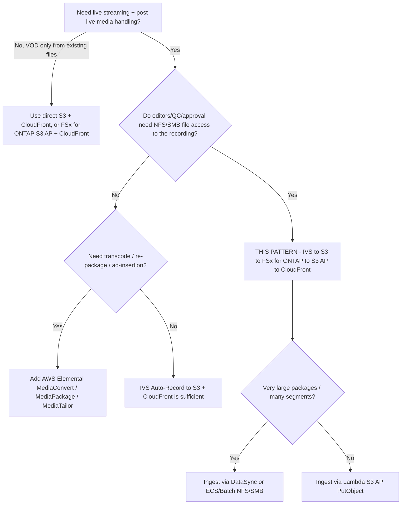

# 아키텍처 — Amazon IVS Live-to-FSx for ONTAP VOD Publishing

🌐 **Language / 언어**: [日本語](architecture.md) | [English](architecture.en.md) | [한국어](architecture.ko.md) | [简体中文](architecture.zh-CN.md) | [繁體中文](architecture.zh-TW.md) | [Français](architecture.fr.md) | [Deutsch](architecture.de.md) | [Español](architecture.es.md)

## 설계 원칙

1. **라이브 경험은 Amazon IVS 가 담당.** 저지연 인터랙티브 스트리밍은 IVS 에 맡기고 라이브 전달을 직접
   재구현하지 않는다.
2. **녹화는 지원되는 대상으로.** IVS 는 **표준 Amazon S3 버킷**에 Auto-Record 한다. 현재 AWS 가 공식
   문서화·지원하는 유일한 대상이다.
3. **FSx for ONTAP = 라이브 이후 미디어 워크스페이스.** 녹화 종료 후 HLS 패키지를 FSx for ONTAP 에
   게시하여, S3 API 서비스가 참조하는 것과 동일한 데이터에서 편집·QC·승인을 **NFS/SMB** 로 수행한다.
4. **S3 Access Points 가 FSx 상 파일을 노출.** VOD 전달과 분석은 S3 Access Point 경유 S3 API 로 FSx
   데이터에 접근한다(전달을 위해 별도 S3 버킷에 이중 복사 불필요).
5. **전달 경계는 운영으로 보장.** 공개/제어 전달은 ONTAP ACL 을 경유하지 않으므로 승인된 콘텐츠만 게시하고
   CloudFront 오리진을 제어한다.

## 권장 데이터 흐름

```text
Amazon IVS
  -> Auto-Record to S3 bucket           (supported)
  -> EventBridge "IVS Recording State Change" / "Recording End"
  -> Step Functions
  -> Lambda / ECS / Batch / DataSync    (copy/sync HLS package)
  -> FSx for ONTAP volume               (NFS/SMB workspace + S3 AP surface)
  -> S3 Access Point
  -> CloudFront with OAC (SigV4)
  -> VOD viewers
```

1. 스트리머/인코더가 **Amazon IVS 채널**로 송출한다(RTMPS 또는 IVS Broadcast SDK).
2. IVS 가 세션을 표준 S3 버킷의
   `ivs/v1/<aws_account_id>/<channel_id>/<year>/<month>/<day>/<hours>/<minutes>/<recording_id>`
   프리픽스 하위에 **Auto-Record** 한다(HLS 미디어, 매니페스트, 썸네일, 메타데이터 JSON).
3. **Recording End** 시 IVS 가 `IVS Recording State Change` 이벤트를 **EventBridge** 로 발행한다.
   후속 처리는 Recording End 이후에만 시작해야 한다(그 전에는 세그먼트/매니페스트 완성이 보장되지 않음).
4. EventBridge 규칙이 **Step Functions** 스테이트 머신을 시작한다.
5. Step Functions 가 **복사/동기화 작업**(소규모는 Lambda, 대규모는 ECS/Batch/DataSync)을 실행해 HLS
   패키지를 **FSx for ONTAP** 볼륨에 기록한다.
6. 편집/QC/MAM 도구는 **NFS/SMB** 로 작업하고, 동일 데이터를 **S3 Access Point** 경유로 전달·분석에 노출한다.
7. **Amazon CloudFront**(OAC + SigV4)가 S3 Access Point 오리진에서 HLS VOD 를 전달한다.
8. 선택적으로 **Lambda / Athena / Glue / Bedrock** 이 S3 AP 경유로 동일 데이터를 처리한다.

## 네트워크 설계

- **복사/동기화 컴퓨트**:
  - 표준 S3 버킷에서 읽고 **S3 AP `PutObject`**(Internet-origin AP)로 FSx 에 쓰는 경우 워커를 **VPC 밖**에서
    실행한다(또는 NAT 경로 사용).
  - **NFS/SMB 마운트**로 FSx 에 쓰는 경우 워커를 **VPC 안**에서 실행한다(FSx 마운트에 도달 가능한 ECS/Batch.
    Lambda 는 NFS/SMB 를 직접 마운트할 수 없으므로 FSx 로의 NFS/SMB 쓰기는 보통 ECS/Batch 사용).
- 하나의 Lambda 에서 ONTAP 관리 LIF 접근과 Internet-origin S3 AP 접근을 **혼용하지 않는다**.
- **CloudFront** 는 SigV4(OAC)로 인터넷 경유하여 S3 Access Point 오리진에 도달한다. S3 Gateway VPC
  엔드포인트는 Internet-origin S3 AP 의 프런트가 되지 않는다.

## FSx for ONTAP 로의 두 가지 쓰기 방식

| 방식 | 사용처 | 비고 |
|------|--------|------|
| S3 AP `PutObject` | 객체 수 보통, 워커가 서버리스(Lambda) | `PutObject` 최대 5 GB, 초과는 multipart. Internet-origin AP 는 VPC 밖 워커 또는 NAT 필요 |
| NFS/SMB 마운트(ECS/Batch/DataSync) | 대용량 패키지, 다수 소규모 세그먼트, 기존 파일 도구 | 편집자를 위한 파일 시맨틱 보존. DataSync 는 대량 전송을 효율적으로 처리 |

## 스토리지 / 스루풋 설계(Storage lens)

- FSx for ONTAP 프로비저닝 스루풋은 NFS/SMB/S3AP 에서 **공유**된다. VOD 오리진 페치와 편집 트래픽이 동일
  볼륨에서 경합하므로 **P95/P99(tail latency)** 로 사이징한다.
- 높은 CloudFront TTL 과 **Origin Shield** 로 오리진 페치를 최소화한다. 세그먼트는 불변(장 TTL),
  플레이리스트는 변화(단 TTL).
- 전달 읽기를 프로덕션 편집 볼륨에서 분리하려면 **FlexCache** 볼륨을 CloudFront 오리진 소스로 고려한다
  (ONTAP 네이티브, 앱 변경 불필요).
- 정량값은 구성 종속 — 프로덕션 산정은 본 샘플이 아니라 실측에 기반할 것.

## 제약(FSx for ONTAP S3 AP)

- **Presigned URL 미지원** → 시청자 인증은 CloudFront 서명 URL/쿠키 사용.
- 완전한 S3 버킷 아님: Object Versioning / Object Lock / Lifecycle / Static Website Hosting 미지원
  (작업별로 [../../docs/s3ap-compatibility-notes.md](../../docs/s3ap-compatibility-notes.md) 확인).
- `PutObject` 최대 5 GB(초과는 multipart).
- 이중 인가: IAM/AP 정책 **과** ONTAP 파일 시스템 identity(UNIX/Windows) 모두 허용해야 함.
- `NetworkOrigin`(Internet vs VPC)은 생성 후 변경 불가.

## 리전 / 데이터 소재지

- IVS 채널·Recording Configuration·S3 녹화 위치는 **동일 리전**이어야 한다. 크로스 리전 전송을 피하려면
  FSx for ONTAP 와 S3 버킷을 동일 리전에 배치한다.
- CloudFront 는 글로벌 — 리전 외 전달이 불가한 콘텐츠에는 지역 제한을 적용한다.

> **데이터 소재지**(Public Sector lens): "기본적으로 전 세계로 전달됨"을 출발 전제로 삼는다. 리전 고정
> 콘텐츠는 수집/게시 대상에서 제외하거나 CloudFront 지역 제한으로 게이트한다. 전달 계층은 ONTAP ACL 을
> 상속하지 않는다.

## 스코프

- 본 패턴은 **Amazon IVS Low-Latency Streaming** 의 Auto-Record(`ivs/v1/...` 하위 채널 녹화)를 대상으로 한다.
  **IVS Real-Time Streaming(stages)** 은 녹화 모델이 다르며(개별/합성 participant recording) 여기서는 대상 외.
  다만 "FSx for ONTAP 에 게시 → S3 AP + CloudFront 로 전달" 개념은 적용 가능.
- 대상은 **인코딩된 HLS 의 라이브 이후 패키징/전달**. 트랜스코딩·재패키징·광고 삽입은 **하지 않는다**.

> **미디어 워크플로**(Media SME lens): IVS 는 HLS 를 multivariate `master.m3u8` + 렌디션별 미디어
> 플레이리스트 + 세그먼트(TS 는 `.ts`, fMP4/CMAF 는 `.m4s`+init)와 썸네일·녹화 메타데이터 JSON 으로
> 기록한다. 임의 플레이리스트가 아니라 multivariate master 를 검증할 것.

## 라이브 병행 near-live 공동 편집(3-레이어 정리)

"라이브 중에 FSx for ONTAP 에서 S3 Access Point 를 통해 따라잡기 편집이나 자막을 삽입하고 싶다"는
요구는 자연스럽지만, IVS 라이브 전달 구조상 **어느 레이어에서 삽입할지**를 나누어 설계해야 한다.

| 레이어 | 무엇이 가능한가 | FSx for ONTAP S3 AP 의 관여 |
|--------|----------------|------------------------------|
| **1. IVS 라이브 전달 경로(IVS 관리)** | encoder → IVS 트랜스코드/패키징 → IVS CDN 으로 시청자에게. 이 **라이브 재생 매니페스트는 IVS 가 관리**하며, 외부에서 만든 HLS 세그먼트/자막을 나중에 끼워 넣을 훅이 없다. | **불가**(라이브 매니페스트는 불변). 서버 측 라이브 가공은 AWS Elemental MediaLive / MediaPackage 영역. |
| **2. 클라이언트 측 오버레이(timed metadata)** | [Timed Metadata(`PutMetadata`)](https://docs.aws.amazon.com/ivs/latest/LowLatencyUserGuide/metadata.html) 를 라이브에 동기 삽입하고 플레이어 SDK 가 **클라이언트에서 자막·자막바·그래픽을 렌더링**. `PutMetadata` 는 요청당 최대 1 KB·채널당 5 TPS. | **간접적으로 가능**: metadata 에 "에셋 참조 키 + 타임코드"를 싣고, 자막 본문/오버레이 이미지 실체는 **CloudFront(오리진 = FSx for ONTAP S3 AP)** 에서 가져오게 한다. 편집팀은 NFS/SMB 로 자막을 쓰고, 같은 데이터를 S3 AP + CloudFront 가 배포. |
| **3. near-live 편집 렌디션(녹화 측)** | Auto-Record 된 HLS 를 지속적으로 FSx for ONTAP 로 취합하고, 편집팀이 growing recording 을 편집해 **라이브보다 수십 초~수 분 지연된 별도 URL** 로 near-live 배포. | **핵심**: NLE(SMB) / 자막 도구(SMB) / S3-API 자동화 / Athena·Bedrock 분석이 복사 없이 **단일 정본 데이터** 위에서 병행(프로토콜 무관 공동 편집). |

> **Media SME lens**: "라이브 자체에 굽는" 것이 아니라 레이어 2(클라이언트 렌더링) 또는 레이어 3
> (near-live 별도 렌디션)에서 구현하는 것이 IVS 방식에 맞다. 영상에 구워진 클로즈드 캡션
> (CEA-608/708)은 **인코더 측**에서 삽입하며 FSx 에서 나중에 넣는 것이 아니다.

### 솔직한 제약

- **진짜 라이브가 아니라 near-live**: 세그먼트 확정 → 취합 → 편집 → 재배포만큼 반드시 지연된다.
  "따라잡기"는 수십 초~분 단위 지연이 전제.
- **IVS 라이브 매니페스트는 불변**: 레이어 1 삽입은 불가.
- **라이브 굽기 자막**은 인코더 측(IVS 외부).
- 레이어 2 는 `PutMetadata` 1 KB / 5 TPS 한도에 맞게 실체가 아닌 참조를 싣는다.

> **이용자 가치**(Partner/SI lens): 이 패턴의 매력은 "라이브 이후 VOD 화"뿐 아니라
> **라이브와 병행하는 near-live 공동 편집 워크스페이스**로 확장된다. 편집·QC·자막·분석이 프로토콜과
> 무관하게 같은 데이터 위에서 병행되는 점이 FSx for ONTAP + S3 Access Points 조합의 동기다.

## 배포의 과제와 해결 아이디어(유스케이스 모음)

라이브 이후 VOD 나 near-live 편집 외에도, 배포 현장에서 흔한 과제는 S3 Access Points 로 노출하는
FSx for ONTAP 공유 미디어 워크스페이스에 매핑할 수 있다. 아래는 우열이 아니라 **용도에 따른 선택지와
트레이드오프**이며, 명시된 보완 서비스와 조합해 사용한다.

| 배포 과제 | 해결 아이디어(FSx for ONTAP + S3 AP + IVS) | 보완 서비스 | 솔직한 트레이드오프 |
|---|---|---|---|
| 다국어 자막/번역으로 해외 시청자에게 전달 | 로컬라이제이션 팀이 같은 녹화에 대해 NFS/SMB 로 자막 에셋을 만들고, VTT 를 S3 AP + CloudFront(near-live 렌디션)로 배포하거나 timed metadata 로 클라이언트 오버레이 구동 | Amazon Transcribe, Amazon Translate, 라이브 자막 파트너 | 라이브 번역은 near-live. 규제/브랜드 민감 콘텐츠는 사람 검토 권장 |
| 긴 라이브를 하이라이트/클립으로 신속히 | EventBridge → Step Functions 로 확정 세그먼트를 하이라이트 소재로 FSx for ONTAP 에 잘라내고 SMB 로 편집, S3 AP + CloudFront 로 공개 | AWS Elemental MediaConvert(렌디션) | 세그먼트 확정 지연. 클립 정확도는 마커/타임코드에 의존 |
| 고지연 회선의 원격/지리 분산 편집 | 편집자 근처에 FlexCache 로 로컬 같은 캐시를 두고 저해상도 프록시로 편집(풀 해상도는 오리진 볼륨 유지) | — | FlexCache 는 캐시 운영 증가. 프록시 운영은 생성 단계 필요 |
| 미디어 라이브러리 증가와 스토리지 비용 | FabricPool 로 콜드 소재를 capacity pool 로 계층화하고 핫한 편집 데이터는 SSD 유지 | — | 계층화는 ONTAP 네이티브(S3 AP 는 S3 Lifecycle 미제공). 콜드 데이터는 회수 지연 |
| 미디어 운영의 사업 연속성 | SnapMirror 로 미디어 워크스페이스를 크로스 리전 복제, Snapshot 으로 특정 시점 복구, 3-2-1 방침에 정합 | CloudFront + AWS 미디어 서비스 복원력 | 소스 데이터와 인덱스의 RPO/RTO 를 별도 정의. 복제 비용 |
| 인터랙티브 라이브 커머스/인게이지먼트 | IVS timed metadata 로 상품 오버레이·결정적 순간을 구동, 상품/카탈로그/오버레이 자산을 FSx for ONTAP 에 두고 S3 AP + CloudFront 로 배포, 순간을 VOD 로 클립 | IVS timed metadata, IVS chat | PutMetadata 1 KB / 5 TPS. 오버레이는 클라이언트 렌더링 |
| 규제 대응 보존/감사 | 녹화를 ONTAP 에서 Snapshot/보존 기능과 감사 추적과 함께 보존, 타이틀/롤 단위 읽기 경로를 별도 access point 로 노출 | — | 불변성/보존 기능은 FSx for ONTAP 버전·관할에서 검증 필요. 이는 거버넌스 지침이며 법적 조언이 아님 |
| 검색 가능한 미디어 아카이브 | 녹화를 전사해 검색용 인덱스화하고 데이터를 FSx for ONTAP 밖으로 복사하지 않고 S3 AP 로 분석 | Amazon Transcribe, Athena/Glue, Amazon Bedrock, OpenSearch | 추출/인덱스 비용. 검색 시 타이틀 단위 접근 제어 적용 |

> **중립 프레이밍**: 각 행은 문맥에 맞는 선택지다. 서버 측 라이브 가공·패키징·광고 삽입은 AWS Elemental
> MediaLive / MediaPackage / MediaTailor 영역이며, 본 패턴은 파일 + S3 API 미디어 워크스페이스와
> 라이브 이후/near-live 배포에 초점을 둔다. 워크로드·제약·트레이드오프로 선택한다.

## 언제 이 패턴을 쓰는가 — 의사결정 가이드



## 대안과 선택 방법(중립)

각 선택지는 서로 다른 상황에 적합하다. 트레이드오프는 권장안을 포함해 대칭으로 기술한다.

| 선택지 | 적합한 상황 | 트레이드오프 / 고려사항 |
|--------|-----------|----------------------|
| **본 패턴**(IVS → S3 → FSx for ONTAP → S3 AP → CloudFront) | 녹화에 **파일 프로토콜(NFS/SMB) 편집/QC/승인**이 필요하고 동일 사본으로 S3 API 전달/분석도 수행하는 팀 | 수집 홉(S3 → FSx)과 운영 계층 증가. 전달 경계는 ONTAP ACL 이 아닌 운영으로 보장 |
| **IVS Auto-Record → S3 + CloudFront**(FSx 없음) | 파일 기반 후반작업이 불필요한 단순 live-to-VOD | 통합 NFS/SMB 워크스페이스 없음. 편집에 파일이 필요하면 사본 분리 |
| **AWS Elemental MediaConvert / MediaPackage / MediaTailor** | 트랜스코딩, JIT 패키징, DRM, 서버측 광고 삽입 | 운영 대상 증가. 본 패턴은 미수행 — 필요 시 조합 |
| **직접 S3 + CloudFront**(이미 S3 상 파일) | 라이브 수집 없는 기존 HLS 의 순수 VOD | 라이브 계층 없음, ONTAP 파일 워크플로 없음 |

> **선택 방법**: (a) 녹화에 대한 **공유 파일 워크스페이스**가 필요한가(→ 본 패턴), (b) **미디어 처리**가
> 필요한가(→ MediaConvert/MediaPackage/MediaTailor. FSx 앞뒤 어디든 배치 가능), (c) **가장 단순한
> live-to-VOD** 인가(→ IVS + S3 + CloudFront)로 선택. 이들은 배타적이지 않고 조합 가능.

> **비용**(FinOps lens): 지배적 비용은 FSx for ONTAP 스루풋/용량, CloudFront egress, 녹화의 S3 스토리지이며
> Lambda 가 아니다. [../../docs/cost-calculator.md](../../docs/cost-calculator.md) 참조, 샘플 실행이 아니라
> 실측 트래픽으로 사이징할 것.

## 신뢰성: EventBridge 전달 시맨틱

Amazon IVS 의 EventBridge 이벤트는 **베스트에포트** 전달로 누락·지연·순서 역전이 가능하다. 단일
`Recording End` 이벤트를 exactly-once 트리거로 전제하지 말 것.

- **권장**: 프로덕션은 `TriggerMode=HYBRID` 사용 — 저지연 EVENT_DRIVEN 에 더해 이벤트를 놓친 녹화를 보완하는
  POLLING 백스톱(`SourcePrefixRoot` 스캔) 병용.
- 후속 처리는 `Recording End` **이후**에만 시작(그 전에는 매니페스트/세그먼트가 미완성일 수 있음).

> **Reliability/Ops**(SRE lens): 본 스캐폴드는 멱등성 **미구현**이므로 HYBRID 는 녹화를 이중 처리할 수 있다.
> 프로덕션에서 HYBRID 활성화 전 `recording_session_id` + `recording_prefix` 를 키로 한
> `shared/idempotency_checker.py` 를 통합. poison 이벤트용 DLQ 를 스테이트 머신/Lambda 에 배선한다.

> **Runbook**(Ops lens): publish 실패 시 `/aws/lambda/<stack>-publish` 확인, S3 AP 인가(IAM + AP policy +
> ONTAP identity)와 소스 읽기를 분리. 오배포 시 CloudFront 오리진 경로에서 해당 객체 제거 후 원인 수정하여 재실행.

## 콘텐츠 모더레이션과 보존(모더레이션은 opt-in; 보존은 ONTAP 네이티브)

- **콘텐츠 모더레이션은 opt-in(기본 꺼짐).** `EnableModeration=true`(비 DemoMode)로 녹화 썸네일에 Amazon
  Rekognition `DetectModerationLabels` 를 실행하고, `ModerationMinConfidence` 이상 라벨이 나오면 게시를 차단
  (`blocked_by_moderation`)하고 사람 검토로 라우팅한다. 이는 **썸네일 샘플 검사**이며 전체 콘텐츠 커버리지가
  아니다 — 더 엄격하려면 Rekognition 비동기 `StartContentModeration`(동영상) / Amazon Transcribe + Comprehend
  (음성/자막)를 병행한다. 본 패턴은 이 엄격 경로를 opt-in `functions/moderation/`(비동기 start/collect)와
  HLS→MP4 변환 `functions/transcode/`(MediaConvert)로 동봉한다(`EnableStrictModeration=true`, Step Functions
  샘플: [samples/strict-moderation.asl.json](samples/strict-moderation.asl.json)). 완전성 휴리스틱(Human Review)과
  독립적으로 동작한다.

> **거버넌스**(Public Sector lens): "패키지가 완비됨" ≠ "공개 승인됨". 사람의 게시 승인(Data Owner /
> Approver)을 최종 게이트로 유지하고, 완전성 스코어는 그 게이트로 라우팅만 한다.

- **보존**: FSx for ONTAP S3 AP 는 S3 Lifecycle 을 **지원하지 않는다**. VOD 보존/계층화는 ONTAP 네이티브로
  관리 — 콜드 VOD 는 **FabricPool** 용량 계층, 특정 시점은 **Snapshot**, 아카이브/DR 은 **SnapMirror** 를
  사용하고 S3 버킷 lifecycle 을 기대하지 말 것.

> **스토리지**(Storage Specialist lens): 전달 오리진 읽기를 편집 볼륨에서 분리하려면 **FlexCache** 볼륨을
> CloudFront 오리진 소스로 사용. 오리진 페치는 P95/P99 로 사이징하고 Range GET 과 높은 CloudFront TTL /
> Origin Shield 를 활용해 VOD 가 QC I/O 와 경합하지 않게 한다.

## 단계적 도입

1. **로직 검증(인프라 불필요)**: `make test-media-ivs-vod-publishing`(단위 + 속성 테스트).
2. **DemoMode 배포**: `DemoMode=true` 로 배포(FSx 의존 없음). publish 매니페스트, master manifest 검증,
   Human Review 라우팅 확인.
3. **실 수집**: `RecordingSourceBucket` 을 IVS 녹화 버킷, `S3AccessPointOutputAlias` 를 FSx for ONTAP S3 AP 로
   지정하고 짧게 송출해 `ivs/v1/...` 착지와 게시를 확인.
4. **전달**: CloudFront 활성화(`EnableCloudFront=true`), OAC + AP 정책 설정, `.m3u8`/세그먼트의 SigV4 GET 확인.
   제어 VOD 는 서명 URL/쿠키 추가.
5. **강화**: HYBRID + 멱등성, DLQ, 경보(`EnableCloudWatchAlarms=true`), 공개 시 모더레이션 통합.

> **Partner/SI**(delivery lens): 페이즈 1–2 는 30 분·FSx 불필요 PoC 로 첫 디스커버리 대화에 적합. 페이즈 3–5 는
> 이용자 실환경에 매핑되며 사이징과 거버넌스 승인이 이뤄지는 지점.

> **App Developer**(developer lens): 배포 대상 핸들러는 `functions/publish/handler.py`(S3 AP 접근,
> 데이터 분류, Human Review, EMF 에 `shared/` 사용). `samples/` 스니펫은 설명용이며 배포하지 말 것.

## FAQ / 흔한 오해

- **"IVS 녹화를 FSx for ONTAP S3 Access Point 로 직접?"** 설정 생성은 `ACTIVE` 가 되지만, 검증 환경의 실제 라이브
  스트림에서는 **"Recording Start Failure"** 가 발생하고 `ivs/v1/...` 객체가 기록되지 않음. 공식 지원 명시도 없어 Experimental 로 취급
  ([direct-recording-experiment.md](direct-recording-experiment.md)).
- **"S3 Access Point 는 S3 버킷 대체?"** 아니오 — S3 호환 접근 경계. Presigned URL, Versioning, Object Lock,
  Lifecycle, Static Website Hosting 미지원.
- **"시청자에게 VOD presigned URL?"** 아니오 — CloudFront 서명 URL/쿠키 사용.
- **"게시가 원래 NFS/SMB 권한을 강제?"** 아니오 — 전달은 ONTAP ACL 을 경유하지 않음. 경계는 운영(승인된 것만
  게시) + CloudFront 오리진 잠금.
- **"완전성 스코어가 높으면 공개 안전?"** 아니오 — HLS 패키지 완비 여부만 확인. 콘텐츠 공개 가부는 별도의
  사람/AI 모더레이션 단계.
- **"MediaConvert 필요?"** 트랜스코딩/재패키징/광고가 필요할 때만. 본 패턴은 인코딩된 HLS 를 전달한다.

## 관련 문서

- [README (日本語)](README.md) / [README (English)](README.en.md)
- [Validation matrix](validation-matrix.md)
- [Direct recording experiment](direct-recording-experiment.md)
- [Supported path notes](supported-path-ivs-s3-fsx-cloudfront.md)
- [DemoMode 가이드](docs/demo-guide.md)
- [S3AP 호환성 노트](../../docs/s3ap-compatibility-notes.md) / [S3AP 성능](../../docs/s3ap-performance-considerations.md)
- [비용 계산](../../docs/cost-calculator.md)
- [Content Edge Delivery 패턴](../content-delivery/README.md)
