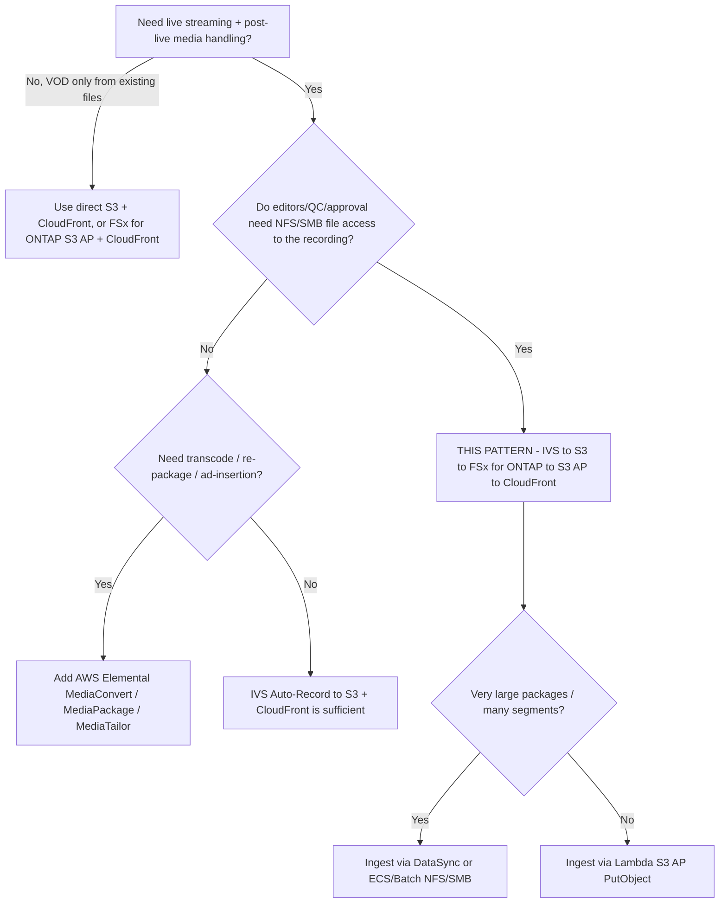

# アーキテクチャ — Amazon IVS Live-to-FSx for ONTAP VOD Publishing

🌐 **Language / 言語**: [日本語](architecture.md) | [English](architecture.en.md) | [한국어](architecture.ko.md) | [简体中文](architecture.zh-CN.md) | [繁體中文](architecture.zh-TW.md) | [Français](architecture.fr.md) | [Deutsch](architecture.de.md) | [Español](architecture.es.md)

## 設計原則

1. **ライブ体験は Amazon IVS が担う。** 低遅延のインタラクティブ配信は IVS に任せ、ライブ配信を
   自前で再実装しない。
2. **録画はサポートされた出力先へ。** IVS は **標準の Amazon S3 バケット** に Auto-Record する。
   これが現時点で AWS 公式にドキュメント化・サポートされた唯一の出力先である。
3. **FSx for ONTAP = ライブ後のメディアワークスペース。** 録画完了後、HLS パッケージを FSx for ONTAP へ
   publish し、編集・QC・承認を **NFS/SMB** で、S3 API サービスが参照するのと同一データ上で行えるようにする。
4. **S3 Access Points が FSx 上のファイルを公開する。** VOD 配信と分析は、S3 Access Point 経由の S3 API で
   FSx データへアクセスする（配信のために別 S3 バケットへ二重コピーする必要はない）。
5. **配信境界は運用で担保する。** 公開/制御配信は ONTAP の ACL を経由しないため、承認済みコンテンツのみを
   publish し、CloudFront オリジンを制御する。

## 推奨データフロー

```text
Amazon IVS
  -> Auto-Record to S3 bucket           (supported)
  -> EventBridge "IVS Recording State Change" / "Recording End"
  -> Step Functions
  -> Lambda / ECS / Batch / DataSync    (copy/sync HLS package)
  -> FSx for ONTAP volume               (NFS/SMB workspace + S3 AP surface)
  -> S3 Access Point
  -> CloudFront with OAC (SigV4)
  -> VOD viewers
```

1. 配信者/エンコーダが **Amazon IVS チャンネル** へ配信する（RTMPS または IVS Broadcast SDK）。
2. IVS がセッションを標準 S3 バケットの
   `ivs/v1/<aws_account_id>/<channel_id>/<year>/<month>/<day>/<hours>/<minutes>/<recording_id>`
   プレフィックス配下に **Auto-Record** する（HLS メディア、マニフェスト、サムネイル、メタデータ JSON）。
3. **Recording End** で IVS が `IVS Recording State Change` イベントを **EventBridge** に発行する。
   後続処理は Recording End 後にのみ開始すること（それ以前はセグメント/マニフェストの完成が保証されない）。
4. EventBridge ルールが **Step Functions** ステートマシンを起動する。
5. Step Functions が **コピー/同期ジョブ**（小規模は Lambda、大規模は ECS/Batch/DataSync）を実行し、
   HLS パッケージを **FSx for ONTAP** ボリュームへ書き込む。
6. 編集/QC/MAM ツールは **NFS/SMB** で作業し、同一データを **S3 Access Point** 経由で配信・分析に公開する。
7. **Amazon CloudFront**（OAC + SigV4）が S3 Access Point オリジンから HLS VOD を配信する。
8. 任意で **Lambda / Athena / Glue / Bedrock** が S3 AP 経由で同一データを処理する。

## ネットワーク設計

- **コピー/同期コンピュート**:
  - 標準 S3 バケットから読み取り、**S3 AP `PutObject`**（Internet-origin AP）で FSx へ書き込む場合は、
    ワーカーを **VPC 外** で実行する（または NAT 経路を使う）。
  - **NFS/SMB マウント** で FSx へ書き込む場合は、ワーカーを **VPC 内** で実行する（FSx マウントへ到達
    できる ECS/Batch。Lambda は NFS/SMB を直接マウントできないため、FSx への NFS/SMB 書き込みは通常
    ECS/Batch を用いる）。
- 1 つの Lambda で ONTAP 管理 LIF アクセスと Internet-origin S3 AP アクセスを **混在させない**。
- **CloudFront** は SigV4（OAC）でインターネット経由に S3 Access Point オリジンへ到達する。S3 Gateway
  VPC エンドポイントは Internet-origin S3 AP のフロントにはならない。

## FSx for ONTAP への 2 通りの書き込み方式

| 方式 | 使いどころ | 注記 |
|------|-----------|------|
| S3 AP `PutObject` | オブジェクト数が中程度、ワーカーがサーバーレス（Lambda） | `PutObject` は最大 5 GB、超過は multipart。Internet-origin AP は VPC 外ワーカーまたは NAT が必要 |
| NFS/SMB マウント（ECS/Batch/DataSync） | 大容量パッケージ、多数の小セグメント、既存のファイルツール | 編集者向けにファイルセマンティクスを保持。DataSync は大量転送を効率的に処理 |

## ストレージ / スループット設計（Storage lens）

- FSx for ONTAP のプロビジョンドスループットは NFS/SMB/S3AP で **共有** される。VOD オリジンフェッチと
  編集トラフィックが同一ボリュームで競合するため、**P95/P99（tail latency）** でサイジングする。
- 高い CloudFront TTL と **Origin Shield** でオリジンフェッチを最小化する。セグメントは不変（長 TTL）、
  プレイリストは変化する（短 TTL）。
- 配信読み取りを本番編集ボリュームから分離するため、**FlexCache** ボリュームを CloudFront オリジンの
  ソースにすることを検討する（ONTAP ネイティブ、アプリ変更不要）。
- 定量値は構成依存 — 本番見積もりは本サンプルではなく実測に基づくこと。

## 制約（FSx for ONTAP S3 AP 由来）

- **Presigned URL 非対応** → 視聴者認証は CloudFront ネイティブの署名付き URL/Cookie を使用。
- フル S3 バケットではない: Object Versioning / Object Lock / Lifecycle / Static Website Hosting は非対応
  （操作ごとに [../../docs/s3ap-compatibility-notes.md](../../docs/s3ap-compatibility-notes.md) で確認）。
- `PutObject` は最大 5 GB（超過は multipart）。
- 二層認可: IAM/AP ポリシー **と** ONTAP ファイルシステム identity（UNIX/Windows）の両方が許可すること。
- `NetworkOrigin`（Internet か VPC か）は作成後に変更不可。

## リージョン / データ所在地

- IVS チャンネル・Recording Configuration・S3 録画ロケーションは **同一リージョン** であること。
  クロスリージョン転送を避けるため FSx for ONTAP と S3 バケットを同一リージョンに配置する。
- CloudFront はグローバル — リージョン外配信が許容されないコンテンツには地域制限を適用する。

> **データ所在地**（Public Sector lens）: 「デフォルトでグローバル配信される」を出発点の前提とすること。
> リージョン固定コンテンツは取り込み/publish の対象から除外するか、CloudFront の地域制限で制御する。
> 配信レイヤは ONTAP の ACL を継承しない。

## スコープ

- 本パターンは **Amazon IVS Low-Latency Streaming** の Auto-Record（`ivs/v1/...` 配下のチャンネル録画）を
  対象とする。**IVS Real-Time Streaming（stages）** は録画モデルが異なり（個別/合成の participant recording）
  ここでは対象外。ただし「FSx for ONTAP へ publish → S3 AP + CloudFront で配信」という考え方は適用可能。
- 対象は **エンコード済み HLS のライブ後パッケージング/配信**。トランスコード・再パッケージ・広告挿入は **行わない**。

> **メディアワークフロー**（Media SME lens）: IVS は HLS を multivariate `master.m3u8` + レンディション別
> メディアプレイリスト + セグメント（TS は `.ts`、fMP4/CMAF は `.m4s`+init）に加え、サムネイルと録画
> メタデータ JSON として記録する。任意のプレイリストではなく multivariate master を検証すること。

## いつ本パターンを使うか — 意思決定ガイド



## 代替と選び方（中立）

各選択肢は異なる状況に適する。トレードオフは本パターンの推奨案を含めて対称に記載する。

| 選択肢 | 向いている状況 | トレードオフ / 考慮点 |
|--------|--------------|---------------------|
| **本パターン**（IVS → S3 → FSx for ONTAP → S3 AP → CloudFront） | 録画に **ファイルプロトコル（NFS/SMB）での編集/QC/承認** が必要で、かつ同一コピーで S3 API 配信/分析も行うチーム | 取り込みホップ（S3 → FSx）と運用レイヤが増える。配信境界は ONTAP ACL ではなく運用で担保 |
| **IVS Auto-Record → S3 + CloudFront**（FSx なし） | ファイルベースの後処理が不要な単純な live-to-VOD | 統合 NFS/SMB ワークスペースなし。編集にファイルが要る場合はコピーが分かれる |
| **AWS Elemental MediaConvert / MediaPackage / MediaTailor** | トランスコード、JIT パッケージング、DRM、サーバーサイド広告挿入 | 運用対象が増える。本パターンはこれらを行わない — 必要時に組み合わせる |
| **直接 S3 + CloudFront**（既に S3 上のファイル） | ライブ収録なしの既存 HLS の純粋 VOD | ライブ層なし、ONTAP ファイルワークフローなし |

> **選び方**: (a) 録画に対する **共有ファイルワークスペース** が必要か（→ 本パターン）、(b) **メディア処理**
> が必要か（→ MediaConvert/MediaPackage/MediaTailor。FSx の前後どちらにも置ける）、(c) **最も単純な
> live-to-VOD** か（→ IVS + S3 + CloudFront）で選ぶ。これらは排他ではなく組み合わせ可能。

> **コスト**（FinOps lens）: 支配的コストは FSx for ONTAP のスループット/容量、CloudFront egress、録画の
> S3 ストレージであり、Lambda ではない。[../../docs/cost-calculator.md](../../docs/cost-calculator.md) を参照し、
> サンプル実行ではなく実測トラフィックでサイジングすること。

## 信頼性: EventBridge 配信セマンティクス

Amazon IVS の EventBridge イベントは **ベストエフォート** 配信であり、欠落・遅延・順序前後がありうる。
単一の `Recording End` イベントを exactly-once トリガーとして前提にしないこと。

- **推奨**: 本番では `TriggerMode=HYBRID` を使う — 低遅延の EVENT_DRIVEN に加え、イベントを取りこぼした
  録画を補完する POLLING バックストップ（`SourcePrefixRoot` 走査）を併用する。
- 後続処理は `Recording End` **後** にのみ開始する（それ以前はマニフェスト/セグメントが未完成のことがある）。

> **Reliability/Ops**（SRE lens）: 本雛形は冪等化を **未実装** のため、HYBRID は録画を二重処理しうる。
> 本番で HYBRID を有効化する前に `recording_session_id` + `recording_prefix` をキーにした
> `shared/idempotency_checker.py` を組み込むこと。poison イベント向けにステートマシン/Lambda へ DLQ を配線する。

> **Runbook**（Ops lens）: publish 失敗時は `/aws/lambda/<stack>-publish` を確認し、S3 AP 認可
> （IAM + AP policy + ONTAP identity）と取り込み元読み取りを切り分ける。誤公開時は CloudFront オリジン
> パスから該当オブジェクトを除去し、原因修正後に再実行する。

## コンテンツモデレーションと保持（モデレーションは opt-in、保持は ONTAP ネイティブ）

- **コンテンツモデレーションは opt-in（既定オフ）。** `EnableModeration=true`（非 DemoMode）で、録画パッケージ内の
  サムネイルに Amazon Rekognition `DetectModerationLabels` を実行し、`ModerationMinConfidence` 以上のラベルが
  出たら publish をブロック（`blocked_by_moderation`）して人手確認へ回す。これは**サムネイルのサンプル検査**で
  あり本文全編の網羅ではない。より厳密には Rekognition 非同期 `StartContentModeration`（動画）/ Amazon
  Transcribe + Comprehend（音声/字幕）を併用する。本パターンはこの厳密パスを opt-in の
  `functions/moderation/`（非同期 start/collect）＋ HLS→MP4 変換 `functions/transcode/`（MediaConvert）
  として同梱する（`EnableStrictModeration=true`、Step Functions サンプル:
  [samples/strict-moderation.asl.json](samples/strict-moderation.asl.json)）。
  完全性ヒューリスティック（Human Review）とは独立して動作する。

> **ガバナンス**（Public Sector lens）: 「パッケージが揃っている」≠「公開可と判定済み」。人手の publish
> 承認（Data Owner / Approver）を最終ゲートとして維持し、完全性スコアはそのゲートへ振り分けるだけとする。

- **保持**: FSx for ONTAP S3 AP は S3 Lifecycle を **サポートしない**。VOD の保持と階層化は ONTAP ネイティブ
  で管理する — コールド VOD には **FabricPool** 容量階層、ある時点向けに **Snapshot**、アーカイブ/DR に
  **SnapMirror** を用い、S3 バケットの lifecycle を期待しないこと。

> **ストレージ**（Storage Specialist lens）: 配信オリジン読み取りを編集ボリュームから分離するため
> **FlexCache** ボリュームを CloudFront オリジンのソースにする。オリジンフェッチは P95/P99 でサイジングし、
> Range GET と高い CloudFront TTL / Origin Shield を活用して VOD が QC の I/O と競合しないようにする。

## 段階的導入

1. **ロジック検証（インフラ不要）**: `make test-media-ivs-vod-publishing`（ユニット + プロパティテスト）。
2. **DemoMode デプロイ**: `DemoMode=true` でデプロイ（FSx 依存なし）。publish マニフェスト、master manifest
   検証、Human Review 振り分けを確認。
3. **実取り込み**: `RecordingSourceBucket` を IVS 録画バケット、`S3AccessPointOutputAlias` を FSx for ONTAP
   S3 AP に向け、短時間配信して `ivs/v1/...` の着地と publish を確認。
4. **配信**: CloudFront を有効化（`EnableCloudFront=true`）、OAC + AP ポリシーを設定し、`.m3u8`/セグメントの
   SigV4 GET を確認。制御 VOD には署名付き URL/Cookie を追加。
5. **堅牢化**: HYBRID + 冪等化、DLQ、アラーム（`EnableCloudWatchAlarms=true`）、公開する場合はモデレーション統合。

> **Partner/SI**（delivery lens）: フェーズ 1–2 は 30 分・FSx 不要の PoC で、初回のディスカバリー会話に適する。
> フェーズ 3–5 は利用者の実環境にマッピングされ、サイジングとガバナンス承認を行う場面である。

> **App Developer**（developer lens）: デプロイ対象のハンドラは `functions/publish/handler.py`
> （S3 AP アクセス、データ分類、Human Review、EMF に `shared/` を使用）。`samples/` のスニペットは
> 説明用であり、デプロイしないこと。

## FAQ / よくある誤解

- **「IVS の録画先を直接 FSx for ONTAP の S3 Access Point にできる？」** 公式サポート明記なし — Experimental
  として扱い検証する（[direct-recording-experiment.md](direct-recording-experiment.md)）。
- **「S3 Access Point は S3 バケットの差し替え？」** いいえ — S3 互換のアクセス境界。Presigned URL、Versioning、
  Object Lock、Lifecycle、Static Website Hosting は非対応。
- **「視聴者に VOD の presigned URL を渡せる？」** いいえ — CloudFront 署名付き URL/Cookie を使用。
- **「publish は元の NFS/SMB 権限を強制する？」** いいえ — 配信は ONTAP ACL を経由しない。境界は運用
  （承認済みのみ publish）+ CloudFront オリジンのロックダウン。
- **「完全性スコアが高ければ公開して安全？」** いいえ — HLS パッケージが揃っているかを確認するだけ。
  コンテンツの公開可否は別途の人手/AI モデレーション手順。
- **「MediaConvert は必要？」** トランスコード/再パッケージ/広告が必要な場合のみ。本パターンはエンコード済み
  HLS を配信する。

## 関連ドキュメント

- [README (日本語)](README.md) / [README (English)](README.en.md)
- [Validation matrix](validation-matrix.md)
- [Direct recording experiment](direct-recording-experiment.md)
- [Supported path notes](supported-path-ivs-s3-fsx-cloudfront.md)
- [DemoMode ガイド](docs/demo-guide.md)
- [S3AP 互換性ノート](../../docs/s3ap-compatibility-notes.md) / [S3AP 性能](../../docs/s3ap-performance-considerations.md)
- [コスト試算](../../docs/cost-calculator.md)
- [Content Edge Delivery パターン](../content-delivery/README.md)
