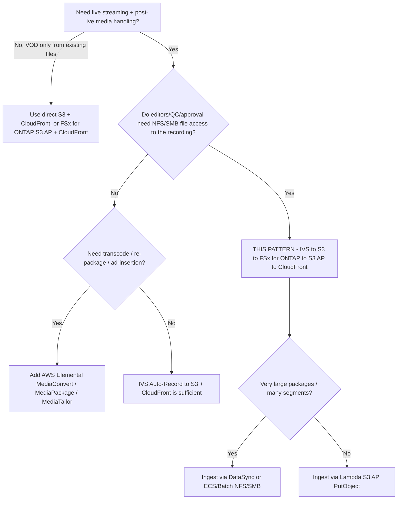

# 架构 — Amazon IVS Live-to-FSx for ONTAP VOD Publishing

🌐 **Language / 语言**: [日本語](architecture.md) | [English](architecture.en.md) | [한국어](architecture.ko.md) | [简体中文](architecture.zh-CN.md) | [繁體中文](architecture.zh-TW.md) | [Français](architecture.fr.md) | [Deutsch](architecture.de.md) | [Español](architecture.es.md)

## 设计原则

1. **直播体验由 Amazon IVS 承担。** 低延迟互动流由 IVS 负责，不自行重新实现直播分发。
2. **录制到受支持的目标。** IVS 自动录制到**标准 Amazon S3 存储桶**——这是目前 AWS 官方文档化并支持的唯一目标。
3. **FSx for ONTAP = 直播后媒体工作区。** 录制结束后将 HLS 包发布到 FSx for ONTAP，使编辑、QC、审批在与
   S3 API 服务读取相同的数据上通过 **NFS/SMB** 进行。
4. **S3 Access Points 暴露 FSx 上的文件。** VOD 分发与分析通过 S3 Access Point 的 S3 API 访问 FSx 数据
   （无需为分发在单独 S3 存储桶再复制一份）。
5. **分发边界由运维保障。** 公开/受控分发不经过 ONTAP ACL，因此仅发布已审批内容并控制 CloudFront 源。

## 推荐数据流

```text
Amazon IVS
  -> Auto-Record to S3 bucket           (supported)
  -> EventBridge "IVS Recording State Change" / "Recording End"
  -> Step Functions
  -> Lambda / ECS / Batch / DataSync    (copy/sync HLS package)
  -> FSx for ONTAP volume               (NFS/SMB workspace + S3 AP surface)
  -> S3 Access Point
  -> CloudFront with OAC (SigV4)
  -> VOD viewers
```

1. 推流端/编码器向 **Amazon IVS 频道**推流（RTMPS 或 IVS Broadcast SDK）。
2. IVS 将会话**自动录制**到标准 S3 存储桶的
   `ivs/v1/<aws_account_id>/<channel_id>/<year>/<month>/<day>/<hours>/<minutes>/<recording_id>`
   前缀下（HLS 媒体、清单、缩略图、元数据 JSON）。
3. **Recording End** 时 IVS 向 **EventBridge** 发出 `IVS Recording State Change` 事件。后续处理应仅在
   Recording End 之后开始（在此之前不保证段/清单已完整）。
4. EventBridge 规则启动 **Step Functions** 状态机。
5. Step Functions 运行**复制/同步作业**（小包用 Lambda，大包用 ECS/Batch/DataSync），将 HLS 包写入
   **FSx for ONTAP** 卷。
6. 编辑/QC/MAM 工具通过 **NFS/SMB** 工作，同一数据经 **S3 Access Point** 暴露给分发与分析。
7. **Amazon CloudFront**（OAC + SigV4）从 S3 Access Point 源分发 HLS VOD。
8. 可选：**Lambda / Athena / Glue / Bedrock** 经 S3 AP 处理同一数据。

## 网络设计

- **复制/同步计算**：
  - 若从标准 S3 存储桶读取并经 **S3 AP `PutObject`**（Internet-origin AP）写入 FSx，则在 **VPC 外**运行
    工作进程（或使用 NAT 路径）。
  - 若经 **NFS/SMB 挂载**写入 FSx，则在 **VPC 内**运行工作进程（可达 FSx 挂载的 ECS/Batch。Lambda 无法直接
    挂载 NFS/SMB，因此对 FSx 的 NFS/SMB 写入通常用 ECS/Batch）。
- 不要在单个 Lambda 中**混用** ONTAP 管理 LIF 访问与 Internet-origin S3 AP 访问。
- **CloudFront** 通过 SigV4（OAC）经互联网到达 S3 Access Point 源。S3 Gateway VPC 终端节点不作为
  Internet-origin S3 AP 的前端。

## 写入 FSx for ONTAP 的两种方式

| 方式 | 适用 | 说明 |
|------|------|------|
| S3 AP `PutObject` | 对象数适中，工作进程无服务器（Lambda） | `PutObject` 最大 5 GB，更大用 multipart。Internet-origin AP 需 VPC 外工作进程或 NAT |
| NFS/SMB 挂载（ECS/Batch/DataSync） | 大包、大量小段、既有文件工具 | 为编辑者保留文件语义。DataSync 高效处理批量传输 |

## 存储 / 吞吐设计（Storage lens）

- FSx for ONTAP 预置吞吐在 NFS/SMB/S3AP 间**共享**。VOD 源拉取与编辑流量在同一卷上竞争，按 **P95/P99
  （尾延迟）** 进行容量规划。
- 使用高 CloudFront TTL 和 **Origin Shield** 最小化源拉取。段不可变（长 TTL），播放列表变化（短 TTL）。
- 为将分发读取与生产编辑卷隔离，可考虑用 **FlexCache** 卷作为 CloudFront 源（ONTAP 原生，无需改应用）。
- 定量值取决于配置——生产估算应基于实测而非本示例。

## 约束（FSx for ONTAP S3 AP）

- **不支持 Presigned URL** → 观众认证用 CloudFront 签名 URL/Cookie。
- 非完整 S3 存储桶：不支持 Object Versioning / Object Lock / Lifecycle / Static Website Hosting
  （按操作在 [../../docs/s3ap-compatibility-notes.md](../../docs/s3ap-compatibility-notes.md) 核对）。
- `PutObject` 最大 5 GB（更大用 multipart）。
- 双层授权：IAM/AP 策略**与** ONTAP 文件系统 identity（UNIX/Windows）都必须允许。
- `NetworkOrigin`（Internet 或 VPC）创建后不可变。

## 区域 / 数据所在地

- IVS 频道、Recording Configuration、S3 录制位置必须在**同一区域**。为避免跨区传输，将 FSx for ONTAP 与
  S3 存储桶同区放置。
- CloudFront 为全球——对不可跨区分发的内容应用地域限制。

> **数据所在地**（Public Sector lens）：以"默认全球分发"为出发前提。区域受限内容应从摄取/发布中排除，或用
> CloudFront 地域限制门控。分发层不继承 ONTAP ACL。

## 范围

- 本模式面向 **Amazon IVS Low-Latency Streaming** 的自动录制（`ivs/v1/...` 下频道录制）。
  **IVS Real-Time Streaming（stages）** 录制模型不同（个别/合成 participant recording），不在此范围。但
  "发布到 FSx for ONTAP → 经 S3 AP + CloudFront 分发"的思路仍适用。
- 面向**已编码 HLS 的直播后打包/分发**，**不做**转码、再打包、广告插入。

> **媒体工作流**（Media SME lens）：IVS 将 HLS 记录为 multivariate `master.m3u8` + 各码率媒体播放列表 +
> 段（TS 为 `.ts`，fMP4/CMAF 为 `.m4s`+init）以及缩略图、录制元数据 JSON。应校验 multivariate master 而非任意播放列表。

## 何时使用本模式 — 决策指南



## 备选与如何选择（中立）

各选项适合不同场景。权衡对称陈述，含本模式推荐方案。

| 选项 | 适合 | 权衡 / 考量 |
|------|------|-----------|
| **本模式**（IVS → S3 → FSx for ONTAP → S3 AP → CloudFront） | 录制需要**文件协议（NFS/SMB）编辑/QC/审批**，且同一副本进行 S3 API 分发/分析 | 增加摄取跳（S3 → FSx）与运维层。分发边界由运维而非 ONTAP ACL 保障 |
| **IVS Auto-Record → S3 + CloudFront**（无 FSx） | 无需文件后期的简单 live-to-VOD | 无统一 NFS/SMB 工作区；编辑需要文件则副本分离 |
| **AWS Elemental MediaConvert / MediaPackage / MediaTailor** | 转码、JIT 打包、DRM、服务端广告插入 | 运维对象增多；本模式不做——按需组合 |
| **直接 S3 + CloudFront**（文件已在 S3） | 无直播采集的既有 HLS 纯 VOD | 无直播层；无 ONTAP 文件工作流 |

> **如何选择**：按是否需要 (a) 对录制的**共享文件工作区**（→ 本模式）、(b) **媒体处理**（→
> MediaConvert/MediaPackage/MediaTailor，可置于 FSx 前后）、(c) **最简单的 live-to-VOD**（→ IVS + S3 +
> CloudFront）。三者可组合，非互斥。

> **成本**（FinOps lens）：主导成本是 FSx for ONTAP 吞吐/容量、CloudFront egress 与录制的 S3 存储，而非
> Lambda。参见 [../../docs/cost-calculator.md](../../docs/cost-calculator.md)，应按实测流量而非示例运行进行估算。

## 可靠性：EventBridge 交付语义

Amazon IVS 的 EventBridge 事件为**尽力交付**——可能丢失、延迟或乱序。不要将单个 `Recording End` 事件视为
保证的 exactly-once 触发。

- **建议**：生产使用 `TriggerMode=HYBRID`——低延迟 EVENT_DRIVEN 加上补漏的 POLLING 兜底
  （`SourcePrefixRoot` 扫描）。
- 后续处理仅在 `Recording End` **之后**开始（此前清单/段可能未完整）。

> **Reliability/Ops**（SRE lens）：本脚手架**未实现幂等**，故 HYBRID 可能重复处理录制。生产启用 HYBRID 前，
> 集成以 `recording_session_id` + `recording_prefix` 为键的 `shared/idempotency_checker.py`。为毒性事件在
> 状态机/Lambda 上配置 DLQ。

> **Runbook**（Ops lens）：publish 失败时查看 `/aws/lambda/<stack>-publish`，区分 S3 AP 授权（IAM + AP policy +
> ONTAP identity）与源读取。误发布时从 CloudFront 源路径移除该对象并在修正后重跑。

## 内容审核与保留（审核为 opt-in；保留为 ONTAP 原生）

- **内容审核为 opt-in（默认关闭）。** 设置 `EnableModeration=true`（非 DemoMode）对录制缩略图运行 Amazon
  Rekognition `DetectModerationLabels`；若出现 `ModerationMinConfidence` 及以上的标签，则阻止发布
  （`blocked_by_moderation`）并路由到人工审核。这是**缩略图抽样检查**，非全文覆盖——更严格时可加用 Rekognition
  异步 `StartContentModeration`（视频）/ Amazon Transcribe + Comprehend（音频/字幕）。本模式将此严格路径以
  opt-in 的 `functions/moderation/`（异步 start/collect）与 HLS→MP4 转换 `functions/transcode/`（MediaConvert）
  同捆（`EnableStrictModeration=true`，Step Functions 示例：[samples/strict-moderation.asl.json](samples/strict-moderation.asl.json)）。
  与完整性启发式（Human Review）独立运行。

> **治理**（Public Sector lens）："包完整" ≠ "内容已获公开许可"。将人工发布审批（Data Owner / Approver）作为
> 最终门，完整性评分仅将条目路由到该门。

- **保留**：FSx for ONTAP S3 AP **不支持** S3 Lifecycle。VOD 保留/分层以 ONTAP 原生方式管理——冷 VOD 用
  **FabricPool** 容量分层，时间点用 **Snapshot**，归档/DR 用 **SnapMirror**，不要指望 S3 存储桶 lifecycle。

> **存储**（Storage Specialist lens）：用 **FlexCache** 卷作为 CloudFront 源以将分发源读取与编辑卷隔离；
> 源拉取按 P95/P99 规划，利用 Range GET 与高 CloudFront TTL / Origin Shield，避免 VOD 与 QC I/O 竞争。

## 分阶段采用

1. **验证逻辑（无基础设施）**：`make test-media-ivs-vod-publishing`（单元 + 属性测试）。
2. **DemoMode 部署**：以 `DemoMode=true` 部署（无 FSx 依赖）。确认 publish 清单、master manifest 校验、
   Human Review 路由。
3. **真实摄取**：将 `RecordingSourceBucket` 指向 IVS 录制桶、`S3AccessPointOutputAlias` 指向 FSx for ONTAP
   S3 AP，短时推流确认 `ivs/v1/...` 落地并发布。
4. **分发**：启用 CloudFront（`EnableCloudFront=true`），配置 OAC + AP 策略，验证 `.m3u8`/段的 SigV4 GET。
   受控 VOD 增加签名 URL/Cookie。
5. **加固**：HYBRID + 幂等、DLQ、告警（`EnableCloudWatchAlarms=true`），公开时集成审核。

> **Partner/SI**（delivery lens）：阶段 1–2 为 30 分钟、无 FSx 的 PoC，适合首次发现性对话。阶段 3–5 映射到
> 使用方真实环境，是进行容量规划与治理签核之处。

> **App Developer**（developer lens）：可部署处理程序为 `functions/publish/handler.py`（S3 AP 访问、数据分类、
> Human Review、EMF 使用 `shared/`）。`samples/` 片段仅供说明，请勿部署。

## FAQ / 常见误解

- **"IVS 能否直接录制到 FSx for ONTAP S3 Access Point？"** 无官方支持声明——作为 Experimental 处理并验证
  ([direct-recording-experiment.md](direct-recording-experiment.md))。
- **"S3 Access Point 是 S3 存储桶的替代？"** 否——它是 S3 兼容访问边界。不支持 Presigned URL、Versioning、
  Object Lock、Lifecycle、Static Website Hosting。
- **"能给观众 VOD 的 presigned URL 吗？"** 否——使用 CloudFront 签名 URL/Cookie。
- **"发布会强制原 NFS/SMB 权限吗？"** 否——分发不经过 ONTAP ACL。边界为运维（仅发布已审批）+ CloudFront 源锁定。
- **"完整性分数高就能安全公开？"** 否——只检查 HLS 包是否完整。内容可否公开为另行的人工/AI 审核步骤。
- **"需要 MediaConvert 吗？"** 仅在需要转码/再打包/广告时。本模式分发已编码 HLS。

## 相关文档

- [README (日本語)](README.md) / [README (English)](README.en.md)
- [Validation matrix](validation-matrix.md)
- [Direct recording experiment](direct-recording-experiment.md)
- [Supported path notes](supported-path-ivs-s3-fsx-cloudfront.md)
- [DemoMode 指南](docs/demo-guide.md)
- [S3AP 兼容性说明](../../docs/s3ap-compatibility-notes.md) / [S3AP 性能](../../docs/s3ap-performance-considerations.md)
- [成本估算](../../docs/cost-calculator.md)
- [Content Edge Delivery 模式](../content-delivery/README.md)
