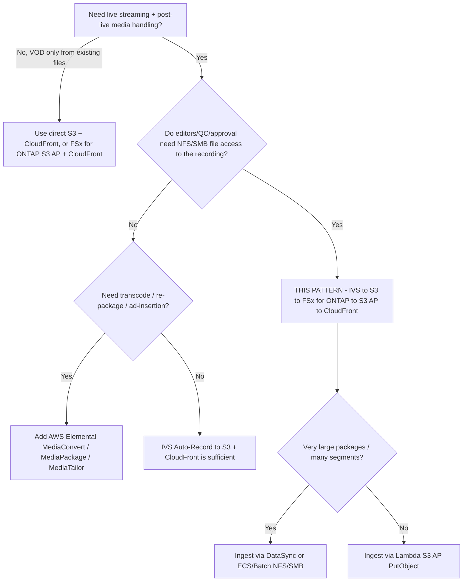

# 架構 — Amazon IVS Live-to-FSx for ONTAP VOD Publishing

🌐 **Language / 語言**: [日本語](architecture.md) | [English](architecture.en.md) | [한국어](architecture.ko.md) | [简体中文](architecture.zh-CN.md) | [繁體中文](architecture.zh-TW.md) | [Français](architecture.fr.md) | [Deutsch](architecture.de.md) | [Español](architecture.es.md)

## 設計原則

1. **直播體驗由 Amazon IVS 承擔。** 低延遲互動串流由 IVS 負責，不自行重新實作直播分發。
2. **錄製到受支援的目標。** IVS 自動錄製到**標準 Amazon S3 儲存貯體**——這是目前 AWS 官方文件化並支援的唯一目標。
3. **FSx for ONTAP = 直播後媒體工作區。** 錄製結束後將 HLS 套件發佈到 FSx for ONTAP，使編輯、QC、審核在與
   S3 API 服務讀取相同的資料上透過 **NFS/SMB** 進行。
4. **S3 Access Points 暴露 FSx 上的檔案。** VOD 分發與分析透過 S3 Access Point 的 S3 API 存取 FSx 資料
   （無需為分發在單獨 S3 儲存貯體再複製一份）。
5. **分發邊界由維運保障。** 公開/受控分發不經過 ONTAP ACL，因此僅發佈已審核內容並控制 CloudFront 來源。

## 建議資料流

```text
Amazon IVS
  -> Auto-Record to S3 bucket           (supported)
  -> EventBridge "IVS Recording State Change" / "Recording End"
  -> Step Functions
  -> Lambda / ECS / Batch / DataSync    (copy/sync HLS package)
  -> FSx for ONTAP volume               (NFS/SMB workspace + S3 AP surface)
  -> S3 Access Point
  -> CloudFront with OAC (SigV4)
  -> VOD viewers
```

1. 推流端/編碼器向 **Amazon IVS 頻道**推流（RTMPS 或 IVS Broadcast SDK）。
2. IVS 將工作階段**自動錄製**到標準 S3 儲存貯體的
   `ivs/v1/<aws_account_id>/<channel_id>/<year>/<month>/<day>/<hours>/<minutes>/<recording_id>`
   前綴下（HLS 媒體、清單、縮圖、中繼資料 JSON）。
3. **Recording End** 時 IVS 向 **EventBridge** 發出 `IVS Recording State Change` 事件。後續處理應僅在
   Recording End 之後開始（在此之前不保證分段/清單已完整）。
4. EventBridge 規則啟動 **Step Functions** 狀態機。
5. Step Functions 執行**複製/同步作業**（小套件用 Lambda，大套件用 ECS/Batch/DataSync），將 HLS 套件寫入
   **FSx for ONTAP** 磁碟區。
6. 編輯/QC/MAM 工具透過 **NFS/SMB** 工作，同一資料經 **S3 Access Point** 暴露給分發與分析。
7. **Amazon CloudFront**（OAC + SigV4）從 S3 Access Point 來源分發 HLS VOD。
8. 選用：**Lambda / Athena / Glue / Bedrock** 經 S3 AP 處理同一資料。

## 網路設計

- **複製/同步運算**：
  - 若從標準 S3 儲存貯體讀取並經 **S3 AP `PutObject`**（Internet-origin AP）寫入 FSx，則在 **VPC 外**執行
    工作程序（或使用 NAT 路徑）。
  - 若經 **NFS/SMB 掛載**寫入 FSx，則在 **VPC 內**執行工作程序（可達 FSx 掛載的 ECS/Batch。Lambda 無法直接
    掛載 NFS/SMB，因此對 FSx 的 NFS/SMB 寫入通常用 ECS/Batch）。
- 不要在單一 Lambda 中**混用** ONTAP 管理 LIF 存取與 Internet-origin S3 AP 存取。
- **CloudFront** 透過 SigV4（OAC）經網際網路到達 S3 Access Point 來源。S3 Gateway VPC 端點不作為
  Internet-origin S3 AP 的前端。

## 寫入 FSx for ONTAP 的兩種方式

| 方式 | 適用 | 說明 |
|------|------|------|
| S3 AP `PutObject` | 物件數適中，工作程序無伺服器（Lambda） | `PutObject` 最大 5 GB，更大用 multipart。Internet-origin AP 需 VPC 外工作程序或 NAT |
| NFS/SMB 掛載（ECS/Batch/DataSync） | 大套件、大量小分段、既有檔案工具 | 為編輯者保留檔案語意。DataSync 高效處理批次傳輸 |

## 儲存 / 吞吐設計（Storage lens）

- FSx for ONTAP 佈建吞吐在 NFS/SMB/S3AP 間**共用**。VOD 來源提取與編輯流量在同一磁碟區競爭，按 **P95/P99
  （尾端延遲）** 進行容量規劃。
- 使用高 CloudFront TTL 與 **Origin Shield** 最小化來源提取。分段不可變（長 TTL），播放清單變化（短 TTL）。
- 為將分發讀取與生產編輯磁碟區隔離，可考慮用 **FlexCache** 磁碟區作為 CloudFront 來源（ONTAP 原生，無需改應用）。
- 定量值取決於組態——生產估算應基於實測而非本範例。

## 限制（FSx for ONTAP S3 AP）

- **不支援 Presigned URL** → 觀眾認證用 CloudFront 簽章 URL/Cookie。
- 非完整 S3 儲存貯體：不支援 Object Versioning / Object Lock / Lifecycle / Static Website Hosting
  （按操作於 [../../docs/s3ap-compatibility-notes.md](../../docs/s3ap-compatibility-notes.md) 核對）。
- `PutObject` 最大 5 GB（更大用 multipart）。
- 雙層授權：IAM/AP 政策**與** ONTAP 檔案系統 identity（UNIX/Windows）都必須允許。
- `NetworkOrigin`（Internet 或 VPC）建立後不可變。

## 區域 / 資料所在地

- IVS 頻道、Recording Configuration、S3 錄製位置必須在**同一區域**。為避免跨區傳輸，將 FSx for ONTAP 與
  S3 儲存貯體同區放置。
- CloudFront 為全球——對不可跨區分發的內容套用地域限制。

> **資料所在地**（Public Sector lens）：以「預設全球分發」為出發前提。區域受限內容應從擷取/發佈中排除，或用
> CloudFront 地域限制門控。分發層不繼承 ONTAP ACL。

## 範圍

- 本模式面向 **Amazon IVS Low-Latency Streaming** 的自動錄製（`ivs/v1/...` 下頻道錄製）。
  **IVS Real-Time Streaming（stages）** 錄製模型不同（個別/合成 participant recording），不在此範圍。但
  「發佈到 FSx for ONTAP → 經 S3 AP + CloudFront 分發」的思路仍適用。
- 面向**已編碼 HLS 的直播後封裝/分發**，**不做**轉碼、重新封裝、廣告插入。

> **媒體工作流**（Media SME lens）：IVS 將 HLS 記錄為 multivariate `master.m3u8` + 各位元率媒體播放清單 +
> 分段（TS 為 `.ts`，fMP4/CMAF 為 `.m4s`+init）以及縮圖、錄製中繼資料 JSON。應驗證 multivariate master 而非任意播放清單。

## 直播並行的 near-live 協同編輯（三層梳理）

「在直播過程中，從 FSx for ONTAP 經由 S3 Access Point 插入追趕編輯或字幕」是很自然的訴求，但受限於
IVS 直播傳遞機制，需要區分**在哪一層插入**來設計。

| 層 | 能做什麼 | FSx for ONTAP S3 AP 的參與 |
|----|----------|----------------------------|
| **1. IVS 直播傳遞路徑（IVS 託管）** | encoder → IVS 轉碼/封裝 → IVS CDN 到觀眾。此**直播播放清單由 IVS 託管**，沒有把外部製作的 HLS 分段/字幕事後插入的入口。 | **不可**（直播清單不可變）。伺服器端直播加工屬於 AWS Elemental MediaLive / MediaPackage 領域。 |
| **2. 用戶端疊加（timed metadata）** | 將 [Timed Metadata（`PutMetadata`）](https://docs.aws.amazon.com/ivs/latest/LowLatencyUserGuide/metadata.html) 同步插入直播，播放器 SDK 在**用戶端算繪字幕/字幕條/圖形**。`PutMetadata` 每請求最多 1 KB、每頻道 5 TPS。 | **可間接實現**：在 metadata 放「資產參照鍵 + 時間碼」，字幕本文/疊加圖片的實體從 **CloudFront（來源 = FSx for ONTAP S3 AP）** 取得。編輯團隊用 NFS/SMB 撰寫字幕，同一份資料由 S3 AP + CloudFront 傳遞。 |
| **3. near-live 編輯版本（錄製側）** | 持續將 Auto-Record 的 HLS 取入 FSx for ONTAP，編輯團隊編輯 growing recording，並以**比直播延遲數十秒至數分鐘的獨立 URL** 做 near-live 傳遞。 | **主戰場**：NLE(SMB) / 字幕工具(SMB) / S3-API 自動化 / Athena·Bedrock 分析在**單一權威資料**上並行，無需額外複本（協定無關的協同編輯）。 |

> **Media SME lens**：不是「燒錄進直播本身」，而是在第 2 層（用戶端算繪）或第 3 層（near-live 獨立版本）
> 實現，才符合 IVS 的機制。燒錄式隱藏式字幕（CEA-608/708）在**編碼器側**嵌入，而非從 FSx 事後加入。

### 誠實的限制

- **不是真直播而是 near-live**：分段確定 → 取入 → 編輯 → 再傳遞都會帶來延遲。「追趕」以數十秒至分鐘級延遲為前提。
- **IVS 直播清單不可變**：無法插入第 1 層。
- **直播燒錄字幕**屬編碼器側（IVS 之外）。
- 第 2 層需在 `PutMetadata` 1 KB / 5 TPS 限制內，放參照而非實體。

> **使用者價值**（Partner/SI lens）：本模式的價值不僅是「直播後 VOD 化」，還擴展到
> **與直播並行的 near-live 協同編輯工作區**。編輯·QC·字幕·分析可跨協定在同一份資料上並行，正是
> 組合 FSx for ONTAP 與 S3 Access Points 的動機。

## 直播的挑戰與解決思路（用例集）

除直播後 VOD 與 near-live 編輯外，直播現場常見的挑戰也能對應到透過 S3 Access Points 暴露的
FSx for ONTAP 共享媒體工作區。以下並非優劣，而是**依情境選擇的選項與取捨**，與所列補充服務組合使用。

| 直播挑戰 | 解決思路（FSx for ONTAP + S3 AP + IVS） | 補充服務 | 誠實的取捨 |
|---|---|---|---|
| 以多語言字幕/翻譯觸及海外觀眾 | 在地化團隊對同一錄製透過 NFS/SMB 製作字幕資產，以 S3 AP + CloudFront（near-live 版本）分發 VTT，或以 timed metadata 驅動用戶端疊加 | Amazon Transcribe、Amazon Translate、直播字幕夥伴 | 直播翻譯為 near-live。受監管/品牌敏感內容建議人工審核 |
| 將長直播快速做成精華/剪輯 | 以 EventBridge → Step Functions 將確定分段切成精華素材到 FSx for ONTAP，以 SMB 編輯，以 S3 AP + CloudFront 發佈 | AWS Elemental MediaConvert（版本） | 分段確定延遲。剪輯精度取決於標記/時間碼 |
| 高延遲線路的遠端/分散式編輯 | 在編輯者附近以 FlexCache 提供類本地快取，以低解析度代理編輯（全解析度保留在來源磁碟區） | — | FlexCache 增加快取維運。代理流程需要產生步驟 |
| 媒體庫增長與儲存成本 | 以 FabricPool 將冷素材分層到 capacity pool，熱編輯資料保留在 SSD | — | 分層為 ONTAP 原生（S3 AP 不提供 S3 Lifecycle）。冷資料召回延遲 |
| 媒體營運的業務持續性 | 以 SnapMirror 跨區域複製媒體工作區，以 Snapshot 做時間點復原，符合 3-2-1 方針 | CloudFront + AWS 媒體服務韌性 | 來源資料與索引的 RPO/RTO 分別定義。複製有成本 |
| 互動式直播電商/互動 | 以 IVS timed metadata 驅動商品疊加與決定性瞬間，將商品/型錄/疊加資產置於 FSx for ONTAP 並經 S3 AP + CloudFront 分發，將瞬間剪輯為 VOD | IVS timed metadata、IVS chat | PutMetadata 為 1 KB / 5 TPS。疊加於用戶端算繪 |
| 合規保留/稽核 | 將錄製在 ONTAP 上以 Snapshot/保留功能與稽核軌跡保存，依標題/角色以獨立 access point 暴露讀取路徑 | — | 不可變性/保留功能需依 FSx for ONTAP 版本與管轄驗證。此為治理指引，非法律建議 |
| 可檢索的媒體封存 | 轉錄錄製並建立檢索索引，不將資料複製出 FSx for ONTAP，經 S3 AP 分析 | Amazon Transcribe、Athena/Glue、Amazon Bedrock、OpenSearch | 擷取/索引成本。檢索時依標題施加存取控制 |

> **中立表述**：每行都是依情境的選項。伺服器端直播加工、封裝與廣告插入屬 AWS Elemental
> MediaLive / MediaPackage / MediaTailor 領域，本模式聚焦檔案 + S3 API 媒體工作區與直播後/near-live 分發。
> 依工作負載、限制與取捨進行選擇。

## 何時使用本模式 — 決策指南



## 替代與如何選擇（中立）

各選項適合不同場景。權衡對稱陳述，含本模式建議方案。

| 選項 | 適合 | 權衡 / 考量 |
|------|------|-----------|
| **本模式**（IVS → S3 → FSx for ONTAP → S3 AP → CloudFront） | 錄製需要**檔案協定（NFS/SMB）編輯/QC/審核**，且同一副本進行 S3 API 分發/分析 | 增加擷取跳（S3 → FSx）與維運層。分發邊界由維運而非 ONTAP ACL 保障 |
| **IVS Auto-Record → S3 + CloudFront**（無 FSx） | 無需檔案後製的簡單 live-to-VOD | 無統一 NFS/SMB 工作區；編輯需要檔案則副本分離 |
| **AWS Elemental MediaConvert / MediaPackage / MediaTailor** | 轉碼、JIT 封裝、DRM、伺服器端廣告插入 | 維運對象增多；本模式不做——按需組合 |
| **直接 S3 + CloudFront**（檔案已在 S3） | 無直播擷取的既有 HLS 純 VOD | 無直播層；無 ONTAP 檔案工作流 |

> **如何選擇**：按是否需要 (a) 對錄製的**共享檔案工作區**（→ 本模式）、(b) **媒體處理**（→
> MediaConvert/MediaPackage/MediaTailor，可置於 FSx 前後）、(c) **最簡單的 live-to-VOD**（→ IVS + S3 +
> CloudFront）。三者可組合，非互斥。

> **成本**（FinOps lens）：主導成本是 FSx for ONTAP 吞吐/容量、CloudFront egress 與錄製的 S3 儲存，而非
> Lambda。參見 [../../docs/cost-calculator.md](../../docs/cost-calculator.md)，應按實測流量而非範例執行進行估算。

## 可靠性：EventBridge 交付語意

Amazon IVS 的 EventBridge 事件為**盡力交付**——可能遺失、延遲或亂序。不要將單一 `Recording End` 事件視為
保證的 exactly-once 觸發。

- **建議**：生產使用 `TriggerMode=HYBRID`——低延遲 EVENT_DRIVEN 加上補漏的 POLLING 兜底
  （`SourcePrefixRoot` 掃描）。
- 後續處理僅在 `Recording End` **之後**開始（此前清單/分段可能未完整）。

> **Reliability/Ops**（SRE lens）：本 scaffold **未實作冪等**，故 HYBRID 可能重複處理錄製。生產啟用 HYBRID 前，
> 整合以 `recording_session_id` + `recording_prefix` 為鍵的 `shared/idempotency_checker.py`。為毒性事件在
> 狀態機/Lambda 上設定 DLQ。

> **Runbook**（Ops lens）：publish 失敗時查看 `/aws/lambda/<stack>-publish`，區分 S3 AP 授權（IAM + AP policy +
> ONTAP identity）與來源讀取。誤發佈時從 CloudFront 來源路徑移除該物件並在修正後重跑。

## 內容審核與保留（審核為 opt-in；保留為 ONTAP 原生）

- **內容審核為 opt-in（預設關閉）。** 設定 `EnableModeration=true`（非 DemoMode）對錄製縮圖執行 Amazon
  Rekognition `DetectModerationLabels`；若出現 `ModerationMinConfidence` 以上的標籤，則封鎖發佈
  （`blocked_by_moderation`）並路由到人工審核。這是**縮圖抽樣檢查**，非全文涵蓋——更嚴格時可加用 Rekognition
  非同步 `StartContentModeration`（影片）/ Amazon Transcribe + Comprehend（音訊/字幕）。本模式將此嚴格路徑以
  opt-in 的 `functions/moderation/`（非同步 start/collect）與 HLS→MP4 轉換 `functions/transcode/`（MediaConvert）
  同捆（`EnableStrictModeration=true`，Step Functions 範例：[samples/strict-moderation.asl.json](samples/strict-moderation.asl.json)）。
  與完整性啟發式（Human Review）獨立運作。

> **治理**（Public Sector lens）：「套件完整」≠「內容已獲公開許可」。將人工發佈審核（Data Owner / Approver）作為
> 最終閘門，完整性評分僅將項目路由到該閘門。

- **保留**：FSx for ONTAP S3 AP **不支援** S3 Lifecycle。VOD 保留/分層以 ONTAP 原生方式管理——冷 VOD 用
  **FabricPool** 容量分層，時間點用 **Snapshot**，封存/DR 用 **SnapMirror**，不要期望 S3 儲存貯體 lifecycle。

> **儲存**（Storage Specialist lens）：用 **FlexCache** 磁碟區作為 CloudFront 來源以將分發來源讀取與編輯磁碟區
> 隔離；來源提取按 P95/P99 規劃，利用 Range GET 與高 CloudFront TTL / Origin Shield，避免 VOD 與 QC I/O 競爭。

## 分階段採用

1. **驗證邏輯（無基礎設施）**：`make test-media-ivs-vod-publishing`（單元 + 屬性測試）。
2. **DemoMode 部署**：以 `DemoMode=true` 部署（無 FSx 相依）。確認 publish 清單、master manifest 驗證、
   Human Review 路由。
3. **實際擷取**：將 `RecordingSourceBucket` 指向 IVS 錄製貯體、`S3AccessPointOutputAlias` 指向 FSx for ONTAP
   S3 AP，短時推流確認 `ivs/v1/...` 落地並發佈。
4. **分發**：啟用 CloudFront（`EnableCloudFront=true`），設定 OAC + AP 政策，驗證 `.m3u8`/分段的 SigV4 GET。
   受控 VOD 增加簽章 URL/Cookie。
5. **強化**：HYBRID + 冪等、DLQ、警示（`EnableCloudWatchAlarms=true`），公開時整合審核。

> **Partner/SI**（delivery lens）：階段 1–2 為 30 分鐘、無 FSx 的 PoC，適合首次探索性對話。階段 3–5 對應到
> 使用方真實環境，是進行容量規劃與治理簽核之處。

> **App Developer**（developer lens）：可部署處理程式為 `functions/publish/handler.py`（S3 AP 存取、資料分類、
> Human Review、EMF 使用 `shared/`）。`samples/` 片段僅供說明，請勿部署。

## FAQ / 常見誤解

- **「IVS 能否直接錄製到 FSx for ONTAP S3 Access Point？」** 設定建立可達 `ACTIVE`，但測試環境的實際直播出現
  **「Recording Start Failure」**，且未寫入 `ivs/v1/...` 物件。亦無官方支援聲明——作為 Experimental 處理
  ([direct-recording-experiment.md](direct-recording-experiment.md))。
- **「S3 Access Point 是 S3 儲存貯體的替代？」** 否——它是 S3 相容存取邊界。不支援 Presigned URL、Versioning、
  Object Lock、Lifecycle、Static Website Hosting。
- **「能給觀眾 VOD 的 presigned URL 嗎？」** 否——使用 CloudFront 簽章 URL/Cookie。
- **「發佈會強制原 NFS/SMB 權限嗎？」** 否——分發不經過 ONTAP ACL。邊界為維運（僅發佈已審核）+ CloudFront 來源鎖定。
- **「完整性分數高就能安全公開？」** 否——只檢查 HLS 套件是否完整。內容可否公開為另行的人工/AI 審核步驟。
- **「需要 MediaConvert 嗎？」** 僅在需要轉碼/重新封裝/廣告時。本模式分發已編碼 HLS。

## 相關文件

- [README (日本語)](README.md) / [README (English)](README.en.md)
- [Validation matrix](validation-matrix.md)
- [Direct recording experiment](direct-recording-experiment.md)
- [Supported path notes](supported-path-ivs-s3-fsx-cloudfront.md)
- [DemoMode 指南](docs/demo-guide.md)
- [S3AP 相容性說明](../../docs/s3ap-compatibility-notes.md) / [S3AP 效能](../../docs/s3ap-performance-considerations.md)
- [成本試算](../../docs/cost-calculator.md)
- [Content Edge Delivery 模式](../content-delivery/README.md)
