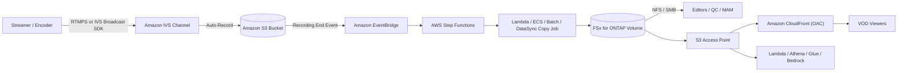

<!--
dev.to publishing draft (English). Set `published: true` when ready.
Source of truth (canonical): the pattern in the GitHub repo
  solutions/edge/media-ivs-vod-publishing/
Japanese version for Hatena Blog: blog/ja.md
-->

# Building a VOD Publishing Pattern with Amazon IVS and Amazon FSx for NetApp ONTAP S3 Access Points

> Technical community blog draft. It separates what AWS documents as supported from what still
> needs validation, and avoids overclaiming unsupported behavior.

## Introduction

Live streaming is only half the story. After the stream ends, teams need to archive the
recording, cut highlights, run quality control (QC), get approvals, and re-deliver the content
as video-on-demand (VOD).

This post explores how to take live recordings from **Amazon Interactive Video Service
(Amazon IVS)** into a media workspace built on **Amazon FSx for NetApp ONTAP** (hereafter
FSx for ONTAP) with **Amazon S3 Access Points**, and deliver VOD through **Amazon CloudFront**.

The recommended flow, up front:

> Amazon IVS → S3 bucket (Auto-Record) → FSx for ONTAP → S3 Access Point → CloudFront

## Why combine Amazon IVS with FSx for ONTAP

Post-live workflows want **both** file protocols (NFS/SMB) and the **S3 API**. Editing tools
and MAM systems want files; CloudFront, Lambda, Athena, and Amazon Bedrock want the S3 API.

FSx for ONTAP exposes the **same data** over NFS/SMB and through an S3 Access Point. That means
you keep **one authoritative copy** of the media instead of separate copies for editing and
delivery. Feeding IVS recordings into that workspace makes the post-live workflow flow
naturally.

## Can IVS record directly to an FSx for ONTAP S3 Access Point?

A natural question: can we point the IVS recording destination straight at an FSx for ONTAP
S3 Access Point alias?

An IVS Recording Configuration specifies its destination as
`destinationConfiguration.s3.bucketName` — a bucket **name**
([API reference](https://docs.aws.amazon.com/ivs/latest/LowLatencyAPIReference/API_CreateRecordingConfiguration.html)).
Separately, an S3 Access Point **alias** can stand in for a bucket name in *object* operations
([S3 docs](https://docs.aws.amazon.com/AmazonS3/latest/userguide/access-points-alias.html)).

However, **AWS documentation does not state that IVS officially supports an S3 Access Point
alias as a recording destination.** IVS validates the destination when recording starts
(bucket ownership, region match), so whether an S3 Access Point is accepted was unknown.

So we actually tried it in a test environment (results recorded in `direct-recording-experiment.md`):

- A Recording Configuration with the Access Point **alias** as `bucketName` reached `ACTIVE`.
- Using the Access Point **ARN** was rejected — `bucketName` is validated to a max length of 63,
  and the ARN (78 chars) exceeds it while the alias (≤63) fits.

We still treat this as **Experimental** for three reasons: (1) the test used a **standard S3**
Access Point, not an FSx for ONTAP S3 AP (dual-layer authorization untested); (2) a configuration
reaching `ACTIVE` is not the same as a live recording actually writing through that path (no live
stream was run); (3) AWS documentation still does not state support. So the README describes it as
"observed reaching config creation with the alias in this test environment, not documented as
officially supported."

## Recommended architecture: IVS → S3 → FSx for ONTAP → S3 Access Point → CloudFront

The recommended path is composed entirely of individually supported components:

1. Amazon IVS Auto-Records to a **standard S3 bucket** (supported).
2. On completion, the EventBridge `IVS Recording State Change` (Recording End) event fires.
3. AWS Step Functions orchestrates
4. a **copy/sync job** (Lambda / ECS / Batch / DataSync) that
5. writes the HLS package to an **FSx for ONTAP** volume.
6. Editors/QC/MAM work over **NFS/SMB**; the same data is exposed via an **S3 Access Point**.
7. **Amazon CloudFront** (OAC + SigV4) re-delivers the HLS VOD to viewers.

## Architecture walkthrough

## Validation plan

- Confirm that post-processing keyed off the **Recording End** event is stable. AWS recommends
  processing recordings only after Recording End (manifests/segments may be incomplete before).
- Decide when to copy via S3 AP `PutObject` vs NFS/SMB mount. The publish handler auto-selects by
  object size (`PutObject` for small; low-memory streaming multipart above `MULTIPART_THRESHOLD_MB`;
  skip above `MAX_LAMBDA_INGEST_GB` and defer to DataSync/ECS). Multipart clears the 5 GB single-put
  limit; many small segments still mean many API calls.
- Tune CloudFront TTLs for the S3 Access Point origin over OAC + SigV4 (short for `.m3u8`,
  long for segments).

Full detail is in the pattern's `validation-matrix.md` and `direct-recording-experiment.md`.

## Implementation samples

The pattern ships a deployable reference implementation (`DemoMode=true` runs without FSx for ONTAP;
tune parameters, IAM, and MediaConvert settings before production):

- A deployable SAM template (`template.yaml`, cfn-lint 0 errors).
- Functional Lambda handlers (`functions/publish/` = ingest + completeness score + optional
  moderation gate; `functions/moderation/` = strict moderation; `functions/transcode/` = HLS→MP4),
  all using the shared modules.
- Unit/property tests (`tests/`, 45 tests).
- A Recording End EventBridge event example, a Step Functions state machine
  (validate → list → copy → verify → catalog → invalidate), and an end-to-end ASL sample for strict moderation.
- A CloudFront OAC access-point policy example plus TTL / viewer-lockdown notes.

## Limitations and considerations

- FSx for ONTAP S3 AP does **not** support S3 Presigned URLs — use CloudFront signed URLs /
  cookies for controlled VOD.
- S3 AP is **not** a full S3 bucket (constraints/no support for Versioning, Object Lock,
  Lifecycle, Static Website Hosting). Don't assume bucket-level parity. Manage VOD retention/tiering
  ONTAP-natively (FabricPool / Snapshot / SnapMirror), not via S3 Lifecycle.
- IVS channel, Recording Configuration, and S3 location must be in the **same region**.
- FSx throughput is shared across NFS/SMB/S3AP — size delivery origin fetches vs editing
  traffic on **P95/P99**; consider FlexCache to isolate delivery reads.
- Delivery does not enforce ONTAP file permissions — enforce the boundary by publishing only
  approved content and locking down the CloudFront origin.
- **EventBridge delivery is best-effort** (missing, late, or out-of-order events). In production,
  pair EVENT_DRIVEN with a POLLING backstop (HYBRID) to reconcile missed recordings, and add
  idempotency.
- The completeness score indicates whether the package is complete, not whether the content is
  cleared for release. Content moderation is available **opt-in (default off)**: `EnableModeration=true`
  runs an Amazon Rekognition `DetectModerationLabels` sampling check on thumbnails before publish;
  `EnableStrictModeration=true` runs asynchronous video/audio/caption moderation (Rekognition
  `StartContentModeration` + Transcribe→Comprehend `DetectToxicContent`). Both are **assistive
  signals** — a human makes the final release decision.
- Scope is **IVS Low-Latency Streaming** (`ivs/v1/...`). Video moderation takes a single MP4 input, so
  an **opt-in MediaConvert step** (`functions/transcode/`, HLS→MP4) is bundled for the conversion. For
  broader media processing (ad insertion, packaging), AWS Elemental MediaPackage / MediaTailor are the
  domain — combine them with this pattern (different roles, not a ranking).
- Moderation/transcode (Rekognition, Transcribe, Comprehend, MediaConvert) add cost and latency.
  They default off — enable only for use cases that need them.

## Conclusion

Recording IVS directly to an FSx for ONTAP S3 Access Point is appealing, and in a test environment
we observed the alias reaching config creation — but it still has no documented support. So this
pattern leads with a **recommended path built entirely from supported components** and isolates the
direct-recording idea as an Experimental result (with observations).

Using FSx for ONTAP as a post-live media workspace connects editing, QC, approval, delivery,
and analytics on the same data. Letting Amazon IVS own the live experience and FSx for ONTAP
own file operations and S3-API integrations is the point of this composition.

## References

- [IVS Auto-Record to Amazon S3](https://docs.aws.amazon.com/ivs/latest/LowLatencyUserGuide/record-to-s3.html)
- [Using Amazon EventBridge with IVS (Low-Latency)](https://docs.aws.amazon.com/ivs/latest/LowLatencyUserGuide/eventbridge.html)
- [IVS CreateRecordingConfiguration API](https://docs.aws.amazon.com/ivs/latest/LowLatencyAPIReference/API_CreateRecordingConfiguration.html)
- [FSx for ONTAP S3 access points](https://docs.aws.amazon.com/fsx/latest/ONTAPGuide/s3-access-points.html)
- [Restricting access to an S3 origin (CloudFront OAC)](https://docs.aws.amazon.com/AmazonCloudFront/latest/DeveloperGuide/private-content-restricting-access-to-s3.html)
