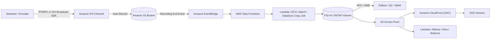

# Amazon IVS のライブ録画を FSx for ONTAP に展開して VOD 配信基盤を作る

> 技術検証ブログ草案（AWS Community Builder 目線）。断定を避け、公式ドキュメントで確認できる
> 範囲と、これから検証する範囲を明確に分けて書いています。

## はじめに

ライブ配信を行うと、配信そのものだけでなく「配信後」の運用が必ず発生します。録画のアーカイブ、
ハイライト編集、品質チェック（QC）、承認、そして VOD としての再配信です。

このブログでは、**Amazon Interactive Video Service（Amazon IVS）** のライブ録画を、
**Amazon FSx for NetApp ONTAP**（以降 FSx for ONTAP）と **Amazon S3 Access Points** を使った
メディアワークスペースへ取り込み、**Amazon CloudFront** で VOD 配信する構成を検討します。

結論を先に書くと、推奨は次の流れです。

> Amazon IVS → S3 バケット（Auto-Record）→ FSx for ONTAP → S3 Access Point → CloudFront

## なぜ IVS と FSx for ONTAP を組み合わせるのか

ライブ後のワークフローでは、**ファイルプロトコル（NFS/SMB）** と **S3 API** の両方が欲しくなります。
編集ソフトや MAM はファイルとして扱いたい一方、CloudFront や Lambda、Athena、Amazon Bedrock は
S3 API で触りたい。

FSx for ONTAP は、同一データを NFS/SMB と S3 Access Point の両方から扱えます。つまり、編集用と配信用で
コピーを二重持ちせず、**単一の正となるメディア** を置けます。ここに IVS の録画を流し込めれば、
ライブ後の運用が素直につながります。

## 直接録画先として FSx for ONTAP S3 AP を指定できるのか

素朴な疑問として「IVS の録画出力先を、そのまま FSx for ONTAP の S3 Access Point alias にできないか？」
があります。

IVS の Recording Configuration は、出力先を `destinationConfiguration.s3.bucketName`（バケット名）
として指定します（[API リファレンス](https://docs.aws.amazon.com/ivs/latest/LowLatencyAPIReference/API_CreateRecordingConfiguration.html)）。
一方、S3 Access Point alias は object 操作でバケット名の代わりに使える、という説明が
[S3 側のドキュメント](https://docs.aws.amazon.com/AmazonS3/latest/userguide/access-points-alias.html)
にあります。

ただし、**「IVS が S3 Access Point alias を出力先として正式サポートしている」とは、AWS 公式
ドキュメントに書かれていません。** IVS は録画開始時に出力先のバリデーション（バケット所有権、
リージョン一致など）を行うため、S3 Access Point がそのまま受け入れられるかは未知数でした。

そこで検証環境で実際に試してみました（結果は `direct-recording-experiment.md` に記録）。

- Access Point の **alias** を `bucketName` に指定した Recording Configuration は `ACTIVE` になった。
- 一方、Access Point の **ARN** を指定すると、`bucketName` の 63 文字制限に引っかかり拒否された
  （alias は 63 文字以内、ARN は超過）。

ただし、これは次の理由から引き続き **Experimental（実験）** 扱いとします。(1) 検証したのは
**標準 S3 の Access Point** であり、FSx for ONTAP S3 AP そのものではない（二層認可は未検証）。
(2) 設定が `ACTIVE` になることと、実際にライブ録画がその経路で書き込めることは別問題（ライブ配信
実行までは未確認）。(3) AWS 公式ドキュメントに支持がない。よって README でも「この検証環境では
alias 指定で設定作成まで確認したが、正式サポートとは明記されていない」という表現に留めます。

## 推奨構成: IVS → S3 → FSx for ONTAP → S3 Access Point → CloudFront

推奨するのは、各コンポーネントが個別にサポートされている構成です。

1. Amazon IVS が **標準 S3 バケット** に Auto-Record（正式サポート）。
2. 録画完了で発火する EventBridge の `IVS Recording State Change`（Recording End）を起点に、
3. Step Functions が
4. Lambda / ECS / Batch / DataSync による**コピー/同期ジョブ**を実行し、
5. HLS パッケージを **FSx for ONTAP** ボリュームへ展開。
6. 編集/QC/MAM は **NFS/SMB** で作業し、同じデータを **S3 Access Point** 経由で
7. **CloudFront（OAC + SigV4）** から VOD 配信する。

## アーキテクチャ

## 検証したいポイント

- IVS の録画完了イベント（Recording End）を起点にした後続処理が安定して動くか。
  IVS は「録画完了後に処理を始めること」を推奨しています（開始直後はマニフェスト/セグメントが
  未完成のことがあるため）。
- S3 → FSx のコピー方式（S3 AP の `PutObject` か、NFS/SMB マウントか）を、パッケージ規模で
  どう使い分けるか。publish ハンドラはオブジェクトサイズで自動選択します（小さいものは
  `PutObject`、`MULTIPART_THRESHOLD_MB` 超はメモリを使わない streaming multipart、
  `MAX_LAMBDA_INGEST_GB` 超は skip して DataSync/ECS へ委譲）。`PutObject` の 1 オブジェクト
  最大 5 GB 制限は multipart で回避します。
- CloudFront から FSx for ONTAP S3 AP オリジンへの OAC + SigV4 配信の TTL 設計
  （`.m3u8` は短く、セグメントは長く）。

## 実装サンプル

このパターンは、リファレンス実装としてデプロイ可能な構成を同梱しています（`DemoMode=true` で
FSx for ONTAP なしでも動作確認できます。本番前にはパラメータ・IAM・MediaConvert 設定の調整が必要です）。

- デプロイ可能な SAM テンプレート（`template.yaml`、cfn-lint 0 エラー）
- 機能する Lambda ハンドラ（`functions/publish/` = 取り込み + 完全性スコア + 任意モデレーションゲート、
  `functions/moderation/` = 厳格モデレーション、`functions/transcode/` = HLS→MP4 変換。いずれも共有モジュールを利用）
- ユニット/プロパティテスト（`tests/`、45 件）
- EventBridge の Recording End イベント例、Step Functions のステートマシン
  （validate → list → copy → verify → catalog → invalidate）と、厳格モデレーション用の end-to-end ASL サンプル
- CloudFront OAC 用の S3 Access Point ポリシー例と、TTL/視聴者ロックダウンのノート

## 制約と注意点

- FSx for ONTAP S3 AP は **S3 Presigned URL 非対応**。視聴者認証は CloudFront ネイティブの
  署名付き URL / Cookie を使います。
- S3 AP は **フル S3 バケットではありません**（Versioning、Object Lock、Lifecycle、
  Static Website Hosting などに制約/非対応）。バケット同等を前提にしないこと。VOD の保持/階層化は
  S3 Lifecycle ではなく ONTAP ネイティブ（FabricPool / Snapshot / SnapMirror）で行います。
- IVS チャンネル・Recording Configuration・S3 ロケーションは **同一リージョン**。
- FSx のスループットは NFS/SMB/S3AP で共有されるため、配信オリジンフェッチと編集トラフィックの
  競合を **P95/P99** で見積もる。必要なら FlexCache で配信読み取りを分離。
- 配信は ONTAP のファイル権限を強制しません。配信境界は「承認済みのみ配信」という運用と、
  CloudFront オリジンのロックダウンで担保します。
- **EventBridge はベストエフォート配信**（欠落・遅延・順序前後）。本番では EVENT_DRIVEN に POLLING を
  併用（HYBRID）して取りこぼしを補完し、冪等化を組み込むのが安全です。
- 完全性スコアは「パッケージが揃っているか」の指標であり、公開してよい内容かは別問題です。
  コンテンツモデレーションは **任意（デフォルト off）** で組み込めます。`EnableModeration=true` で
  publish 前にサムネイルを Amazon Rekognition `DetectModerationLabels` でチェック（サンプリング）、
  `EnableStrictModeration=true` で動画/音声/字幕の厳格モデレーション（Rekognition
  `StartContentModeration` + Transcribe→Comprehend `DetectToxicContent`）を非同期で実行します。
  いずれも **判定は補助シグナル**であり、最終的な公開可否は人間が決めます。
- 対象は **IVS Low-Latency Streaming**（`ivs/v1/...`）。動画モデレーションは単一 MP4 を入力にするため、
  HLS からの変換用に **任意の MediaConvert 連携**（`functions/transcode/`、HLS→MP4）を同梱しています。
  広告挿入やパッケージングなど、より広いメディア処理が必要なら AWS Elemental MediaPackage /
  MediaTailor の領域で、本構成と組み合わせて使います（役割が異なるだけで優劣ではありません）。
- モデレーション/変換（Rekognition・Transcribe・Comprehend・MediaConvert）は追加コストとレイテンシを
  伴います。デフォルト off なので、必要なユースケースでのみ有効化してください。

## まとめ

「IVS の録画先を直接 FSx for ONTAP S3 AP に」は魅力的で、検証環境では alias 指定で設定作成まで
確認できました。ただし正式サポートの裏付けはまだありません。そこで本パターンは、**サポート済み
コンポーネントだけで構成する推奨パス**を主役にし、直接録画は Experimental（観測結果付き）として
分離しました。

FSx for ONTAP をライブ後のメディアワークスペースとして使うと、編集・QC・承認・配信・分析が
同一データ上でつながります。IVS のライブ体験と、FSx for ONTAP のファイル運用・S3 API 連携を
役割分担させるのが、この構成の狙いです。

## 参考

- [IVS Auto-Record to Amazon S3](https://docs.aws.amazon.com/ivs/latest/LowLatencyUserGuide/record-to-s3.html)
- [IVS EventBridge イベント（Low-Latency）](https://docs.aws.amazon.com/ivs/latest/LowLatencyUserGuide/eventbridge.html)
- [IVS CreateRecordingConfiguration API](https://docs.aws.amazon.com/ivs/latest/LowLatencyAPIReference/API_CreateRecordingConfiguration.html)
- [FSx for ONTAP S3 access points](https://docs.aws.amazon.com/fsx/latest/ONTAPGuide/s3-access-points.html)
- [CloudFront OAC で S3 オリジンを保護](https://docs.aws.amazon.com/AmazonCloudFront/latest/DeveloperGuide/private-content-restricting-access-to-s3.html)
