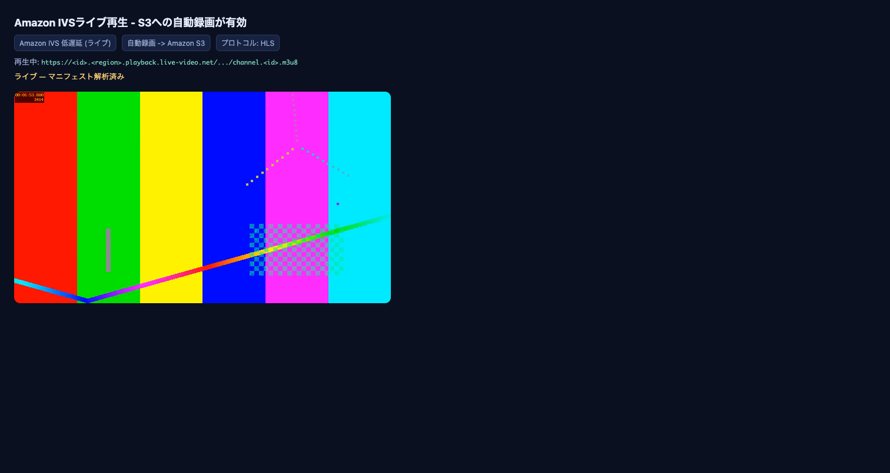
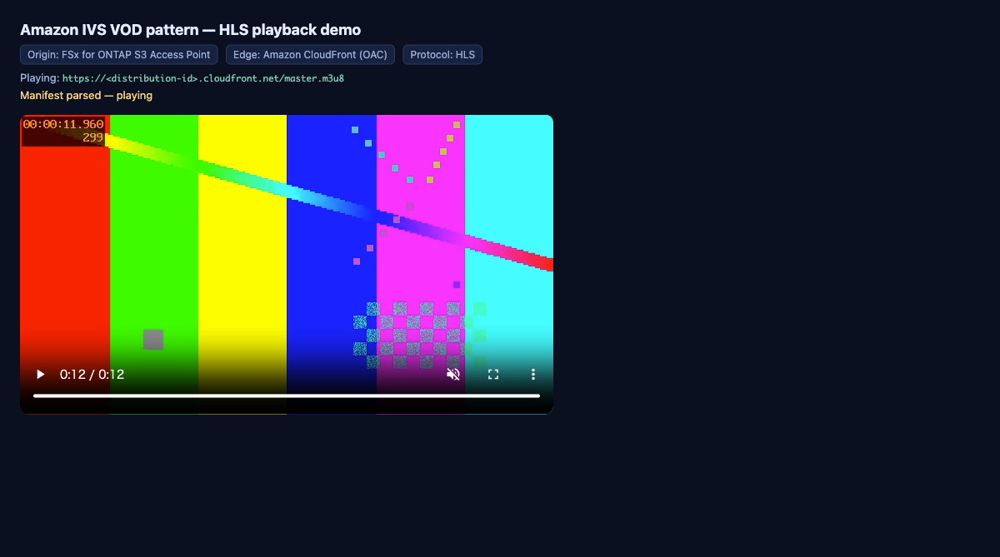

# デモガイド — Media IVS VOD Publishing（DemoMode）

FSx for ONTAP / Amazon IVS なしで、VOD publish ワークフローのロジックを検証する手順です。

## 1. ユニット/プロパティテスト（最速）

```bash
make test-media-ivs-vod-publishing
# または
python3 -m pytest solutions/edge/media-ivs-vod-publishing/tests/ -v
```

検証内容:
- `Recording End` イベントで publish が起動し、`master.m3u8` 検証が働くこと
- `Recording Start` / `Recording End Failure` 等、Recording End 以外はスキップされること
- DemoMode では FSx への実コピーをスキップし、記録のみ行うこと
- master manifest 欠落時に Human Review が `HUMAN_REVIEW` / `REJECT` を返すこと
- 取り込みが録画プレフィックス配下に限定されること（permission-aware）
- publish マニフェストに `data_classification`（PUBLIC）が付与されること

## 2. ローカルでの publish 動作確認（mock）

`tests/conftest.py` の `FakeS3Ap` を使うと、S3/FSx に接続せずに publish の入出力を確認できます。
publish マニフェスト JSON には `master_manifest_present` / `human_review` / `published` /
`skipped` / `data_classification` が含まれます。

サンプルイベントは [../samples/eventbridge-recording-ended.json](../samples/eventbridge-recording-ended.json) を参照。

## 3. DemoMode デプロイ（任意）

実 AWS で確認する場合（FSx は不要、S3 AP alias の形式パラメータのみ必要）:

```bash
sam build --template solutions/edge/media-ivs-vod-publishing/template.yaml
sam deploy --guided \
  --template solutions/edge/media-ivs-vod-publishing/template.yaml \
  --stack-name fsxn-media-ivs-vod-publishing-demo \
  --parameter-overrides DemoMode=true TriggerMode=EVENT_DRIVEN
```

DemoMode=true では FSx への実コピーを行わず、マニフェストの `skipped` に記録します。

## 4. 本番移行時の追加確認

| 項目 | DemoMode | 本番移行前 |
|---|---|---|
| publish ロジック / Recording End 分岐 | ✅（テスト） | — |
| master manifest 検証 / Human Review 判定 | ✅（テスト） | 実 HLS パッケージで確認 |
| S3 → FSx 取り込み（S3 AP PutObject） | ⚠️ スキップ | 実 S3 AP + ONTAP ID で確認 |
| 大容量/多数セグメント | — | DataSync / ECS・Batch（NFS/SMB）を検討 |
| CloudFront 配信（OAC + SigV4） | — | 実機で `.m3u8`/segments の SigV4 取得を確認 |
| 直接録画（IVS→FSx for ONTAP S3 AP） | — | Experimental（[../direct-recording-experiment.md](../direct-recording-experiment.md)） |

## 5. 実 AWS で検証できる範囲（コスト別）

デモ/動作確認を段階的に行うためのガイド。順に A → B → C。

### A. ローカル / ゼロコスト（AWS 不要）

```bash
make test-media-ivs-vod-publishing         # 45 テスト（publish/moderation/transcode ロジック）
cfn-lint solutions/edge/media-ivs-vod-publishing/template.yaml   # 0 エラー
```

### B. 低コストで実 AWS 検証（FSx 不要が中心）

- **B3: IVS が S3 AP alias を録画先として受理するか（config 作成の検証のみ）**

  ```bash
  # 標準 S3 AP でも FSx for ONTAP S3 AP でも同じスクリプトで検証できる。
  # config 作成のみを検証し、作成した RecordingConfiguration は自動削除する（KEEP_RC=1 で保持）。
  FSX_S3AP_ALIAS="<your-s3-access-point-alias>" \
  FSX_S3AP_ARN="arn:aws:s3:<region>:<account-id>:accesspoint/<name>" \
    ./scripts/test-direct-fsx-s3ap-alias.sh
  ```

  観測（この検証環境）: **alias**（≤63 文字）→ `state: ACTIVE`。**ARN**（>63 文字）→ `ValidationException`
  （`bucketName` は最大 63 文字）。**標準 S3 AP と FSx for ONTAP S3 AP の両方**で alias が config 作成を
  通過し ACTIVE に到達することを確認済み。ただし **config 作成 ≠ 録画成功**（ライブ配信・volume 書き込み・
  二層認可は未検証）。詳細と公開ラベル方針は [../direct-recording-experiment.md](../direct-recording-experiment.md)。

- **B1: 推奨パスのコア（DemoMode）** — `sam deploy DemoMode=true` でスタックを作成し、IVS チャンネル +
  Recording Config を用意して短時間 RTMPS 配信 → Recording End イベント → Step Functions → publish Lambda。
  実配信はエンコーダー（OBS/FFmpeg）操作が必要。
- **B4: S3 Access Point → CloudFront（OAC）配信レグ** — 標準 S3 バケット + S3 AP + CloudFront で
  `.m3u8`/segments の SigV4 取得・TTL 挙動を確認（FSx 不要）。

#### B 実施結果（実 AWS で検証済み）

IVS チャンネル + Recording Configuration（S3 出力）を作成し、**ffmpeg から RTMPS で短時間配信** →
Auto-Record → S3 → publish ロジックまでを実機確認した。

- **ライブ再生**（hls.js、ブラウザで確認。URL はマスキング）:

  

- **配信中の timed metadata**（レイヤー2 のオーバーレイ機構）:

  ```bash
  aws ivs put-metadata --channel-arn <channel-arn> \
    --metadata '{"type":"caption","cue":"c-010","assetKey":"captions/en/seg-010.vtt"}'
  #=> rc=0（配信が LIVE の間のみ受理。実体アセットは CloudFront(S3 AP オリジン) から取得する設計）
  ```
  > オーバーレイの実描画には IVS Player SDK が必要（本検証は挿入機構の確認まで）。

- **Auto-Record 生成物**（配信停止後、IVS が S3 にファイナライズ）:
  `ivs/v1/<account>/<channel>/<date>/<session>/` 配下に `media/hls/master.m3u8`、
  `media/hls/720p/playlist.m3u8` + セグメント、`media/thumbnails/`、
  `events/recording-started.json` / `recording-ended.json` を確認。

- **publish ステップ**（実録画に対し同一ハンドラを DemoMode で実行）:
  `master_manifest_present=true`、confidence `0.95` → `AUTO_APPROVE`、manifest 出力を確認。

> 検証で作成した IVS チャンネル・Recording Configuration・録画用 S3 バケットは、確認後にすべて削除。
> `-t` による尺制限はエンコーダー実装依存のため、固定長で流す場合は入力側の duration を用いる。

### C. FSx for ONTAP を使う検証（既存リソースを活用）

新規に FSx for ONTAP を作らず、**既存のファイルシステム/ボリューム/S3 アクセスポイント接続を再利用**する。

- 既存の FSx for ONTAP S3 アクセスポイント接続を確認:

  ```bash
  aws fsx describe-s3-access-point-attachments --region ap-northeast-1 \
    --query "S3AccessPointAttachments[].{Name:Name,Vol:OntapConfiguration.VolumeId,Alias:S3AccessPoint.Alias}"
  ```

- 既存 S3 AP alias を CloudFront オリジンにして HLS を配信（[Stream video using CloudFront with FSx for ONTAP](https://docs.aws.amazon.com/fsx/latest/ONTAPGuide/tutorial-stream-video-with-cloudfront.html) を参照）。
- NFS/SMB と S3 API の二面アクセス、FlexCache、FabricPool 階層化、SnapMirror は既存構成の範囲で確認する。

> 注意: 共有の既存 FSx for ONTAP を使う場合は、**専用のプレフィックス/ボリューム**に限定し、既存データに
> 触れないこと。検証で作成した IVS RecordingConfiguration 等の一時リソースは完了後に削除する。
>
> 注意: FSx for ONTAP の S3 アクセスポイントは、**マネージド S3 アクセスポイントをサポートする SVM**
> 上に作成すること。既に手動で ONTAP object-storage（S3）サーバーが構成された SVM ではアタッチが
> 失敗する（`unable to create an S3 access point because of an existing ONTAP object storage server`）。

### C. 実施結果（実 AWS で検証済み）

既存 FSx for ONTAP ファイルシステム上に**専用ボリューム + 専用 S3 アクセスポイント（internet-origin）**を
作成し、ffmpeg で生成した短尺 HLS を S3 API 経由でアップロード、CloudFront（OAC）から配信して再生を確認。

検証コマンドと結果（値はマスキング）:

```bash
# 1) S3 API データプレーン（AP alias 経由の PutObject / ListObjectsV2）— 確認済み
aws s3api put-object --bucket <fsxontap-s3ap-alias> --key vod/demo1/master.m3u8 \
  --body master.m3u8 --content-type application/vnd.apple.mpegurl
aws s3api list-objects-v2 --bucket <fsxontap-s3ap-alias> --prefix vod/demo1/

# 2) CloudFront(OAC) → FSx for ONTAP S3 AP 配信レグ — 確認済み
curl -sS -o /dev/null -w "%{http_code} %{content_type} %{size_download}\n" \
  https://<distribution-id>.cloudfront.net/master.m3u8
#=> 200 application/vnd.apple.mpegurl 121
curl -sS -D - -o /dev/null https://<distribution-id>.cloudfront.net/seg_000.ts | grep -i x-cache
#=> 200 video/mp2t 478836 ... x-cache: Hit from cloudfront
```

hls.js プレイヤーで再生した様子（オリジン = FSx for ONTAP S3 AP、エッジ = CloudFront/OAC）:



> 検証で作成した CloudFront ディストリビューション・OAC・S3 アクセスポイント・専用ボリュームは、
> 確認後にすべて削除している（既存/他プロジェクトのリソースは不変）。手順とテンプレートは
> [../cloudfront/](../cloudfront/) と [../scripts/demo-cloudfront-fsxontap.sh](../scripts/demo-cloudfront-fsxontap.sh) を参照。
