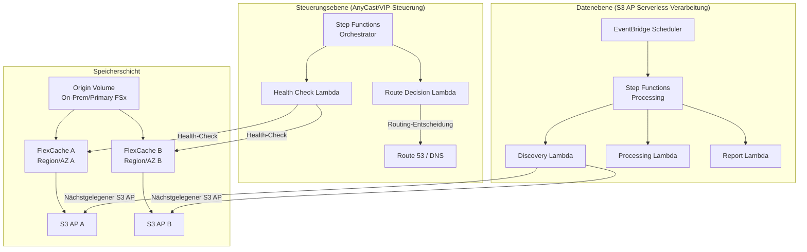

# FlexCache AnyCast / DR-Muster

🌐 **Language / 言語**: [日本語](README.md) | [English](README.en.md) | [한국어](README.ko.md) | [简体中文](README.zh-CN.md) | [繁體中文](README.zh-TW.md) | [Français](README.fr.md) | [Deutsch](README.de.md) | [Español](README.es.md)

## Übersicht

Dieses Muster stellt Entwurfsleitfäden, Simulationsdemos und Dokumente zum Betriebsdesign bereit, um AnyCast-Konfigurationen und DR-Konfigurationen (Disaster Recovery) von ONTAP FlexCache in Kombination mit den Diensten FSx for ONTAP × S3 Access Points × AWS Serverless zu realisieren.

## Gelöste Probleme

| Problem | Lösung über FlexCache AnyCast / DR |
|------|----------------------------------|
| Leseleistung für geografisch verteilte Teams | Hot-Daten aus dem nächstgelegenen FlexCache bereitstellen |
| Cloud-Bursting für EDA/Media/HPC | On-Premises-Origin + Cloud-FlexCache reduziert WAN-Übertragungen |
| Lesekontinuität während DR | Lesen über den Cache auch bei Ausfall des Origin möglich |
| Reduzierung des WAN-Übertragungsvolumens | Nur Hot-Daten cachen, Deltas übertragen |
| Vermeidung komplexer clientseitiger Mount-Konfiguration | Einzelner Mount-Punkt über AnyCast-IP |

## Architekturübersicht



## Bezug zu bestehenden Use Cases

| Bestehender UC | Bezugspunkt |
|---------|------------|
| [media-vfx/](../media-vfx/) | FlexCache-Beschleunigung von render input assets |
| [manufacturing-analytics/](../manufacturing-analytics/) | FlexCache für die Datenteilung zwischen Fabriken |
| [healthcare-dicom/](../healthcare-dicom/) | DICOM-Caching zwischen Forschungsstandorten |
| [legal-compliance/](../legal-compliance/) | FlexCache für Auditdaten zwischen Niederlassungen |
| [financial-idp/](../financial-idp/) | Dokumenten-Caching zwischen Niederlassungen |
| [semiconductor-eda/](../semiconductor-eda/) | Cloud-Bursting für EDA Tools/Libraries |

## Verbindungspunkte mit FSx for ONTAP S3 Access Points

```
┌─────────────────────────────────────────────────────────┐
│ NFS/SMB-Zugriff: über FlexCache (Client direkt)           │
│ S3-API-Zugriff: über S3 Access Points (Serverless-Verarb.)│
└─────────────────────────────────────────────────────────┘
```

- **NFS/SMB**: Clients mounten das FlexCache volume direkt (über AnyCast-IP oder DNS)
- **S3 API**: Lambda/Step Functions verarbeiten zwischengespeicherte Daten über den S3 Access Point
- **Kombination**: ein Design, das zwischengespeicherte/nahegelegene Daten an serverlose KI/Analytik übergibt

## Support/Einschränkungen

### ONTAP-Versionsunterschiede

| Funktion | Mindestversion | Hinweise |
|------|--------------|------|
| FlexCache Basis (NFS) | 9.8 | |
| FlexCache SMB | 9.10.1 | |
| Prepopulate | 9.13.1 | |
| Disconnected mode | 9.12.1 | Lesekontinuität, wenn der Origin nicht erreichbar ist |
| Global file lock | 9.14.1 | |
| Writeback | 9.15.1 | |

### Umfang der Funktionsverfügbarkeit auf FSx for ONTAP

- Erstellung/Verwaltung von FlexCache: ✅ Möglich über ONTAP REST API / CLI
- S3 Access Points: ✅ Über FSx-Konsole / API erstellbar
- **S3 AP an ein FlexCache volume anhängen**: ⚠️ Nicht verifiziert (in einem PoC zu validieren)
- Virtual IP / BGP: ❌ Auf FSx for ONTAP nicht verfügbar (verwaltetes Netzwerk)

### Umsetzbarkeitsumfang von Virtual IP / BGP

| Umgebung | VIP/BGP | Alternative |
|------|---------|---------|
| FSx for ONTAP | ❌ | Route 53, Global Accelerator, App routing |
| On-Premises-ONTAP | ✅ | Natives AnyCast |
| Lab/Simulator | ✅ | AnyCast für Tests |

## Verzeichnisstruktur

```
flexcache-anycast-dr/
├── README.md                          # Diese Datei
├── template.yaml                      # CloudFormation-Vorlage
├── src/
│   ├── discovery/handler.py           # Cache-Erkennungs-Lambda
│   ├── health_check/handler.py        # Health-Check-Lambda
│   ├── route_decision/handler.py      # Routenentscheidungs-Lambda
│   └── report/handler.py             # Berichtserstellungs-Lambda
├── events/
│   ├── sample-failover-event.json     # Beispiel für ein Failover-Ereignis
│   └── sample-cache-health-event.json # Beispiel für ein Cache-Health-Ereignis
├── tests/
│   ├── test_health_check.py
│   ├── test_route_decision.py
│   └── test_discovery.py
└── docs/
    ├── architecture.md                # Architekturdetails
    ├── design-patterns.md             # Sammlung von Konfigurationsmustern
    ├── poc-checklist.md               # PoC-Checkliste
    ├── demo-guide.md                  # Demo-Leitfaden
    ├── operations-runbook.md          # Betriebs-Runbook
    ├── limitations-and-support-matrix.md
    ├── disaster-recovery-patterns.md  # DR-Muster
    ├── network-design-bgp-vip.md      # Netzwerkdesign
    └── flexcache-anycast-faq.md       # FAQ
```

## Schnellstart (Simulationsdemo)

Auch wenn BGP/VIP in einer realen Umgebung nicht verfügbar ist, können Sie „Routenauswahl“, „Cache-Health“ und „Auswahl des nächstgelegenen Caches“ mit Step Functions und Lambda simulieren.

### Voraussetzungen

- AWS-Konto
- Python 3.12
- AWS CLI v2
- SAM CLI (optional)

### Bereitstellung

```bash
# Parameterdatei bearbeiten
cp params/staging.json params/flexcache-anycast-demo.json
# Erforderliche Parameter festlegen

# Bereitstellen
# Voraussetzung: AWS SAM CLI ist erforderlich. „sam build“ packt den Code und den Shared Layer automatisch.
sam build

sam deploy \
  --stack-name flexcache-anycast-demo \
  --capabilities CAPABILITY_NAMED_IAM \
  --resolve-s3 \
  --parameter-overrides \
    SimulationMode=true \
    CacheEndpoints="cache-a.example.com,cache-b.example.com" \
    HealthCheckIntervalMinutes=5
```

> **Hinweis**: `template.yaml` wird mit der SAM CLI verwendet (`sam build` + `sam deploy`).
> Um direkt mit dem Befehl `aws cloudformation deploy` bereitzustellen, verwenden Sie stattdessen `template-deploy.yaml` (erfordert das Vorab-Packen von Lambda-Zip-Dateien und deren Upload nach S3).

### Demo ausführen

```bash
# Health-Check ausführen
aws stepfunctions start-execution \
  --state-machine-arn <STATE_MACHINE_ARN> \
  --input '{"action": "health_check"}'

# Failover-Simulation
aws stepfunctions start-execution \
  --state-machine-arn <STATE_MACHINE_ARN> \
  --input file://events/sample-failover-event.json
```

## Dokumentation

| Dokument | Inhalt |
|-------------|------|
| [Architektur](docs/architecture.md) | Detaillierter Entwurf mit Mermaid-Diagrammen |
| [Entwurfsmuster](docs/design-patterns.md) | 7 Konfigurationsmuster |
| [PoC-Checkliste](docs/poc-checklist.md) | Eine in realen Projekten nutzbare Checkliste |
| [Demo-Leitfaden](docs/demo-guide.md) | 5 Demo-Szenarien |
| [Betriebs-Runbook](docs/operations-runbook.md) | Betriebsverfahren |
| [Einschränkungs-/Support-Matrix](docs/limitations-and-support-matrix.md) | Funktionsverfügbarkeit je Plattform |
| [DR-Muster](docs/disaster-recovery-patterns.md) | DR-Entwurfsmuster |
| [Netzwerkdesign](docs/network-design-bgp-vip.md) | BGP/VIP/DNS-Design |
| [FAQ](docs/flexcache-anycast-faq.md) | Häufig gestellte Fragen |

## Anycast Terminology

In this sample, "Anycast" refers to application-level routing decisions based on cache health and availability. It is not intended to replace network-layer anycast design.

## DR Scope

This pattern focuses on read-path resilience and cache-aware routing. It does not replace a full DR strategy such as backup, replication, RPO/RTO design, and operational recovery planning.

## Suggested Validation Metrics

- Route decision latency
- Cache health detection time
- Origin unavailable detection time
- Time to switch active read path
- Read-path recovery behavior
- False positive / false negative health check behavior
- DynamoDB routing table update latency
- Audit event completeness for route changes

## Success Metrics

### Outcome
Provide faster and more resilient read access for distributed teams without requiring a full independent copy of the dataset.

### Metrics
| Metrik | Zielwert (Beispiel) |
|-----------|------------|
| Route decision latency | < 500 ms |
| Cache health detection time | < 30 seconds |
| Read-path recovery time | < 60 seconds |
| Successful reads from healthy cache path | > 99% |
| Audit event completeness | 100% |
| Human-Review-Anteil | Route changes require approval in regulated environments |

### Measurement Method
DynamoDB routing table updates, CloudWatch Logs, ONTAP REST API health check results, Step Functions execution history, generated audit records.

## Verwandte Links

- [Support-Matrix](../docs/support-matrix-fsx-ontap-flexcache-s3ap.md)
- [Branchen-/Workload-Mapping](../docs/industry-workload-mapping.md)
- [Dynamic FlexCache Render Workflow](../dynamic-flexcache-render-workflow/README.md)
- [NetApp FlexCache-Dokumentation](https://docs.netapp.com/us-en/ontap/flexcache/index.html)
- [FSx for ONTAP-Dokumentation](https://docs.aws.amazon.com/fsx/latest/ONTAPGuide/)

---

## Kostenschätzung (monatliche Näherung)

> **Anmerkung**: Das Folgende ist eine Näherung für die Region ap-northeast-1; die tatsächlichen Kosten variieren je nach Nutzung. Prüfen Sie die aktuellen Preise mit dem [AWS Pricing Calculator](https://calculator.aws/).

### Serverlose Komponenten (nutzungsbasierte Abrechnung)

| Dienst | Stückpreis | Angenommene Nutzung | Monatliche Näherung |
|---------|------|-----------|---------|
| Lambda | $0.0000166667/GB-sec | 2 Funktionen × 24 checks/Tag | ~$1-5 |
| S3 API (GetObject/ListObjects) | $0.0047/10K requests | ~10K requests/Tag | ~$1.5 |
| Step Functions | $0.025/1K state transitions | ~1K transitions/Tag | ~$0.75 |
| Bedrock (Nova Lite) | $0.00006/1K input tokens | N/A | ~$3-10 |
| Athena | $5/TB scanned | N/A | ~$0.5-2 |
| SNS | $0.50/100K notifications | ~100 notifications/Tag | ~$0.15 |
| CloudWatch Logs | $0.76/GB ingested | ~1 GB/Monat | ~$0.76 |
| Route 53 Health Check | $0.50/check/Monat |

### Fixkosten (FSx for ONTAP — setzt eine bestehende Umgebung voraus)

| Komponente | Monatlich |
|--------------|------|
| FSx for ONTAP (128 MBps, 1 TB) | ~$230 (gemeinsame bestehende Umgebung) |
| S3 Access Point | Keine zusätzlichen Gebühren (nur S3-API-Gebühren) |

### Gesamtnäherung

| Konfiguration | Monatliche Näherung |
|------|---------|
| Minimale Konfiguration (einmal täglich) | ~$5-15 |
| Standardkonfiguration (stündlich) | ~$15-50 |
| Großkonfiguration (hohe Frequenz + Alarme) | ~$50-150 |

> **Governance Caveat**: Kostenschätzungen sind Näherungen, keine garantierten Werte. Der tatsächliche Rechnungsbetrag variiert je nach Nutzungsmuster, Datenvolumen und Region.

---

## Lokales Testen

### Prüfung der Voraussetzungen

```bash
# Voraussetzungen prüfen
aws --version          # AWS CLI v2
sam --version          # SAM CLI
python3 --version      # Python 3.9+
docker --version       # Docker (für sam local)
aws sts get-caller-identity  # AWS-Anmeldeinformationen
```

### sam local invoke

```bash
# Build
# Voraussetzung: AWS SAM CLI ist erforderlich. „sam build“ packt den Code und den Shared Layer automatisch.
sam build

# Lokale Ausführung der Discovery-Lambda
sam local invoke DiscoveryFunction --event events/discovery-event.json

# Mit Überschreiben von Umgebungsvariablen
sam local invoke DiscoveryFunction \
  --event events/discovery-event.json \
  --env-vars env.json
```

### Unit-Tests

```bash
python3 -m pytest tests/ -v
```

Weitere Details siehe [Schnellstart für lokales Testen](../docs/local-testing-quick-start.md).

---

## Ausgabebeispiel (Output Sample)

Beispielausgabe eines FlexCache-Health-Checks + Routing-Entscheidung:

```json
{
  "health_check": {
    "primary": {
      "region": "ap-northeast-1",
      "status": "healthy",
      "latency_ms": 12,
      "cache_hit_rate_pct": 87.5
    },
    "secondary": {
      "region": "ap-southeast-1",
      "status": "healthy",
      "latency_ms": 45,
      "cache_hit_rate_pct": 72.3
    }
  },
  "routing_decision": {
    "active_region": "ap-northeast-1",
    "failover_triggered": false,
    "decision_reason": "primary_healthy",
    "timestamp": "2026-05-23T09:00:00Z"
  }
}
```

> **Anmerkung**: Das Obige ist eine Beispielausgabe; die tatsächlichen Werte variieren je nach Umgebung und Eingabedaten. Benchmark-Zahlen sind eine Sizing-Referenz, kein Service-Limit.

---

## Performance Considerations

- Die Durchsatzkapazität von FSx for ONTAP wird von NFS/SMB/S3AP gemeinsam genutzt
- Die Latenz über den S3 Access Point verursacht einen Overhead von einigen zehn Millisekunden
- Steuern Sie bei der Verarbeitung großer Dateimengen den Parallelitätsgrad über die MaxConcurrency des Step Functions Map state
- Eine Erhöhung der Lambda-Speichergröße verbessert auch die Netzwerkbandbreite

> **Anmerkung**: Die Leistungszahlen dieses Musters sind eine Sizing-Referenz, kein Service-Limit. Die Leistung in einer realen Umgebung variiert je nach Durchsatzkapazität von FSx for ONTAP, Netzwerkkonfiguration und gleichzeitig laufenden Workloads.

---

## Governance Note

> Dieses Muster bietet technische Architekturhinweise. Es handelt sich nicht um rechtliche, Compliance- oder aufsichtsrechtliche Beratung. Organisationen sollten qualifizierte Fachleute konsultieren.
