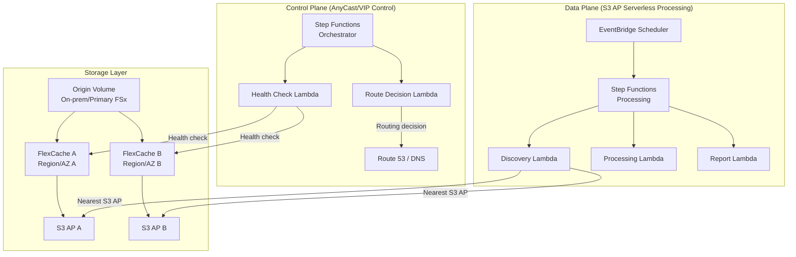

# FlexCache AnyCast / DR Pattern

🌐 **Language / 言語**: [日本語](README.md) | [English](README.en.md) | [한국어](README.ko.md) | [简体中文](README.zh-CN.md) | [繁體中文](README.zh-TW.md) | [Français](README.fr.md) | [Deutsch](README.de.md) | [Español](README.es.md)

## Overview

This pattern provides design guides, simulation demos, and operational design documents for implementing ONTAP FlexCache AnyCast configurations and DR (Disaster Recovery) configurations by combining FSx for ONTAP × S3 Access Points × AWS Serverless services.

## Problems Solved

| Problem | Solution via FlexCache AnyCast / DR |
|------|----------------------------------|
| Read performance for geographically distributed teams | Serve hot data from the nearest FlexCache |
| Cloud bursting for EDA/Media/HPC | On-premises Origin + cloud FlexCache reduces WAN transfers |
| Read continuity during DR | Reads remain possible via cache even during Origin failure |
| Reducing WAN transfer volume | Cache only hot data, transfer deltas |
| Avoiding client-side mount configuration complexity | Single mount point via AnyCast IP |

## Architecture Overview



## Relationship to Existing Use Cases

| Existing UC | Relevance |
|---------|------------|
| [media-vfx/](../media-vfx/) | FlexCache acceleration for render input assets |
| [manufacturing-analytics/](../manufacturing-analytics/) | FlexCache for inter-factory data sharing |
| [healthcare-dicom/](../healthcare-dicom/) | DICOM caching between research sites |
| [legal-compliance/](../legal-compliance/) | FlexCache for inter-branch audit data |
| [financial-idp/](../financial-idp/) | Inter-branch document caching |
| [semiconductor-eda/](../semiconductor-eda/) | Cloud bursting for EDA Tools/Libraries |

## Connection Points with FSx for ONTAP S3 Access Points

```
┌─────────────────────────────────────────────────────────┐
│ NFS/SMB access: via FlexCache (direct from client)        │
│ S3 API access: via S3 Access Points (serverless process)  │
└─────────────────────────────────────────────────────────┘
```

- **NFS/SMB**: Clients mount the FlexCache volume directly (via AnyCast IP or DNS)
- **S3 API**: Lambda/Step Functions process cached data via the S3 Access Point
- **Combination**: A design that passes cached/nearby data to serverless AI/analytics

## Support/Constraints

### ONTAP Version Differences

| Feature | Minimum Version | Notes |
|------|--------------|------|
| FlexCache basic (NFS) | 9.8 | |
| FlexCache SMB | 9.10.1 | |
| Prepopulate | 9.13.1 | |
| Disconnected mode | 9.12.1 | Read continuity when Origin is unreachable |
| Global file lock | 9.14.1 | |
| Writeback | 9.15.1 | |

### Feature Availability on FSx for ONTAP

- FlexCache creation/management: ✅ Possible via ONTAP REST API / CLI
- S3 Access Points: ✅ Can be created via FSx console / API
- **Attaching an S3 AP to a FlexCache volume**: ⚠️ Unverified (validate in a PoC)
- Virtual IP / BGP: ❌ Not available on FSx for ONTAP (managed network)

### Feasibility Scope of Virtual IP / BGP

| Environment | VIP/BGP | Alternative |
|------|---------|---------|
| FSx for ONTAP | ❌ | Route 53, Global Accelerator, App routing |
| On-premises ONTAP | ✅ | Native AnyCast |
| Lab/Simulator | ✅ | AnyCast for testing |

## Directory Structure

```
flexcache-anycast-dr/
├── README.md                          # This file
├── template.yaml                      # CloudFormation template
├── src/
│   ├── discovery/handler.py           # Cache discovery Lambda
│   ├── health_check/handler.py        # Health check Lambda
│   ├── route_decision/handler.py      # Route decision Lambda
│   └── report/handler.py             # Report generation Lambda
├── events/
│   ├── sample-failover-event.json     # Failover event example
│   └── sample-cache-health-event.json # Cache health event example
├── tests/
│   ├── test_health_check.py
│   ├── test_route_decision.py
│   └── test_discovery.py
└── docs/
    ├── architecture.md                # Architecture details
    ├── design-patterns.md             # Configuration pattern collection
    ├── poc-checklist.md               # PoC checklist
    ├── demo-guide.md                  # Demo guide
    ├── operations-runbook.md          # Operations runbook
    ├── limitations-and-support-matrix.md
    ├── disaster-recovery-patterns.md  # DR patterns
    ├── network-design-bgp-vip.md      # Network design
    └── flexcache-anycast-faq.md       # FAQ
```

## Quick Start (Simulation Demo)

Even when BGP/VIP is not available in a real environment, you can simulate "route selection", "cache health", and "nearest cache selection" with Step Functions and Lambda.

### Prerequisites

- AWS account
- Python 3.12
- AWS CLI v2
- SAM CLI (optional)

### Deploy

```bash
# Edit the parameter file
cp params/staging.json params/flexcache-anycast-demo.json
# Set the required parameters

# Deploy
# Prerequisite: AWS SAM CLI is required. 'sam build' automatically packages the code and shared layer.
sam build

sam deploy \
  --stack-name flexcache-anycast-demo \
  --capabilities CAPABILITY_NAMED_IAM \
  --resolve-s3 \
  --parameter-overrides \
    SimulationMode=true \
    CacheEndpoints="cache-a.example.com,cache-b.example.com" \
    HealthCheckIntervalMinutes=5
```

> **Note**: `template.yaml` is used with the SAM CLI (`sam build` + `sam deploy`).
> To deploy directly with the `aws cloudformation deploy` command, use `template-deploy.yaml` instead (requires pre-packaging Lambda zip files and uploading them to S3).

### Run the Demo

```bash
# Run a health check
aws stepfunctions start-execution \
  --state-machine-arn <STATE_MACHINE_ARN> \
  --input '{"action": "health_check"}'

# Failover simulation
aws stepfunctions start-execution \
  --state-machine-arn <STATE_MACHINE_ARN> \
  --input file://events/sample-failover-event.json
```

## Documentation

| Document | Content |
|-------------|------|
| [Architecture](docs/architecture.md) | Detailed design with Mermaid diagrams |
| [Design Patterns](docs/design-patterns.md) | 7 configuration patterns |
| [PoC Checklist](docs/poc-checklist.md) | A checklist usable in real projects |
| [Demo Guide](docs/demo-guide.md) | 5 demo scenarios |
| [Operations Runbook](docs/operations-runbook.md) | Operational procedures |
| [Constraints & Support Matrix](docs/limitations-and-support-matrix.md) | Feature availability by platform |
| [DR Patterns](docs/disaster-recovery-patterns.md) | DR design patterns |
| [Network Design](docs/network-design-bgp-vip.md) | BGP/VIP/DNS design |
| [FAQ](docs/flexcache-anycast-faq.md) | Frequently asked questions |

## Anycast Terminology

In this sample, "Anycast" refers to application-level routing decisions based on cache health and availability. It is not intended to replace network-layer anycast design.

## DR Scope

This pattern focuses on read-path resilience and cache-aware routing. It does not replace a full DR strategy such as backup, replication, RPO/RTO design, and operational recovery planning.

## Suggested Validation Metrics

- Route decision latency
- Cache health detection time
- Origin unavailable detection time
- Time to switch active read path
- Read-path recovery behavior
- False positive / false negative health check behavior
- DynamoDB routing table update latency
- Audit event completeness for route changes

## Success Metrics

### Outcome
Provide faster and more resilient read access for distributed teams without requiring a full independent copy of the dataset.

### Metrics
| Metric | Target (example) |
|-----------|------------|
| Route decision latency | < 500 ms |
| Cache health detection time | < 30 seconds |
| Read-path recovery time | < 60 seconds |
| Successful reads from healthy cache path | > 99% |
| Audit event completeness | 100% |
| Human Review rate | Route changes require approval in regulated environments |

### Measurement Method
DynamoDB routing table updates, CloudWatch Logs, ONTAP REST API health check results, Step Functions execution history, generated audit records.

## Related Links

- [Support Matrix](../docs/support-matrix-fsx-ontap-flexcache-s3ap.md)
- [Industry / Workload Mapping](../docs/industry-workload-mapping.md)
- [Dynamic FlexCache Render Workflow](../dynamic-flexcache-render-workflow/README.md)
- [NetApp FlexCache Documentation](https://docs.netapp.com/us-en/ontap/flexcache/index.html)
- [FSx for ONTAP Documentation](https://docs.aws.amazon.com/fsx/latest/ONTAPGuide/)

---

## Cost Estimate (Monthly Approximation)

> **Note**: The following is an approximation for the ap-northeast-1 region; actual costs vary by usage. Check the latest pricing with the [AWS Pricing Calculator](https://calculator.aws/).

### Serverless Components (Pay-as-you-go)

| Service | Unit Price | Assumed Usage | Monthly Approximation |
|---------|------|-----------|---------|
| Lambda | $0.0000166667/GB-sec | 2 functions × 24 checks/day | ~$1-5 |
| S3 API (GetObject/ListObjects) | $0.0047/10K requests | ~10K requests/day | ~$1.5 |
| Step Functions | $0.025/1K state transitions | ~1K transitions/day | ~$0.75 |
| Bedrock (Nova Lite) | $0.00006/1K input tokens | N/A | ~$3-10 |
| Athena | $5/TB scanned | N/A | ~$0.5-2 |
| SNS | $0.50/100K notifications | ~100 notifications/day | ~$0.15 |
| CloudWatch Logs | $0.76/GB ingested | ~1 GB/month | ~$0.76 |
| Route 53 Health Check | $0.50/check/month |

### Fixed Cost (FSx for ONTAP — assumes an existing environment)

| Component | Monthly |
|--------------|------|
| FSx for ONTAP (128 MBps, 1 TB) | ~$230 (shared existing environment) |
| S3 Access Point | No additional charge (S3 API charges only) |

### Total Approximation

| Configuration | Monthly Approximation |
|------|---------|
| Minimal configuration (once daily) | ~$5-15 |
| Standard configuration (hourly) | ~$15-50 |
| Large-scale configuration (high frequency + alarms) | ~$50-150 |

> **Governance Caveat**: Cost estimates are approximations, not guaranteed values. Actual billing varies by usage pattern, data volume, and region.

---

## Local Testing

### Prerequisites Check

```bash
# Check prerequisites
aws --version          # AWS CLI v2
sam --version          # SAM CLI
python3 --version      # Python 3.9+
docker --version       # Docker (for sam local)
aws sts get-caller-identity  # AWS credentials
```

### sam local invoke

```bash
# Build
# Prerequisite: AWS SAM CLI is required. 'sam build' automatically packages the code and shared layer.
sam build

# Local execution of the Discovery Lambda
sam local invoke DiscoveryFunction --event events/discovery-event.json

# With environment variable overrides
sam local invoke DiscoveryFunction \
  --event events/discovery-event.json \
  --env-vars env.json
```

### Unit Tests

```bash
python3 -m pytest tests/ -v
```

For details, see [Local Testing Quick Start](../docs/local-testing-quick-start.md).

---

## Output Sample (Output Sample)

Example output of a FlexCache health check + routing decision:

```json
{
  "health_check": {
    "primary": {
      "region": "ap-northeast-1",
      "status": "healthy",
      "latency_ms": 12,
      "cache_hit_rate_pct": 87.5
    },
    "secondary": {
      "region": "ap-southeast-1",
      "status": "healthy",
      "latency_ms": 45,
      "cache_hit_rate_pct": 72.3
    }
  },
  "routing_decision": {
    "active_region": "ap-northeast-1",
    "failover_triggered": false,
    "decision_reason": "primary_healthy",
    "timestamp": "2026-05-23T09:00:00Z"
  }
}
```

> **Note**: The above is sample output; actual values vary by environment and input data. Benchmark figures are a sizing reference, not a service limit.

---

## Performance Considerations

- FSx for ONTAP throughput capacity is shared across NFS/SMB/S3AP
- Latency via the S3 Access Point incurs an overhead of tens of milliseconds
- When processing large numbers of files, control the parallelism with the MaxConcurrency of the Step Functions Map state
- Increasing the Lambda memory size also improves network bandwidth

> **Note**: The performance figures in this pattern are a sizing reference, not a service limit. Real-world performance varies by FSx for ONTAP throughput capacity, network configuration, and concurrent workloads.

---

## Governance Note

> This pattern provides technical architecture guidance. It is not legal, compliance, or regulatory advice. Organizations should consult qualified professionals.
