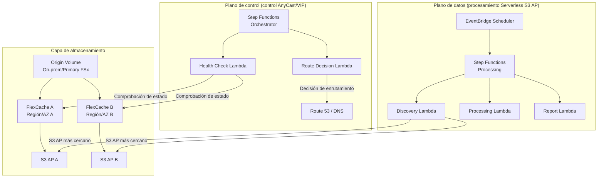

# Patrón FlexCache AnyCast / DR

🌐 **Language / 言語**: [日本語](README.md) | [English](README.en.md) | [한국어](README.ko.md) | [简体中文](README.zh-CN.md) | [繁體中文](README.zh-TW.md) | [Français](README.fr.md) | [Deutsch](README.de.md) | [Español](README.es.md)

## Descripción general

Este patrón proporciona guías de diseño, demos de simulación y documentos de diseño operativo para implementar las configuraciones AnyCast y de DR (Disaster Recovery) de ONTAP FlexCache combinándolas con los servicios FSx for ONTAP × S3 Access Points × AWS Serverless.

## Problemas resueltos

| Problema | Solución mediante FlexCache AnyCast / DR |
|------|----------------------------------|
| Rendimiento de lectura para equipos geográficamente distribuidos | Servir datos calientes desde el FlexCache más cercano |
| Cloud bursting para EDA/Media/HPC | Origin on-premises + FlexCache en la nube reduce las transferencias WAN |
| Continuidad de lectura durante DR | Lectura posible mediante caché incluso durante un fallo del Origin |
| Reducción del volumen de transferencia WAN | Almacenar en caché solo datos calientes, transferencias diferenciales |
| Evitar la complejidad de configuración de montaje en el cliente | Punto de montaje único mediante IP AnyCast |

## Descripción general de la arquitectura



## Relación con casos de uso existentes

| UC existente | Punto de relación |
|---------|------------|
| [media-vfx/](../media-vfx/) | Aceleración FlexCache de render input assets |
| [manufacturing-analytics/](../manufacturing-analytics/) | FlexCache para el uso compartido de datos entre fábricas |
| [healthcare-dicom/](../healthcare-dicom/) | Caché DICOM entre sedes de investigación |
| [legal-compliance/](../legal-compliance/) | FlexCache de datos de auditoría entre sucursales |
| [financial-idp/](../financial-idp/) | Caché de documentos entre sucursales |
| [semiconductor-eda/](../semiconductor-eda/) | Cloud bursting para EDA Tools/Libraries |

## Puntos de conexión con FSx for ONTAP S3 Access Points

```
┌─────────────────────────────────────────────────────────┐
│ Acceso NFS/SMB: mediante FlexCache (cliente directo)      │
│ Acceso S3 API: mediante S3 Access Points (proc. serverless)│
└─────────────────────────────────────────────────────────┘
```

- **NFS/SMB**: los clientes montan el FlexCache volume directamente (mediante IP AnyCast o DNS)
- **S3 API**: Lambda/Step Functions procesan los datos en caché mediante el S3 Access Point
- **Combinación**: un diseño que pasa los datos en caché/cercanos a la IA/analítica serverless

## Soporte/Restricciones

### Diferencias de versión de ONTAP

| Función | Versión mínima | Notas |
|------|--------------|------|
| FlexCache básico (NFS) | 9.8 | |
| FlexCache SMB | 9.10.1 | |
| Prepopulate | 9.13.1 | |
| Disconnected mode | 9.12.1 | Continuidad de lectura cuando el Origin es inalcanzable |
| Global file lock | 9.14.1 | |
| Writeback | 9.15.1 | |

### Alcance de disponibilidad de funciones en FSx for ONTAP

- Creación/gestión de FlexCache: ✅ Posible mediante ONTAP REST API / CLI
- S3 Access Points: ✅ Se pueden crear mediante la consola / API de FSx
- **Adjuntar un S3 AP a un FlexCache volume**: ⚠️ Sin verificar (validar en una PoC)
- Virtual IP / BGP: ❌ No disponible en FSx for ONTAP (red gestionada)

### Alcance de viabilidad de Virtual IP / BGP

| Entorno | VIP/BGP | Alternativa |
|------|---------|---------|
| FSx for ONTAP | ❌ | Route 53, Global Accelerator, App routing |
| ONTAP on-premises | ✅ | AnyCast nativo |
| Lab/Simulator | ✅ | AnyCast para pruebas |

## Estructura de directorios

```
flexcache-anycast-dr/
├── README.md                          # Este archivo
├── template.yaml                      # Plantilla de CloudFormation
├── src/
│   ├── discovery/handler.py           # Lambda de detección de caché
│   ├── health_check/handler.py        # Lambda de comprobación de estado
│   ├── route_decision/handler.py      # Lambda de decisión de ruta
│   └── report/handler.py             # Lambda de generación de informes
├── events/
│   ├── sample-failover-event.json     # Ejemplo de evento de conmutación por error
│   └── sample-cache-health-event.json # Ejemplo de evento de estado de caché
├── tests/
│   ├── test_health_check.py
│   ├── test_route_decision.py
│   └── test_discovery.py
└── docs/
    ├── architecture.md                # Detalles de la arquitectura
    ├── design-patterns.md             # Colección de patrones de configuración
    ├── poc-checklist.md               # Lista de comprobación de PoC
    ├── demo-guide.md                  # Guía de demo
    ├── operations-runbook.md          # Runbook de operaciones
    ├── limitations-and-support-matrix.md
    ├── disaster-recovery-patterns.md  # Patrones de DR
    ├── network-design-bgp-vip.md      # Diseño de red
    └── flexcache-anycast-faq.md       # FAQ
```

## Inicio rápido (demo de simulación)

Incluso cuando BGP/VIP no está disponible en un entorno real, puede simular la «selección de ruta», el «estado de la caché» y la «selección de la caché más cercana» con Step Functions y Lambda.

### Requisitos previos

- Cuenta de AWS
- Python 3.12
- AWS CLI v2
- SAM CLI (opcional)

### Despliegue

```bash
# Editar el archivo de parámetros
cp params/staging.json params/flexcache-anycast-demo.json
# Establecer los parámetros necesarios

# Desplegar
# Requisito previo: se requiere AWS SAM CLI. «sam build» empaqueta automáticamente el código y la capa compartida.
sam build

sam deploy \
  --stack-name flexcache-anycast-demo \
  --capabilities CAPABILITY_NAMED_IAM \
  --resolve-s3 \
  --parameter-overrides \
    SimulationMode=true \
    CacheEndpoints="cache-a.example.com,cache-b.example.com" \
    HealthCheckIntervalMinutes=5
```

> **Nota**: `template.yaml` se usa con la SAM CLI (`sam build` + `sam deploy`).
> Para desplegar directamente con el comando `aws cloudformation deploy`, use `template-deploy.yaml` en su lugar (requiere empaquetar previamente los archivos zip de Lambda y subirlos a S3).

### Ejecutar la demo

```bash
# Ejecutar una comprobación de estado
aws stepfunctions start-execution \
  --state-machine-arn <STATE_MACHINE_ARN> \
  --input '{"action": "health_check"}'

# Simulación de conmutación por error
aws stepfunctions start-execution \
  --state-machine-arn <STATE_MACHINE_ARN> \
  --input file://events/sample-failover-event.json
```

## Documentación

| Documento | Contenido |
|-------------|------|
| [Arquitectura](docs/architecture.md) | Diseño detallado con diagramas Mermaid |
| [Patrones de diseño](docs/design-patterns.md) | 7 patrones de configuración |
| [Lista de comprobación de PoC](docs/poc-checklist.md) | Una lista de comprobación utilizable en proyectos reales |
| [Guía de demo](docs/demo-guide.md) | 5 escenarios de demo |
| [Runbook de operaciones](docs/operations-runbook.md) | Procedimientos de operación |
| [Matriz de restricciones/soporte](docs/limitations-and-support-matrix.md) | Disponibilidad de funciones por plataforma |
| [Patrones de DR](docs/disaster-recovery-patterns.md) | Patrones de diseño de DR |
| [Diseño de red](docs/network-design-bgp-vip.md) | Diseño BGP/VIP/DNS |
| [FAQ](docs/flexcache-anycast-faq.md) | Preguntas frecuentes |

## Anycast Terminology

In this sample, "Anycast" refers to application-level routing decisions based on cache health and availability. It is not intended to replace network-layer anycast design.

## DR Scope

This pattern focuses on read-path resilience and cache-aware routing. It does not replace a full DR strategy such as backup, replication, RPO/RTO design, and operational recovery planning.

## Suggested Validation Metrics

- Route decision latency
- Cache health detection time
- Origin unavailable detection time
- Time to switch active read path
- Read-path recovery behavior
- False positive / false negative health check behavior
- DynamoDB routing table update latency
- Audit event completeness for route changes

## Success Metrics

### Outcome
Provide faster and more resilient read access for distributed teams without requiring a full independent copy of the dataset.

### Metrics
| Métrica | Objetivo (ejemplo) |
|-----------|------------|
| Route decision latency | < 500 ms |
| Cache health detection time | < 30 seconds |
| Read-path recovery time | < 60 seconds |
| Successful reads from healthy cache path | > 99% |
| Audit event completeness | 100% |
| Tasa sujeta a Human Review | Route changes require approval in regulated environments |

### Measurement Method
DynamoDB routing table updates, CloudWatch Logs, ONTAP REST API health check results, Step Functions execution history, generated audit records.

## Enlaces relacionados

- [Matriz de soporte](../docs/support-matrix-fsx-ontap-flexcache-s3ap.md)
- [Mapeo de industria/carga de trabajo](../docs/industry-workload-mapping.md)
- [Dynamic FlexCache Render Workflow](../dynamic-flexcache-render-workflow/README.md)
- [Documentación de NetApp FlexCache](https://docs.netapp.com/us-en/ontap/flexcache/index.html)
- [Documentación de FSx for ONTAP](https://docs.aws.amazon.com/fsx/latest/ONTAPGuide/)

---

## Estimación de costos (aproximación mensual)

> **Nota**: Lo siguiente es una aproximación para la región ap-northeast-1; los costos reales varían según el uso. Consulte los precios más recientes con la [AWS Pricing Calculator](https://calculator.aws/).

### Componentes serverless (pago por uso)

| Servicio | Precio unitario | Uso supuesto | Aproximación mensual |
|---------|------|-----------|---------|
| Lambda | $0.0000166667/GB-sec | 2 funciones × 24 checks/día | ~$1-5 |
| S3 API (GetObject/ListObjects) | $0.0047/10K requests | ~10K requests/día | ~$1.5 |
| Step Functions | $0.025/1K state transitions | ~1K transitions/día | ~$0.75 |
| Bedrock (Nova Lite) | $0.00006/1K input tokens | N/A | ~$3-10 |
| Athena | $5/TB scanned | N/A | ~$0.5-2 |
| SNS | $0.50/100K notifications | ~100 notifications/día | ~$0.15 |
| CloudWatch Logs | $0.76/GB ingested | ~1 GB/mes | ~$0.76 |
| Route 53 Health Check | $0.50/check/mes |

### Costo fijo (FSx for ONTAP — supone un entorno existente)

| Componente | Mensual |
|--------------|------|
| FSx for ONTAP (128 MBps, 1 TB) | ~$230 (entorno existente compartido) |
| S3 Access Point | Sin cargo adicional (solo cargos de S3 API) |

### Aproximación total

| Configuración | Aproximación mensual |
|------|---------|
| Configuración mínima (una vez al día) | ~$5-15 |
| Configuración estándar (por hora) | ~$15-50 |
| Configuración a gran escala (alta frecuencia + alarmas) | ~$50-150 |

> **Governance Caveat**: Las estimaciones de costos son aproximaciones, no valores garantizados. El importe facturado real varía según el patrón de uso, el volumen de datos y la región.

---

## Pruebas locales

### Comprobación de requisitos previos

```bash
# Comprobar los requisitos previos
aws --version          # AWS CLI v2
sam --version          # SAM CLI
python3 --version      # Python 3.9+
docker --version       # Docker (para sam local)
aws sts get-caller-identity  # Credenciales de AWS
```

### sam local invoke

```bash
# Compilar
# Requisito previo: se requiere AWS SAM CLI. «sam build» empaqueta automáticamente el código y la capa compartida.
sam build

# Ejecución local de la Lambda Discovery
sam local invoke DiscoveryFunction --event events/discovery-event.json

# Con sobrescritura de variables de entorno
sam local invoke DiscoveryFunction \
  --event events/discovery-event.json \
  --env-vars env.json
```

### Pruebas unitarias

```bash
python3 -m pytest tests/ -v
```

Para más detalles, consulte [Inicio rápido de pruebas locales](../docs/local-testing-quick-start.md).

---

## Muestra de salida (Output Sample)

Ejemplo de salida de una comprobación de estado de FlexCache + decisión de enrutamiento:

```json
{
  "health_check": {
    "primary": {
      "region": "ap-northeast-1",
      "status": "healthy",
      "latency_ms": 12,
      "cache_hit_rate_pct": 87.5
    },
    "secondary": {
      "region": "ap-southeast-1",
      "status": "healthy",
      "latency_ms": 45,
      "cache_hit_rate_pct": 72.3
    }
  },
  "routing_decision": {
    "active_region": "ap-northeast-1",
    "failover_triggered": false,
    "decision_reason": "primary_healthy",
    "timestamp": "2026-05-23T09:00:00Z"
  }
}
```

> **Nota**: Lo anterior es una salida de muestra; los valores reales varían según el entorno y los datos de entrada. Las cifras de benchmark son una referencia de dimensionamiento, no un límite de servicio.

---

## Performance Considerations

- La capacidad de rendimiento de FSx for ONTAP se comparte entre NFS/SMB/S3AP
- La latencia mediante el S3 Access Point implica una sobrecarga de decenas de milisegundos
- Al procesar grandes cantidades de archivos, controle el paralelismo con MaxConcurrency del estado Map de Step Functions
- Aumentar el tamaño de memoria de Lambda también mejora el ancho de banda de red

> **Nota**: Las cifras de rendimiento de este patrón son una referencia de dimensionamiento, no un límite de servicio. El rendimiento en un entorno real varía según la capacidad de rendimiento de FSx for ONTAP, la configuración de red y las cargas de trabajo concurrentes.

---

## Governance Note

> Este patrón proporciona orientación de arquitectura técnica. No constituye asesoramiento legal, de cumplimiento ni regulatorio. Las organizaciones deben consultar a profesionales cualificados.
