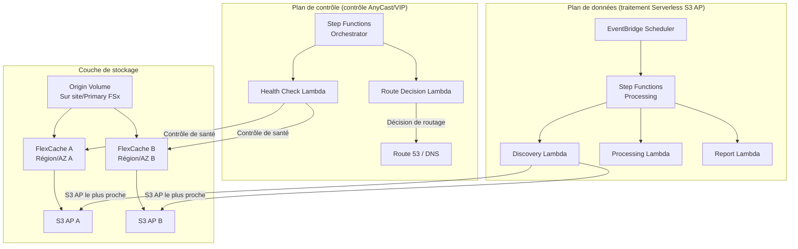

# Modèle FlexCache AnyCast / DR

🌐 **Language / 言語**: [日本語](README.md) | [English](README.en.md) | [한국어](README.ko.md) | [简体中文](README.zh-CN.md) | [繁體中文](README.zh-TW.md) | [Français](README.fr.md) | [Deutsch](README.de.md) | [Español](README.es.md)

## Vue d'ensemble

Ce modèle fournit des guides de conception, des démos de simulation et des documents de conception opérationnelle pour mettre en œuvre les configurations AnyCast et DR (Disaster Recovery) d'ONTAP FlexCache en les combinant avec les services FSx for ONTAP × S3 Access Points × AWS Serverless.

## Problèmes résolus

| Problème | Solution via FlexCache AnyCast / DR |
|------|----------------------------------|
| Performance de lecture pour les équipes géographiquement distribuées | Servir les données chaudes depuis le FlexCache le plus proche |
| Cloud bursting pour EDA/Media/HPC | Origin sur site + FlexCache cloud réduit les transferts WAN |
| Continuité de lecture pendant un DR | Lecture possible via le cache même en cas de panne de l'Origin |
| Réduction du volume de transfert WAN | Mettre en cache uniquement les données chaudes, transferts différentiels |
| Éviter la complexité de configuration de montage côté client | Point de montage unique via une IP AnyCast |

## Aperçu de l'architecture



## Relation avec les cas d'usage existants

| UC existant | Point de relation |
|---------|------------|
| [media-vfx/](../media-vfx/) | Accélération FlexCache des render input assets |
| [manufacturing-analytics/](../manufacturing-analytics/) | FlexCache pour le partage de données entre usines |
| [healthcare-dicom/](../healthcare-dicom/) | Cache DICOM entre sites de recherche |
| [legal-compliance/](../legal-compliance/) | FlexCache des données d'audit entre agences |
| [financial-idp/](../financial-idp/) | Cache de documents entre agences |
| [semiconductor-eda/](../semiconductor-eda/) | Cloud bursting pour les EDA Tools/Libraries |

## Points de connexion avec FSx for ONTAP S3 Access Points

```
┌─────────────────────────────────────────────────────────┐
│ Accès NFS/SMB : via FlexCache (client direct)             │
│ Accès S3 API : via S3 Access Points (traitement serverless)│
└─────────────────────────────────────────────────────────┘
```

- **NFS/SMB** : les clients montent directement le FlexCache volume (via IP AnyCast ou DNS)
- **S3 API** : Lambda/Step Functions traitent les données mises en cache via le S3 Access Point
- **Combinaison** : une conception qui transmet les données mises en cache/proches à l'IA/l'analytique serverless

## Support/Contraintes

### Différences de version ONTAP

| Fonctionnalité | Version minimale | Remarques |
|------|--------------|------|
| FlexCache de base (NFS) | 9.8 | |
| FlexCache SMB | 9.10.1 | |
| Prepopulate | 9.13.1 | |
| Disconnected mode | 9.12.1 | Continuité de lecture lorsque l'Origin est inaccessible |
| Global file lock | 9.14.1 | |
| Writeback | 9.15.1 | |

### Périmètre de disponibilité des fonctionnalités sur FSx for ONTAP

- Création/gestion de FlexCache : ✅ Possible via ONTAP REST API / CLI
- S3 Access Points : ✅ Peuvent être créés via la console / l'API FSx
- **Attacher un S3 AP à un FlexCache volume** : ⚠️ Non vérifié (à valider en PoC)
- Virtual IP / BGP : ❌ Non disponible sur FSx for ONTAP (réseau managé)

### Périmètre de faisabilité de Virtual IP / BGP

| Environnement | VIP/BGP | Alternative |
|------|---------|---------|
| FSx for ONTAP | ❌ | Route 53, Global Accelerator, App routing |
| ONTAP sur site | ✅ | AnyCast natif |
| Lab/Simulator | ✅ | AnyCast pour tests |

## Structure des répertoires

```
flexcache-anycast-dr/
├── README.md                          # Ce fichier
├── template.yaml                      # Modèle CloudFormation
├── src/
│   ├── discovery/handler.py           # Lambda de détection de cache
│   ├── health_check/handler.py        # Lambda de contrôle de santé
│   ├── route_decision/handler.py      # Lambda de décision de route
│   └── report/handler.py             # Lambda de génération de rapport
├── events/
│   ├── sample-failover-event.json     # Exemple d'événement de bascule
│   └── sample-cache-health-event.json # Exemple d'événement de santé du cache
├── tests/
│   ├── test_health_check.py
│   ├── test_route_decision.py
│   └── test_discovery.py
└── docs/
    ├── architecture.md                # Détails de l'architecture
    ├── design-patterns.md             # Recueil de modèles de configuration
    ├── poc-checklist.md               # Liste de contrôle PoC
    ├── demo-guide.md                  # Guide de démo
    ├── operations-runbook.md          # Runbook d'exploitation
    ├── limitations-and-support-matrix.md
    ├── disaster-recovery-patterns.md  # Modèles de DR
    ├── network-design-bgp-vip.md      # Conception réseau
    └── flexcache-anycast-faq.md       # FAQ
```

## Démarrage rapide (démo de simulation)

Même lorsque BGP/VIP n'est pas disponible dans un environnement réel, vous pouvez simuler la « sélection de route », la « santé du cache » et la « sélection du cache le plus proche » avec Step Functions et Lambda.

### Prérequis

- Compte AWS
- Python 3.12
- AWS CLI v2
- SAM CLI (facultatif)

### Déploiement

```bash
# Modifier le fichier de paramètres
cp params/staging.json params/flexcache-anycast-demo.json
# Définir les paramètres requis

# Déployer
# Prérequis : AWS SAM CLI est requis. « sam build » package automatiquement le code et la couche partagée.
sam build

sam deploy \
  --stack-name flexcache-anycast-demo \
  --capabilities CAPABILITY_NAMED_IAM \
  --resolve-s3 \
  --parameter-overrides \
    SimulationMode=true \
    CacheEndpoints="cache-a.example.com,cache-b.example.com" \
    HealthCheckIntervalMinutes=5
```

> **Remarque** : `template.yaml` s'utilise avec la SAM CLI (`sam build` + `sam deploy`).
> Pour déployer directement avec la commande `aws cloudformation deploy`, utilisez plutôt `template-deploy.yaml` (nécessite le pré-packaging des fichiers zip Lambda et leur téléversement vers S3).

### Exécuter la démo

```bash
# Exécuter un contrôle de santé
aws stepfunctions start-execution \
  --state-machine-arn <STATE_MACHINE_ARN> \
  --input '{"action": "health_check"}'

# Simulation de bascule
aws stepfunctions start-execution \
  --state-machine-arn <STATE_MACHINE_ARN> \
  --input file://events/sample-failover-event.json
```

## Documentation

| Document | Contenu |
|-------------|------|
| [Architecture](docs/architecture.md) | Conception détaillée avec des diagrammes Mermaid |
| [Modèles de conception](docs/design-patterns.md) | 7 modèles de configuration |
| [Liste de contrôle PoC](docs/poc-checklist.md) | Une liste de contrôle utilisable dans de vrais projets |
| [Guide de démo](docs/demo-guide.md) | 5 scénarios de démo |
| [Runbook d'exploitation](docs/operations-runbook.md) | Procédures d'exploitation |
| [Matrice de contraintes/support](docs/limitations-and-support-matrix.md) | Disponibilité des fonctionnalités par plateforme |
| [Modèles de DR](docs/disaster-recovery-patterns.md) | Modèles de conception DR |
| [Conception réseau](docs/network-design-bgp-vip.md) | Conception BGP/VIP/DNS |
| [FAQ](docs/flexcache-anycast-faq.md) | Questions fréquentes |

## Anycast Terminology

In this sample, "Anycast" refers to application-level routing decisions based on cache health and availability. It is not intended to replace network-layer anycast design.

## DR Scope

This pattern focuses on read-path resilience and cache-aware routing. It does not replace a full DR strategy such as backup, replication, RPO/RTO design, and operational recovery planning.

## Suggested Validation Metrics

- Route decision latency
- Cache health detection time
- Origin unavailable detection time
- Time to switch active read path
- Read-path recovery behavior
- False positive / false negative health check behavior
- DynamoDB routing table update latency
- Audit event completeness for route changes

## Success Metrics

### Outcome
Provide faster and more resilient read access for distributed teams without requiring a full independent copy of the dataset.

### Metrics
| Métrique | Cible (exemple) |
|-----------|------------|
| Route decision latency | < 500 ms |
| Cache health detection time | < 30 seconds |
| Read-path recovery time | < 60 seconds |
| Successful reads from healthy cache path | > 99% |
| Audit event completeness | 100% |
| Taux soumis à Human Review | Route changes require approval in regulated environments |

### Measurement Method
DynamoDB routing table updates, CloudWatch Logs, ONTAP REST API health check results, Step Functions execution history, generated audit records.

## Liens connexes

- [Matrice de support](../docs/support-matrix-fsx-ontap-flexcache-s3ap.md)
- [Mapping secteur/charge de travail](../docs/industry-workload-mapping.md)
- [Dynamic FlexCache Render Workflow](../dynamic-flexcache-render-workflow/README.md)
- [Documentation NetApp FlexCache](https://docs.netapp.com/us-en/ontap/flexcache/index.html)
- [Documentation FSx for ONTAP](https://docs.aws.amazon.com/fsx/latest/ONTAPGuide/)

---

## Estimation des coûts (approximation mensuelle)

> **Note** : Ce qui suit est une approximation pour la région ap-northeast-1 ; les coûts réels varient selon l'utilisation. Vérifiez les tarifs les plus récents avec l'[AWS Pricing Calculator](https://calculator.aws/).

### Composants serverless (paiement à l'usage)

| Service | Prix unitaire | Utilisation supposée | Approximation mensuelle |
|---------|------|-----------|---------|
| Lambda | $0.0000166667/GB-sec | 2 fonctions × 24 checks/jour | ~$1-5 |
| S3 API (GetObject/ListObjects) | $0.0047/10K requests | ~10K requests/jour | ~$1.5 |
| Step Functions | $0.025/1K state transitions | ~1K transitions/jour | ~$0.75 |
| Bedrock (Nova Lite) | $0.00006/1K input tokens | N/A | ~$3-10 |
| Athena | $5/TB scanned | N/A | ~$0.5-2 |
| SNS | $0.50/100K notifications | ~100 notifications/jour | ~$0.15 |
| CloudWatch Logs | $0.76/GB ingested | ~1 GB/mois | ~$0.76 |
| Route 53 Health Check | $0.50/check/mois |

### Coût fixe (FSx for ONTAP — suppose un environnement existant)

| Composant | Mensuel |
|--------------|------|
| FSx for ONTAP (128 MBps, 1 TB) | ~$230 (environnement existant partagé) |
| S3 Access Point | Aucun frais supplémentaire (frais S3 API uniquement) |

### Approximation totale

| Configuration | Approximation mensuelle |
|------|---------|
| Configuration minimale (une fois par jour) | ~$5-15 |
| Configuration standard (horaire) | ~$15-50 |
| Configuration à grande échelle (haute fréquence + alarmes) | ~$50-150 |

> **Governance Caveat** : Les estimations de coûts sont des approximations, pas des valeurs garanties. Le montant facturé réel varie selon le profil d'utilisation, le volume de données et la région.

---

## Tests locaux

### Vérification des prérequis

```bash
# Vérifier les prérequis
aws --version          # AWS CLI v2
sam --version          # SAM CLI
python3 --version      # Python 3.9+
docker --version       # Docker (pour sam local)
aws sts get-caller-identity  # Informations d'identification AWS
```

### sam local invoke

```bash
# Build
# Prérequis : AWS SAM CLI est requis. « sam build » package automatiquement le code et la couche partagée.
sam build

# Exécution locale de la Lambda Discovery
sam local invoke DiscoveryFunction --event events/discovery-event.json

# Avec surcharge des variables d'environnement
sam local invoke DiscoveryFunction \
  --event events/discovery-event.json \
  --env-vars env.json
```

### Tests unitaires

```bash
python3 -m pytest tests/ -v
```

Pour plus de détails, voir [Démarrage rapide des tests locaux](../docs/local-testing-quick-start.md).

---

## Exemple de sortie (Output Sample)

Exemple de sortie d'un contrôle de santé FlexCache + décision de routage :

```json
{
  "health_check": {
    "primary": {
      "region": "ap-northeast-1",
      "status": "healthy",
      "latency_ms": 12,
      "cache_hit_rate_pct": 87.5
    },
    "secondary": {
      "region": "ap-southeast-1",
      "status": "healthy",
      "latency_ms": 45,
      "cache_hit_rate_pct": 72.3
    }
  },
  "routing_decision": {
    "active_region": "ap-northeast-1",
    "failover_triggered": false,
    "decision_reason": "primary_healthy",
    "timestamp": "2026-05-23T09:00:00Z"
  }
}
```

> **Note** : Ce qui précède est un exemple de sortie ; les valeurs réelles varient selon l'environnement et les données d'entrée. Les chiffres de benchmark sont une référence de dimensionnement, pas une limite de service.

---

## Performance Considerations

- La capacité de débit de FSx for ONTAP est partagée entre NFS/SMB/S3AP
- La latence via le S3 Access Point entraîne une surcharge de plusieurs dizaines de millisecondes
- Lors du traitement d'un grand nombre de fichiers, contrôlez le parallélisme avec le MaxConcurrency de l'état Map de Step Functions
- L'augmentation de la taille mémoire de Lambda améliore aussi la bande passante réseau

> **Note** : Les chiffres de performance de ce modèle sont une référence de dimensionnement, pas une limite de service. La performance en environnement réel varie selon la capacité de débit de FSx for ONTAP, la configuration réseau et les charges de travail concurrentes.

---

## Governance Note

> Ce modèle fournit des orientations d'architecture technique. Il ne constitue pas un conseil juridique, de conformité ou réglementaire. Les organisations doivent consulter des professionnels qualifiés.
