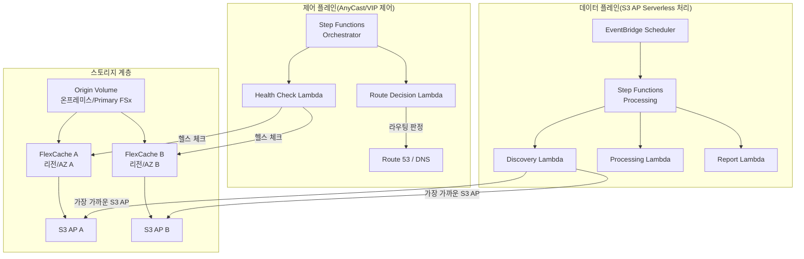

# FlexCache AnyCast / DR 패턴

🌐 **Language / 言語**: [日本語](README.md) | [English](README.en.md) | [한국어](README.ko.md) | [简体中文](README.zh-CN.md) | [繁體中文](README.zh-TW.md) | [Français](README.fr.md) | [Deutsch](README.de.md) | [Español](README.es.md)

## 개요

본 패턴은 ONTAP FlexCache의 AnyCast 구성 및 DR(Disaster Recovery) 구성을 FSx for ONTAP × S3 Access Points × AWS Serverless 서비스와 결합하여 구현하기 위한 설계 가이드, 시뮬레이션 데모, 운영 설계 문서를 제공한다.

## 해결하는 과제

| 과제 | FlexCache AnyCast / DR을 통한 해결 |
|------|----------------------------------|
| 지리적으로 분산된 팀의 읽기 성능 | 가장 가까운 FlexCache에서 핫 데이터를 제공 |
| EDA/Media/HPC의 클라우드 버스팅 | 온프레미스 Origin + 클라우드 FlexCache로 WAN 전송 절감 |
| DR 시 읽기 연속성 | 캐시 경유로 Origin 장애 시에도 읽기 가능 |
| WAN 전송량 절감 | 핫 데이터만 캐시, 차분 전송 |
| 클라이언트 측 마운트 설정의 복잡화 회피 | AnyCast IP로 단일 마운트 포인트 |

## 아키텍처 개요



## 기존 유스케이스와의 관련성

| 기존 UC | 관련 포인트 |
|---------|------------|
| [media-vfx/](../media-vfx/) | render input assets의 FlexCache 고속화 |
| [manufacturing-analytics/](../manufacturing-analytics/) | 공장 간 데이터 공유의 FlexCache |
| [healthcare-dicom/](../healthcare-dicom/) | 연구 거점 간 DICOM 캐시 |
| [legal-compliance/](../legal-compliance/) | 지점 간 감사 데이터의 FlexCache |
| [financial-idp/](../financial-idp/) | 지점 간 문서 캐시 |
| [semiconductor-eda/](../semiconductor-eda/) | EDA Tools/Libraries의 클라우드 버스팅 |

## FSx for ONTAP S3 Access Points와의 접점

```
┌─────────────────────────────────────────────────────────┐
│ NFS/SMB 액세스: FlexCache 경유(클라이언트 직접)           │
│ S3 API 액세스: S3 Access Points 경유(서버리스 처리)       │
└─────────────────────────────────────────────────────────┘
```

- **NFS/SMB**: 클라이언트는 FlexCache volume을 직접 마운트(AnyCast IP 또는 DNS 경유)
- **S3 API**: Lambda/Step Functions는 S3 Access Point 경유로 캐시된 데이터를 처리
- **조합**: 캐시된/근접 데이터를 서버리스 AI/분석에 전달하는 설계

## 지원/제약

### ONTAP 버전 차이

| 기능 | 최소 버전 | 비고 |
|------|--------------|------|
| FlexCache 기본 (NFS) | 9.8 | |
| FlexCache SMB | 9.10.1 | |
| Prepopulate | 9.13.1 | |
| Disconnected mode | 9.12.1 | Origin 도달 불가 시 읽기 연속성 |
| Global file lock | 9.14.1 | |
| Writeback | 9.15.1 | |

### FSx for ONTAP에서의 기능 공개 범위

- FlexCache의 생성·관리: ✅ ONTAP REST API / CLI 경유로 가능
- S3 Access Points: ✅ FSx 콘솔 / API로 생성 가능
- **FlexCache volume에 S3 AP attach**: ⚠️ 미확인(PoC에서 검증 필요)
- Virtual IP / BGP: ❌ FSx for ONTAP에서는 사용 불가(관리형 네트워크)

### Virtual IP / BGP의 구현 가능 범위

| 환경 | VIP/BGP | 대체 수단 |
|------|---------|---------|
| FSx for ONTAP | ❌ | Route 53, Global Accelerator, App routing |
| 온프레미스 ONTAP | ✅ | 네이티브 AnyCast |
| Lab/Simulator | ✅ | 테스트용 AnyCast |

## 디렉터리 구성

```
flexcache-anycast-dr/
├── README.md                          # 본 파일
├── template.yaml                      # CloudFormation 템플릿
├── src/
│   ├── discovery/handler.py           # 캐시 검출 Lambda
│   ├── health_check/handler.py        # 헬스 체크 Lambda
│   ├── route_decision/handler.py      # 라우트 판정 Lambda
│   └── report/handler.py             # 리포트 생성 Lambda
├── events/
│   ├── sample-failover-event.json     # 페일오버 이벤트 예시
│   └── sample-cache-health-event.json # 캐시 헬스 이벤트 예시
├── tests/
│   ├── test_health_check.py
│   ├── test_route_decision.py
│   └── test_discovery.py
└── docs/
    ├── architecture.md                # 아키텍처 상세
    ├── design-patterns.md             # 구성 패턴 모음
    ├── poc-checklist.md               # PoC 체크리스트
    ├── demo-guide.md                  # 데모 가이드
    ├── operations-runbook.md          # 운영 런북
    ├── limitations-and-support-matrix.md
    ├── disaster-recovery-patterns.md  # DR 패턴
    ├── network-design-bgp-vip.md      # 네트워크 설계
    └── flexcache-anycast-faq.md       # FAQ
```

## 퀵 스타트(시뮬레이션 데모)

실제 환경에서 BGP/VIP를 사용할 수 없는 경우에도 Step Functions와 Lambda로 "라우트 선택", "캐시 헬스", "근접 캐시 선택"을 시뮬레이션할 수 있다.

### 전제 조건

- AWS 계정
- Python 3.12
- AWS CLI v2
- SAM CLI(선택)

### 배포

```bash
# 파라미터 파일 편집
cp params/staging.json params/flexcache-anycast-demo.json
# 필요한 파라미터 설정

# 배포
# 전제: AWS SAM CLI가 필요합니다. sam build가 코드와 공유 레이어를 자동으로 패키징합니다.
sam build

sam deploy \
  --stack-name flexcache-anycast-demo \
  --capabilities CAPABILITY_NAMED_IAM \
  --resolve-s3 \
  --parameter-overrides \
    SimulationMode=true \
    CacheEndpoints="cache-a.example.com,cache-b.example.com" \
    HealthCheckIntervalMinutes=5
```

> **주의**: `template.yaml`은 SAM CLI(`sam build` + `sam deploy`)로 사용합니다.
> `aws cloudformation deploy` 명령으로 직접 배포하는 경우 `template-deploy.yaml`을 사용하십시오(Lambda zip 파일의 사전 패키징과 S3 업로드가 필요합니다).

### 데모 실행

```bash
# 헬스 체크 실행
aws stepfunctions start-execution \
  --state-machine-arn <STATE_MACHINE_ARN> \
  --input '{"action": "health_check"}'

# 페일오버 시뮬레이션
aws stepfunctions start-execution \
  --state-machine-arn <STATE_MACHINE_ARN> \
  --input file://events/sample-failover-event.json
```

## 문서

| 문서 | 내용 |
|-------------|------|
| [아키텍처](docs/architecture.md) | Mermaid 다이어그램에 의한 상세 설계 |
| [설계 패턴](docs/design-patterns.md) | 7가지 구성 패턴 |
| [PoC 체크리스트](docs/poc-checklist.md) | 실제 프로젝트에서 사용 가능한 체크리스트 |
| [데모 가이드](docs/demo-guide.md) | 5가지 데모 시나리오 |
| [운영 런북](docs/operations-runbook.md) | 운영 절차서 |
| [제약·지원 매트릭스](docs/limitations-and-support-matrix.md) | 플랫폼별 기능 가부 |
| [DR 패턴](docs/disaster-recovery-patterns.md) | DR 설계 패턴 |
| [네트워크 설계](docs/network-design-bgp-vip.md) | BGP/VIP/DNS 설계 |
| [FAQ](docs/flexcache-anycast-faq.md) | 자주 묻는 질문 |

## Anycast Terminology

In this sample, "Anycast" refers to application-level routing decisions based on cache health and availability. It is not intended to replace network-layer anycast design.

## DR Scope

This pattern focuses on read-path resilience and cache-aware routing. It does not replace a full DR strategy such as backup, replication, RPO/RTO design, and operational recovery planning.

## Suggested Validation Metrics

- Route decision latency
- Cache health detection time
- Origin unavailable detection time
- Time to switch active read path
- Read-path recovery behavior
- False positive / false negative health check behavior
- DynamoDB routing table update latency
- Audit event completeness for route changes

## Success Metrics

### Outcome
Provide faster and more resilient read access for distributed teams without requiring a full independent copy of the dataset.

### Metrics
| 메트릭 | 목표값(예시) |
|-----------|------------|
| Route decision latency | < 500 ms |
| Cache health detection time | < 30 seconds |
| Read-path recovery time | < 60 seconds |
| Successful reads from healthy cache path | > 99% |
| Audit event completeness | 100% |
| Human Review 대상률 | Route changes require approval in regulated environments |

### Measurement Method
DynamoDB routing table updates, CloudWatch Logs, ONTAP REST API health check results, Step Functions execution history, generated audit records.

## 관련 링크

- [지원 매트릭스](../docs/support-matrix-fsx-ontap-flexcache-s3ap.md)
- [산업·워크로드 매핑](../docs/industry-workload-mapping.md)
- [Dynamic FlexCache Render Workflow](../dynamic-flexcache-render-workflow/README.md)
- [NetApp FlexCache 문서](https://docs.netapp.com/us-en/ontap/flexcache/index.html)
- [FSx for ONTAP 문서](https://docs.aws.amazon.com/fsx/latest/ONTAPGuide/)

---

## 비용 견적(월간 개산)

> **참고**: 아래는 ap-northeast-1 리전의 개산이며, 실제 비용은 사용량에 따라 다릅니다. 최신 요금은 [AWS Pricing Calculator](https://calculator.aws/)에서 확인하십시오.

### 서버리스 컴포넌트(종량 과금)

| 서비스 | 단가 | 예상 사용량 | 월간 개산 |
|---------|------|-----------|---------|
| Lambda | $0.0000166667/GB-sec | 2 함수 × 24 checks/일 | ~$1-5 |
| S3 API (GetObject/ListObjects) | $0.0047/10K requests | ~10K requests/일 | ~$1.5 |
| Step Functions | $0.025/1K state transitions | ~1K transitions/일 | ~$0.75 |
| Bedrock (Nova Lite) | $0.00006/1K input tokens | N/A | ~$3-10 |
| Athena | $5/TB scanned | N/A | ~$0.5-2 |
| SNS | $0.50/100K notifications | ~100 notifications/일 | ~$0.15 |
| CloudWatch Logs | $0.76/GB ingested | ~1 GB/월 | ~$0.76 |
| Route 53 Health Check | $0.50/check/월 |

### 고정 비용(FSx for ONTAP — 기존 환경 전제)

| 컴포넌트 | 월간 |
|--------------|------|
| FSx for ONTAP (128 MBps, 1 TB) | ~$230 (기존 환경 공유) |
| S3 Access Point | 추가 요금 없음(S3 API 요금만) |

### 합계 개산

| 구성 | 월간 개산 |
|------|---------|
| 최소 구성(일 1회 실행) | ~$5-15 |
| 표준 구성(시간별 실행) | ~$15-50 |
| 대규모 구성(고빈도 + 알람) | ~$50-150 |

> **Governance Caveat**: 비용 견적은 개산이며, 보증값이 아닙니다. 실제 청구액은 사용 패턴, 데이터양, 리전에 따라 다릅니다.

---

## 로컬 테스트

### Prerequisites 체크

```bash
# 전제 조건 확인
aws --version          # AWS CLI v2
sam --version          # SAM CLI
python3 --version      # Python 3.9+
docker --version       # Docker (sam local 용)
aws sts get-caller-identity  # AWS 인증 정보
```

### sam local invoke

```bash
# 빌드
# 전제: AWS SAM CLI가 필요합니다. sam build가 코드와 공유 레이어를 자동으로 패키징합니다.
sam build

# Discovery Lambda의 로컬 실행
sam local invoke DiscoveryFunction --event events/discovery-event.json

# 환경 변수 오버라이드 포함
sam local invoke DiscoveryFunction \
  --event events/discovery-event.json \
  --env-vars env.json
```

### 유닛 테스트

```bash
python3 -m pytest tests/ -v
```

자세한 내용은 [로컬 테스트 퀵 스타트](../docs/local-testing-quick-start.md)를 참조하십시오.

---

## 출력 샘플 (Output Sample)

FlexCache 헬스 체크 + 라우팅 결정의 출력 예시:

```json
{
  "health_check": {
    "primary": {
      "region": "ap-northeast-1",
      "status": "healthy",
      "latency_ms": 12,
      "cache_hit_rate_pct": 87.5
    },
    "secondary": {
      "region": "ap-southeast-1",
      "status": "healthy",
      "latency_ms": 45,
      "cache_hit_rate_pct": 72.3
    }
  },
  "routing_decision": {
    "active_region": "ap-northeast-1",
    "failover_triggered": false,
    "decision_reason": "primary_healthy",
    "timestamp": "2026-05-23T09:00:00Z"
  }
}
```

> **참고**: 위는 샘플 출력이며, 실제 값은 환경·입력 데이터에 따라 다릅니다. 벤치마크 수치는 sizing reference이며, service limit이 아닙니다.

---

## Performance Considerations

- FSx for ONTAP의 스루풋 용량은 NFS/SMB/S3AP에서 공유됩니다
- S3 Access Point 경유의 레이턴시는 수십 밀리초의 오버헤드가 발생합니다
- 대량 파일 처리 시에는 Step Functions Map state의 MaxConcurrency로 병렬도를 제어하십시오
- Lambda 메모리 크기의 증가는 네트워크 대역폭 향상에도 기여합니다

> **참고**: 본 패턴의 성능 수치는 sizing reference이며, service limit이 아닙니다. 실제 환경에서의 성능은 FSx for ONTAP 스루풋 용량, 네트워크 구성, 동시 실행 워크로드에 따라 다릅니다.

---

## Governance Note

> 본 패턴은 기술 아키텍처 가이던스를 제공합니다. 법적·컴플라이언스·규제상의 조언이 아닙니다. 조직은 적격한 전문가에게 상담하십시오.
