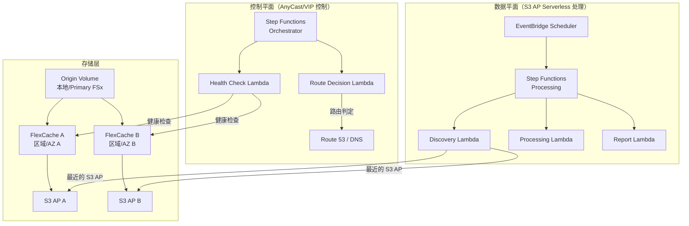

# FlexCache AnyCast / DR 模式

🌐 **Language / 言語**: [日本語](README.md) | [English](README.en.md) | [한국어](README.ko.md) | [简体中文](README.zh-CN.md) | [繁體中文](README.zh-TW.md) | [Français](README.fr.md) | [Deutsch](README.de.md) | [Español](README.es.md)

## 概述

本模式提供设计指南、模拟演示和运维设计文档，用于将 ONTAP FlexCache 的 AnyCast 配置及 DR（Disaster Recovery）配置与 FSx for ONTAP × S3 Access Points × AWS Serverless 服务相结合来实现。

## 解决的问题

| 问题 | 通过 FlexCache AnyCast / DR 的解决方案 |
|------|----------------------------------|
| 地理分散团队的读取性能 | 从最近的 FlexCache 提供热数据 |
| EDA/Media/HPC 的云突发 | 本地 Origin + 云端 FlexCache 减少 WAN 传输 |
| DR 时的读取连续性 | 经由缓存，即使 Origin 故障时也可读取 |
| 减少 WAN 传输量 | 仅缓存热数据，差量传输 |
| 避免客户端挂载配置复杂化 | 通过 AnyCast IP 实现单一挂载点 |

## 架构概述



## 与现有用例的关联

| 现有 UC | 关联点 |
|---------|------------|
| [media-vfx/](../media-vfx/) | render input assets 的 FlexCache 加速 |
| [manufacturing-analytics/](../manufacturing-analytics/) | 工厂间数据共享的 FlexCache |
| [healthcare-dicom/](../healthcare-dicom/) | 研究据点间的 DICOM 缓存 |
| [legal-compliance/](../legal-compliance/) | 分支机构间审计数据的 FlexCache |
| [financial-idp/](../financial-idp/) | 分支机构间文档缓存 |
| [semiconductor-eda/](../semiconductor-eda/) | EDA Tools/Libraries 的云突发 |

## 与 FSx for ONTAP S3 Access Points 的连接点

```
┌─────────────────────────────────────────────────────────┐
│ NFS/SMB 访问：经由 FlexCache（客户端直接）                │
│ S3 API 访问：经由 S3 Access Points（无服务器处理）        │
└─────────────────────────────────────────────────────────┘
```

- **NFS/SMB**: 客户端直接挂载 FlexCache volume（经由 AnyCast IP 或 DNS）
- **S3 API**: Lambda/Step Functions 经由 S3 Access Point 处理已缓存的数据
- **组合**: 将已缓存/邻近数据传递给无服务器 AI/分析的设计

## 支持/约束

### ONTAP 版本差异

| 功能 | 最低版本 | 备注 |
|------|--------------|------|
| FlexCache 基本 (NFS) | 9.8 | |
| FlexCache SMB | 9.10.1 | |
| Prepopulate | 9.13.1 | |
| Disconnected mode | 9.12.1 | Origin 不可达时的读取连续性 |
| Global file lock | 9.14.1 | |
| Writeback | 9.15.1 | |

### FSx for ONTAP 上的功能公开范围

- FlexCache 的创建·管理: ✅ 可经由 ONTAP REST API / CLI
- S3 Access Points: ✅ 可经由 FSx 控制台 / API 创建
- **将 S3 AP attach 到 FlexCache volume**: ⚠️ 未确认（需在 PoC 中验证）
- Virtual IP / BGP: ❌ FSx for ONTAP 上不可用（托管网络）

### Virtual IP / BGP 的可实现范围

| 环境 | VIP/BGP | 替代手段 |
|------|---------|---------|
| FSx for ONTAP | ❌ | Route 53, Global Accelerator, App routing |
| 本地 ONTAP | ✅ | 原生 AnyCast |
| Lab/Simulator | ✅ | 测试用 AnyCast |

## 目录结构

```
flexcache-anycast-dr/
├── README.md                          # 本文件
├── template.yaml                      # CloudFormation 模板
├── src/
│   ├── discovery/handler.py           # 缓存检测 Lambda
│   ├── health_check/handler.py        # 健康检查 Lambda
│   ├── route_decision/handler.py      # 路由判定 Lambda
│   └── report/handler.py             # 报告生成 Lambda
├── events/
│   ├── sample-failover-event.json     # 故障转移事件示例
│   └── sample-cache-health-event.json # 缓存健康事件示例
├── tests/
│   ├── test_health_check.py
│   ├── test_route_decision.py
│   └── test_discovery.py
└── docs/
    ├── architecture.md                # 架构详情
    ├── design-patterns.md             # 配置模式集
    ├── poc-checklist.md               # PoC 检查清单
    ├── demo-guide.md                  # 演示指南
    ├── operations-runbook.md          # 运维运行手册
    ├── limitations-and-support-matrix.md
    ├── disaster-recovery-patterns.md  # DR 模式
    ├── network-design-bgp-vip.md      # 网络设计
    └── flexcache-anycast-faq.md       # FAQ
```

## 快速开始（模拟演示）

即使在实际环境中无法使用 BGP/VIP，也可以通过 Step Functions 和 Lambda 模拟“路由选择”“缓存健康”“邻近缓存选择”。

### 前提条件

- AWS 账户
- Python 3.12
- AWS CLI v2
- SAM CLI（可选）

### 部署

```bash
# 编辑参数文件
cp params/staging.json params/flexcache-anycast-demo.json
# 设置所需参数

# 部署
# 前提：需要 AWS SAM CLI。sam build 会自动打包代码和共享层。
sam build

sam deploy \
  --stack-name flexcache-anycast-demo \
  --capabilities CAPABILITY_NAMED_IAM \
  --resolve-s3 \
  --parameter-overrides \
    SimulationMode=true \
    CacheEndpoints="cache-a.example.com,cache-b.example.com" \
    HealthCheckIntervalMinutes=5
```

> **注意**: `template.yaml` 用于 SAM CLI（`sam build` + `sam deploy`）。
> 若使用 `aws cloudformation deploy` 命令直接部署，请使用 `template-deploy.yaml`（需要预先打包 Lambda zip 文件并上传到 S3）。

### 运行演示

```bash
# 执行健康检查
aws stepfunctions start-execution \
  --state-machine-arn <STATE_MACHINE_ARN> \
  --input '{"action": "health_check"}'

# 故障转移模拟
aws stepfunctions start-execution \
  --state-machine-arn <STATE_MACHINE_ARN> \
  --input file://events/sample-failover-event.json
```

## 文档

| 文档 | 内容 |
|-------------|------|
| [架构](docs/architecture.md) | 通过 Mermaid 图的详细设计 |
| [设计模式](docs/design-patterns.md) | 7 种配置模式 |
| [PoC 检查清单](docs/poc-checklist.md) | 可用于实际项目的检查清单 |
| [演示指南](docs/demo-guide.md) | 5 个演示场景 |
| [运维运行手册](docs/operations-runbook.md) | 运维操作手册 |
| [约束·支持矩阵](docs/limitations-and-support-matrix.md) | 各平台功能可用性 |
| [DR 模式](docs/disaster-recovery-patterns.md) | DR 设计模式 |
| [网络设计](docs/network-design-bgp-vip.md) | BGP/VIP/DNS 设计 |
| [FAQ](docs/flexcache-anycast-faq.md) | 常见问题 |

## Anycast Terminology

In this sample, "Anycast" refers to application-level routing decisions based on cache health and availability. It is not intended to replace network-layer anycast design.

## DR Scope

This pattern focuses on read-path resilience and cache-aware routing. It does not replace a full DR strategy such as backup, replication, RPO/RTO design, and operational recovery planning.

## Suggested Validation Metrics

- Route decision latency
- Cache health detection time
- Origin unavailable detection time
- Time to switch active read path
- Read-path recovery behavior
- False positive / false negative health check behavior
- DynamoDB routing table update latency
- Audit event completeness for route changes

## Success Metrics

### Outcome
Provide faster and more resilient read access for distributed teams without requiring a full independent copy of the dataset.

### Metrics
| 指标 | 目标值（示例） |
|-----------|------------|
| Route decision latency | < 500 ms |
| Cache health detection time | < 30 seconds |
| Read-path recovery time | < 60 seconds |
| Successful reads from healthy cache path | > 99% |
| Audit event completeness | 100% |
| Human Review 对象率 | Route changes require approval in regulated environments |

### Measurement Method
DynamoDB routing table updates, CloudWatch Logs, ONTAP REST API health check results, Step Functions execution history, generated audit records.

## 相关链接

- [支持矩阵](../docs/support-matrix-fsx-ontap-flexcache-s3ap.md)
- [行业·工作负载映射](../docs/industry-workload-mapping.md)
- [Dynamic FlexCache Render Workflow](../dynamic-flexcache-render-workflow/README.md)
- [NetApp FlexCache 文档](https://docs.netapp.com/us-en/ontap/flexcache/index.html)
- [FSx for ONTAP 文档](https://docs.aws.amazon.com/fsx/latest/ONTAPGuide/)

---

## 成本估算（每月概算）

> **注记**: 以下是 ap-northeast-1 区域的概算，实际成本因使用量而异。请在 [AWS Pricing Calculator](https://calculator.aws/) 上确认最新价格。

### 无服务器组件（按量付费）

| 服务 | 单价 | 预计使用量 | 每月概算 |
|---------|------|-----------|---------|
| Lambda | $0.0000166667/GB-sec | 2 个函数 × 24 checks/天 | ~$1-5 |
| S3 API (GetObject/ListObjects) | $0.0047/10K requests | ~10K requests/天 | ~$1.5 |
| Step Functions | $0.025/1K state transitions | ~1K transitions/天 | ~$0.75 |
| Bedrock (Nova Lite) | $0.00006/1K input tokens | N/A | ~$3-10 |
| Athena | $5/TB scanned | N/A | ~$0.5-2 |
| SNS | $0.50/100K notifications | ~100 notifications/天 | ~$0.15 |
| CloudWatch Logs | $0.76/GB ingested | ~1 GB/月 | ~$0.76 |
| Route 53 Health Check | $0.50/check/月 |

### 固定成本（FSx for ONTAP — 以现有环境为前提）

| 组件 | 每月 |
|--------------|------|
| FSx for ONTAP (128 MBps, 1 TB) | ~$230 (共享现有环境) |
| S3 Access Point | 无额外费用（仅 S3 API 费用） |

### 合计概算

| 配置 | 每月概算 |
|------|---------|
| 最小配置（每日 1 次执行） | ~$5-15 |
| 标准配置（每小时执行） | ~$15-50 |
| 大规模配置（高频 + 告警） | ~$50-150 |

> **Governance Caveat**: 成本估算为概算，并非保证值。实际账单金额因使用模式、数据量、区域而异。

---

## 本地测试

### Prerequisites 检查

```bash
# 确认前提条件
aws --version          # AWS CLI v2
sam --version          # SAM CLI
python3 --version      # Python 3.9+
docker --version       # Docker (sam local 用)
aws sts get-caller-identity  # AWS 凭证
```

### sam local invoke

```bash
# 构建
# 前提：需要 AWS SAM CLI。sam build 会自动打包代码和共享层。
sam build

# Discovery Lambda 的本地执行
sam local invoke DiscoveryFunction --event events/discovery-event.json

# 带环境变量覆盖
sam local invoke DiscoveryFunction \
  --event events/discovery-event.json \
  --env-vars env.json
```

### 单元测试

```bash
python3 -m pytest tests/ -v
```

详情请参阅 [本地测试快速开始](../docs/local-testing-quick-start.md)。

---

## 输出示例 (Output Sample)

FlexCache 健康检查 + 路由决策的输出示例：

```json
{
  "health_check": {
    "primary": {
      "region": "ap-northeast-1",
      "status": "healthy",
      "latency_ms": 12,
      "cache_hit_rate_pct": 87.5
    },
    "secondary": {
      "region": "ap-southeast-1",
      "status": "healthy",
      "latency_ms": 45,
      "cache_hit_rate_pct": 72.3
    }
  },
  "routing_decision": {
    "active_region": "ap-northeast-1",
    "failover_triggered": false,
    "decision_reason": "primary_healthy",
    "timestamp": "2026-05-23T09:00:00Z"
  }
}
```

> **注记**: 以上为示例输出，实际值因环境·输入数据而异。基准数值为 sizing reference，并非 service limit。

---

## Performance Considerations

- FSx for ONTAP 的吞吐容量在 NFS/SMB/S3AP 之间共享
- 经由 S3 Access Point 的延迟会产生数十毫秒的开销
- 处理大量文件时，请使用 Step Functions Map state 的 MaxConcurrency 控制并行度
- 增加 Lambda 内存大小也有助于提升网络带宽

> **注记**: 本模式的性能数值为 sizing reference，并非 service limit。实际环境中的性能因 FSx for ONTAP 吞吐容量、网络配置、并发工作负载而异。

---

## Governance Note

> 本模式提供技术架构指导。并非法律·合规·监管方面的建议。组织应咨询合格的专业人士。
