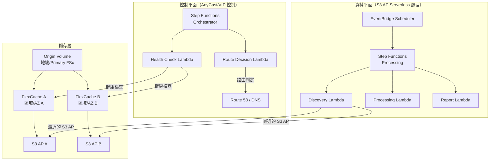

# FlexCache AnyCast / DR 模式

🌐 **Language / 言語**: [日本語](README.md) | [English](README.en.md) | [한국어](README.ko.md) | [简体中文](README.zh-CN.md) | [繁體中文](README.zh-TW.md) | [Français](README.fr.md) | [Deutsch](README.de.md) | [Español](README.es.md)

## 概述

本模式提供設計指南、模擬示範與運維設計文件，用於將 ONTAP FlexCache 的 AnyCast 組態及 DR（Disaster Recovery）組態與 FSx for ONTAP × S3 Access Points × AWS Serverless 服務相結合來實現。

## 解決的問題

| 問題 | 透過 FlexCache AnyCast / DR 的解決方案 |
|------|----------------------------------|
| 地理分散團隊的讀取效能 | 從最近的 FlexCache 提供熱資料 |
| EDA/Media/HPC 的雲端突發 | 地端 Origin + 雲端 FlexCache 減少 WAN 傳輸 |
| DR 時的讀取連續性 | 經由快取，即使 Origin 故障時也可讀取 |
| 減少 WAN 傳輸量 | 僅快取熱資料，差量傳輸 |
| 避免用戶端掛載組態複雜化 | 透過 AnyCast IP 實現單一掛載點 |

## 架構概述



## 與現有使用案例的關聯

| 現有 UC | 關聯點 |
|---------|------------|
| [media-vfx/](../media-vfx/) | render input assets 的 FlexCache 加速 |
| [manufacturing-analytics/](../manufacturing-analytics/) | 工廠間資料共享的 FlexCache |
| [healthcare-dicom/](../healthcare-dicom/) | 研究據點間的 DICOM 快取 |
| [legal-compliance/](../legal-compliance/) | 分支機構間稽核資料的 FlexCache |
| [financial-idp/](../financial-idp/) | 分支機構間文件快取 |
| [semiconductor-eda/](../semiconductor-eda/) | EDA Tools/Libraries 的雲端突發 |

## 與 FSx for ONTAP S3 Access Points 的連接點

```
┌─────────────────────────────────────────────────────────┐
│ NFS/SMB 存取：經由 FlexCache（用戶端直接）                │
│ S3 API 存取：經由 S3 Access Points（無伺服器處理）        │
└─────────────────────────────────────────────────────────┘
```

- **NFS/SMB**: 用戶端直接掛載 FlexCache volume（經由 AnyCast IP 或 DNS）
- **S3 API**: Lambda/Step Functions 經由 S3 Access Point 處理已快取的資料
- **組合**: 將已快取/鄰近資料傳遞給無伺服器 AI/分析的設計

## 支援/限制

### ONTAP 版本差異

| 功能 | 最低版本 | 備註 |
|------|--------------|------|
| FlexCache 基本 (NFS) | 9.8 | |
| FlexCache SMB | 9.10.1 | |
| Prepopulate | 9.13.1 | |
| Disconnected mode | 9.12.1 | Origin 無法到達時的讀取連續性 |
| Global file lock | 9.14.1 | |
| Writeback | 9.15.1 | |

### FSx for ONTAP 上的功能公開範圍

- FlexCache 的建立·管理: ✅ 可經由 ONTAP REST API / CLI
- S3 Access Points: ✅ 可經由 FSx 主控台 / API 建立
- **將 S3 AP attach 到 FlexCache volume**: ⚠️ 未確認（需在 PoC 中驗證）
- Virtual IP / BGP: ❌ FSx for ONTAP 上不可用（受管網路）

### Virtual IP / BGP 的可實現範圍

| 環境 | VIP/BGP | 替代手段 |
|------|---------|---------|
| FSx for ONTAP | ❌ | Route 53, Global Accelerator, App routing |
| 地端 ONTAP | ✅ | 原生 AnyCast |
| Lab/Simulator | ✅ | 測試用 AnyCast |

## 目錄結構

```
flexcache-anycast-dr/
├── README.md                          # 本檔案
├── template.yaml                      # CloudFormation 範本
├── src/
│   ├── discovery/handler.py           # 快取偵測 Lambda
│   ├── health_check/handler.py        # 健康檢查 Lambda
│   ├── route_decision/handler.py      # 路由判定 Lambda
│   └── report/handler.py             # 報告產生 Lambda
├── events/
│   ├── sample-failover-event.json     # 容錯移轉事件範例
│   └── sample-cache-health-event.json # 快取健康事件範例
├── tests/
│   ├── test_health_check.py
│   ├── test_route_decision.py
│   └── test_discovery.py
└── docs/
    ├── architecture.md                # 架構詳情
    ├── design-patterns.md             # 組態模式集
    ├── poc-checklist.md               # PoC 檢查清單
    ├── demo-guide.md                  # 示範指南
    ├── operations-runbook.md          # 運維執行手冊
    ├── limitations-and-support-matrix.md
    ├── disaster-recovery-patterns.md  # DR 模式
    ├── network-design-bgp-vip.md      # 網路設計
    └── flexcache-anycast-faq.md       # FAQ
```

## 快速開始（模擬示範）

即使在實際環境中無法使用 BGP/VIP，也可以透過 Step Functions 和 Lambda 模擬「路由選擇」「快取健康」「鄰近快取選擇」。

### 前提條件

- AWS 帳戶
- Python 3.12
- AWS CLI v2
- SAM CLI（選用）

### 部署

```bash
# 編輯參數檔案
cp params/staging.json params/flexcache-anycast-demo.json
# 設定所需參數

# 部署
# 前提：需要 AWS SAM CLI。sam build 會自動封裝程式碼與共享層。
sam build

sam deploy \
  --stack-name flexcache-anycast-demo \
  --capabilities CAPABILITY_NAMED_IAM \
  --resolve-s3 \
  --parameter-overrides \
    SimulationMode=true \
    CacheEndpoints="cache-a.example.com,cache-b.example.com" \
    HealthCheckIntervalMinutes=5
```

> **注意**: `template.yaml` 用於 SAM CLI（`sam build` + `sam deploy`）。
> 若使用 `aws cloudformation deploy` 命令直接部署，請使用 `template-deploy.yaml`（需要預先封裝 Lambda zip 檔案並上傳至 S3）。

### 執行示範

```bash
# 執行健康檢查
aws stepfunctions start-execution \
  --state-machine-arn <STATE_MACHINE_ARN> \
  --input '{"action": "health_check"}'

# 容錯移轉模擬
aws stepfunctions start-execution \
  --state-machine-arn <STATE_MACHINE_ARN> \
  --input file://events/sample-failover-event.json
```

## 文件

| 文件 | 內容 |
|-------------|------|
| [架構](docs/architecture.md) | 透過 Mermaid 圖的詳細設計 |
| [設計模式](docs/design-patterns.md) | 7 種組態模式 |
| [PoC 檢查清單](docs/poc-checklist.md) | 可用於實際專案的檢查清單 |
| [示範指南](docs/demo-guide.md) | 5 個示範情境 |
| [運維執行手冊](docs/operations-runbook.md) | 運維操作手冊 |
| [限制·支援矩陣](docs/limitations-and-support-matrix.md) | 各平台功能可用性 |
| [DR 模式](docs/disaster-recovery-patterns.md) | DR 設計模式 |
| [網路設計](docs/network-design-bgp-vip.md) | BGP/VIP/DNS 設計 |
| [FAQ](docs/flexcache-anycast-faq.md) | 常見問題 |

## Anycast Terminology

In this sample, "Anycast" refers to application-level routing decisions based on cache health and availability. It is not intended to replace network-layer anycast design.

## DR Scope

This pattern focuses on read-path resilience and cache-aware routing. It does not replace a full DR strategy such as backup, replication, RPO/RTO design, and operational recovery planning.

## Suggested Validation Metrics

- Route decision latency
- Cache health detection time
- Origin unavailable detection time
- Time to switch active read path
- Read-path recovery behavior
- False positive / false negative health check behavior
- DynamoDB routing table update latency
- Audit event completeness for route changes

## Success Metrics

### Outcome
Provide faster and more resilient read access for distributed teams without requiring a full independent copy of the dataset.

### Metrics
| 指標 | 目標值（範例） |
|-----------|------------|
| Route decision latency | < 500 ms |
| Cache health detection time | < 30 seconds |
| Read-path recovery time | < 60 seconds |
| Successful reads from healthy cache path | > 99% |
| Audit event completeness | 100% |
| Human Review 對象率 | Route changes require approval in regulated environments |

### Measurement Method
DynamoDB routing table updates, CloudWatch Logs, ONTAP REST API health check results, Step Functions execution history, generated audit records.

## 相關連結

- [支援矩陣](../docs/support-matrix-fsx-ontap-flexcache-s3ap.md)
- [產業·工作負載對應](../docs/industry-workload-mapping.md)
- [Dynamic FlexCache Render Workflow](../dynamic-flexcache-render-workflow/README.md)
- [NetApp FlexCache 文件](https://docs.netapp.com/us-en/ontap/flexcache/index.html)
- [FSx for ONTAP 文件](https://docs.aws.amazon.com/fsx/latest/ONTAPGuide/)

---

## 成本估算（每月概算）

> **註記**: 以下是 ap-northeast-1 區域的概算，實際成本因使用量而異。請在 [AWS Pricing Calculator](https://calculator.aws/) 上確認最新價格。

### 無伺服器元件（按量計費）

| 服務 | 單價 | 預計使用量 | 每月概算 |
|---------|------|-----------|---------|
| Lambda | $0.0000166667/GB-sec | 2 個函式 × 24 checks/日 | ~$1-5 |
| S3 API (GetObject/ListObjects) | $0.0047/10K requests | ~10K requests/日 | ~$1.5 |
| Step Functions | $0.025/1K state transitions | ~1K transitions/日 | ~$0.75 |
| Bedrock (Nova Lite) | $0.00006/1K input tokens | N/A | ~$3-10 |
| Athena | $5/TB scanned | N/A | ~$0.5-2 |
| SNS | $0.50/100K notifications | ~100 notifications/日 | ~$0.15 |
| CloudWatch Logs | $0.76/GB ingested | ~1 GB/月 | ~$0.76 |
| Route 53 Health Check | $0.50/check/月 |

### 固定成本（FSx for ONTAP — 以現有環境為前提）

| 元件 | 每月 |
|--------------|------|
| FSx for ONTAP (128 MBps, 1 TB) | ~$230 (共享現有環境) |
| S3 Access Point | 無額外費用（僅 S3 API 費用） |

### 合計概算

| 組態 | 每月概算 |
|------|---------|
| 最小組態（每日 1 次執行） | ~$5-15 |
| 標準組態（每小時執行） | ~$15-50 |
| 大規模組態（高頻 + 警報） | ~$50-150 |

> **Governance Caveat**: 成本估算為概算，並非保證值。實際帳單金額因使用模式、資料量、區域而異。

---

## 本地測試

### Prerequisites 檢查

```bash
# 確認前提條件
aws --version          # AWS CLI v2
sam --version          # SAM CLI
python3 --version      # Python 3.9+
docker --version       # Docker (sam local 用)
aws sts get-caller-identity  # AWS 憑證
```

### sam local invoke

```bash
# 建置
# 前提：需要 AWS SAM CLI。sam build 會自動封裝程式碼與共享層。
sam build

# Discovery Lambda 的本地執行
sam local invoke DiscoveryFunction --event events/discovery-event.json

# 帶環境變數覆寫
sam local invoke DiscoveryFunction \
  --event events/discovery-event.json \
  --env-vars env.json
```

### 單元測試

```bash
python3 -m pytest tests/ -v
```

詳情請參閱 [本地測試快速開始](../docs/local-testing-quick-start.md)。

---

## 輸出範例 (Output Sample)

FlexCache 健康檢查 + 路由決策的輸出範例：

```json
{
  "health_check": {
    "primary": {
      "region": "ap-northeast-1",
      "status": "healthy",
      "latency_ms": 12,
      "cache_hit_rate_pct": 87.5
    },
    "secondary": {
      "region": "ap-southeast-1",
      "status": "healthy",
      "latency_ms": 45,
      "cache_hit_rate_pct": 72.3
    }
  },
  "routing_decision": {
    "active_region": "ap-northeast-1",
    "failover_triggered": false,
    "decision_reason": "primary_healthy",
    "timestamp": "2026-05-23T09:00:00Z"
  }
}
```

> **註記**: 以上為範例輸出，實際值因環境·輸入資料而異。基準數值為 sizing reference，並非 service limit。

---

## Performance Considerations

- FSx for ONTAP 的吞吐容量在 NFS/SMB/S3AP 之間共享
- 經由 S3 Access Point 的延遲會產生數十毫秒的開銷
- 處理大量檔案時，請使用 Step Functions Map state 的 MaxConcurrency 控制並行度
- 增加 Lambda 記憶體大小也有助於提升網路頻寬

> **註記**: 本模式的效能數值為 sizing reference，並非 service limit。實際環境中的效能因 FSx for ONTAP 吞吐容量、網路組態、並行工作負載而異。

---

## Governance Note

> 本模式提供技術架構指導。並非法律·合規·法規方面的建議。組織應諮詢合格的專業人士。
