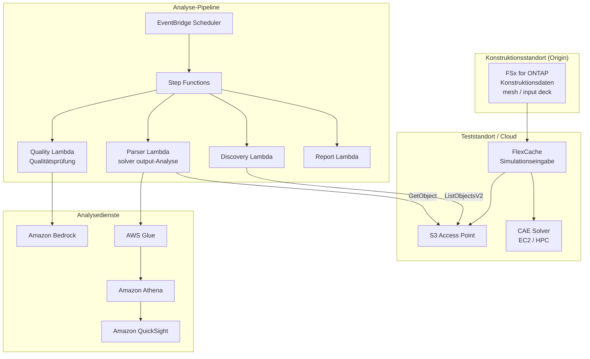

# Automotive CAE Analytics

🌐 **Language / 言語**: [日本語](README.md) | [English](README.en.md) | [한국어](README.ko.md) | [简体中文](README.zh-CN.md) | [繁體中文](README.zh-TW.md) | [Français](README.fr.md) | Deutsch | [Español](README.es.md)

## Überblick

Ein Muster, das FlexCache von FSx for ONTAP und S3 Access Points in CAE-Simulationsworkflows (Computer-Aided Engineering) der Automobil-, Luft- und Raumfahrt- sowie Fertigungsindustrie nutzt, um standortübergreifendes Teilen von Simulationseingabedaten, die automatisierte Analyse von solver output und die Qualitätsanalyse von Telemetriedaten zu ermöglichen.

## Adressierte Herausforderungen

| Herausforderung | Lösung durch dieses Muster |
|------|-------------------|
| Latenz bei der Datenübertragung zwischen Konstruktions- und Teststandorten | Standortübergreifendes Teilen von Daten mit FlexCache |
| Manuelle Analyse von Simulationsergebnissen | Automatisierte Analyse mit S3 AP + Lambda + Athena |
| Verwaltung großer Mengen an solver output | Automatisierte Klassifizierung und Aggregation mit Step Functions |
| Qualitätsprüfung von Telemetriedaten | Berichte zur Anomalieerkennung mit Bedrock |
| Optimierung der CAE-Lizenzkosten | Effizienzgewinne durch kürzere Job-Zeiten |

## Architektur



## CAE-Datenklassifizierung

| Datentyp | Zugriffsmuster | Empfohlene Platzierung | S3 AP-Nutzung |
|-----------|---------------|---------|-----------|
| Mesh / Input Deck | Leselastig | FlexCache | ✅ Für Analyse |
| Solver Output | Schreiben → Lesen | FSx native volume | ✅ Ergebnisanalyse |
| Telemetry | Streaming-Schreibvorgänge | FSx native volume | ✅ Qualitätsprüfung |
| Design Files (CAD) | Leselastig | FlexCache | ⚠️ Binär |
| Reports | Erzeugen → Verteilen | S3 Output Bucket | ❌ |

## Bezug zu bestehenden Use Cases

| Zugehöriger UC | Bezugspunkt |
|---------|------------|
| [manufacturing-analytics/](../manufacturing-analytics/) | Gemeinsame Nutzung von IoT-/Qualitätsanalysemustern |
| [semiconductor-eda/](../semiconductor-eda/) | Gemeinsame Nutzung von EDA-Job-Verwaltungsmustern |
| [Dynamic FlexCache Workflow](../dynamic-flexcache-render-workflow/) | FlexCache pro Job |

## Verzeichnisstruktur

```
automotive-cae/
├── README.md
├── template.yaml
├── functions/
│   ├── discovery/handler.py
│   ├── solver_output_parser/handler.py
│   ├── quality_check/handler.py
│   └── report_generation/handler.py
├── tests/
│   └── test_handlers.py
├── events/
│   └── sample-input.json
└── docs/
    ├── architecture.md
    ├── demo-guide.md
    ├── poc-checklist.md
    └── use-case-mapping.md
```

## Zielsimulationen

- Crash-Analyse (LS-DYNA, Radioss)
- Strömungsanalyse (STAR-CCM+, Fluent)
- Strukturanalyse (Nastran, Abaqus)
- Elektromagnetische Feldanalyse (HFSS, CST)
- Multiphysik (COMSOL)

## Weiterführende Links

- [manufacturing-analytics/](../manufacturing-analytics/README.md)
- [semiconductor-eda/](../semiconductor-eda/README.md)
- [Dynamic FlexCache Render Workflow](../dynamic-flexcache-render-workflow/README.md)
- [Branchen-/Workload-Zuordnung](../docs/industry-workload-mapping.md)


## Success Metrics

### Outcome
Reduzierung des Vorbereitungsaufwands für Design-Reviews durch die automatisierte Analyse von CAE-Simulationsergebnissen.

### Metrics
| Metrik | Zielwert (Beispiel) |
|-----------|------------|
| Analysierte solver output-Dateien / Ausführung | > 50 files |
| Bestehensquote der Qualitätsprüfung | > 90% |
| Bedrock-Berichterstellungszeit | < 3 Min. |
| Reduzierung des Vorbereitungsaufwands für Design-Reviews | > 40% |
| Human-Review-Quote | < 15% (Fälle mit Qualitätsmängeln) |

### Measurement Method
Step Functions-Ausführungsverlauf, Metadaten der Bedrock-Berichte, CloudWatch Metrics.


---

## Links zur AWS-Dokumentation

| Dienst | Dokumentation |
|---------|------------|
| FSx for ONTAP | [Benutzerhandbuch](https://docs.aws.amazon.com/fsx/latest/ONTAPGuide/what-is-fsx-ontap.html) |
| S3 Access Points for FSx for ONTAP | [S3 AP-Leitfaden](https://docs.aws.amazon.com/fsx/latest/ONTAPGuide/s3-access-points.html) |
| AWS Batch | [Benutzerhandbuch](https://docs.aws.amazon.com/batch/latest/userguide/what-is-batch.html) |
| AWS ParallelCluster | [Benutzerhandbuch](https://docs.aws.amazon.com/parallelcluster/latest/ug/what-is-aws-parallelcluster.html) |
| Amazon Athena | [Benutzerhandbuch](https://docs.aws.amazon.com/athena/latest/ug/what-is.html) |
| AWS Glue | [Entwicklerhandbuch](https://docs.aws.amazon.com/glue/latest/dg/what-is-glue.html) |
| Amazon Bedrock | [Benutzerhandbuch](https://docs.aws.amazon.com/bedrock/latest/userguide/what-is-bedrock.html) |
| Step Functions | [Entwicklerhandbuch](https://docs.aws.amazon.com/step-functions/latest/dg/welcome.html) |

### Well-Architected-Framework-Konformität

| Säule | Umsetzung |
|----|------|
| Operative Exzellenz | Strukturierte Protokollierung, CloudWatch Metrics, automatisierte Bedrock-Berichterstellung |
| Sicherheit | IAM-Least-Privilege, KMS-Verschlüsselung, VPC-Isolierung |
| Zuverlässigkeit | Step Functions Retry/Catch, Map-State-Parallelverarbeitung |
| Leistungseffizienz | Lambda ARM64, Range GET (teilweises Lesen des Headers) |
| Kostenoptimierung | Serverless, Optimierung des Athena-Scanvolumens |
| Nachhaltigkeit | On-Demand-Ausführung, automatisches Herunterfahren nicht benötigter Ressourcen |

### Zugehörige AWS-Lösungen

- [AWS HPC-Lösungen](https://aws.amazon.com/hpc/)
- [Automotive Industry on AWS](https://aws.amazon.com/automotive/)
- [NICE DCV](https://aws.amazon.com/hpc/dcv/) — Remote-Visualisierung


---

## Kostenschätzung (monatliche Näherung)

> **Hinweis**: Die folgenden Werte sind Näherungswerte für die Region ap-northeast-1; die tatsächlichen Kosten variieren je nach Nutzung. Prüfen Sie die aktuellen Preise im [AWS Pricing Calculator](https://calculator.aws/).

### Serverless-Komponenten (nutzungsabhängige Abrechnung)

| Dienst | Stückpreis | Angenommene Nutzung | Monatliche Näherung |
|---------|------|-----------|---------|
| Lambda | $0.0000166667/GB-sec | 4 Funktionen × 20 simulations/Tag | ~$1-5 |
| S3 API (GetObject/ListObjects) | $0.0047/10K requests | ~10K requests/Tag | ~$1.5 |
| Step Functions | $0.025/1K state transitions | ~1K transitions/Tag | ~$0.75 |
| Bedrock (Nova Lite) | $0.00006/1K input tokens | ~30K tokens/Ausführung | ~$3-10 |
| Athena | $5/TB scanned | ~20 MB/Abfrage | ~$0.5-2 |
| SNS | $0.50/100K notifications | ~100 notifications/Tag | ~$0.15 |
| CloudWatch Logs | $0.76/GB ingested | ~1 GB/Monat | ~$0.76 |

### Fixkosten (FSx for ONTAP — bestehende Umgebung vorausgesetzt)

| Komponente | Monatlich |
|--------------|------|
| FSx for ONTAP (128 MBps, 1 TB) | ~$230 (gemeinsame Nutzung der bestehenden Umgebung) |
| S3 Access Point | Keine zusätzlichen Gebühren (nur S3-API-Gebühren) |

### Gesamtnäherung

| Konfiguration | Monatliche Näherung |
|------|---------|
| Minimalkonfiguration (einmal täglich) | ~$5-15 |
| Standardkonfiguration (stündliche Ausführung) | ~$15-50 |
| Großkonfiguration (hohe Frequenz + Alarme) | ~$50-150 |

> **Governance Caveat**: Kostenschätzungen sind Näherungswerte und keine garantierten Werte. Die tatsächlichen Rechnungsbeträge variieren je nach Nutzungsmuster, Datenvolumen und Region.

---

## Lokales Testen

### Prüfung der Prerequisites

```bash
# Voraussetzungen prüfen
aws --version          # AWS CLI v2
sam --version          # SAM CLI
python3 --version      # Python 3.9+
docker --version       # Docker (für sam local)
aws sts get-caller-identity  # AWS-Anmeldeinformationen
```

### sam local invoke

```bash
# Build
# Voraussetzung: AWS SAM CLI erforderlich. „sam build" packt den Code automatisch.
sam build

# Discovery Lambda lokal ausführen
sam local invoke DiscoveryFunction --event events/discovery-event.json

# Mit Überschreibung der Umgebungsvariablen
sam local invoke DiscoveryFunction \
  --event events/discovery-event.json \
  --env-vars env.json
```

### Unit-Tests

```bash
python3 -m pytest tests/ -v
```

Weitere Einzelheiten finden Sie im [Schnellstart für lokales Testen](../docs/local-testing-quick-start.md).

---

## Ausgabebeispiel (Output Sample)

Beispielausgabe der CAE-Solver-Output-Analyse-Pipeline:

```json
{
  "discovery": {
    "status": "completed",
    "object_count": 6,
    "solver_types": {"ls-dyna": 3, "star-ccm": 2, "nastran": 1}
  },
  "analysis": [
    {
      "key": "cae-results/crash-sim-001.d3plot",
      "solver": "ls-dyna",
      "simulation_type": "crash",
      "max_displacement_mm": 45.2,
      "max_stress_mpa": 320.5,
      "energy_balance_error_pct": 0.3,
      "pass_criteria": true
    }
  ],
  "report": {
    "total_simulations": 6,
    "passed": 5,
    "failed": 1,
    "report_key": "reports/cae-review-2026-05-23.md",
    "recommendation": "1 simulation exceeded stress threshold - manual review required"
  }
}
```

> **Hinweis**: Das Obige ist eine Beispielausgabe; die tatsächlichen Werte variieren je nach Umgebung und Eingabedaten. Benchmark-Werte sind eine Dimensionierungsreferenz (sizing reference), keine Dienstgrenze (service limit).

---

## Performance Considerations

- Die Durchsatzkapazität von FSx for ONTAP wird von NFS/SMB/S3AP gemeinsam genutzt
- Der Zugriff über S3 Access Point verursacht einen Latenz-Overhead von einigen zehn Millisekunden
- Steuern Sie bei der Verarbeitung großer Dateimengen den Parallelitätsgrad über MaxConcurrency des Step Functions Map state
- Eine Erhöhung der Lambda-Speichergröße verbessert auch die Netzwerkbandbreite

> **Hinweis**: Die Leistungswerte dieses Musters sind eine Dimensionierungsreferenz (sizing reference), keine Dienstgrenze (service limit). Die Leistung in realen Umgebungen variiert je nach Durchsatzkapazität von FSx for ONTAP, Netzwerkkonfiguration und gleichzeitig ausgeführten Workloads.

---

## Bereitstellung

Stellen Sie mit der AWS SAM CLI bereit (ersetzen Sie die Platzhalter entsprechend Ihrer Umgebung):

```bash
# Voraussetzung: AWS SAM CLI erforderlich. „sam build" packt den Code automatisch.
sam build

sam deploy \
  --stack-name fsxn-automotive-cae \
  --parameter-overrides \
    S3AccessPointAlias=<your-s3ap-alias> \
    S3AccessPointName=<your-s3ap-name> \
    NotificationEmail=<your-email@example.com> \
  --capabilities CAPABILITY_NAMED_IAM \
  --resolve-s3 \
  --region <your-region>
```

> **Achtung**: `template.yaml` wird mit der SAM CLI (`sam build` + `sam deploy`) verwendet.
> Zur direkten Bereitstellung mit dem Befehl `aws cloudformation deploy` verwenden Sie stattdessen `template-deploy.yaml` (erfordert das vorherige Packen der Lambda-Zip-Dateien und den Upload nach S3).

## Governance Note

> Dieses Muster bietet technische Architekturhinweise. Es stellt keine rechtliche, Compliance- oder regulatorische Beratung dar. Organisationen sollten qualifizierte Fachleute konsultieren.
