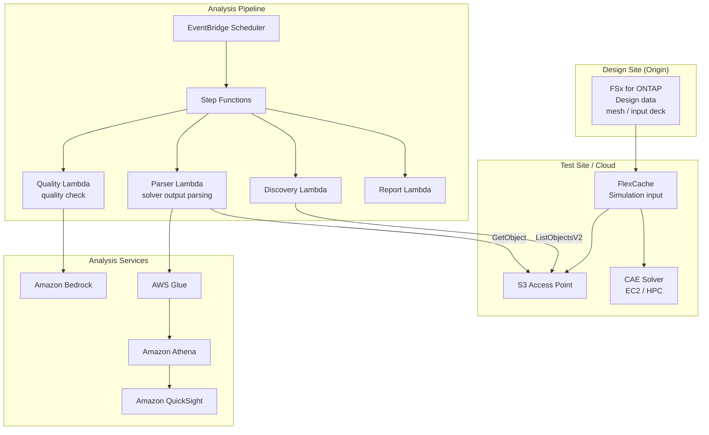

# Automotive CAE Analytics

🌐 **Language / 言語**: [日本語](README.md) | English | [한국어](README.ko.md) | [简体中文](README.zh-CN.md) | [繁體中文](README.zh-TW.md) | [Français](README.fr.md) | [Deutsch](README.de.md) | [Español](README.es.md)

## Overview

A pattern that leverages FSx for ONTAP FlexCache and S3 Access Points in CAE (Computer-Aided Engineering) simulation workflows for automotive, aerospace, and manufacturing industries to enable cross-site sharing of simulation input data, automated analysis of solver output, and quality analysis of telemetry data.

## Challenges Addressed

| Challenge | Solution with this pattern |
|------|-------------------|
| Data transfer latency between design and test sites | Cross-site data sharing with FlexCache |
| Manual analysis of simulation results | Automated analysis with S3 AP + Lambda + Athena |
| Managing large volumes of solver output | Automated classification and aggregation with Step Functions |
| Quality checks for telemetry data | Anomaly detection reports with Bedrock |
| Optimizing CAE license costs | Efficiency gains through shorter job times |

## Architecture



## CAE Data Classification

| Data type | Access pattern | Recommended placement | S3 AP usage |
|-----------|---------------|---------|-----------|
| Mesh / Input Deck | Read-heavy | FlexCache | ✅ For analysis |
| Solver Output | Write → read | FSx native volume | ✅ Result analysis |
| Telemetry | Streaming writes | FSx native volume | ✅ Quality checks |
| Design Files (CAD) | Read-heavy | FlexCache | ⚠️ Binary |
| Reports | Generate → distribute | S3 Output Bucket | ❌ |

## Related Existing Use Cases

| Related UC | Relevance |
|---------|------------|
| [manufacturing-analytics/](../manufacturing-analytics/) | Sharing IoT/quality-analysis patterns |
| [semiconductor-eda/](../semiconductor-eda/) | Sharing EDA job-management patterns |
| [Dynamic FlexCache Workflow](../dynamic-flexcache-render-workflow/) | Per-job FlexCache |

## Directory Structure

```
automotive-cae/
├── README.md
├── template.yaml
├── functions/
│   ├── discovery/handler.py
│   ├── solver_output_parser/handler.py
│   ├── quality_check/handler.py
│   └── report_generation/handler.py
├── tests/
│   └── test_handlers.py
├── events/
│   └── sample-input.json
└── docs/
    ├── architecture.md
    ├── demo-guide.md
    ├── poc-checklist.md
    └── use-case-mapping.md
```

## Target Simulations

- Crash analysis (LS-DYNA, Radioss)
- Fluid analysis (STAR-CCM+, Fluent)
- Structural analysis (Nastran, Abaqus)
- Electromagnetic analysis (HFSS, CST)
- Multiphysics (COMSOL)

## Related Links

- [manufacturing-analytics/](../manufacturing-analytics/README.md)
- [semiconductor-eda/](../semiconductor-eda/README.md)
- [Dynamic FlexCache Render Workflow](../dynamic-flexcache-render-workflow/README.md)
- [Industry / Workload Mapping](../docs/industry-workload-mapping.md)


## Success Metrics

### Outcome
Reduce the effort to prepare for design reviews by automatically analyzing CAE simulation results.

### Metrics
| Metric | Target (example) |
|-----------|------------|
| Solver output files analyzed / run | > 50 files |
| Quality check pass rate | > 90% |
| Bedrock report generation time | < 3 min |
| Reduction in design-review preparation effort | > 40% |
| Human Review rate | < 15% (quality-failure cases) |

### Measurement Method
Step Functions execution history, Bedrock report metadata, CloudWatch Metrics.


---

## AWS Documentation Links

| Service | Documentation |
|---------|------------|
| FSx for ONTAP | [User Guide](https://docs.aws.amazon.com/fsx/latest/ONTAPGuide/what-is-fsx-ontap.html) |
| S3 Access Points for FSx for ONTAP | [S3 AP Guide](https://docs.aws.amazon.com/fsx/latest/ONTAPGuide/s3-access-points.html) |
| AWS Batch | [User Guide](https://docs.aws.amazon.com/batch/latest/userguide/what-is-batch.html) |
| AWS ParallelCluster | [User Guide](https://docs.aws.amazon.com/parallelcluster/latest/ug/what-is-aws-parallelcluster.html) |
| Amazon Athena | [User Guide](https://docs.aws.amazon.com/athena/latest/ug/what-is.html) |
| AWS Glue | [Developer Guide](https://docs.aws.amazon.com/glue/latest/dg/what-is-glue.html) |
| Amazon Bedrock | [User Guide](https://docs.aws.amazon.com/bedrock/latest/userguide/what-is-bedrock.html) |
| Step Functions | [Developer Guide](https://docs.aws.amazon.com/step-functions/latest/dg/welcome.html) |

### Well-Architected Framework Alignment

| Pillar | Alignment |
|----|------|
| Operational Excellence | Structured logging, CloudWatch Metrics, automated Bedrock report generation |
| Security | IAM least privilege, KMS encryption, VPC isolation |
| Reliability | Step Functions Retry/Catch, Map state parallel processing |
| Performance Efficiency | Lambda ARM64, Range GET (partial header reads) |
| Cost Optimization | Serverless, optimized Athena scan volume |
| Sustainability | On-demand execution, automatic shutdown of unused resources |

### Related AWS Solutions

- [AWS HPC Solutions](https://aws.amazon.com/hpc/)
- [Automotive Industry on AWS](https://aws.amazon.com/automotive/)
- [NICE DCV](https://aws.amazon.com/hpc/dcv/) — Remote visualization


---

## Cost Estimate (Monthly Approximate)

> **Note**: The following are approximate figures for the ap-northeast-1 region; actual costs vary by usage. Check the latest pricing in the [AWS Pricing Calculator](https://calculator.aws/).

### Serverless Components (Pay-as-you-go)

| Service | Unit Price | Assumed Usage | Monthly Estimate |
|---------|------|-----------|---------|
| Lambda | $0.0000166667/GB-sec | 4 functions × 20 simulations/day | ~$1-5 |
| S3 API (GetObject/ListObjects) | $0.0047/10K requests | ~10K requests/day | ~$1.5 |
| Step Functions | $0.025/1K state transitions | ~1K transitions/day | ~$0.75 |
| Bedrock (Nova Lite) | $0.00006/1K input tokens | ~30K tokens/execution | ~$3-10 |
| Athena | $5/TB scanned | ~20 MB/query | ~$0.5-2 |
| SNS | $0.50/100K notifications | ~100 notifications/day | ~$0.15 |
| CloudWatch Logs | $0.76/GB ingested | ~1 GB/month | ~$0.76 |

### Fixed Costs (FSx for ONTAP — assumes existing environment)

| Component | Monthly |
|--------------|------|
| FSx for ONTAP (128 MBps, 1 TB) | ~$230 (shared existing environment) |
| S3 Access Point | No additional charge (S3 API fees only) |

### Total Estimate

| Configuration | Monthly Estimate |
|------|---------|
| Minimal (once daily) | ~$5-15 |
| Standard (hourly) | ~$15-50 |
| Large-scale (high frequency + alarms) | ~$50-150 |

> **Governance Caveat**: Cost estimates are approximate and not guaranteed. Actual charges vary by usage patterns, data volume, and region.

---

## Local Testing

### Prerequisites Check

```bash
# Verify prerequisites
aws --version          # AWS CLI v2
sam --version          # SAM CLI
python3 --version      # Python 3.9+
docker --version       # Docker (for sam local)
aws sts get-caller-identity  # AWS credentials
```

### sam local invoke

```bash
# Build
# Prerequisite: AWS SAM CLI required. 'sam build' packages the code automatically.
sam build

# Run the Discovery Lambda locally
sam local invoke DiscoveryFunction --event events/discovery-event.json

# With environment variable overrides
sam local invoke DiscoveryFunction \
  --event events/discovery-event.json \
  --env-vars env.json
```

### Unit Tests

```bash
python3 -m pytest tests/ -v
```

See the [Local Testing Quick Start](../docs/local-testing-quick-start.md) for details.

---

## Output Sample

Example output from the CAE solver-output analysis pipeline:

```json
{
  "discovery": {
    "status": "completed",
    "object_count": 6,
    "solver_types": {"ls-dyna": 3, "star-ccm": 2, "nastran": 1}
  },
  "analysis": [
    {
      "key": "cae-results/crash-sim-001.d3plot",
      "solver": "ls-dyna",
      "simulation_type": "crash",
      "max_displacement_mm": 45.2,
      "max_stress_mpa": 320.5,
      "energy_balance_error_pct": 0.3,
      "pass_criteria": true
    }
  ],
  "report": {
    "total_simulations": 6,
    "passed": 5,
    "failed": 1,
    "report_key": "reports/cae-review-2026-05-23.md",
    "recommendation": "1 simulation exceeded stress threshold - manual review required"
  }
}
```

> **Note**: The above is sample output; actual values vary by environment and input data. Benchmark figures are a sizing reference, not a service limit.

---

## Performance Considerations

- FSx for ONTAP throughput capacity is shared across NFS/SMB/S3AP
- Access via S3 Access Point adds tens of milliseconds of latency overhead
- For large file volumes, control the degree of parallelism with the Step Functions Map state MaxConcurrency
- Increasing Lambda memory size also improves network bandwidth

> **Note**: Performance figures for this pattern are a sizing reference, not a service limit. Real-world performance varies by FSx for ONTAP throughput capacity, network configuration, and concurrent workloads.

---

## Deployment

Deploy with the AWS SAM CLI (replace the placeholders for your environment):

```bash
# Prerequisite: AWS SAM CLI required. 'sam build' packages the code automatically.
sam build

sam deploy \
  --stack-name fsxn-automotive-cae \
  --parameter-overrides \
    S3AccessPointAlias=<your-s3ap-alias> \
    S3AccessPointName=<your-s3ap-name> \
    NotificationEmail=<your-email@example.com> \
  --capabilities CAPABILITY_NAMED_IAM \
  --resolve-s3 \
  --region <your-region>
```

> **Note**: `template.yaml` is for use with the SAM CLI (`sam build` + `sam deploy`).
> To deploy directly with the `aws cloudformation deploy` command, use `template-deploy.yaml` instead (requires pre-packaging the Lambda zip files and uploading them to S3).

## Governance Note

> This pattern provides technical architecture guidance. It is not legal, compliance, or regulatory advice. Organizations should consult qualified professionals.
