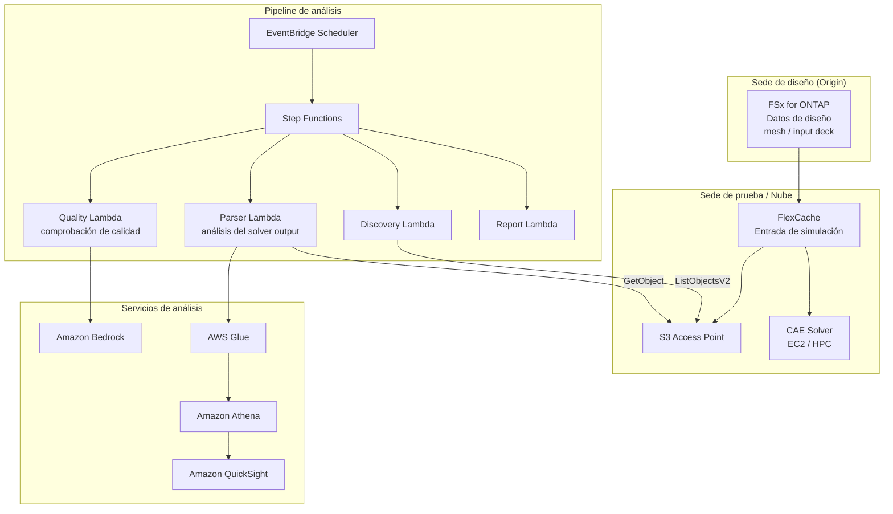

# Automotive CAE Analytics

🌐 **Language / 言語**: [日本語](README.md) | [English](README.en.md) | [한국어](README.ko.md) | [简体中文](README.zh-CN.md) | [繁體中文](README.zh-TW.md) | [Français](README.fr.md) | [Deutsch](README.de.md) | Español

## Descripción general

Un patrón que aprovecha FlexCache de FSx for ONTAP y S3 Access Points en los flujos de trabajo de simulación CAE (Computer-Aided Engineering) de los sectores de automoción, aeroespacial y manufactura, para habilitar el uso compartido de datos de entrada de simulación entre sedes, el análisis automatizado del solver output y el análisis de calidad de los datos de telemetría.

## Desafíos que resuelve

| Desafío | Solución de este patrón |
|------|-------------------|
| Latencia de transferencia de datos entre las sedes de diseño y de prueba | Uso compartido de datos entre sedes con FlexCache |
| Análisis manual de los resultados de simulación | Análisis automatizado con S3 AP + Lambda + Athena |
| Gestión de grandes volúmenes de solver output | Clasificación y agregación automatizadas con Step Functions |
| Comprobación de calidad de los datos de telemetría | Informes de detección de anomalías con Bedrock |
| Optimización de los costes de licencias de CAE | Mejora de la eficiencia mediante la reducción del tiempo de los trabajos |

## Arquitectura



## Clasificación de datos CAE

| Tipo de datos | Patrón de acceso | Ubicación recomendada | Uso de S3 AP |
|-----------|---------------|---------|-----------|
| Mesh / Input Deck | Predominio de lectura | FlexCache | ✅ Para análisis |
| Solver Output | Escritura → lectura | FSx native volume | ✅ Análisis de resultados |
| Telemetry | Escrituras en streaming | FSx native volume | ✅ Comprobación de calidad |
| Design Files (CAD) | Predominio de lectura | FlexCache | ⚠️ Binario |
| Reports | Generación → distribución | S3 Output Bucket | ❌ |

## Relación con los casos de uso existentes

| UC relacionado | Punto de relación |
|---------|------------|
| [manufacturing-analytics/](../manufacturing-analytics/) | Uso compartido de patrones de análisis de IoT/calidad |
| [semiconductor-eda/](../semiconductor-eda/) | Uso compartido de patrones de gestión de trabajos EDA |
| [Dynamic FlexCache Workflow](../dynamic-flexcache-render-workflow/) | FlexCache por trabajo |

## Estructura de directorios

```
automotive-cae/
├── README.md
├── template.yaml
├── functions/
│   ├── discovery/handler.py
│   ├── solver_output_parser/handler.py
│   ├── quality_check/handler.py
│   └── report_generation/handler.py
├── tests/
│   └── test_handlers.py
├── events/
│   └── sample-input.json
└── docs/
    ├── architecture.md
    ├── demo-guide.md
    ├── poc-checklist.md
    └── use-case-mapping.md
```

## Simulaciones objetivo

- Análisis de colisiones (LS-DYNA, Radioss)
- Análisis de fluidos (STAR-CCM+, Fluent)
- Análisis estructural (Nastran, Abaqus)
- Análisis de campos electromagnéticos (HFSS, CST)
- Multifísica (COMSOL)

## Enlaces relacionados

- [manufacturing-analytics/](../manufacturing-analytics/README.md)
- [semiconductor-eda/](../semiconductor-eda/README.md)
- [Dynamic FlexCache Render Workflow](../dynamic-flexcache-render-workflow/README.md)
- [Mapeo de sectores / cargas de trabajo](../docs/industry-workload-mapping.md)


## Success Metrics

### Outcome
Reducir el esfuerzo de preparación de las revisiones de diseño mediante el análisis automatizado de los resultados de simulación CAE.

### Metrics
| Métrica | Valor objetivo (ejemplo) |
|-----------|------------|
| Archivos de solver output analizados / ejecución | > 50 files |
| Tasa de aprobación de la comprobación de calidad | > 90% |
| Tiempo de generación del informe de Bedrock | < 3 min |
| Reducción del esfuerzo de preparación de las revisiones de diseño | > 40% |
| Tasa sujeta a Human Review | < 15% (casos de fallo de calidad) |

### Measurement Method
Historial de ejecución de Step Functions, metadatos de los informes de Bedrock, CloudWatch Metrics.


---

## Enlaces a la documentación de AWS

| Servicio | Documentación |
|---------|------------|
| FSx for ONTAP | [Guía del usuario](https://docs.aws.amazon.com/fsx/latest/ONTAPGuide/what-is-fsx-ontap.html) |
| S3 Access Points for FSx for ONTAP | [Guía de S3 AP](https://docs.aws.amazon.com/fsx/latest/ONTAPGuide/s3-access-points.html) |
| AWS Batch | [Guía del usuario](https://docs.aws.amazon.com/batch/latest/userguide/what-is-batch.html) |
| AWS ParallelCluster | [Guía del usuario](https://docs.aws.amazon.com/parallelcluster/latest/ug/what-is-aws-parallelcluster.html) |
| Amazon Athena | [Guía del usuario](https://docs.aws.amazon.com/athena/latest/ug/what-is.html) |
| AWS Glue | [Guía del desarrollador](https://docs.aws.amazon.com/glue/latest/dg/what-is-glue.html) |
| Amazon Bedrock | [Guía del usuario](https://docs.aws.amazon.com/bedrock/latest/userguide/what-is-bedrock.html) |
| Step Functions | [Guía del desarrollador](https://docs.aws.amazon.com/step-functions/latest/dg/welcome.html) |

### Conformidad con el Well-Architected Framework

| Pilar | Implementación |
|----|------|
| Excelencia operativa | Registro estructurado, CloudWatch Metrics, generación automatizada de informes de Bedrock |
| Seguridad | Privilegio mínimo de IAM, cifrado con KMS, aislamiento de VPC |
| Fiabilidad | Step Functions Retry/Catch, procesamiento en paralelo con Map state |
| Eficiencia del rendimiento | Lambda ARM64, Range GET (lectura parcial de cabecera) |
| Optimización de costes | Serverless, optimización del volumen escaneado por Athena |
| Sostenibilidad | Ejecución bajo demanda, detención automática de los recursos innecesarios |

### Soluciones de AWS relacionadas

- [Soluciones de AWS HPC](https://aws.amazon.com/hpc/)
- [Automotive Industry on AWS](https://aws.amazon.com/automotive/)
- [NICE DCV](https://aws.amazon.com/hpc/dcv/) — Visualización remota


---

## Estimación de costes (aproximación mensual)

> **Nota**: Los valores siguientes son aproximaciones para la región ap-northeast-1; los costes reales varían según el uso. Consulte los precios más recientes en el [AWS Pricing Calculator](https://calculator.aws/).

### Componentes serverless (pago por uso)

| Servicio | Precio unitario | Uso estimado | Aproximación mensual |
|---------|------|-----------|---------|
| Lambda | $0.0000166667/GB-sec | 4 funciones × 20 simulations/día | ~$1-5 |
| S3 API (GetObject/ListObjects) | $0.0047/10K requests | ~10K requests/día | ~$1.5 |
| Step Functions | $0.025/1K state transitions | ~1K transitions/día | ~$0.75 |
| Bedrock (Nova Lite) | $0.00006/1K input tokens | ~30K tokens/ejecución | ~$3-10 |
| Athena | $5/TB scanned | ~20 MB/consulta | ~$0.5-2 |
| SNS | $0.50/100K notifications | ~100 notifications/día | ~$0.15 |
| CloudWatch Logs | $0.76/GB ingested | ~1 GB/mes | ~$0.76 |

### Costes fijos (FSx for ONTAP — se asume un entorno existente)

| Componente | Mensual |
|--------------|------|
| FSx for ONTAP (128 MBps, 1 TB) | ~$230 (uso compartido del entorno existente) |
| S3 Access Point | Sin cargo adicional (solo tarifas de S3 API) |

### Aproximación total

| Configuración | Aproximación mensual |
|------|---------|
| Configuración mínima (una ejecución diaria) | ~$5-15 |
| Configuración estándar (ejecución por hora) | ~$15-50 |
| Configuración a gran escala (alta frecuencia + alarmas) | ~$50-150 |

> **Governance Caveat**: Las estimaciones de costes son aproximadas y no constituyen valores garantizados. Los importes facturados reales varían según los patrones de uso, el volumen de datos y la región.

---

## Pruebas locales

### Comprobación de Prerequisites

```bash
# Comprobar los requisitos previos
aws --version          # AWS CLI v2
sam --version          # SAM CLI
python3 --version      # Python 3.9+
docker --version       # Docker (para sam local)
aws sts get-caller-identity  # Credenciales de AWS
```

### sam local invoke

```bash
# Build
# Requisito previo: se necesita AWS SAM CLI. «sam build» empaqueta el código automáticamente.
sam build

# Ejecutar el Discovery Lambda en local
sam local invoke DiscoveryFunction --event events/discovery-event.json

# Con sustitución de variables de entorno
sam local invoke DiscoveryFunction \
  --event events/discovery-event.json \
  --env-vars env.json
```

### Pruebas unitarias

```bash
python3 -m pytest tests/ -v
```

Para más detalles, consulte el [inicio rápido de pruebas locales](../docs/local-testing-quick-start.md).

---

## Muestra de salida (Output Sample)

Ejemplo de salida del pipeline de análisis de salidas del solver CAE:

```json
{
  "discovery": {
    "status": "completed",
    "object_count": 6,
    "solver_types": {"ls-dyna": 3, "star-ccm": 2, "nastran": 1}
  },
  "analysis": [
    {
      "key": "cae-results/crash-sim-001.d3plot",
      "solver": "ls-dyna",
      "simulation_type": "crash",
      "max_displacement_mm": 45.2,
      "max_stress_mpa": 320.5,
      "energy_balance_error_pct": 0.3,
      "pass_criteria": true
    }
  ],
  "report": {
    "total_simulations": 6,
    "passed": 5,
    "failed": 1,
    "report_key": "reports/cae-review-2026-05-23.md",
    "recommendation": "1 simulation exceeded stress threshold - manual review required"
  }
}
```

> **Nota**: Lo anterior es una salida de muestra; los valores reales varían según el entorno y los datos de entrada. Las cifras de benchmark son una referencia de dimensionamiento (sizing reference), no un límite de servicio (service limit).

---

## Performance Considerations

- La capacidad de rendimiento de FSx for ONTAP se comparte entre NFS/SMB/S3AP
- El acceso a través de S3 Access Point añade una sobrecarga de latencia de decenas de milisegundos
- Al procesar grandes volúmenes de archivos, controle el grado de paralelismo con MaxConcurrency del Step Functions Map state
- Aumentar el tamaño de memoria de Lambda también contribuye a mejorar el ancho de banda de red

> **Nota**: Las cifras de rendimiento de este patrón son una referencia de dimensionamiento (sizing reference), no un límite de servicio (service limit). El rendimiento en entornos reales varía según la capacidad de rendimiento de FSx for ONTAP, la configuración de red y las cargas de trabajo concurrentes.

---

## Implementación

Implemente con la AWS SAM CLI (reemplace los marcadores de posición según su entorno):

```bash
# Requisito previo: se necesita AWS SAM CLI. «sam build» empaqueta el código automáticamente.
sam build

sam deploy \
  --stack-name fsxn-automotive-cae \
  --parameter-overrides \
    S3AccessPointAlias=<your-s3ap-alias> \
    S3AccessPointName=<your-s3ap-name> \
    NotificationEmail=<your-email@example.com> \
  --capabilities CAPABILITY_NAMED_IAM \
  --resolve-s3 \
  --region <your-region>
```

> **Atención**: `template.yaml` se utiliza con la SAM CLI (`sam build` + `sam deploy`).
> Para implementar directamente con el comando `aws cloudformation deploy`, utilice `template-deploy.yaml` (requiere el empaquetado previo de los archivos zip de Lambda y su carga en S3).

## Governance Note

> Este patrón proporciona orientación sobre arquitectura técnica. No constituye asesoramiento legal, de cumplimiento ni regulatorio. Las organizaciones deben consultar a profesionales cualificados.
