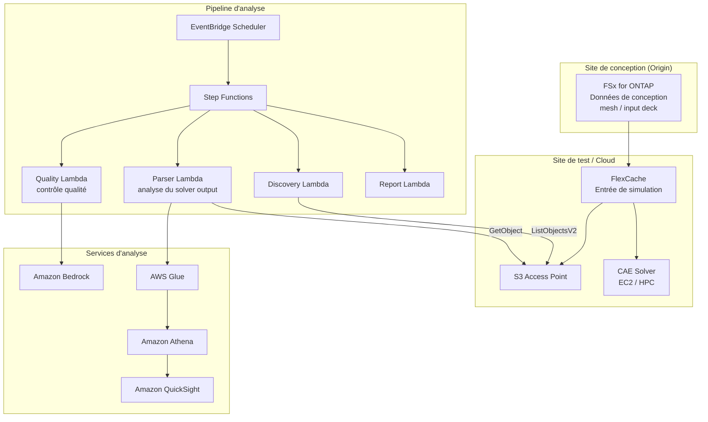

# Automotive CAE Analytics

🌐 **Language / 言語**: [日本語](README.md) | [English](README.en.md) | [한국어](README.ko.md) | [简体中文](README.zh-CN.md) | [繁體中文](README.zh-TW.md) | Français | [Deutsch](README.de.md) | [Español](README.es.md)

## Vue d'ensemble

Un modèle qui exploite FlexCache de FSx for ONTAP et S3 Access Points dans les workflows de simulation CAE (Computer-Aided Engineering) des secteurs automobile, aérospatial et manufacturier, afin de permettre le partage inter-sites des données d'entrée de simulation, l'analyse automatisée du solver output et l'analyse de la qualité des données de télémétrie.

## Problématiques traitées

| Problématique | Solution apportée par ce modèle |
|------|-------------------|
| Latence de transfert des données entre sites de conception et de test | Partage de données inter-sites avec FlexCache |
| Analyse manuelle des résultats de simulation | Analyse automatisée avec S3 AP + Lambda + Athena |
| Gestion de grands volumes de solver output | Classification et agrégation automatisées avec Step Functions |
| Contrôle qualité des données de télémétrie | Rapports de détection d'anomalies avec Bedrock |
| Optimisation des coûts de licences CAE | Gains d'efficacité grâce à la réduction du temps des jobs |

## Architecture



## Classification des données CAE

| Type de données | Modèle d'accès | Placement recommandé | Utilisation S3 AP |
|-----------|---------------|---------|-----------|
| Mesh / Input Deck | Axé sur la lecture | FlexCache | ✅ Pour l'analyse |
| Solver Output | Écriture → lecture | FSx native volume | ✅ Analyse des résultats |
| Telemetry | Écritures en streaming | FSx native volume | ✅ Contrôle qualité |
| Design Files (CAD) | Axé sur la lecture | FlexCache | ⚠️ Binaire |
| Reports | Génération → distribution | S3 Output Bucket | ❌ |

## Lien avec les cas d'usage existants

| UC associé | Point de rattachement |
|---------|------------|
| [manufacturing-analytics/](../manufacturing-analytics/) | Partage des modèles d'analyse IoT/qualité |
| [semiconductor-eda/](../semiconductor-eda/) | Partage des modèles de gestion des jobs EDA |
| [Dynamic FlexCache Workflow](../dynamic-flexcache-render-workflow/) | FlexCache par job |

## Structure des répertoires

```
automotive-cae/
├── README.md
├── template.yaml
├── functions/
│   ├── discovery/handler.py
│   ├── solver_output_parser/handler.py
│   ├── quality_check/handler.py
│   └── report_generation/handler.py
├── tests/
│   └── test_handlers.py
├── events/
│   └── sample-input.json
└── docs/
    ├── architecture.md
    ├── demo-guide.md
    ├── poc-checklist.md
    └── use-case-mapping.md
```

## Simulations cibles

- Analyse de crash (LS-DYNA, Radioss)
- Analyse fluidique (STAR-CCM+, Fluent)
- Analyse structurelle (Nastran, Abaqus)
- Analyse électromagnétique (HFSS, CST)
- Multiphysique (COMSOL)

## Liens connexes

- [manufacturing-analytics/](../manufacturing-analytics/README.md)
- [semiconductor-eda/](../semiconductor-eda/README.md)
- [Dynamic FlexCache Render Workflow](../dynamic-flexcache-render-workflow/README.md)
- [Cartographie secteurs / charges de travail](../docs/industry-workload-mapping.md)


## Success Metrics

### Outcome
Réduire l'effort de préparation des revues de conception grâce à l'analyse automatisée des résultats de simulation CAE.

### Metrics
| Métrique | Valeur cible (exemple) |
|-----------|------------|
| Fichiers de solver output analysés / exécution | > 50 files |
| Taux de réussite du contrôle qualité | > 90% |
| Temps de génération du rapport Bedrock | < 3 min |
| Réduction de l'effort de préparation des revues de conception | > 40% |
| Taux soumis à Human Review | < 15% (cas d'échec qualité) |

### Measurement Method
Historique d'exécution Step Functions, métadonnées des rapports Bedrock, CloudWatch Metrics.


---

## Liens vers la documentation AWS

| Service | Documentation |
|---------|------------|
| FSx for ONTAP | [Guide de l'utilisateur](https://docs.aws.amazon.com/fsx/latest/ONTAPGuide/what-is-fsx-ontap.html) |
| S3 Access Points for FSx for ONTAP | [Guide S3 AP](https://docs.aws.amazon.com/fsx/latest/ONTAPGuide/s3-access-points.html) |
| AWS Batch | [Guide de l'utilisateur](https://docs.aws.amazon.com/batch/latest/userguide/what-is-batch.html) |
| AWS ParallelCluster | [Guide de l'utilisateur](https://docs.aws.amazon.com/parallelcluster/latest/ug/what-is-aws-parallelcluster.html) |
| Amazon Athena | [Guide de l'utilisateur](https://docs.aws.amazon.com/athena/latest/ug/what-is.html) |
| AWS Glue | [Guide du développeur](https://docs.aws.amazon.com/glue/latest/dg/what-is-glue.html) |
| Amazon Bedrock | [Guide de l'utilisateur](https://docs.aws.amazon.com/bedrock/latest/userguide/what-is-bedrock.html) |
| Step Functions | [Guide du développeur](https://docs.aws.amazon.com/step-functions/latest/dg/welcome.html) |

### Conformité au Well-Architected Framework

| Pilier | Prise en charge |
|----|------|
| Excellence opérationnelle | Journalisation structurée, CloudWatch Metrics, génération automatisée des rapports Bedrock |
| Sécurité | Moindre privilège IAM, chiffrement KMS, isolation VPC |
| Fiabilité | Step Functions Retry/Catch, traitement parallèle Map state |
| Efficacité des performances | Lambda ARM64, Range GET (lecture partielle d'en-tête) |
| Optimisation des coûts | Serverless, optimisation du volume scanné par Athena |
| Durabilité | Exécution à la demande, arrêt automatique des ressources inutiles |

### Solutions AWS connexes

- [Solutions AWS HPC](https://aws.amazon.com/hpc/)
- [Automotive Industry on AWS](https://aws.amazon.com/automotive/)
- [NICE DCV](https://aws.amazon.com/hpc/dcv/) — Visualisation à distance


---

## Estimation des coûts (approximation mensuelle)

> **Remarque** : Les valeurs ci-dessous sont des approximations pour la région ap-northeast-1 ; les coûts réels varient selon l'utilisation. Vérifiez les tarifs les plus récents dans le [AWS Pricing Calculator](https://calculator.aws/).

### Composants serverless (paiement à l'usage)

| Service | Prix unitaire | Utilisation estimée | Approximation mensuelle |
|---------|------|-----------|---------|
| Lambda | $0.0000166667/GB-sec | 4 fonctions × 20 simulations/jour | ~$1-5 |
| S3 API (GetObject/ListObjects) | $0.0047/10K requests | ~10K requests/jour | ~$1.5 |
| Step Functions | $0.025/1K state transitions | ~1K transitions/jour | ~$0.75 |
| Bedrock (Nova Lite) | $0.00006/1K input tokens | ~30K tokens/exécution | ~$3-10 |
| Athena | $5/TB scanned | ~20 MB/requête | ~$0.5-2 |
| SNS | $0.50/100K notifications | ~100 notifications/jour | ~$0.15 |
| CloudWatch Logs | $0.76/GB ingested | ~1 GB/mois | ~$0.76 |

### Coûts fixes (FSx for ONTAP — environnement existant supposé)

| Composant | Mensuel |
|--------------|------|
| FSx for ONTAP (128 MBps, 1 TB) | ~$230 (environnement existant partagé) |
| S3 Access Point | Aucun frais supplémentaire (frais S3 API uniquement) |

### Estimation totale

| Configuration | Approximation mensuelle |
|------|---------|
| Configuration minimale (une exécution par jour) | ~$5-15 |
| Configuration standard (exécution horaire) | ~$15-50 |
| Configuration à grande échelle (haute fréquence + alarmes) | ~$50-150 |

> **Governance Caveat** : Les estimations de coûts sont approximatives et ne constituent pas des valeurs garanties. Les montants réels facturés varient selon les schémas d'utilisation, le volume de données et la région.

---

## Tests en local

### Vérification des Prerequisites

```bash
# Vérifier les prérequis
aws --version          # AWS CLI v2
sam --version          # SAM CLI
python3 --version      # Python 3.9+
docker --version       # Docker (pour sam local)
aws sts get-caller-identity  # Identifiants AWS
```

### sam local invoke

```bash
# Build
# Prérequis : AWS SAM CLI requis. « sam build » package le code automatiquement.
sam build

# Exécuter le Discovery Lambda en local
sam local invoke DiscoveryFunction --event events/discovery-event.json

# Avec substitution des variables d'environnement
sam local invoke DiscoveryFunction \
  --event events/discovery-event.json \
  --env-vars env.json
```

### Tests unitaires

```bash
python3 -m pytest tests/ -v
```

Pour plus de détails, consultez le [démarrage rapide des tests en local](../docs/local-testing-quick-start.md).

---

## Exemple de sortie (Output Sample)

Exemple de sortie du pipeline d'analyse des sorties du solveur CAE :

```json
{
  "discovery": {
    "status": "completed",
    "object_count": 6,
    "solver_types": {"ls-dyna": 3, "star-ccm": 2, "nastran": 1}
  },
  "analysis": [
    {
      "key": "cae-results/crash-sim-001.d3plot",
      "solver": "ls-dyna",
      "simulation_type": "crash",
      "max_displacement_mm": 45.2,
      "max_stress_mpa": 320.5,
      "energy_balance_error_pct": 0.3,
      "pass_criteria": true
    }
  ],
  "report": {
    "total_simulations": 6,
    "passed": 5,
    "failed": 1,
    "report_key": "reports/cae-review-2026-05-23.md",
    "recommendation": "1 simulation exceeded stress threshold - manual review required"
  }
}
```

> **Remarque** : Ce qui précède est un exemple de sortie ; les valeurs réelles varient selon l'environnement et les données d'entrée. Les chiffres de benchmark constituent une référence de dimensionnement (sizing reference), et non une limite de service (service limit).

---

## Performance Considerations

- La capacité de débit de FSx for ONTAP est partagée entre NFS/SMB/S3AP
- L'accès via S3 Access Point ajoute une surcharge de latence de quelques dizaines de millisecondes
- Pour le traitement d'un grand nombre de fichiers, contrôlez le degré de parallélisme avec MaxConcurrency du Step Functions Map state
- L'augmentation de la taille mémoire de Lambda améliore également la bande passante réseau

> **Remarque** : Les chiffres de performance de ce modèle constituent une référence de dimensionnement (sizing reference), et non une limite de service (service limit). Les performances en environnement réel varient selon la capacité de débit de FSx for ONTAP, la configuration réseau et les charges de travail concurrentes.

---

## Déploiement

Déployez avec l'AWS SAM CLI (remplacez les espaces réservés selon votre environnement) :

```bash
# Prérequis : AWS SAM CLI requis. « sam build » package le code automatiquement.
sam build

sam deploy \
  --stack-name fsxn-automotive-cae \
  --parameter-overrides \
    S3AccessPointAlias=<your-s3ap-alias> \
    S3AccessPointName=<your-s3ap-name> \
    NotificationEmail=<your-email@example.com> \
  --capabilities CAPABILITY_NAMED_IAM \
  --resolve-s3 \
  --region <your-region>
```

> **Attention** : `template.yaml` s'utilise avec la SAM CLI (`sam build` + `sam deploy`).
> Pour un déploiement direct avec la commande `aws cloudformation deploy`, utilisez `template-deploy.yaml` (nécessite le pré-packaging des fichiers zip Lambda et leur téléversement sur S3).

## Governance Note

> Ce modèle fournit des orientations d'architecture technique. Il ne constitue pas un conseil juridique, de conformité ou réglementaire. Les organisations doivent consulter des professionnels qualifiés.
