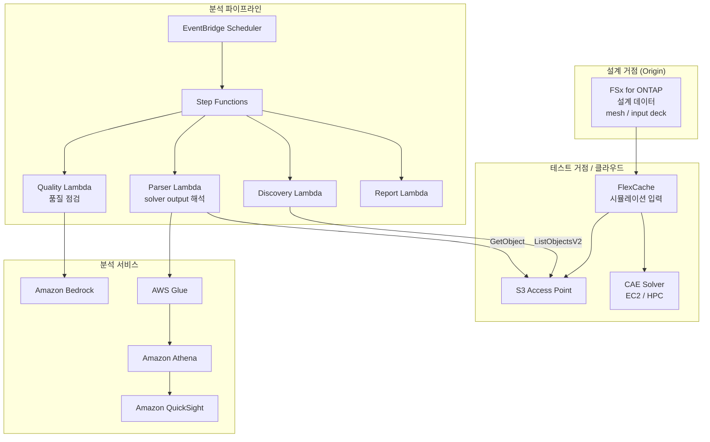

# Automotive CAE Analytics

🌐 **Language / 言語**: [日本語](README.md) | [English](README.en.md) | 한국어 | [简体中文](README.zh-CN.md) | [繁體中文](README.zh-TW.md) | [Français](README.fr.md) | [Deutsch](README.de.md) | [Español](README.es.md)

## 개요

자동차·항공우주·제조업의 CAE(Computer-Aided Engineering) 시뮬레이션 워크플로에서 FSx for ONTAP의 FlexCache와 S3 Access Points를 활용하여 시뮬레이션 입력 데이터의 거점 간 공유, solver output의 자동 분석, 텔레메트리 데이터의 품질 분석을 실현하는 패턴.

## 해결하는 과제

| 과제 | 본 패턴을 통한 해결 |
|------|-------------------|
| 설계 거점과 테스트 거점 간 데이터 전송 지연 | FlexCache로 거점 간 데이터 공유 |
| 시뮬레이션 결과의 수동 분석 | S3 AP + Lambda + Athena로 자동 분석 |
| 대량의 solver output 관리 | Step Functions로 자동 분류·집계 |
| 텔레메트리 데이터의 품질 점검 | Bedrock에 의한 이상 탐지 리포트 |
| CAE 라이선스 비용 최적화 | 작업 시간 단축을 통한 효율화 |

## 아키텍처



## CAE 데이터 분류

| 데이터 종류 | 액세스 패턴 | 권장 배치 | S3 AP 이용 |
|-----------|---------------|---------|-----------|
| Mesh / Input Deck | 읽기 중심 | FlexCache | ✅ 분석용 |
| Solver Output | 쓰기 → 읽기 | FSx native volume | ✅ 결과 분석 |
| Telemetry | 스트리밍 쓰기 | FSx native volume | ✅ 품질 점검 |
| Design Files (CAD) | 읽기 중심 | FlexCache | ⚠️ 바이너리 |
| Reports | 생성 → 배포 | S3 Output Bucket | ❌ |

## 기존 유스케이스와의 관련

| 관련 UC | 관련 포인트 |
|---------|------------|
| [manufacturing-analytics/](../manufacturing-analytics/) | IoT/품질 분석 패턴 공유 |
| [semiconductor-eda/](../semiconductor-eda/) | EDA 작업 관리 패턴 공유 |
| [Dynamic FlexCache Workflow](../dynamic-flexcache-render-workflow/) | 작업 단위 FlexCache |

## 디렉터리 구성

```
automotive-cae/
├── README.md
├── template.yaml
├── functions/
│   ├── discovery/handler.py
│   ├── solver_output_parser/handler.py
│   ├── quality_check/handler.py
│   └── report_generation/handler.py
├── tests/
│   └── test_handlers.py
├── events/
│   └── sample-input.json
└── docs/
    ├── architecture.md
    ├── demo-guide.md
    ├── poc-checklist.md
    └── use-case-mapping.md
```

## 대상 시뮬레이션

- 충돌 해석(LS-DYNA, Radioss)
- 유체 해석(STAR-CCM+, Fluent)
- 구조 해석(Nastran, Abaqus)
- 전자기장 해석(HFSS, CST)
- 멀티피직스(COMSOL)

## 관련 링크

- [manufacturing-analytics/](../manufacturing-analytics/README.md)
- [semiconductor-eda/](../semiconductor-eda/README.md)
- [Dynamic FlexCache Render Workflow](../dynamic-flexcache-render-workflow/README.md)
- [업계·워크로드 매핑](../docs/industry-workload-mapping.md)


## Success Metrics

### Outcome
CAE 시뮬레이션 결과의 자동 분석을 통해 설계 리뷰 준비 공수를 절감한다.

### Metrics
| 메트릭 | 목표값(예) |
|-----------|------------|
| Solver output 해석 파일 수 / 실행 | > 50 files |
| 품질 점검 통과율 | > 90% |
| Bedrock 리포트 생성 시간 | < 3 분 |
| 설계 리뷰 준비 공수 절감 | > 40% |
| Human Review 대상률 | < 15%(품질 불합격 케이스) |

### Measurement Method
Step Functions 실행 이력, Bedrock 리포트 메타데이터, CloudWatch Metrics.


---

## AWS 문서 링크

| 서비스 | 문서 |
|---------|------------|
| FSx for ONTAP | [사용자 가이드](https://docs.aws.amazon.com/fsx/latest/ONTAPGuide/what-is-fsx-ontap.html) |
| S3 Access Points for FSx for ONTAP | [S3 AP 가이드](https://docs.aws.amazon.com/fsx/latest/ONTAPGuide/s3-access-points.html) |
| AWS Batch | [사용자 가이드](https://docs.aws.amazon.com/batch/latest/userguide/what-is-batch.html) |
| AWS ParallelCluster | [사용자 가이드](https://docs.aws.amazon.com/parallelcluster/latest/ug/what-is-aws-parallelcluster.html) |
| Amazon Athena | [사용자 가이드](https://docs.aws.amazon.com/athena/latest/ug/what-is.html) |
| AWS Glue | [개발자 가이드](https://docs.aws.amazon.com/glue/latest/dg/what-is-glue.html) |
| Amazon Bedrock | [사용자 가이드](https://docs.aws.amazon.com/bedrock/latest/userguide/what-is-bedrock.html) |
| Step Functions | [개발자 가이드](https://docs.aws.amazon.com/step-functions/latest/dg/welcome.html) |

### Well-Architected Framework 대응

| 기둥 | 대응 |
|----|------|
| 운영 우수성 | 구조화 로그, CloudWatch Metrics, Bedrock 리포트 자동 생성 |
| 보안 | IAM 최소 권한, KMS 암호화, VPC 분리 |
| 신뢰성 | Step Functions Retry/Catch, Map state 병렬 처리 |
| 성능 효율 | Lambda ARM64, Range GET(헤더 부분 읽기) |
| 비용 최적화 | 서버리스, Athena 스캔량 최적화 |
| 지속 가능성 | 온디맨드 실행, 불필요한 리소스의 자동 정지 |

### 관련 AWS 솔루션

- [AWS HPC 솔루션](https://aws.amazon.com/hpc/)
- [Automotive Industry on AWS](https://aws.amazon.com/automotive/)
- [NICE DCV](https://aws.amazon.com/hpc/dcv/) — 원격 시각화


---

## 비용 견적(월간 개산)

> **주기**: 아래는 ap-northeast-1 리전의 개산이며, 실제 비용은 사용량에 따라 다릅니다. 최신 요금은 [AWS Pricing Calculator](https://calculator.aws/)에서 확인하세요.

### 서버리스 컴포넌트(종량 과금)

| 서비스 | 단가 | 예상 사용량 | 월간 개산 |
|---------|------|-----------|---------|
| Lambda | $0.0000166667/GB-sec | 4 함수 × 20 simulations/일 | ~$1-5 |
| S3 API (GetObject/ListObjects) | $0.0047/10K requests | ~10K requests/일 | ~$1.5 |
| Step Functions | $0.025/1K state transitions | ~1K transitions/일 | ~$0.75 |
| Bedrock (Nova Lite) | $0.00006/1K input tokens | ~30K tokens/실행 | ~$3-10 |
| Athena | $5/TB scanned | ~20 MB/쿼리 | ~$0.5-2 |
| SNS | $0.50/100K notifications | ~100 notifications/일 | ~$0.15 |
| CloudWatch Logs | $0.76/GB ingested | ~1 GB/월 | ~$0.76 |

### 고정 비용(FSx for ONTAP — 기존 환경 전제)

| 컴포넌트 | 월간 |
|--------------|------|
| FSx for ONTAP (128 MBps, 1 TB) | ~$230 (기존 환경 공유) |
| S3 Access Point | 추가 요금 없음(S3 API 요금만) |

### 합계 개산

| 구성 | 월간 개산 |
|------|---------|
| 최소 구성(일 1회 실행) | ~$5-15 |
| 표준 구성(시간별 실행) | ~$15-50 |
| 대규모 구성(고빈도 + 알람) | ~$50-150 |

> **Governance Caveat**: 비용 견적은 개산이며 보증값이 아닙니다. 실제 청구액은 사용 패턴, 데이터양, 리전에 따라 다릅니다.

---

## 로컬 테스트

### Prerequisites 점검

```bash
# 전제 조건 확인
aws --version          # AWS CLI v2
sam --version          # SAM CLI
python3 --version      # Python 3.9+
docker --version       # Docker (sam local 용)
aws sts get-caller-identity  # AWS 자격 증명
```

### sam local invoke

```bash
# 빌드
# 전제: AWS SAM CLI가 필요합니다. sam build가 코드를 자동으로 패키징합니다.
sam build

# Discovery Lambda 로컬 실행
sam local invoke DiscoveryFunction --event events/discovery-event.json

# 환경 변수 오버라이드 포함
sam local invoke DiscoveryFunction \
  --event events/discovery-event.json \
  --env-vars env.json
```

### 유닛 테스트

```bash
python3 -m pytest tests/ -v
```

자세한 내용은 [로컬 테스트 퀵 스타트](../docs/local-testing-quick-start.md)를 참조하세요.

---

## 출력 샘플 (Output Sample)

CAE 솔버 출력 해석 파이프라인의 출력 예:

```json
{
  "discovery": {
    "status": "completed",
    "object_count": 6,
    "solver_types": {"ls-dyna": 3, "star-ccm": 2, "nastran": 1}
  },
  "analysis": [
    {
      "key": "cae-results/crash-sim-001.d3plot",
      "solver": "ls-dyna",
      "simulation_type": "crash",
      "max_displacement_mm": 45.2,
      "max_stress_mpa": 320.5,
      "energy_balance_error_pct": 0.3,
      "pass_criteria": true
    }
  ],
  "report": {
    "total_simulations": 6,
    "passed": 5,
    "failed": 1,
    "report_key": "reports/cae-review-2026-05-23.md",
    "recommendation": "1 simulation exceeded stress threshold - manual review required"
  }
}
```

> **주기**: 위는 샘플 출력이며, 실제 값은 환경·입력 데이터에 따라 다릅니다. 벤치마크 수치는 sizing reference이며 service limit이 아닙니다.

---

## Performance Considerations

- FSx for ONTAP의 스루풋 용량은 NFS/SMB/S3AP에서 공유됩니다
- S3 Access Point 경유의 레이턴시는 수십 밀리초의 오버헤드가 발생합니다
- 대량 파일 처리 시에는 Step Functions Map state의 MaxConcurrency로 병렬도를 제어하세요
- Lambda 메모리 크기 증가는 네트워크 대역폭 향상에도 기여합니다

> **주기**: 본 패턴의 성능 수치는 sizing reference이며 service limit이 아닙니다. 실제 환경에서의 성능은 FSx for ONTAP 스루풋 용량, 네트워크 구성, 동시 실행 워크로드에 따라 다릅니다.

---

## 배포

AWS SAM CLI로 배포합니다(플레이스홀더는 환경에 맞게 교체하세요):

```bash
# 전제: AWS SAM CLI가 필요합니다. sam build가 코드를 자동으로 패키징합니다.
sam build

sam deploy \
  --stack-name fsxn-automotive-cae \
  --parameter-overrides \
    S3AccessPointAlias=<your-s3ap-alias> \
    S3AccessPointName=<your-s3ap-name> \
    NotificationEmail=<your-email@example.com> \
  --capabilities CAPABILITY_NAMED_IAM \
  --resolve-s3 \
  --region <your-region>
```

> **주의**: `template.yaml`은 SAM CLI(`sam build` + `sam deploy`)에서 사용합니다.
> `aws cloudformation deploy` 명령으로 직접 배포하는 경우에는 `template-deploy.yaml`을 사용하세요(Lambda zip 파일의 사전 패키징과 S3 업로드가 필요합니다).

## Governance Note

> 본 패턴은 기술 아키텍처 가이던스를 제공합니다. 법적·컴플라이언스·규제상의 조언이 아닙니다. 조직은 적격한 전문가에게 상담하세요.
