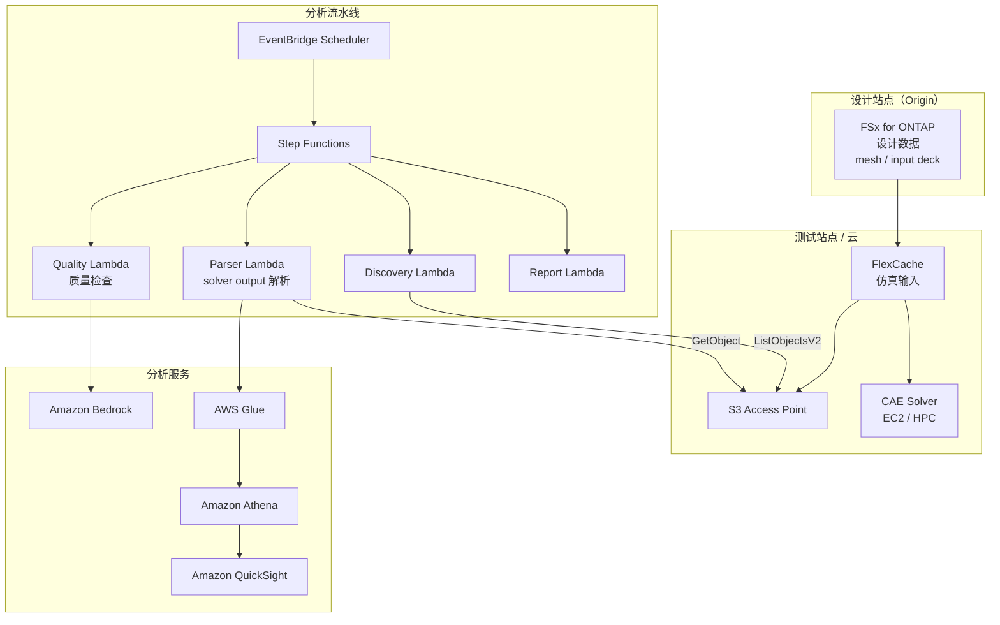

# Automotive CAE Analytics

🌐 **Language / 言語**: [日本語](README.md) | [English](README.en.md) | [한국어](README.ko.md) | 简体中文 | [繁體中文](README.zh-TW.md) | [Français](README.fr.md) | [Deutsch](README.de.md) | [Español](README.es.md)

## 概述

一种在汽车、航空航天和制造业的 CAE（Computer-Aided Engineering）仿真工作流中，利用 FSx for ONTAP 的 FlexCache 和 S3 Access Points，实现仿真输入数据的跨站点共享、solver output 的自动分析以及遥测数据质量分析的模式。

## 解决的课题

| 课题 | 本模式的解决方案 |
|------|-------------------|
| 设计站点与测试站点之间的数据传输延迟 | 使用 FlexCache 进行跨站点数据共享 |
| 仿真结果的手动分析 | 使用 S3 AP + Lambda + Athena 进行自动分析 |
| 大量 solver output 的管理 | 使用 Step Functions 自动分类·汇总 |
| 遥测数据的质量检查 | 基于 Bedrock 的异常检测报告 |
| CAE 许可证成本优化 | 通过缩短作业时间提升效率 |

## 架构



## CAE 数据分类

| 数据类型 | 访问模式 | 推荐放置 | S3 AP 使用 |
|-----------|---------------|---------|-----------|
| Mesh / Input Deck | 以读取为主 | FlexCache | ✅ 用于分析 |
| Solver Output | 写入 → 读取 | FSx native volume | ✅ 结果分析 |
| Telemetry | 流式写入 | FSx native volume | ✅ 质量检查 |
| Design Files (CAD) | 以读取为主 | FlexCache | ⚠️ 二进制 |
| Reports | 生成 → 分发 | S3 Output Bucket | ❌ |

## 与现有用例的关联

| 相关 UC | 关联点 |
|---------|------------|
| [manufacturing-analytics/](../manufacturing-analytics/) | 共享 IoT/质量分析模式 |
| [semiconductor-eda/](../semiconductor-eda/) | 共享 EDA 作业管理模式 |
| [Dynamic FlexCache Workflow](../dynamic-flexcache-render-workflow/) | 按作业维度的 FlexCache |

## 目录结构

```
automotive-cae/
├── README.md
├── template.yaml
├── functions/
│   ├── discovery/handler.py
│   ├── solver_output_parser/handler.py
│   ├── quality_check/handler.py
│   └── report_generation/handler.py
├── tests/
│   └── test_handlers.py
├── events/
│   └── sample-input.json
└── docs/
    ├── architecture.md
    ├── demo-guide.md
    ├── poc-checklist.md
    └── use-case-mapping.md
```

## 目标仿真

- 碰撞分析（LS-DYNA, Radioss）
- 流体分析（STAR-CCM+, Fluent）
- 结构分析（Nastran, Abaqus）
- 电磁场分析（HFSS, CST）
- 多物理场（COMSOL）

## 相关链接

- [manufacturing-analytics/](../manufacturing-analytics/README.md)
- [semiconductor-eda/](../semiconductor-eda/README.md)
- [Dynamic FlexCache Render Workflow](../dynamic-flexcache-render-workflow/README.md)
- [行业·工作负载映射](../docs/industry-workload-mapping.md)


## Success Metrics

### Outcome
通过对 CAE 仿真结果进行自动分析，减少设计评审的准备工时。

### Metrics
| 指标 | 目标值（示例） |
|-----------|------------|
| Solver output 解析文件数 / 执行 | > 50 files |
| 质量检查通过率 | > 90% |
| Bedrock 报告生成时间 | < 3 分钟 |
| 设计评审准备工时的减少 | > 40% |
| Human Review 对象率 | < 15%（质量不合格情形） |

### Measurement Method
Step Functions 执行历史、Bedrock 报告元数据、CloudWatch Metrics。


---

## AWS 文档链接

| 服务 | 文档 |
|---------|------------|
| FSx for ONTAP | [用户指南](https://docs.aws.amazon.com/fsx/latest/ONTAPGuide/what-is-fsx-ontap.html) |
| S3 Access Points for FSx for ONTAP | [S3 AP 指南](https://docs.aws.amazon.com/fsx/latest/ONTAPGuide/s3-access-points.html) |
| AWS Batch | [用户指南](https://docs.aws.amazon.com/batch/latest/userguide/what-is-batch.html) |
| AWS ParallelCluster | [用户指南](https://docs.aws.amazon.com/parallelcluster/latest/ug/what-is-aws-parallelcluster.html) |
| Amazon Athena | [用户指南](https://docs.aws.amazon.com/athena/latest/ug/what-is.html) |
| AWS Glue | [开发者指南](https://docs.aws.amazon.com/glue/latest/dg/what-is-glue.html) |
| Amazon Bedrock | [用户指南](https://docs.aws.amazon.com/bedrock/latest/userguide/what-is-bedrock.html) |
| Step Functions | [开发者指南](https://docs.aws.amazon.com/step-functions/latest/dg/welcome.html) |

### Well-Architected Framework 对应

| 支柱 | 对应 |
|----|------|
| 卓越运营 | 结构化日志、CloudWatch Metrics、Bedrock 报告自动生成 |
| 安全性 | IAM 最小权限、KMS 加密、VPC 隔离 |
| 可靠性 | Step Functions Retry/Catch、Map state 并行处理 |
| 性能效率 | Lambda ARM64、Range GET（头部部分读取） |
| 成本优化 | 无服务器、Athena 扫描量优化 |
| 可持续性 | 按需执行、不需要资源的自动停止 |

### 相关 AWS 解决方案

- [AWS HPC 解决方案](https://aws.amazon.com/hpc/)
- [Automotive Industry on AWS](https://aws.amazon.com/automotive/)
- [NICE DCV](https://aws.amazon.com/hpc/dcv/) — 远程可视化


---

## 成本估算（月度概算）

> **注记**: 以下为 ap-northeast-1 区域的概算，实际成本因使用量而异。最新价格请在 [AWS Pricing Calculator](https://calculator.aws/) 中确认。

### 无服务器组件（按量计费）

| 服务 | 单价 | 预计使用量 | 月度概算 |
|---------|------|-----------|---------|
| Lambda | $0.0000166667/GB-sec | 4 函数 × 20 simulations/日 | ~$1-5 |
| S3 API (GetObject/ListObjects) | $0.0047/10K requests | ~10K requests/日 | ~$1.5 |
| Step Functions | $0.025/1K state transitions | ~1K transitions/日 | ~$0.75 |
| Bedrock (Nova Lite) | $0.00006/1K input tokens | ~30K tokens/执行 | ~$3-10 |
| Athena | $5/TB scanned | ~20 MB/查询 | ~$0.5-2 |
| SNS | $0.50/100K notifications | ~100 notifications/日 | ~$0.15 |
| CloudWatch Logs | $0.76/GB ingested | ~1 GB/月 | ~$0.76 |

### 固定成本（FSx for ONTAP — 以现有环境为前提）

| 组件 | 月度 |
|--------------|------|
| FSx for ONTAP (128 MBps, 1 TB) | ~$230 (共享现有环境) |
| S3 Access Point | 无附加费用（仅 S3 API 费用） |

### 合计概算

| 配置 | 月度概算 |
|------|---------|
| 最小配置（每日执行 1 次） | ~$5-15 |
| 标准配置（每小时执行） | ~$15-50 |
| 大规模配置（高频 + 告警） | ~$50-150 |

> **Governance Caveat**: 成本估算为概算，并非保证值。实际账单金额因使用模式、数据量和区域而异。

---

## 本地测试

### Prerequisites 检查

```bash
# 确认前提条件
aws --version          # AWS CLI v2
sam --version          # SAM CLI
python3 --version      # Python 3.9+
docker --version       # Docker (用于 sam local)
aws sts get-caller-identity  # AWS 凭证
```

### sam local invoke

```bash
# 构建
# 前提: 需要 AWS SAM CLI。sam build 会自动打包代码。
sam build

# 本地运行 Discovery Lambda
sam local invoke DiscoveryFunction --event events/discovery-event.json

# 带环境变量覆盖
sam local invoke DiscoveryFunction \
  --event events/discovery-event.json \
  --env-vars env.json
```

### 单元测试

```bash
python3 -m pytest tests/ -v
```

详情请参阅[本地测试快速入门](../docs/local-testing-quick-start.md)。

---

## 输出示例 (Output Sample)

CAE 求解器输出解析流水线的输出示例:

```json
{
  "discovery": {
    "status": "completed",
    "object_count": 6,
    "solver_types": {"ls-dyna": 3, "star-ccm": 2, "nastran": 1}
  },
  "analysis": [
    {
      "key": "cae-results/crash-sim-001.d3plot",
      "solver": "ls-dyna",
      "simulation_type": "crash",
      "max_displacement_mm": 45.2,
      "max_stress_mpa": 320.5,
      "energy_balance_error_pct": 0.3,
      "pass_criteria": true
    }
  ],
  "report": {
    "total_simulations": 6,
    "passed": 5,
    "failed": 1,
    "report_key": "reports/cae-review-2026-05-23.md",
    "recommendation": "1 simulation exceeded stress threshold - manual review required"
  }
}
```

> **注记**: 上述为示例输出，实际值因环境·输入数据而异。基准数值为 sizing reference，并非 service limit。

---

## Performance Considerations

- FSx for ONTAP 的吞吐容量在 NFS/SMB/S3AP 之间共享
- 经由 S3 Access Point 的延迟会产生数十毫秒的开销
- 处理大量文件时，请使用 Step Functions Map state 的 MaxConcurrency 控制并行度
- 增加 Lambda 内存大小也有助于提升网络带宽

> **注记**: 本模式的性能数值为 sizing reference，并非 service limit。实际环境中的性能因 FSx for ONTAP 吞吐容量、网络配置和并发工作负载而异。

---

## 部署

使用 AWS SAM CLI 进行部署（请根据环境替换占位符）:

```bash
# 前提: 需要 AWS SAM CLI。sam build 会自动打包代码。
sam build

sam deploy \
  --stack-name fsxn-automotive-cae \
  --parameter-overrides \
    S3AccessPointAlias=<your-s3ap-alias> \
    S3AccessPointName=<your-s3ap-name> \
    NotificationEmail=<your-email@example.com> \
  --capabilities CAPABILITY_NAMED_IAM \
  --resolve-s3 \
  --region <your-region>
```

> **注意**: `template.yaml` 用于 SAM CLI（`sam build` + `sam deploy`）。
> 如果使用 `aws cloudformation deploy` 命令直接部署，请使用 `template-deploy.yaml`（需要预先打包 Lambda zip 文件并上传到 S3）。

## Governance Note

> 本模式提供技术架构指导，并非法律、合规或监管方面的建议。组织应咨询合格的专业人士。
