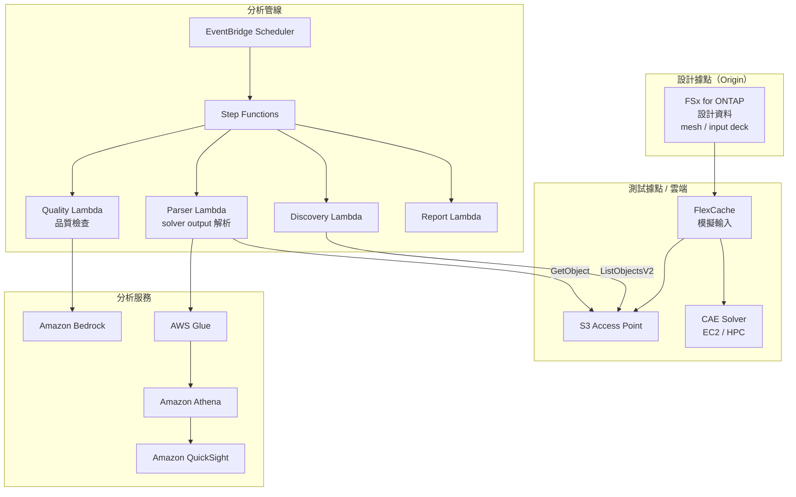

# Automotive CAE Analytics

🌐 **Language / 言語**: [日本語](README.md) | [English](README.en.md) | [한국어](README.ko.md) | [简体中文](README.zh-CN.md) | 繁體中文 | [Français](README.fr.md) | [Deutsch](README.de.md) | [Español](README.es.md)

## 概述

一種在汽車、航太與製造業的 CAE（Computer-Aided Engineering）模擬工作流程中，運用 FSx for ONTAP 的 FlexCache 與 S3 Access Points，實現模擬輸入資料的跨據點共用、solver output 的自動分析以及遙測資料品質分析的模式。

## 解決的課題

| 課題 | 本模式的解決方案 |
|------|-------------------|
| 設計據點與測試據點之間的資料傳輸延遲 | 使用 FlexCache 進行跨據點資料共用 |
| 模擬結果的手動分析 | 使用 S3 AP + Lambda + Athena 進行自動分析 |
| 大量 solver output 的管理 | 使用 Step Functions 自動分類·彙總 |
| 遙測資料的品質檢查 | 基於 Bedrock 的異常偵測報告 |
| CAE 授權成本最佳化 | 透過縮短作業時間提升效率 |

## 架構



## CAE 資料分類

| 資料類型 | 存取模式 | 建議放置 | S3 AP 使用 |
|-----------|---------------|---------|-----------|
| Mesh / Input Deck | 以讀取為主 | FlexCache | ✅ 用於分析 |
| Solver Output | 寫入 → 讀取 | FSx native volume | ✅ 結果分析 |
| Telemetry | 串流寫入 | FSx native volume | ✅ 品質檢查 |
| Design Files (CAD) | 以讀取為主 | FlexCache | ⚠️ 二進位 |
| Reports | 產生 → 發佈 | S3 Output Bucket | ❌ |

## 與現有使用案例的關聯

| 相關 UC | 關聯點 |
|---------|------------|
| [manufacturing-analytics/](../manufacturing-analytics/) | 共用 IoT/品質分析模式 |
| [semiconductor-eda/](../semiconductor-eda/) | 共用 EDA 作業管理模式 |
| [Dynamic FlexCache Workflow](../dynamic-flexcache-render-workflow/) | 以作業為單位的 FlexCache |

## 目錄結構

```
automotive-cae/
├── README.md
├── template.yaml
├── functions/
│   ├── discovery/handler.py
│   ├── solver_output_parser/handler.py
│   ├── quality_check/handler.py
│   └── report_generation/handler.py
├── tests/
│   └── test_handlers.py
├── events/
│   └── sample-input.json
└── docs/
    ├── architecture.md
    ├── demo-guide.md
    ├── poc-checklist.md
    └── use-case-mapping.md
```

## 目標模擬

- 碰撞解析（LS-DYNA, Radioss）
- 流體解析（STAR-CCM+, Fluent）
- 結構解析（Nastran, Abaqus）
- 電磁場解析（HFSS, CST）
- 多物理場（COMSOL）

## 相關連結

- [manufacturing-analytics/](../manufacturing-analytics/README.md)
- [semiconductor-eda/](../semiconductor-eda/README.md)
- [Dynamic FlexCache Render Workflow](../dynamic-flexcache-render-workflow/README.md)
- [產業·工作負載對應](../docs/industry-workload-mapping.md)


## Success Metrics

### Outcome
透過對 CAE 模擬結果進行自動分析，減少設計審查的準備工時。

### Metrics
| 指標 | 目標值（範例） |
|-----------|------------|
| Solver output 解析檔案數 / 執行 | > 50 files |
| 品質檢查通過率 | > 90% |
| Bedrock 報告產生時間 | < 3 分鐘 |
| 設計審查準備工時的減少 | > 40% |
| Human Review 對象率 | < 15%（品質不合格情形） |

### Measurement Method
Step Functions 執行歷程、Bedrock 報告中繼資料、CloudWatch Metrics。


---

## AWS 文件連結

| 服務 | 文件 |
|---------|------------|
| FSx for ONTAP | [使用者指南](https://docs.aws.amazon.com/fsx/latest/ONTAPGuide/what-is-fsx-ontap.html) |
| S3 Access Points for FSx for ONTAP | [S3 AP 指南](https://docs.aws.amazon.com/fsx/latest/ONTAPGuide/s3-access-points.html) |
| AWS Batch | [使用者指南](https://docs.aws.amazon.com/batch/latest/userguide/what-is-batch.html) |
| AWS ParallelCluster | [使用者指南](https://docs.aws.amazon.com/parallelcluster/latest/ug/what-is-aws-parallelcluster.html) |
| Amazon Athena | [使用者指南](https://docs.aws.amazon.com/athena/latest/ug/what-is.html) |
| AWS Glue | [開發人員指南](https://docs.aws.amazon.com/glue/latest/dg/what-is-glue.html) |
| Amazon Bedrock | [使用者指南](https://docs.aws.amazon.com/bedrock/latest/userguide/what-is-bedrock.html) |
| Step Functions | [開發人員指南](https://docs.aws.amazon.com/step-functions/latest/dg/welcome.html) |

### Well-Architected Framework 對應

| 支柱 | 對應 |
|----|------|
| 卓越運營 | 結構化日誌、CloudWatch Metrics、Bedrock 報告自動產生 |
| 安全性 | IAM 最小權限、KMS 加密、VPC 隔離 |
| 可靠性 | Step Functions Retry/Catch、Map state 平行處理 |
| 效能效率 | Lambda ARM64、Range GET（標頭部分讀取） |
| 成本最佳化 | 無伺服器、Athena 掃描量最佳化 |
| 永續性 | 隨需執行、不需要資源的自動停止 |

### 相關 AWS 解決方案

- [AWS HPC 解決方案](https://aws.amazon.com/hpc/)
- [Automotive Industry on AWS](https://aws.amazon.com/automotive/)
- [NICE DCV](https://aws.amazon.com/hpc/dcv/) — 遠端視覺化


---

## 成本估算（每月概算）

> **註記**: 以下為 ap-northeast-1 區域的概算，實際成本因使用量而異。最新價格請於 [AWS Pricing Calculator](https://calculator.aws/) 中確認。

### 無伺服器元件（依用量計費）

| 服務 | 單價 | 預計使用量 | 每月概算 |
|---------|------|-----------|---------|
| Lambda | $0.0000166667/GB-sec | 4 函式 × 20 simulations/日 | ~$1-5 |
| S3 API (GetObject/ListObjects) | $0.0047/10K requests | ~10K requests/日 | ~$1.5 |
| Step Functions | $0.025/1K state transitions | ~1K transitions/日 | ~$0.75 |
| Bedrock (Nova Lite) | $0.00006/1K input tokens | ~30K tokens/執行 | ~$3-10 |
| Athena | $5/TB scanned | ~20 MB/查詢 | ~$0.5-2 |
| SNS | $0.50/100K notifications | ~100 notifications/日 | ~$0.15 |
| CloudWatch Logs | $0.76/GB ingested | ~1 GB/月 | ~$0.76 |

### 固定成本（FSx for ONTAP — 以現有環境為前提）

| 元件 | 每月 |
|--------------|------|
| FSx for ONTAP (128 MBps, 1 TB) | ~$230 (共用現有環境) |
| S3 Access Point | 無額外費用（僅 S3 API 費用） |

### 合計概算

| 組態 | 每月概算 |
|------|---------|
| 最小組態（每日執行 1 次） | ~$5-15 |
| 標準組態（每小時執行） | ~$15-50 |
| 大規模組態（高頻率 + 警示） | ~$50-150 |

> **Governance Caveat**: 成本估算為概算，並非保證值。實際帳單金額因使用模式、資料量與區域而異。

---

## 本機測試

### Prerequisites 檢查

```bash
# 確認前提條件
aws --version          # AWS CLI v2
sam --version          # SAM CLI
python3 --version      # Python 3.9+
docker --version       # Docker (用於 sam local)
aws sts get-caller-identity  # AWS 認證資訊
```

### sam local invoke

```bash
# 建置
# 前提: 需要 AWS SAM CLI。sam build 會自動封裝程式碼。
sam build

# 於本機執行 Discovery Lambda
sam local invoke DiscoveryFunction --event events/discovery-event.json

# 附帶環境變數覆寫
sam local invoke DiscoveryFunction \
  --event events/discovery-event.json \
  --env-vars env.json
```

### 單元測試

```bash
python3 -m pytest tests/ -v
```

詳情請參閱[本機測試快速入門](../docs/local-testing-quick-start.md)。

---

## 輸出範例 (Output Sample)

CAE 求解器輸出解析管線的輸出範例:

```json
{
  "discovery": {
    "status": "completed",
    "object_count": 6,
    "solver_types": {"ls-dyna": 3, "star-ccm": 2, "nastran": 1}
  },
  "analysis": [
    {
      "key": "cae-results/crash-sim-001.d3plot",
      "solver": "ls-dyna",
      "simulation_type": "crash",
      "max_displacement_mm": 45.2,
      "max_stress_mpa": 320.5,
      "energy_balance_error_pct": 0.3,
      "pass_criteria": true
    }
  ],
  "report": {
    "total_simulations": 6,
    "passed": 5,
    "failed": 1,
    "report_key": "reports/cae-review-2026-05-23.md",
    "recommendation": "1 simulation exceeded stress threshold - manual review required"
  }
}
```

> **註記**: 上述為範例輸出，實際值因環境·輸入資料而異。基準數值為 sizing reference，並非 service limit。

---

## Performance Considerations

- FSx for ONTAP 的輸送量容量在 NFS/SMB/S3AP 之間共用
- 經由 S3 Access Point 的延遲會產生數十毫秒的開銷
- 處理大量檔案時，請使用 Step Functions Map state 的 MaxConcurrency 控制平行度
- 增加 Lambda 記憶體大小也有助於提升網路頻寬

> **註記**: 本模式的效能數值為 sizing reference，並非 service limit。實際環境中的效能因 FSx for ONTAP 輸送量容量、網路組態與並行工作負載而異。

---

## 部署

使用 AWS SAM CLI 進行部署（請依環境替換預留位置）:

```bash
# 前提: 需要 AWS SAM CLI。sam build 會自動封裝程式碼。
sam build

sam deploy \
  --stack-name fsxn-automotive-cae \
  --parameter-overrides \
    S3AccessPointAlias=<your-s3ap-alias> \
    S3AccessPointName=<your-s3ap-name> \
    NotificationEmail=<your-email@example.com> \
  --capabilities CAPABILITY_NAMED_IAM \
  --resolve-s3 \
  --region <your-region>
```

> **注意**: `template.yaml` 用於 SAM CLI（`sam build` + `sam deploy`）。
> 若使用 `aws cloudformation deploy` 命令直接部署，請使用 `template-deploy.yaml`（需要預先封裝 Lambda zip 檔案並上傳至 S3）。

## Governance Note

> 本模式提供技術架構指引，並非法律、合規或法規方面的建議。組織應諮詢合格的專業人士。
