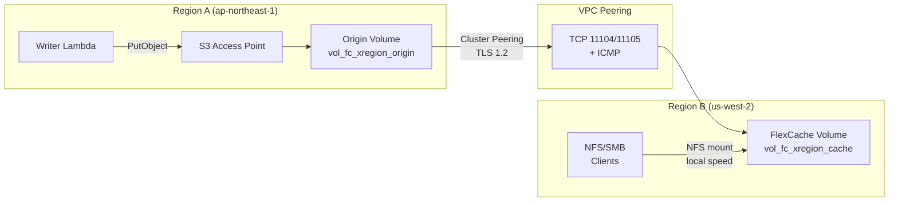

# FlexCache Cross-Region + S3 Access Points Pattern

🌐 **Language / 言語**: [日本語](README.md) | [English](README.en.md) | [한국어](README.ko.md) | [简体中文](README.zh-CN.md) | [繁體中文](README.zh-TW.md) | [Français](README.fr.md) | [Deutsch](README.de.md) | [Español](README.es.md)

## Überblick

Ein regionsübergreifendes Datenverteilungsmuster, das über S3 Access Points in Region A gesammelte Daten über FlexCache mit einer Propagationszeit von unter 3 Sekunden an NFS/SMB-Clients in Region B liefert.

Über S3 AP geschriebene Daten → Origin Volume (Region A) werden über die VPC Peering + Cluster/SVM Peering-Infrastruktur im FlexCache Volume in Region B mit lokaler Cache-Geschwindigkeit lesbar.

## Architektur



## Schlüsselkomponenten

| Komponente | Region | Beschreibung |
|-----------|:------:|-------------|
| Origin Volume + S3 AP | A | Datenaufnahmepunkt. S3 API-Schreibschnittstelle |
| VPC Peering | A ↔ B | Netzwerkkonnektivität für ONTAP Intercluster-Kommunikation |
| Cluster Peering | A ↔ B | ONTAP-Cluster-Vertrauensbeziehung (TLS 1.2-verschlüsselt) |
| SVM Peering | A ↔ B | FlexCache-Anwendungsberechtigung zwischen SVMs |
| FlexCache Volume | B | Zwischenspeichert aktive Daten vom Origin. Lesezugriff mit lokaler Geschwindigkeit |

## Voraussetzungen

- 2 FSx for ONTAP-Cluster (Region A und Region B)
- VPC Peering eingerichtet (TCP 11104, 11105, ICMP erlaubt)
- fsxadmin-Anmeldedaten für jeden Cluster in Secrets Manager gespeichert
- ONTAP 9.12.1 oder höher (S3 NAS-Bucket-Unterstützung auf Origin)
- AWS CLI v2

## Bereitstellung

```bash
# 1. CloudFormation-Stack bereitstellen (erstellt Origin Volume in Region A)
aws cloudformation deploy \
  --template-file template.yaml \
  --stack-name fsxn-fc-xregion \
  --parameter-overrides file://params.example.json \
  --capabilities CAPABILITY_NAMED_IAM

# 2. S3 AP → Cluster Peering → SVM Peering → FlexCache erstellen
#    (siehe PostDeployInstructions in den Stack-Ausgaben)
```

## Überprüfung

```bash
# Schreiben über S3 AP (Region A)
aws s3api put-object \
  --bucket <s3-ap-alias> \
  --key test/cross-region.txt \
  --body /tmp/cross-region.txt

# Lesen über FlexCache (NFS) in Region B — Propagation <3 Sekunden
cat /mnt/fc_xregion_cache/test/cross-region.txt
```

## Leistungsmerkmale (validiert)

| Metrik | Wert | Bedingungen |
|--------|:-----:|------------|
| S3 AP-Schreibvorgang → FlexCache NFS lesbar | <3 sec | ap-northeast-1 → us-west-2, 120ms RTT |
| FlexCache Cache-Hit-Latenz | <1 ms | Entspricht lokalem Speicher |
| FlexCache Mindestgröße | 50 GB | FSx for ONTAP-Beschränkung |
| Empfohlene max. RTT (Write-back-Modus) | ≤200 ms | XLD-Erwerbs-/Widerrufslatenz |

## Technische Einschränkungen

| Einschränkung | Details |
|-----------|---------|
| S3 AP auf FlexCache Cache Volume | Erfordert ONTAP 9.18.1+. Bei 9.17.1 und früher nur NFS/SMB-Zugriff |
| FlexCache write-back (RTT) | Write-around empfohlen bei RTT >200ms. Write-back XLD-Verarbeitung verschlechtert die Leistung |
| VPC Peering-Löschreihenfolge | Löschen von VPC Peering vor Abschluss der SVM Peer-Löschung verursacht verwaiste Datensätze (SM-VAL-011) |
| SnapMirror Synchronous | Nicht unterstützt für Volumes mit S3 NAS-Buckets |
| SVM-DR | Nicht unterstützt auf SVMs mit S3 NAS-Buckets |

## Bereinigung (Reihenfolge kritisch — SM-VAL-011)

```bash
# ⚠️ Befolgen Sie exakt diese Reihenfolge. Zuerst VPC Peering zu löschen verursacht einen nicht wiederherstellbaren Zustand.

# 1. FlexCache Volume löschen (ONTAP REST API auf Region B-Cluster)
# DELETE /api/storage/flexcache/flexcaches/<uuid>

# 2. SVM Peers löschen (BEIDE Cluster) — num_records: 0 auf BEIDEN Seiten verifizieren
# DELETE /api/svm/peers/<uuid> (Region A)
# DELETE /api/svm/peers/<uuid> (Region B)
# POLL: GET /api/svm/peers until num_records: 0 on BOTH

# 3. Cluster Peers löschen (beide Cluster)
# DELETE /api/cluster/peers/<uuid>

# 4. VPC Peering löschen (nur sicher nach Bestätigung von Schritt 2)
# aws ec2 delete-vpc-peering-connection --vpc-peering-connection-id <pcx-id>

# 5. S3 Access Point trennen und löschen
aws fsx detach-and-delete-s3-access-point --s3-access-point-arn <arn>

# 6. CloudFormation-Stack löschen
aws cloudformation delete-stack --stack-name fsxn-fc-xregion
```

## Referenzen

- [NetApp Docs: FlexCache supported features](https://docs.netapp.com/us-en/ontap/flexcache/supported-unsupported-features-concept.html)
- [NetApp Docs: FlexCache duality FAQ (9.18.1 Cache S3)](https://docs.netapp.com/us-en/ontap/flexcache/flexcache-duality-faq.html)
- [NetApp Docs: S3 multiprotocol](https://docs.netapp.com/us-en/ontap/s3-multiprotocol/index.html)
- [AWS Docs: FSx for ONTAP FlexCache](https://docs.aws.amazon.com/fsx/latest/ONTAPGuide/using-flexcache.html)
- [AWS Docs: FSx for ONTAP S3 Access Points](https://docs.aws.amazon.com/fsx/latest/ONTAPGuide/accessing-data-via-s3-access-points.html)
- [AWS Docs: VPC Peering](https://docs.aws.amazon.com/vpc/latest/peering/what-is-vpc-peering.html)
