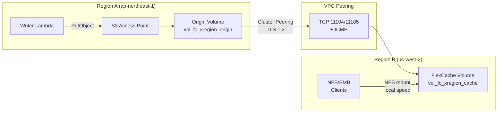

# FlexCache Cross-Region + S3 Access Points Pattern

🌐 **Language / 言語**: [日本語](README.md) | [English](README.en.md) | [한국어](README.ko.md) | [简体中文](README.zh-CN.md) | [繁體中文](README.zh-TW.md) | [Français](README.fr.md) | [Deutsch](README.de.md) | [Español](README.es.md)

## Overview

A cross-region data distribution pattern that delivers data collected via S3 Access Points in Region A to NFS/SMB clients in Region B through FlexCache with sub-3-second propagation.

Data written via S3 AP → Origin Volume (Region A) becomes readable from the FlexCache Volume in Region B at local cache speed, traversing VPC Peering + Cluster/SVM Peering infrastructure.

## Architecture



## Key Components

| Component | Region | Description |
|-----------|:------:|-------------|
| Origin Volume + S3 AP | A | Data ingestion point. S3 API write interface |
| VPC Peering | A ↔ B | Network connectivity for ONTAP Intercluster communication |
| Cluster Peering | A ↔ B | ONTAP cluster trust relationship (TLS 1.2 encrypted) |
| SVM Peering | A ↔ B | FlexCache application permission between SVMs |
| FlexCache Volume | B | Caches hot data from Origin. Local-speed reads |

## Prerequisites

> 📐 **Design Guide**: For S3 AP directory design, performance characteristics, and PoC checklist, see [Design Considerations](../../docs/design-considerations-en.md).

- 2 FSx for ONTAP clusters (Region A and Region B)
- VPC Peering established (TCP 11104, 11105, ICMP allowed)
- fsxadmin credentials for each cluster stored in Secrets Manager
- ONTAP 9.12.1 or later (S3 NAS bucket support on Origin)
- AWS CLI v2

## Deploy

```bash
# 1. Deploy CloudFormation stack (creates Origin Volume in Region A)
aws cloudformation deploy \
  --template-file template.yaml \
  --stack-name fsxn-fc-xregion \
  --parameter-overrides file://params.example.json \
  --capabilities CAPABILITY_NAMED_IAM

# 2. Create S3 AP → Cluster Peering → SVM Peering → FlexCache
#    (see PostDeployInstructions in stack outputs)
```

## Verify

```bash
# Write via S3 AP (Region A)
aws s3api put-object \
  --bucket <s3-ap-alias> \
  --key test/cross-region.txt \
  --body /tmp/cross-region.txt

# Read via FlexCache (NFS) in Region B — propagation <3 seconds
cat /mnt/fc_xregion_cache/test/cross-region.txt
```

## Performance Characteristics (Validated)

| Metric | Value | Conditions |
|--------|:-----:|------------|
| S3 AP write → FlexCache NFS readable | <3 sec | ap-northeast-1 → us-west-2, 120ms RTT |
| FlexCache cache-hit latency | <1 ms | Equivalent to local storage |
| FlexCache minimum size | 50 GB | FSx for ONTAP constraint |
| Recommended max RTT (write-back mode) | ≤200 ms | XLD acquisition/revocation latency |

## Technical Constraints

| Constraint | Details |
|-----------|---------|
| S3 AP on FlexCache Cache Volume | Requires ONTAP 9.18.1+. On 9.17.1 and earlier, NFS/SMB access only |
| FlexCache write-back (RTT) | Write-around recommended for RTT >200ms. Write-back XLD processing degrades performance |
| VPC Peering deletion order | Deleting VPC Peering before SVM Peer deletion completes causes orphaned records (SM-VAL-011) |
| SnapMirror Synchronous | Not supported for volumes with S3 NAS buckets |
| SVM-DR | Not supported on SVMs containing S3 NAS buckets |

## Clean Up (Order Critical — SM-VAL-011)

```bash
# ⚠️ Follow this exact order. Deleting VPC Peering first causes unrecoverable state.

# 1. Delete FlexCache Volume (ONTAP REST API on Region B cluster)
# DELETE /api/storage/flexcache/flexcaches/<uuid>

# 2. Delete SVM Peers (BOTH clusters) — verify num_records: 0 on BOTH sides
# DELETE /api/svm/peers/<uuid> (Region A)
# DELETE /api/svm/peers/<uuid> (Region B)
# POLL: GET /api/svm/peers until num_records: 0 on BOTH

# 3. Delete Cluster Peers (both clusters)
# DELETE /api/cluster/peers/<uuid>

# 4. Delete VPC Peering (safe only after step 2 is confirmed)
# aws ec2 delete-vpc-peering-connection --vpc-peering-connection-id <pcx-id>

# 5. Detach and delete S3 Access Point
aws fsx detach-and-delete-s3-access-point --s3-access-point-arn <arn>

# 6. Delete CloudFormation stack
aws cloudformation delete-stack --stack-name fsxn-fc-xregion
```

## References

- [NetApp Docs: FlexCache supported features](https://docs.netapp.com/us-en/ontap/flexcache/supported-unsupported-features-concept.html)
- [NetApp Docs: FlexCache duality FAQ (9.18.1 Cache S3)](https://docs.netapp.com/us-en/ontap/flexcache/flexcache-duality-faq.html)
- [NetApp Docs: S3 multiprotocol](https://docs.netapp.com/us-en/ontap/s3-multiprotocol/index.html)
- [AWS Docs: FSx for ONTAP FlexCache](https://docs.aws.amazon.com/fsx/latest/ONTAPGuide/using-flexcache.html)
- [AWS Docs: FSx for ONTAP S3 Access Points](https://docs.aws.amazon.com/fsx/latest/ONTAPGuide/accessing-data-via-s3-access-points.html)
- [AWS Docs: VPC Peering](https://docs.aws.amazon.com/vpc/latest/peering/what-is-vpc-peering.html)
