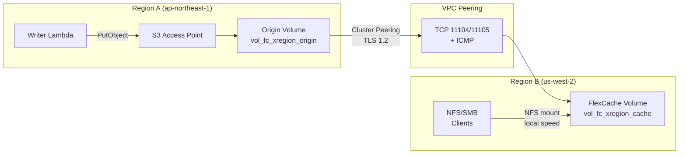

# FlexCache Cross-Region + S3 Access Points Pattern

🌐 **Language / 言語**: [日本語](README.md) | [English](README.en.md) | [한국어](README.ko.md) | [简体中文](README.zh-CN.md) | [繁體中文](README.zh-TW.md) | [Français](README.fr.md) | [Deutsch](README.de.md) | [Español](README.es.md)

## Descripción general

Un patrón de distribución de datos entre regiones que entrega datos recopilados a través de S3 Access Points en la Región A a clientes NFS/SMB en la Región B mediante FlexCache con una propagación inferior a 3 segundos.

Los datos escritos a través de S3 AP → Origin Volume (Región A) se vuelven legibles desde el FlexCache Volume en la Región B a velocidad de caché local, atravesando la infraestructura de VPC Peering + Cluster/SVM Peering.

## Arquitectura



## Componentes clave

| Componente | Región | Descripción |
|-----------|:------:|-------------|
| Origin Volume + S3 AP | A | Punto de ingesta de datos. Interfaz de escritura S3 API |
| VPC Peering | A ↔ B | Conectividad de red para comunicación ONTAP Intercluster |
| Cluster Peering | A ↔ B | Relación de confianza entre clústeres ONTAP (cifrado TLS 1.2) |
| SVM Peering | A ↔ B | Permiso de aplicación FlexCache entre SVMs |
| FlexCache Volume | B | Almacena en caché datos activos del Origin. Lecturas a velocidad local |

## Requisitos previos

- 2 clústeres FSx for ONTAP (Región A y Región B)
- VPC Peering establecido (TCP 11104, 11105, ICMP permitidos)
- Credenciales fsxadmin de cada clúster almacenadas en Secrets Manager
- ONTAP 9.12.1 o posterior (soporte de buckets S3 NAS en Origin)
- AWS CLI v2

## Despliegue

```bash
# 1. Desplegar la pila CloudFormation (crea Origin Volume en Región A)
aws cloudformation deploy \
  --template-file template.yaml \
  --stack-name fsxn-fc-xregion \
  --parameter-overrides file://params.example.json \
  --capabilities CAPABILITY_NAMED_IAM

# 2. Crear S3 AP → Cluster Peering → SVM Peering → FlexCache
#    (ver PostDeployInstructions en las salidas de la pila)
```

## Verificación

```bash
# Escritura vía S3 AP (Región A)
aws s3api put-object \
  --bucket <s3-ap-alias> \
  --key test/cross-region.txt \
  --body /tmp/cross-region.txt

# Lectura vía FlexCache (NFS) en Región B — propagación <3 segundos
cat /mnt/fc_xregion_cache/test/cross-region.txt
```

## Características de rendimiento (validadas)

| Métrica | Valor | Condiciones |
|--------|:-----:|------------|
| Escritura S3 AP → FlexCache NFS legible | <3 sec | ap-northeast-1 → us-west-2, 120ms RTT |
| Latencia cache-hit FlexCache | <1 ms | Equivalente a almacenamiento local |
| Tamaño mínimo FlexCache | 50 GB | Restricción de FSx for ONTAP |
| RTT máximo recomendado (modo write-back) | ≤200 ms | Latencia de adquisición/revocación XLD |

## Restricciones técnicas

| Restricción | Detalles |
|-----------|---------|
| S3 AP en FlexCache Cache Volume | Requiere ONTAP 9.18.1+. En 9.17.1 y anteriores, solo acceso NFS/SMB |
| FlexCache write-back (RTT) | Write-around recomendado para RTT >200ms. El procesamiento XLD en write-back degrada el rendimiento |
| Orden de eliminación de VPC Peering | Eliminar VPC Peering antes de completar la eliminación de SVM Peer causa registros huérfanos (SM-VAL-011) |
| SnapMirror Synchronous | No soportado para volúmenes con buckets S3 NAS |
| SVM-DR | No soportado en SVMs que contienen buckets S3 NAS |

## Limpieza (Orden crítico — SM-VAL-011)

```bash
# ⚠️ Siga exactamente este orden. Eliminar VPC Peering primero causa un estado irrecuperable.

# 1. Eliminar FlexCache Volume (API REST ONTAP en el clúster de Región B)
# DELETE /api/storage/flexcache/flexcaches/<uuid>

# 2. Eliminar SVM Peers (AMBOS clústeres) — verificar num_records: 0 en AMBOS lados
# DELETE /api/svm/peers/<uuid> (Region A)
# DELETE /api/svm/peers/<uuid> (Region B)
# POLL: GET /api/svm/peers until num_records: 0 on BOTH

# 3. Eliminar Cluster Peers (ambos clústeres)
# DELETE /api/cluster/peers/<uuid>

# 4. Eliminar VPC Peering (seguro solo después de confirmar el paso 2)
# aws ec2 delete-vpc-peering-connection --vpc-peering-connection-id <pcx-id>

# 5. Desconectar y eliminar S3 Access Point
aws fsx detach-and-delete-s3-access-point --s3-access-point-arn <arn>

# 6. Eliminar la pila CloudFormation
aws cloudformation delete-stack --stack-name fsxn-fc-xregion
```

## Referencias

- [NetApp Docs: FlexCache supported features](https://docs.netapp.com/us-en/ontap/flexcache/supported-unsupported-features-concept.html)
- [NetApp Docs: FlexCache duality FAQ (9.18.1 Cache S3)](https://docs.netapp.com/us-en/ontap/flexcache/flexcache-duality-faq.html)
- [NetApp Docs: S3 multiprotocol](https://docs.netapp.com/us-en/ontap/s3-multiprotocol/index.html)
- [AWS Docs: FSx for ONTAP FlexCache](https://docs.aws.amazon.com/fsx/latest/ONTAPGuide/using-flexcache.html)
- [AWS Docs: FSx for ONTAP S3 Access Points](https://docs.aws.amazon.com/fsx/latest/ONTAPGuide/accessing-data-via-s3-access-points.html)
- [AWS Docs: VPC Peering](https://docs.aws.amazon.com/vpc/latest/peering/what-is-vpc-peering.html)
