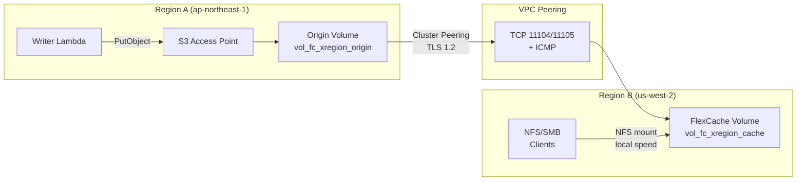

# FlexCache Cross-Region + S3 Access Points Pattern

🌐 **Language / 言語**: [日本語](README.md) | [English](README.en.md) | [한국어](README.ko.md) | [简体中文](README.zh-CN.md) | [繁體中文](README.zh-TW.md) | [Français](README.fr.md) | [Deutsch](README.de.md) | [Español](README.es.md)

## Présentation

Un modèle de distribution de données inter-régions qui fournit les données collectées via S3 Access Points dans la Région A aux clients NFS/SMB de la Région B via FlexCache avec une propagation inférieure à 3 secondes.

Les données écrites via S3 AP → Origin Volume (Région A) deviennent lisibles depuis le FlexCache Volume de la Région B à la vitesse du cache local, en traversant l'infrastructure VPC Peering + Cluster/SVM Peering.

## Architecture



## Composants clés

| Composant | Région | Description |
|-----------|:------:|-------------|
| Origin Volume + S3 AP | A | Point d'ingestion des données. Interface d'écriture S3 API |
| VPC Peering | A ↔ B | Connectivité réseau pour la communication ONTAP Intercluster |
| Cluster Peering | A ↔ B | Relation de confiance entre clusters ONTAP (chiffrement TLS 1.2) |
| SVM Peering | A ↔ B | Permission d'application FlexCache entre SVM |
| FlexCache Volume | B | Met en cache les données actives de l'Origin. Lectures à vitesse locale |

## Prérequis

- 2 clusters FSx for ONTAP (Région A et Région B)
- VPC Peering établi (TCP 11104, 11105, ICMP autorisés)
- Identifiants fsxadmin de chaque cluster stockés dans Secrets Manager
- ONTAP 9.12.1 ou ultérieur (support des buckets S3 NAS sur l'Origin)
- AWS CLI v2

## Déploiement

```bash
# 1. Déployer la pile CloudFormation (crée l'Origin Volume dans la Région A)
aws cloudformation deploy \
  --template-file template.yaml \
  --stack-name fsxn-fc-xregion \
  --parameter-overrides file://params.example.json \
  --capabilities CAPABILITY_NAMED_IAM

# 2. Créer S3 AP → Cluster Peering → SVM Peering → FlexCache
#    (voir PostDeployInstructions dans les sorties de la pile)
```

## Vérification

```bash
# Écriture via S3 AP (Région A)
aws s3api put-object \
  --bucket <s3-ap-alias> \
  --key test/cross-region.txt \
  --body /tmp/cross-region.txt

# Lecture via FlexCache (NFS) dans la Région B — propagation <3 secondes
cat /mnt/fc_xregion_cache/test/cross-region.txt
```

## Caractéristiques de performance (validées)

| Métrique | Valeur | Conditions |
|--------|:-----:|------------|
| Écriture S3 AP → FlexCache NFS lisible | <3 sec | ap-northeast-1 → us-west-2, 120ms RTT |
| Latence cache-hit FlexCache | <1 ms | Équivalent au stockage local |
| Taille minimale FlexCache | 50 GB | Contrainte FSx for ONTAP |
| RTT max recommandé (mode write-back) | ≤200 ms | Latence d'acquisition/révocation XLD |

## Contraintes techniques

| Contrainte | Détails |
|-----------|---------|
| S3 AP sur FlexCache Cache Volume | Nécessite ONTAP 9.18.1+. Sur 9.17.1 et antérieur, accès NFS/SMB uniquement |
| FlexCache write-back (RTT) | Write-around recommandé pour RTT >200ms. Le traitement XLD en write-back dégrade les performances |
| Ordre de suppression VPC Peering | Supprimer VPC Peering avant la fin de la suppression SVM Peer provoque des enregistrements orphelins (SM-VAL-011) |
| SnapMirror Synchronous | Non supporté pour les volumes avec des buckets S3 NAS |
| SVM-DR | Non supporté sur les SVM contenant des buckets S3 NAS |

## Nettoyage (Ordre critique — SM-VAL-011)

```bash
# ⚠️ Suivez exactement cet ordre. Supprimer VPC Peering en premier provoque un état irrécupérable.

# 1. Supprimer le FlexCache Volume (API REST ONTAP sur le cluster Région B)
# DELETE /api/storage/flexcache/flexcaches/<uuid>

# 2. Supprimer les SVM Peers (LES DEUX clusters) — vérifier num_records: 0 des DEUX côtés
# DELETE /api/svm/peers/<uuid> (Region A)
# DELETE /api/svm/peers/<uuid> (Region B)
# POLL: GET /api/svm/peers until num_records: 0 on BOTH

# 3. Supprimer les Cluster Peers (les deux clusters)
# DELETE /api/cluster/peers/<uuid>

# 4. Supprimer VPC Peering (sûr uniquement après confirmation de l'étape 2)
# aws ec2 delete-vpc-peering-connection --vpc-peering-connection-id <pcx-id>

# 5. Détacher et supprimer le S3 Access Point
aws fsx detach-and-delete-s3-access-point --s3-access-point-arn <arn>

# 6. Supprimer la pile CloudFormation
aws cloudformation delete-stack --stack-name fsxn-fc-xregion
```

## Références

- [NetApp Docs: FlexCache supported features](https://docs.netapp.com/us-en/ontap/flexcache/supported-unsupported-features-concept.html)
- [NetApp Docs: FlexCache duality FAQ (9.18.1 Cache S3)](https://docs.netapp.com/us-en/ontap/flexcache/flexcache-duality-faq.html)
- [NetApp Docs: S3 multiprotocol](https://docs.netapp.com/us-en/ontap/s3-multiprotocol/index.html)
- [AWS Docs: FSx for ONTAP FlexCache](https://docs.aws.amazon.com/fsx/latest/ONTAPGuide/using-flexcache.html)
- [AWS Docs: FSx for ONTAP S3 Access Points](https://docs.aws.amazon.com/fsx/latest/ONTAPGuide/accessing-data-via-s3-access-points.html)
- [AWS Docs: VPC Peering](https://docs.aws.amazon.com/vpc/latest/peering/what-is-vpc-peering.html)
