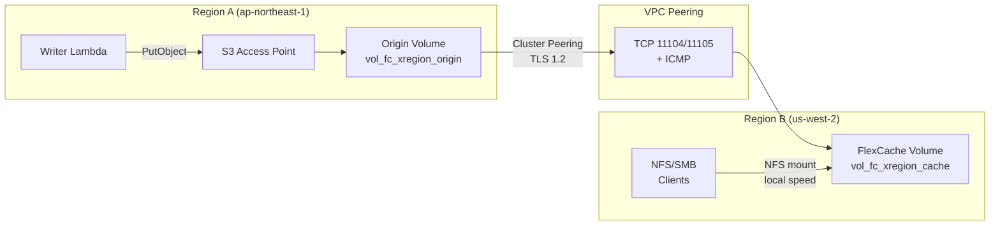

# FlexCache Cross-Region + S3 Access Points 패턴

🌐 **Language / 言語**: [日本語](README.md) | [English](README.en.md) | [한국어](README.ko.md) | [简体中文](README.zh-CN.md) | [繁體中文](README.zh-TW.md) | [Français](README.fr.md) | [Deutsch](README.de.md) | [Español](README.es.md)

## 개요

리전 A에서 S3 Access Points를 통해 수집된 데이터를 FlexCache를 통해 리전 B의 NFS/SMB 클라이언트에 3초 미만의 전파 속도로 배포하는 크로스 리전 데이터 분산 패턴입니다.

S3 AP를 통해 기록된 데이터 → Origin Volume(리전 A)은 VPC Peering + Cluster/SVM Peering 인프라를 경유하여 리전 B의 FlexCache Volume에서 로컬 캐시 속도로 읽을 수 있습니다.

## 아키텍처



## 주요 구성 요소

| 구성 요소 | 리전 | 설명 |
|-----------|:------:|-------------|
| Origin Volume + S3 AP | A | 데이터 수집 지점. S3 API 쓰기 인터페이스 |
| VPC Peering | A ↔ B | ONTAP Intercluster 통신을 위한 네트워크 연결 |
| Cluster Peering | A ↔ B | ONTAP 클러스터 신뢰 관계 (TLS 1.2 암호화) |
| SVM Peering | A ↔ B | SVM 간 FlexCache 애플리케이션 권한 |
| FlexCache Volume | B | Origin의 핫 데이터를 캐시. 로컬 속도 읽기 |

## 전제 조건

- 2개의 FSx for ONTAP 클러스터 (리전 A 및 리전 B)
- VPC Peering 설정 완료 (TCP 11104, 11105, ICMP 허용)
- 각 클러스터의 fsxadmin 자격 증명이 Secrets Manager에 저장
- ONTAP 9.12.1 이상 (Origin에서 S3 NAS 버킷 지원)
- AWS CLI v2

## 배포

```bash
# 1. CloudFormation 스택 배포 (리전 A에 Origin Volume 생성)
aws cloudformation deploy \
  --template-file template.yaml \
  --stack-name fsxn-fc-xregion \
  --parameter-overrides file://params.example.json \
  --capabilities CAPABILITY_NAMED_IAM

# 2. S3 AP → Cluster Peering → SVM Peering → FlexCache 생성
#    (스택 출력의 PostDeployInstructions 참조)
```

## 검증

```bash
# S3 AP를 통해 쓰기 (리전 A)
aws s3api put-object \
  --bucket <s3-ap-alias> \
  --key test/cross-region.txt \
  --body /tmp/cross-region.txt

# 리전 B에서 FlexCache (NFS)를 통해 읽기 — 전파 시간 3초 미만
cat /mnt/fc_xregion_cache/test/cross-region.txt
```

## 성능 특성 (검증 완료)

| 지표 | 값 | 조건 |
|--------|:-----:|------------|
| S3 AP 쓰기 → FlexCache NFS 읽기 가능 | <3 sec | ap-northeast-1 → us-west-2, 120ms RTT |
| FlexCache 캐시 히트 지연 시간 | <1 ms | 로컬 스토리지와 동등 |
| FlexCache 최소 크기 | 50 GB | FSx for ONTAP 제약 |
| 권장 최대 RTT (write-back 모드) | ≤200 ms | XLD 취득/해제 지연 시간 |

## 기술적 제약 사항

| 제약 사항 | 세부 정보 |
|-----------|---------|
| FlexCache Cache Volume의 S3 AP | ONTAP 9.18.1+ 필요. 9.17.1 이하에서는 NFS/SMB 액세스만 가능 |
| FlexCache write-back (RTT) | RTT >200ms인 경우 write-around 권장. Write-back XLD 처리 시 성능 저하 |
| VPC Peering 삭제 순서 | SVM Peer 삭제 완료 전에 VPC Peering을 삭제하면 고아 레코드 발생 (SM-VAL-011) |
| SnapMirror Synchronous | S3 NAS 버킷이 있는 볼륨에서는 지원되지 않음 |
| SVM-DR | S3 NAS 버킷을 포함하는 SVM에서는 지원되지 않음 |

## 정리 (순서 중요 — SM-VAL-011)

```bash
# ⚠️ 이 정확한 순서를 따르십시오. VPC Peering을 먼저 삭제하면 복구 불가능한 상태가 됩니다.

# 1. FlexCache Volume 삭제 (리전 B 클러스터의 ONTAP REST API)
# DELETE /api/storage/flexcache/flexcaches/<uuid>

# 2. SVM Peers 삭제 (양쪽 클러스터) — 양쪽에서 num_records: 0 확인
# DELETE /api/svm/peers/<uuid> (Region A)
# DELETE /api/svm/peers/<uuid> (Region B)
# POLL: GET /api/svm/peers until num_records: 0 on BOTH

# 3. Cluster Peers 삭제 (양쪽 클러스터)
# DELETE /api/cluster/peers/<uuid>

# 4. VPC Peering 삭제 (2단계가 확인된 후에만 안전)
# aws ec2 delete-vpc-peering-connection --vpc-peering-connection-id <pcx-id>

# 5. S3 Access Point 분리 및 삭제
aws fsx detach-and-delete-s3-access-point --s3-access-point-arn <arn>

# 6. CloudFormation 스택 삭제
aws cloudformation delete-stack --stack-name fsxn-fc-xregion
```

## 참고 자료

- [NetApp Docs: FlexCache supported features](https://docs.netapp.com/us-en/ontap/flexcache/supported-unsupported-features-concept.html)
- [NetApp Docs: FlexCache duality FAQ (9.18.1 Cache S3)](https://docs.netapp.com/us-en/ontap/flexcache/flexcache-duality-faq.html)
- [NetApp Docs: S3 multiprotocol](https://docs.netapp.com/us-en/ontap/s3-multiprotocol/index.html)
- [AWS Docs: FSx for ONTAP FlexCache](https://docs.aws.amazon.com/fsx/latest/ONTAPGuide/using-flexcache.html)
- [AWS Docs: FSx for ONTAP S3 Access Points](https://docs.aws.amazon.com/fsx/latest/ONTAPGuide/accessing-data-via-s3-access-points.html)
- [AWS Docs: VPC Peering](https://docs.aws.amazon.com/vpc/latest/peering/what-is-vpc-peering.html)
