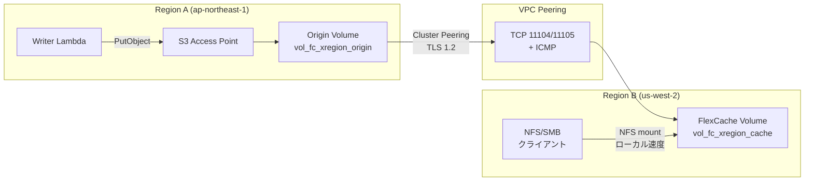

# FlexCache Cross-Region + S3 Access Points パターン

🌐 **Language / 言語**: [日本語](README.md) | [English](README.en.md) | [한국어](README.ko.md) | [简体中文](README.zh-CN.md) | [繁體中文](README.zh-TW.md) | [Français](README.fr.md) | [Deutsch](README.de.md) | [Español](README.es.md)

## 概要

リージョン A の FSx for ONTAP に S3 AP で収集したデータを、リージョン B の FlexCache Volume 経由で低レイテンシ NFS/SMB アクセスを提供するクロスリージョン配信パターン。

S3 AP → Origin Volume（リージョン A）に書き込まれたデータが、VPC Peering + Cluster/SVM Peering を経由して、リージョン B の FlexCache で 3 秒以内にキャッシュ読み取り可能になる。

## アーキテクチャ



## 主要コンポーネント

| コンポーネント | リージョン | 説明 |
|--------------|:--------:|------|
| Origin Volume + S3 AP | A | データ収集ポイント。S3 API 経由で書き込み |
| VPC Peering | A ↔ B | ONTAP Intercluster 通信用ネットワーク接続 |
| Cluster Peering | A ↔ B | ONTAP クラスタ間信頼関係（TLS 1.2 暗号化） |
| SVM Peering | A ↔ B | SVM 間の FlexCache アプリケーション許可 |
| FlexCache Volume | B | Origin のホットデータをキャッシュ。ローカル読み取り速度 |

## 前提条件

> 📐 **設計ガイド**: S3 AP のディレクトリ設計、性能特性、PoC チェックリストは [設計考慮事項](../../docs/design-considerations.md) を参照。

- FSx for ONTAP × 2 クラスタ（リージョン A / リージョン B）
- VPC Peering 確立済み（TCP 11104, 11105, ICMP 許可）
- 各クラスタの fsxadmin 認証情報が Secrets Manager に格納済み
- ONTAP 9.12.1 以上（Origin の S3 NAS bucket サポート）
- AWS CLI v2

## デプロイ

```bash
# 1. CloudFormation スタックデプロイ（Region A に Origin Volume 作成）
aws cloudformation deploy \
  --template-file template.yaml \
  --stack-name fsxn-fc-xregion \
  --parameter-overrides file://params.example.json \
  --capabilities CAPABILITY_NAMED_IAM

# 2. S3 AP 作成 → Cluster Peering → SVM Peering → FlexCache 作成
#    （スタック出力 PostDeployInstructions 参照）
```

## 検証

```bash
# S3 AP 経由で書き込み（Region A）
aws s3api put-object \
  --bucket <s3-ap-alias> \
  --key test/cross-region.txt \
  --body /tmp/cross-region.txt

# FlexCache (NFS) 経由で読み取り確認（Region B）— <3 秒で伝搬
cat /mnt/fc_xregion_cache/test/cross-region.txt
```

## 性能特性（検証データ）

| メトリクス | 値 | 条件 |
|-----------|:---:|------|
| S3 AP 書き込み → FlexCache NFS 読み取り可能 | <3 秒 | ap-northeast-1 → us-west-2, 120ms RTT |
| FlexCache キャッシュヒット時レイテンシ | <1 ms | ローカルストレージ相当 |
| FlexCache 最小サイズ | 50 GB | FSx for ONTAP 制約 |
| 推奨最大 RTT（write-back モード） | ≤200 ms | XLD 取得/失効のレイテンシ制約 |

## 技術的制約

| 制約 | 詳細 |
|------|------|
| FlexCache Cache への S3 AP | ONTAP 9.18.1 以上が必要。9.17.1 以下では NFS/SMB アクセスのみ |
| FlexCache write-back (RTT) | RTT >200ms では write-around を推奨。write-back の XLD 処理がパフォーマンス低下 |
| VPC Peering 削除順序 | SVM Peer 削除完了前に VPC Peering を削除するとオーファン化（SM-VAL-011）|
| SnapMirror Synchronous | S3 NAS bucket ボリュームでは非サポート |
| SVM-DR | S3 NAS bucket を含む SVM では使用不可 |

## クリーンアップ（順序厳守 — SM-VAL-011）

```bash
# ⚠️ 以下の順序を必ず守ること。VPC Peering を先に削除するとリカバリ不能になる

# 1. FlexCache Volume 削除（ONTAP REST API on Region B cluster）
# DELETE /api/storage/flexcache/flexcaches/<uuid>

# 2. SVM Peers 削除（両クラスタ） — 必ず両側で num_records: 0 を確認
# DELETE /api/svm/peers/<uuid> (Region A)
# DELETE /api/svm/peers/<uuid> (Region B)
# POLL: GET /api/svm/peers until num_records: 0 on BOTH

# 3. Cluster Peers 削除（両クラスタ）
# DELETE /api/cluster/peers/<uuid>

# 4. VPC Peering 削除（ここで初めて安全）
# aws ec2 delete-vpc-peering-connection --vpc-peering-connection-id <pcx-id>

# 5. S3 AP デタッチ・削除
aws fsx detach-and-delete-s3-access-point --s3-access-point-arn <arn>

# 6. CloudFormation スタック削除
aws cloudformation delete-stack --stack-name fsxn-fc-xregion
```

## 参考資料

- [NetApp Docs: FlexCache supported features](https://docs.netapp.com/us-en/ontap/flexcache/supported-unsupported-features-concept.html)
- [NetApp Docs: FlexCache duality FAQ (9.18.1 Cache S3)](https://docs.netapp.com/us-en/ontap/flexcache/flexcache-duality-faq.html)
- [NetApp Docs: S3 multiprotocol](https://docs.netapp.com/us-en/ontap/s3-multiprotocol/index.html)
- [AWS Docs: FSx for ONTAP FlexCache](https://docs.aws.amazon.com/fsx/latest/ONTAPGuide/using-flexcache.html)
- [AWS Docs: FSx for ONTAP S3 Access Points](https://docs.aws.amazon.com/fsx/latest/ONTAPGuide/accessing-data-via-s3-access-points.html)
- [AWS Docs: VPC Peering](https://docs.aws.amazon.com/vpc/latest/peering/what-is-vpc-peering.html)
