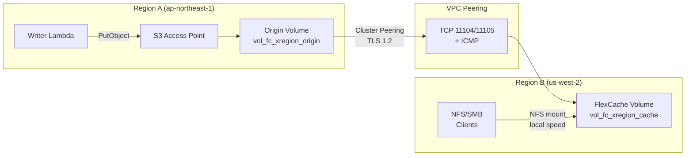

# FlexCache Cross-Region + S3 Access Points 模式

🌐 **Language / 言語**: [日本語](README.md) | [English](README.en.md) | [한국어](README.ko.md) | [简体中文](README.zh-CN.md) | [繁體中文](README.zh-TW.md) | [Français](README.fr.md) | [Deutsch](README.de.md) | [Español](README.es.md)

## 概述

一种跨区域数据分发模式，通过 FlexCache 将区域 A 中通过 S3 Access Points 收集的数据以低于 3 秒的传播速度分发到区域 B 的 NFS/SMB 客户端。

通过 S3 AP 写入的数据 → Origin Volume（区域 A）可通过 VPC Peering + Cluster/SVM Peering 基础设施，在区域 B 的 FlexCache Volume 中以本地缓存速度读取。

## 架构



## 关键组件

| 组件 | 区域 | 说明 |
|-----------|:------:|-------------|
| Origin Volume + S3 AP | A | 数据摄取点。S3 API 写入接口 |
| VPC Peering | A ↔ B | ONTAP Intercluster 通信的网络连接 |
| Cluster Peering | A ↔ B | ONTAP 集群信任关系（TLS 1.2 加密） |
| SVM Peering | A ↔ B | SVM 之间的 FlexCache 应用程序权限 |
| FlexCache Volume | B | 缓存 Origin 的热数据。本地速度读取 |

## 前提条件

- 2 个 FSx for ONTAP 集群（区域 A 和区域 B）
- 已建立 VPC Peering（允许 TCP 11104、11105、ICMP）
- 每个集群的 fsxadmin 凭证已存储在 Secrets Manager 中
- ONTAP 9.12.1 或更高版本（Origin 上支持 S3 NAS 存储桶）
- AWS CLI v2

## 部署

```bash
# 1. 部署 CloudFormation 堆栈（在区域 A 中创建 Origin Volume）
aws cloudformation deploy \
  --template-file template.yaml \
  --stack-name fsxn-fc-xregion \
  --parameter-overrides file://params.example.json \
  --capabilities CAPABILITY_NAMED_IAM

# 2. 创建 S3 AP → Cluster Peering → SVM Peering → FlexCache
#    （参见堆栈输出中的 PostDeployInstructions）
```

## 验证

```bash
# 通过 S3 AP 写入（区域 A）
aws s3api put-object \
  --bucket <s3-ap-alias> \
  --key test/cross-region.txt \
  --body /tmp/cross-region.txt

# 在区域 B 通过 FlexCache (NFS) 读取 — 传播时间 <3 秒
cat /mnt/fc_xregion_cache/test/cross-region.txt
```

## 性能特性（已验证）

| 指标 | 值 | 条件 |
|--------|:-----:|------------|
| S3 AP 写入 → FlexCache NFS 可读 | <3 sec | ap-northeast-1 → us-west-2, 120ms RTT |
| FlexCache 缓存命中延迟 | <1 ms | 等同于本地存储 |
| FlexCache 最小容量 | 50 GB | FSx for ONTAP 限制 |
| 推荐最大 RTT（write-back 模式） | ≤200 ms | XLD 获取/释放延迟 |

## 技术限制

| 限制 | 详细信息 |
|-----------|---------|
| FlexCache Cache Volume 上的 S3 AP | 需要 ONTAP 9.18.1+。9.17.1 及更早版本仅支持 NFS/SMB 访问 |
| FlexCache write-back (RTT) | RTT >200ms 时建议使用 write-around。Write-back XLD 处理会降低性能 |
| VPC Peering 删除顺序 | 在 SVM Peer 删除完成前删除 VPC Peering 会导致孤立记录 (SM-VAL-011) |
| SnapMirror Synchronous | 具有 S3 NAS 存储桶的卷不支持 |
| SVM-DR | 包含 S3 NAS 存储桶的 SVM 不支持 |

## 清理（顺序至关重要 — SM-VAL-011）

```bash
# ⚠️ 请严格按照此顺序执行。先删除 VPC Peering 会导致不可恢复的状态。

# 1. 删除 FlexCache Volume（区域 B 集群上的 ONTAP REST API）
# DELETE /api/storage/flexcache/flexcaches/<uuid>

# 2. 删除 SVM Peers（两个集群） — 验证两侧 num_records: 0
# DELETE /api/svm/peers/<uuid> (Region A)
# DELETE /api/svm/peers/<uuid> (Region B)
# POLL: GET /api/svm/peers until num_records: 0 on BOTH

# 3. 删除 Cluster Peers（两个集群）
# DELETE /api/cluster/peers/<uuid>

# 4. 删除 VPC Peering（仅在第 2 步确认后安全）
# aws ec2 delete-vpc-peering-connection --vpc-peering-connection-id <pcx-id>

# 5. 分离并删除 S3 Access Point
aws fsx detach-and-delete-s3-access-point --s3-access-point-arn <arn>

# 6. 删除 CloudFormation 堆栈
aws cloudformation delete-stack --stack-name fsxn-fc-xregion
```

## 参考资料

- [NetApp Docs: FlexCache supported features](https://docs.netapp.com/us-en/ontap/flexcache/supported-unsupported-features-concept.html)
- [NetApp Docs: FlexCache duality FAQ (9.18.1 Cache S3)](https://docs.netapp.com/us-en/ontap/flexcache/flexcache-duality-faq.html)
- [NetApp Docs: S3 multiprotocol](https://docs.netapp.com/us-en/ontap/s3-multiprotocol/index.html)
- [AWS Docs: FSx for ONTAP FlexCache](https://docs.aws.amazon.com/fsx/latest/ONTAPGuide/using-flexcache.html)
- [AWS Docs: FSx for ONTAP S3 Access Points](https://docs.aws.amazon.com/fsx/latest/ONTAPGuide/accessing-data-via-s3-access-points.html)
- [AWS Docs: VPC Peering](https://docs.aws.amazon.com/vpc/latest/peering/what-is-vpc-peering.html)
