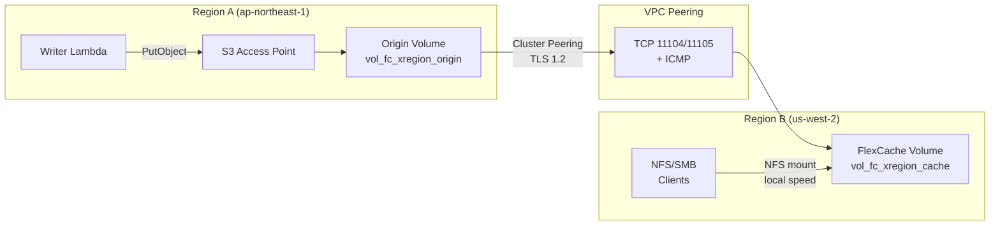

# FlexCache Cross-Region + S3 Access Points 模式

🌐 **Language / 言語**: [日本語](README.md) | [English](README.en.md) | [한국어](README.ko.md) | [简体中文](README.zh-CN.md) | [繁體中文](README.zh-TW.md) | [Français](README.fr.md) | [Deutsch](README.de.md) | [Español](README.es.md)

## 概述

一種跨區域資料分發模式，透過 FlexCache 將區域 A 中經由 S3 Access Points 收集的資料以低於 3 秒的傳播速度分發到區域 B 的 NFS/SMB 用戶端。

透過 S3 AP 寫入的資料 → Origin Volume（區域 A）可透過 VPC Peering + Cluster/SVM Peering 基礎設施，在區域 B 的 FlexCache Volume 中以本機快取速度讀取。

## 架構



## 關鍵元件

| 元件 | 區域 | 說明 |
|-----------|:------:|-------------|
| Origin Volume + S3 AP | A | 資料擷取點。S3 API 寫入介面 |
| VPC Peering | A ↔ B | ONTAP Intercluster 通訊的網路連線 |
| Cluster Peering | A ↔ B | ONTAP 叢集信任關係（TLS 1.2 加密） |
| SVM Peering | A ↔ B | SVM 之間的 FlexCache 應用程式權限 |
| FlexCache Volume | B | 快取 Origin 的熱資料。本機速度讀取 |

## 先決條件

- 2 個 FSx for ONTAP 叢集（區域 A 和區域 B）
- 已建立 VPC Peering（允許 TCP 11104、11105、ICMP）
- 每個叢集的 fsxadmin 認證已儲存在 Secrets Manager 中
- ONTAP 9.12.1 或更高版本（Origin 上支援 S3 NAS 儲存貯體）
- AWS CLI v2

## 部署

```bash
# 1. 部署 CloudFormation 堆疊（在區域 A 中建立 Origin Volume）
aws cloudformation deploy \
  --template-file template.yaml \
  --stack-name fsxn-fc-xregion \
  --parameter-overrides file://params.example.json \
  --capabilities CAPABILITY_NAMED_IAM

# 2. 建立 S3 AP → Cluster Peering → SVM Peering → FlexCache
#    （參見堆疊輸出中的 PostDeployInstructions）
```

## 驗證

```bash
# 透過 S3 AP 寫入（區域 A）
aws s3api put-object \
  --bucket <s3-ap-alias> \
  --key test/cross-region.txt \
  --body /tmp/cross-region.txt

# 在區域 B 透過 FlexCache (NFS) 讀取 — 傳播時間 <3 秒
cat /mnt/fc_xregion_cache/test/cross-region.txt
```

## 效能特性（已驗證）

| 指標 | 值 | 條件 |
|--------|:-----:|------------|
| S3 AP 寫入 → FlexCache NFS 可讀 | <3 sec | ap-northeast-1 → us-west-2, 120ms RTT |
| FlexCache 快取命中延遲 | <1 ms | 等同於本機儲存 |
| FlexCache 最小容量 | 50 GB | FSx for ONTAP 限制 |
| 建議最大 RTT（write-back 模式） | ≤200 ms | XLD 取得/釋放延遲 |

## 技術限制

| 限制 | 詳細資訊 |
|-----------|---------|
| FlexCache Cache Volume 上的 S3 AP | 需要 ONTAP 9.18.1+。9.17.1 及更早版本僅支援 NFS/SMB 存取 |
| FlexCache write-back (RTT) | RTT >200ms 時建議使用 write-around。Write-back XLD 處理會降低效能 |
| VPC Peering 刪除順序 | 在 SVM Peer 刪除完成前刪除 VPC Peering 會導致孤立記錄 (SM-VAL-011) |
| SnapMirror Synchronous | 具有 S3 NAS 儲存貯體的磁碟區不支援 |
| SVM-DR | 包含 S3 NAS 儲存貯體的 SVM 不支援 |

## 清理（順序至關重要 — SM-VAL-011）

```bash
# ⚠️ 請嚴格按照此順序執行。先刪除 VPC Peering 會導致不可復原的狀態。

# 1. 刪除 FlexCache Volume（區域 B 叢集上的 ONTAP REST API）
# DELETE /api/storage/flexcache/flexcaches/<uuid>

# 2. 刪除 SVM Peers（兩個叢集） — 驗證兩側 num_records: 0
# DELETE /api/svm/peers/<uuid> (Region A)
# DELETE /api/svm/peers/<uuid> (Region B)
# POLL: GET /api/svm/peers until num_records: 0 on BOTH

# 3. 刪除 Cluster Peers（兩個叢集）
# DELETE /api/cluster/peers/<uuid>

# 4. 刪除 VPC Peering（僅在第 2 步確認後安全）
# aws ec2 delete-vpc-peering-connection --vpc-peering-connection-id <pcx-id>

# 5. 分離並刪除 S3 Access Point
aws fsx detach-and-delete-s3-access-point --s3-access-point-arn <arn>

# 6. 刪除 CloudFormation 堆疊
aws cloudformation delete-stack --stack-name fsxn-fc-xregion
```

## 參考資料

- [NetApp Docs: FlexCache supported features](https://docs.netapp.com/us-en/ontap/flexcache/supported-unsupported-features-concept.html)
- [NetApp Docs: FlexCache duality FAQ (9.18.1 Cache S3)](https://docs.netapp.com/us-en/ontap/flexcache/flexcache-duality-faq.html)
- [NetApp Docs: S3 multiprotocol](https://docs.netapp.com/us-en/ontap/s3-multiprotocol/index.html)
- [AWS Docs: FSx for ONTAP FlexCache](https://docs.aws.amazon.com/fsx/latest/ONTAPGuide/using-flexcache.html)
- [AWS Docs: FSx for ONTAP S3 Access Points](https://docs.aws.amazon.com/fsx/latest/ONTAPGuide/accessing-data-via-s3-access-points.html)
- [AWS Docs: VPC Peering](https://docs.aws.amazon.com/vpc/latest/peering/what-is-vpc-peering.html)
