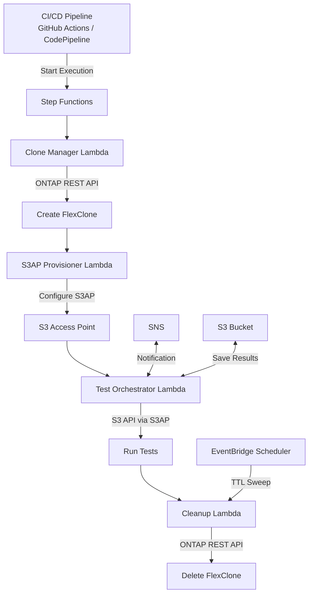

# FC7: DevOps FlexClone + S3AP — Actualización de datos Dev/Test e integración CI/CD

🌐 **Language / Idioma**: [日本語](README.md) | [English](README.en.md) | [한국어](README.ko.md) | [简体中文](README.zh-CN.md) | [繁體中文](README.zh-TW.md) | [Français](README.fr.md) | [Deutsch](README.de.md) | Español

📚 **Docs**: [Arquitectura](docs/architecture.en.md) | [Guía de demostración](docs/demo-guide.en.md)

## Descripción general

Un patrón de automatización que combina ONTAP FlexClone con S3 Access Points para **hacer que copias instantáneas de datos de producción sean accesibles a través de la API S3 serverless**.

Este patrón extiende el flujo de trabajo iniciado por EBS Volume Clones ([Blog de AWS](https://aws.amazon.com/blogs/storage/accelerate-development-workflows-with-amazon-ebs-volume-clones/)) — "copia instantánea → uso para dev/test → eliminación automática" — utilizando FSx for ONTAP FlexClone + S3 Access Points para mayor eficiencia.

### Comparación con EBS Volume Clones

| Característica | EBS Volume Clones | FlexClone + S3AP (este UC) |
|----------------|-------------------|--------------------------|
| Velocidad de copia | Instantánea (segundos) | Instantánea (solo metadatos) |
| Eficiencia de almacenamiento | Copia completa (consume capacidad) | **Eficiente en espacio (solo bloques modificados)** |
| Método de acceso | Requiere adjuntar EC2 | **API S3 (serverless)** |
| Restricción de AZ | Solo misma AZ | **Accesible desde Lambda externo al VPC** |
| Limpieza automática | Manual/personalizado | **Eliminación automática basada en TTL** |
| Integración CI/CD | Implementación personalizada | **Step Functions nativo** |

## Arquitectura



## Casos de uso

### 1. Actualización de datos Dev/Test (diaria)

Creación de un FlexClone diario del volumen de producción y provisión del alias S3AP al equipo de desarrollo. El clon del día anterior se elimina automáticamente antes de crear el siguiente.

```bash
# Ejemplo de activación manual
aws stepfunctions start-execution \
  --state-machine-arn arn:aws:states:ap-northeast-1:ACCOUNT:stateMachine:DevTestRefresh \
  --input '{"source_volume": "production_data", "ttl_hours": 24, "requester": "dev-team"}'
```

### 2. Datos de prueba para pipeline CI/CD (bajo demanda)

Se activa automáticamente con merge de PR o builds nocturnos. Limpieza inmediata tras completar las pruebas.

```yaml
# Ejemplo de integración con GitHub Actions
- name: Provision test data
  run: |
    EXECUTION_ARN=$(aws stepfunctions start-execution \
      --state-machine-arn ${{ secrets.STATE_MACHINE_ARN }} \
      --input '{"source_volume": "testdata_master", "test_suite": "integration"}' \
      --query 'executionArn' --output text)
    # Wait for completion
    aws stepfunctions describe-execution --execution-arn $EXECUTION_ARN --query 'status'
```

### 3. Pruebas DR (semanal/mensual)

Validación de procedimientos DR contra un clon de datos de producción. Sin impacto en producción.

## Despliegue

```bash
# Requisito: se necesita AWS SAM CLI. «sam build» empaqueta automáticamente el código y la capa compartida.
sam build

sam deploy \
  --stack-name devops-flexclone-cicd \
  --parameter-overrides \
    OntapManagementIp=10.0.1.100 \
    OntapSecretName=fsxn/ontap-credentials \
    SvmName=svm1 \
    SourceVolumeName=production_data \
    SimulationMode=true \
  --capabilities CAPABILITY_NAMED_IAM
```

## Métricas de éxito

| Resultado | Métrica | Medición | Revisión humana |
|-----------|---------|----------|-----------------|
| Aprovisionamiento más rápido | Tiempo de creación del clon | < 60 segundos (solo metadatos) | ✅ |
| Eficiencia de almacenamiento | Consumo de capacidad del clon | < 5 % del volumen origen | ✅ |
| Aceleración del pipeline CI/CD | Tiempo de preparación de datos de prueba | Reducción de 90 %+ vs snapshots | ✅ |
| Tasa de limpieza automática | Tasa de eliminación de clones expirados por TTL | 100 % | — |
| Fiabilidad de pruebas | Tasa de éxito de pruebas con datos equivalentes a producción | > 95 % | ✅ |

## Restricciones

- FlexClone se crea dentro del mismo aggregate (IOPS compartidas con el padre)
- Las escrituras vía S3AP están limitadas a 5 GB máximo (usar NFS para escrituras de datos de prueba grandes)
- Los requisitos de ubicación VPC de Lambda dependen de la configuración NetworkOrigin (ver docs de steering)
- La división de FlexClone lo convierte en un volumen independiente (pérdida de eficiencia de espacio)
