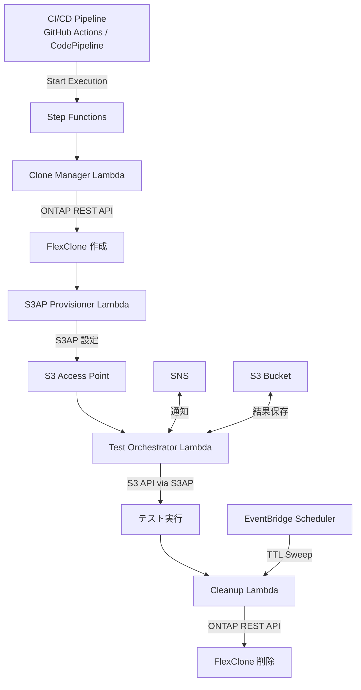

# FC7: DevOps FlexClone + S3AP — Dev/Test データリフレッシュ & CI/CD パイプライン統合

🌐 **Language / 言語**: 日本語 | [English](README.en.md) | [한국어](README.ko.md) | [简体中文](README.zh-CN.md) | [繁體中文](README.zh-TW.md) | [Français](README.fr.md) | [Deutsch](README.de.md) | [Español](README.es.md)

📚 **ドキュメント**: [アーキテクチャ図](docs/architecture.md) | [デモガイド](docs/demo-guide.md)

## 概要

ONTAP FlexClone と S3 Access Points を組み合わせ、**本番データの即時コピーをサーバーレスでアクセス可能にする**自動化パターン。

EBS Volume Clones（[AWS Blog](https://aws.amazon.com/blogs/storage/accelerate-development-workflows-with-amazon-ebs-volume-clones/)）が提供する「即時コピー → 開発利用 → 自動削除」のワークフローを、FSx for ONTAP の FlexClone + S3 Access Points でさらに進化させる。

### EBS Volume Clones との比較

| 特性 | EBS Volume Clones | FlexClone + S3AP (本 UC) |
|------|-------------------|--------------------------|
| コピー速度 | 即時（秒単位） | 即時（メタデータのみ） |
| ストレージ効率 | フルコピー（容量消費） | **スペース効率（変更ブロックのみ）** |
| アクセス方法 | EC2 アタッチ必須 | **S3 API（サーバーレス）** |
| AZ 制約 | same-AZ のみ | **VPC 外 Lambda からもアクセス可能** |
| 自動クリーンアップ | 手動/カスタム | **TTL ベース自動削除** |
| CI/CD 統合 | カスタム実装 | **Step Functions ネイティブ** |

## アーキテクチャ



## ユースケース

### 1. Dev/Test データリフレッシュ（日次）

本番ボリュームの FlexClone を毎日作成し、開発チームに S3AP alias を提供。翌日のクローン作成前に前日分を自動削除。

```bash
# 手動トリガー例
aws stepfunctions start-execution \
  --state-machine-arn arn:aws:states:ap-northeast-1:ACCOUNT:stateMachine:DevTestRefresh \
  --input '{"source_volume": "production_data", "ttl_hours": 24, "requester": "dev-team"}'
```

### 2. CI/CD パイプラインテストデータ（オンデマンド）

PR マージや nightly build 時に自動トリガー。テスト完了後に即座にクリーンアップ。

```yaml
# GitHub Actions 統合例
- name: Provision test data
  run: |
    EXECUTION_ARN=$(aws stepfunctions start-execution \
      --state-machine-arn ${{ secrets.STATE_MACHINE_ARN }} \
      --input '{"source_volume": "testdata_master", "test_suite": "integration"}' \
      --query 'executionArn' --output text)
    # Wait for completion
    aws stepfunctions describe-execution --execution-arn $EXECUTION_ARN --query 'status'
```

### 3. DR テスト（週次/月次）

本番データのクローンで DR 手順を検証。本番に影響なし。

## デプロイ

```bash
# 前提: AWS SAM CLI が必要です。sam build がコードと共有レイヤーを自動でパッケージングします。
sam build

sam deploy \
  --stack-name devops-flexclone-cicd \
  --parameter-overrides \
    OntapManagementIp=10.0.1.100 \
    OntapSecretName=fsxn/ontap-credentials \
    SvmName=svm1 \
    SourceVolumeName=production_data \
    SimulationMode=true \
  --capabilities CAPABILITY_NAMED_IAM
```

## 成功指標

| Outcome | Metric | Measurement | Human Review |
|---------|--------|-------------|--------------|
| データプロビジョニング時間短縮 | Clone 作成完了時間 | < 60 秒（メタデータのみ） | ✅ |
| ストレージ効率 | Clone 容量消費 | < 5% of source volume | ✅ |
| CI/CD パイプライン高速化 | テストデータ準備時間 | Snapshot 比 90%+ 短縮 | ✅ |
| 自動クリーンアップ率 | TTL 超過クローン削除率 | 100% | — |
| テスト信頼性 | 本番同等データでのテスト成功率 | > 95% | ✅ |

## 制約事項

- FlexClone は同一アグリゲート内で作成される（IOPS は親と共有）
- S3AP 経由の書き込みは最大 5 GB（テストデータの書き込みが必要な場合は NFS 経由）
- NetworkOrigin 設定により Lambda の VPC 配置要件が変わる（詳細は steering 参照）
- FlexClone split を実行すると独立ボリュームになる（スペース効率を失う）
