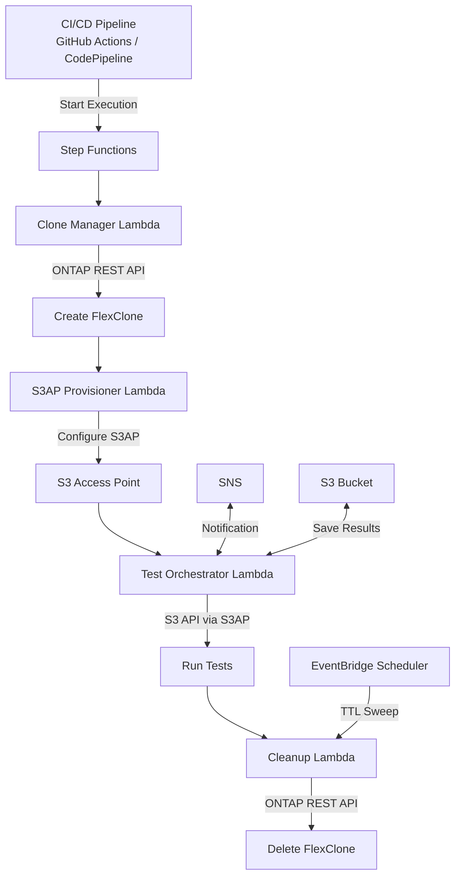

# FC7: DevOps FlexClone + S3AP — 开发/测试数据刷新与 CI/CD 管道集成

🌐 **Language / 语言**: [日本語](README.md) | [English](README.en.md) | [한국어](README.ko.md) | 简体中文 | [繁體中文](README.zh-TW.md) | [Français](README.fr.md) | [Deutsch](README.de.md) | [Español](README.es.md)

📚 **文档**: [架构](docs/architecture.en.md) | [演示指南](docs/demo-guide.en.md)

## 概述

结合 ONTAP FlexClone 与 S3 Access Points 的自动化模式，**使生产数据的即时副本可通过无服务器 S3 API 访问**。

该模式扩展了 EBS Volume Clones（[AWS 博客](https://aws.amazon.com/blogs/storage/accelerate-development-workflows-with-amazon-ebs-volume-clones/)）所开创的"即时复制 → 用于开发/测试 → 自动删除"工作流，通过 FSx for ONTAP FlexClone + S3 Access Points 实现更高效率。

### 与 EBS Volume Clones 的比较

| 特性 | EBS Volume Clones | FlexClone + S3AP（本 UC）|
|------|-------------------|--------------------------|
| 复制速度 | 即时（秒级）| 即时（仅元数据）|
| 存储效率 | 完整复制（消耗容量）| **空间高效（仅变更块）** |
| 访问方式 | 需要挂载 EC2 | **S3 API（无服务器）** |
| AZ 限制 | 仅同一 AZ | **可从 VPC 外部 Lambda 访问** |
| 自动清理 | 手动/自定义 | **基于 TTL 自动删除** |
| CI/CD 集成 | 自定义实现 | **Step Functions 原生** |

## 架构



## 使用场景

### 1. 开发/测试数据刷新（每日）

创建生产卷的每日 FlexClone 并向开发团队提供 S3AP 别名。前一天的克隆在创建下一个之前自动删除。

```bash
# 手动触发示例
aws stepfunctions start-execution \
  --state-machine-arn arn:aws:states:ap-northeast-1:ACCOUNT:stateMachine:DevTestRefresh \
  --input '{"source_volume": "production_data", "ttl_hours": 24, "requester": "dev-team"}'
```

### 2. CI/CD 管道测试数据（按需）

PR 合并或夜间构建时自动触发。测试完成后立即清理。

```yaml
# GitHub Actions 集成示例
- name: Provision test data
  run: |
    EXECUTION_ARN=$(aws stepfunctions start-execution \
      --state-machine-arn ${{ secrets.STATE_MACHINE_ARN }} \
      --input '{"source_volume": "testdata_master", "test_suite": "integration"}' \
      --query 'executionArn' --output text)
    # Wait for completion
    aws stepfunctions describe-execution --execution-arn $EXECUTION_ARN --query 'status'
```

### 3. DR 测试（每周/每月）

使用生产数据克隆验证 DR 流程。对生产环境零影响。

## 部署

```bash
# 前提条件：需要 AWS SAM CLI。'sam build' 会自动打包代码和共享层。
sam build

sam deploy \
  --stack-name devops-flexclone-cicd \
  --parameter-overrides \
    OntapManagementIp=10.0.1.100 \
    OntapSecretName=fsxn/ontap-credentials \
    SvmName=svm1 \
    SourceVolumeName=production_data \
    SimulationMode=true \
  --capabilities CAPABILITY_NAMED_IAM
```

> **注意**: `template.yaml` 用于 SAM CLI（`sam build` + `sam deploy`）。
> 如需使用原生 `aws cloudformation deploy` 部署，请改用 `template-deploy.yaml`（需要预先打包 Lambda zip 文件并上传到 S3 存储桶）。

## 成功指标

| 成果 | 指标 | 测量 | 人工审核 |
|------|------|------|----------|
| 更快的数据供应 | 克隆创建时间 | < 60 秒（仅元数据）| ✅ |
| 存储效率 | 克隆容量消耗 | < 源卷的 5% | ✅ |
| CI/CD 管道加速 | 测试数据准备时间 | 相比快照减少 90%+ | ✅ |
| 自动清理率 | TTL 过期克隆删除率 | 100% | — |
| 测试可靠性 | 生产等效数据测试成功率 | > 95% | ✅ |

## 约束条件

- FlexClone 在同一 aggregate 内创建（与父卷共享 IOPS）
- 通过 S3AP 写入限制为最大 5 GB（大容量测试数据写入请使用 NFS）
- Lambda VPC 部署要求取决于 NetworkOrigin 设置（参见 steering 文档）
- FlexClone 拆分将转换为独立卷（失去空间效率）
