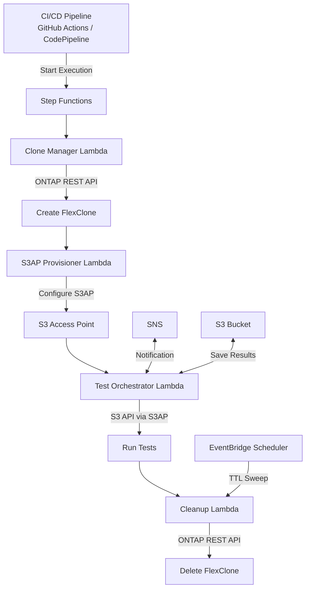

# FC7: DevOps FlexClone + S3AP — 開發/測試資料更新與 CI/CD 管線整合

🌐 **Language / 語言**: [日本語](README.md) | [English](README.en.md) | [한국어](README.ko.md) | [简体中文](README.zh-CN.md) | 繁體中文 | [Français](README.fr.md) | [Deutsch](README.de.md) | [Español](README.es.md)

📚 **文件**: [架構](docs/architecture.en.md) | [示範指南](docs/demo-guide.en.md)

## 概述

結合 ONTAP FlexClone 與 S3 Access Points 的自動化模式，**使生產資料的即時副本可透過無伺服器 S3 API 存取**。

此模式延伸了 EBS Volume Clones（[AWS 部落格](https://aws.amazon.com/blogs/storage/accelerate-development-workflows-with-amazon-ebs-volume-clones/)）所開創的「即時複製 → 用於開發/測試 → 自動刪除」工作流程，透過 FSx for ONTAP FlexClone + S3 Access Points 實現更高效率。

### 與 EBS Volume Clones 的比較

| 功能 | EBS Volume Clones | FlexClone + S3AP（本 UC）|
|------|-------------------|--------------------------|
| 複製速度 | 即時（秒級）| 即時（僅中繼資料）|
| 儲存效率 | 完整複製（消耗容量）| **空間高效（僅變更區塊）** |
| 存取方式 | 需要掛載 EC2 | **S3 API（無伺服器）** |
| AZ 限制 | 僅同一 AZ | **可從 VPC 外部 Lambda 存取** |
| 自動清理 | 手動/自訂 | **基於 TTL 自動刪除** |
| CI/CD 整合 | 自訂實作 | **Step Functions 原生** |

## 架構



## 使用情境

### 1. 開發/測試資料更新（每日）

建立生產卷的每日 FlexClone 並向開發團隊提供 S3AP 別名。前一天的複本在建立下一個之前自動刪除。

```bash
# 手動觸發範例
aws stepfunctions start-execution \
  --state-machine-arn arn:aws:states:ap-northeast-1:ACCOUNT:stateMachine:DevTestRefresh \
  --input '{"source_volume": "production_data", "ttl_hours": 24, "requester": "dev-team"}'
```

### 2. CI/CD 管線測試資料（隨需）

PR 合併或夜間建置時自動觸發。測試完成後立即清理。

```yaml
# GitHub Actions 整合範例
- name: Provision test data
  run: |
    EXECUTION_ARN=$(aws stepfunctions start-execution \
      --state-machine-arn ${{ secrets.STATE_MACHINE_ARN }} \
      --input '{"source_volume": "testdata_master", "test_suite": "integration"}' \
      --query 'executionArn' --output text)
    # Wait for completion
    aws stepfunctions describe-execution --execution-arn $EXECUTION_ARN --query 'status'
```

### 3. DR 測試（每週/每月）

使用生產資料複本驗證 DR 程序。對生產環境零影響。

## 部署

```bash
# 前提條件：需要 AWS SAM CLI。'sam build' 會自動打包程式碼與共用層。
sam build

sam deploy \
  --stack-name devops-flexclone-cicd \
  --parameter-overrides \
    OntapManagementIp=10.0.1.100 \
    OntapSecretName=fsxn/ontap-credentials \
    SvmName=svm1 \
    SourceVolumeName=production_data \
    SimulationMode=true \
  --capabilities CAPABILITY_NAMED_IAM
```

> **注意**: `template.yaml` 用於 SAM CLI（`sam build` + `sam deploy`）。
> 如需使用原生 `aws cloudformation deploy` 部署，請改用 `template-deploy.yaml`（需要預先封裝 Lambda zip 檔案並上傳至 S3 儲存貯體）。

## 成功指標

| 成果 | 指標 | 測量 | 人工審核 |
|------|------|------|----------|
| 更快的資料供應 | 複本建立時間 | < 60 秒（僅中繼資料）| ✅ |
| 儲存效率 | 複本容量消耗 | < 來源卷的 5% | ✅ |
| CI/CD 管線加速 | 測試資料準備時間 | 相較快照減少 90%+ | ✅ |
| 自動清理率 | TTL 過期複本刪除率 | 100% | — |
| 測試可靠性 | 生產等效資料測試成功率 | > 95% | ✅ |

## 限制條件

- FlexClone 在同一 aggregate 內建立（與父卷共用 IOPS）
- 透過 S3AP 寫入限制為最大 5 GB（大容量測試資料寫入請使用 NFS）
- Lambda VPC 部署要求取決於 NetworkOrigin 設定（參見 steering 文件）
- FlexClone 分割將轉換為獨立卷（失去空間效率）
