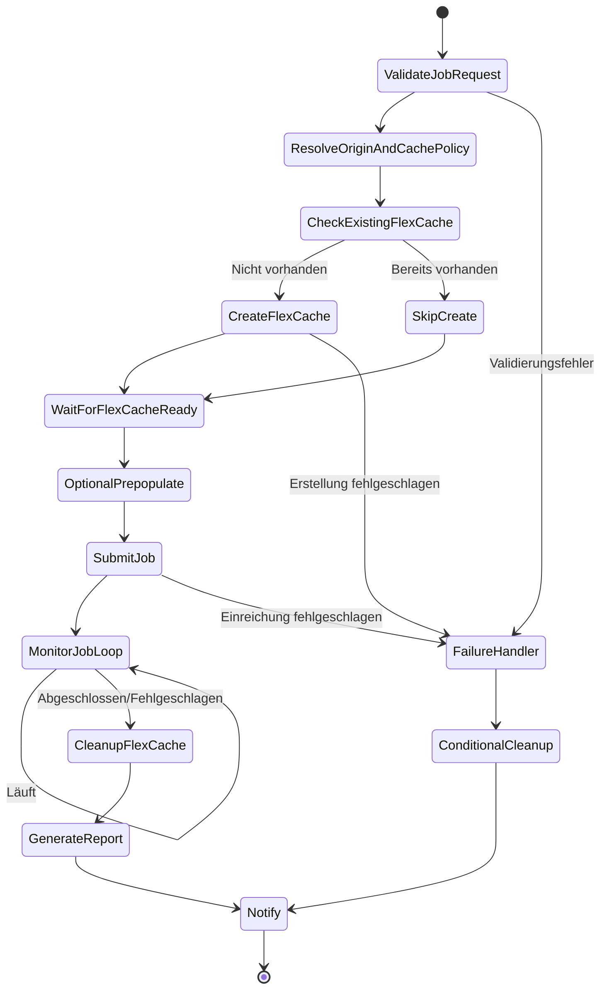

# Dynamic FlexCache Render / EDA Workflow

🌐 **Language / 言語**: [日本語](README.md) | [English](README.en.md) | [한국어](README.ko.md) | [简体中文](README.zh-CN.md) | [繁體中文](README.zh-TW.md) | [Français](README.fr.md) | Deutsch | [Español](README.es.md)

## Überblick

Ein Workflow, der bei der Einreichung eines Rendering-/EDA-/Simulationsjobs über die ONTAP REST API dynamisch FlexCache-Volumes erstellt und diese nach Abschluss des Jobs automatisch löscht. Implementiert ein NVIDIA-artiges Cache-Verwaltungsmuster pro Job mit AWS Step Functions.

## Warum FlexCache pro Job erstellen

| Grund | Beschreibung |
|------|------|
| Kostenoptimierung | Speicherkosten fallen nur während der Jobausführung an |
| Datenisolierung | Cache wird pro Projekt/Job isoliert |
| Sicherheit | Nach Abschluss des Jobs verbleiben keine Daten |
| Betriebliche Einfachheit | Verhindert die Entstehung verwaister Volumes (orphan volume) |
| Leistungsoptimierung | Prepopulate nur der für den Job benötigten Daten |

## Warum FlexCache nach Jobabschluss löschen

- **Kosten**: Vermeidung von Gebühren für unnötige Speicherkapazität
- **Sicherheit**: Verhinderung von Cache-Rückständen vertraulicher Daten
- **Kapazitätsverwaltung**: Verhinderung der Erschöpfung der Aggregatkapazität (aggregate)
- **Betrieb**: Verhinderung der Ansammlung verwaister Volumes (orphan volume)

## Architektur



## Rolle des Benutzerportals

Das Benutzerportal (API Gateway HTTP API) bietet Folgendes:
- Entgegennahme von Jobanfragen (JSON-Payload)
- Abfrage des Jobstatus
- Überprüfung des FlexCache-Status
- Abruf von Berichten

## Rolle der ONTAP REST API

- FlexCache erstellen: `POST /api/storage/flexcache/flexcaches`
- FlexCache löschen: `DELETE /api/storage/flexcache/flexcaches/{uuid}`
- Jobüberwachung: `GET /api/cluster/jobs/{uuid}`
- Prepopulate: `PATCH /api/storage/flexcache/flexcaches/{uuid}`

## Rolle von FSx for ONTAP S3 AP

- Datenlesevorgänge während der Jobausführung (über Lambda)
- Analyse der Jobergebnisse und Berichterstellung
- Metadatenextraktion und Qualitätsprüfungen

## Verzeichnisstruktur

```
dynamic-flexcache-render-workflow/
├── README.md
├── template.yaml                      # CloudFormation-Vorlage
├── src/
│   ├── portal_api/handler.py          # API zur Entgegennahme von Jobanfragen
│   ├── create_flexcache/handler.py    # Lambda zur FlexCache-Erstellung
│   ├── submit_job/handler.py          # Lambda zur Jobeinreichung
│   ├── monitor_job/handler.py         # Lambda zur Jobüberwachung
│   ├── cleanup_flexcache/handler.py   # Lambda zum FlexCache-Löschen
│   └── report/handler.py             # Lambda zur Berichterstellung
├── events/
│   ├── sample-render-job-request.json
│   ├── sample-eda-job-request.json
│   └── sample-cleanup-request.json
├── tests/
│   ├── test_create_flexcache.py
│   ├── test_cleanup_flexcache.py
│   └── test_monitor_job.py
└── docs/
    ├── architecture.md
    ├── workflow-design.md
    ├── ontap-rest-api-design.md
    ├── poc-checklist.md
    ├── demo-guide.md
    ├── failure-handling.md
    ├── security-design.md
    └── cost-optimization.md
```

## Schnellstart

### Bereitstellung

```bash
# Voraussetzung: AWS SAM CLI ist erforderlich. 'sam build' paketiert Code und Shared Layer automatisch.
sam build

sam deploy \
  --stack-name dynamic-flexcache-workflow-demo \
  --capabilities CAPABILITY_NAMED_IAM \
  --resolve-s3 \
  --parameter-overrides \
    OntapManagementIp=10.0.0.1 \
    OntapSecretName=fsxn/ontap-credentials \
    OriginSvmName=svm1 \
    OriginVolumeName=render_assets \
    CacheSvmName=svm1 \
    SimulationMode=true
```

> **Hinweis**: `template.yaml` wird mit der SAM CLI (`sam build` + `sam deploy`) verwendet.
> Um direkt mit dem Befehl `aws cloudformation deploy` bereitzustellen, verwenden Sie `template-deploy.yaml` (das Vorpaketieren der Lambda-Zip-Dateien und der Upload nach S3 sind erforderlich).

### Jobeinreichung

```bash
aws stepfunctions start-execution \
  --state-machine-arn <STATE_MACHINE_ARN> \
  --input file://events/sample-render-job-request.json
```

## Kostenoptimierung

- FlexCache existiert nur während der Jobausführung → minimiert die Speicherkosten
- Beschränken Sie den Prepopulate-Umfang auf die erforderlichen Verzeichnisse
- Regelmäßige Erkennung und Löschung verwaister FlexCache
- Nur Ausführungskosten für Lambda/Step Functions (serverless)

## Sicherheit

- Verwalten der ONTAP-Anmeldeinformationen in Secrets Manager
- IAM least privilege
- ONTAP-RBAC-Rolle mit minimalen Berechtigungen
- Automatisches Löschen der Daten nach Jobabschluss
- TLS-Verifizierung standardmäßig aktiviert

## Zukünftige Erweiterungen

- AWS Deadline Cloud-Integration
- AWS Batch-Integration
- IBM Spectrum LSF-Integration
- Slurm-Integration
- EDA regression scheduler-Integration

## Verwandte Links

- [FlexCache AnyCast / DR-Muster](../flexcache-anycast-dr/README.md)
- [Support-Matrix](../docs/support-matrix-fsx-ontap-flexcache-s3ap.md)
- [Branchen-·Workload-Zuordnung](../docs/industry-workload-mapping.md)
- [media-vfx/](../media-vfx/README.md)
- [semiconductor-eda/](../semiconductor-eda/README.md)

## Success Metrics

### Outcome
Die dynamische Erstellung und Löschung von FlexCache pro Job vermeidet E/A-Konkurrenz in Rendering-/EDA-Workflows und erreicht eine Kostenoptimierung.

### Metrics
| Metrik | Zielwert (Beispiel) |
|-----------|------------|
| FlexCache-Erstellungszeit | < 30 seconds |
| Verkürzung der Jobabschlusszeit | > 20% |
| Erfolgsrate der FlexCache-Löschung | 100% |
| Kosten / Job | 30 % Reduzierung gegenüber der Baseline |
| Human-Review-Rate | N/A (automatisiertes Muster) |

### Measurement Method
Step Functions-Ausführungsverlauf, ONTAP REST API-Antworten, CloudWatch Metrics und Kostenvergleich.

---

## Kostenschätzung (monatliche Näherung)

> **Anmerkung**: Das Folgende ist eine Näherung für die Region ap-northeast-1; die tatsächlichen Kosten variieren je nach Nutzung. Prüfen Sie die aktuellen Preise mit dem [AWS Pricing Calculator](https://calculator.aws/).

### Serverlose Komponenten (nutzungsbasierte Abrechnung)

| Dienst | Stückpreis | Angenommene Nutzung | Monatliche Näherung |
|---------|------|-----------|---------|
| Lambda | $0.0000166667/GB-sec | 4 Funktionen × 10 jobs/Tag | ~$1-5 |
| S3 API (GetObject/ListObjects) | $0.0047/10K requests | ~10K requests/Tag | ~$1.5 |
| Step Functions | $0.025/1K state transitions | ~1K transitions/Tag | ~$0.75 |
| Bedrock (Nova Lite) | $0.00006/1K input tokens | N/A | ~$3-10 |
| Athena | $5/TB scanned | N/A | ~$0.5-2 |
| SNS | $0.50/100K notifications | ~100 notifications/Tag | ~$0.15 |
| CloudWatch Logs | $0.76/GB ingested | ~1 GB/Monat | ~$0.76 |
| FlexCache-Volume | In der FSx for ONTAP-Speicherpreisgestaltung enthalten |

### Fixkosten (FSx for ONTAP — bestehende Umgebung vorausgesetzt)

| Komponente | Monatlich |
|--------------|------|
| FSx for ONTAP (128 MBps, 1 TB) | ~$230 (gemeinsame Nutzung einer bestehenden Umgebung) |
| S3 Access Point | Keine zusätzlichen Gebühren (nur S3-API-Gebühren) |

### Gesamtnäherung

| Konfiguration | Monatliche Näherung |
|------|---------|
| Minimalkonfiguration (1× täglich) | ~$5-15 |
| Standardkonfiguration (stündlich) | ~$15-50 |
| Großkonfiguration (hohe Frequenz + Alarme) | ~$50-150 |

> **Governance Caveat**: Kostenschätzungen sind Näherungswerte und keine garantierten Werte. Der tatsächliche Rechnungsbetrag variiert je nach Nutzungsmuster, Datenvolumen und Region.

---

## Lokales Testen

### Prerequisites-Prüfung

```bash
# Voraussetzungen prüfen
aws --version          # AWS CLI v2
sam --version          # SAM CLI
python3 --version      # Python 3.9+
docker --version       # Docker (für sam local)
aws sts get-caller-identity  # AWS-Anmeldeinformationen
```

### sam local invoke

```bash
# Build
# Voraussetzung: AWS SAM CLI ist erforderlich. 'sam build' paketiert Code und Shared Layer automatisch.
sam build

# Lokale Ausführung des Discovery-Lambda
sam local invoke DiscoveryFunction --event events/discovery-event.json

# Mit Überschreibung von Umgebungsvariablen
sam local invoke DiscoveryFunction \
  --event events/discovery-event.json \
  --env-vars env.json
```

### Unit-Tests

```bash
python3 -m pytest tests/ -v
```

Weitere Details finden Sie im [Schnellstart für lokales Testen](../docs/local-testing-quick-start.md).

---

## Ausgabebeispiel (Output Sample)

Beispielausgabe der dynamischen FlexCache-Bereitstellung + eines Rendering-Jobs:

```json
{
  "flexcache_provision": {
    "cache_name": "render-job-2026-0523-001",
    "origin_volume": "vfx-assets-vol1",
    "cache_size_gb": 100,
    "status": "online",
    "provision_time_sec": 45
  },
  "job_execution": {
    "job_id": "render-2026-0523-001",
    "frames_total": 240,
    "frames_completed": 240,
    "status": "completed",
    "duration_sec": 1800
  },
  "cleanup": {
    "cache_deleted": true,
    "cleanup_time_sec": 12
  },
  "cost_estimate": {
    "cache_hours": 0.5,
    "estimated_cost_usd": 0.15
  }
}
```

> **Anmerkung**: Das Obige ist eine Beispielausgabe; die tatsächlichen Werte variieren je nach Umgebung und Eingabedaten. Benchmark-Zahlen sind eine Dimensionierungsreferenz (sizing reference), keine Servicebegrenzung (service limit).

---

## Performance Considerations

- Die Durchsatzkapazität von FSx for ONTAP wird von NFS/SMB/S3AP gemeinsam genutzt
- Die Latenz über den S3 Access Point verursacht einen Overhead von einigen zehn Millisekunden
- Steuern Sie bei der Verarbeitung großer Dateimengen den Parallelitätsgrad mit der MaxConcurrency des Step Functions Map state
- Eine Erhöhung der Lambda-Speichergröße verbessert auch die Netzwerkbandbreite

> **Anmerkung**: Die Leistungszahlen dieses Musters sind eine Dimensionierungsreferenz (sizing reference), keine Servicebegrenzung (service limit). Die tatsächliche Leistung variiert je nach Durchsatzkapazität von FSx for ONTAP, Netzwerkkonfiguration und gleichzeitigen Workloads.

---

## Governance Note

> Dieses Muster bietet technische Architekturberatung. Es stellt keine rechtliche, Compliance- oder aufsichtsrechtliche Beratung dar. Organisationen sollten qualifizierte Fachleute konsultieren.
