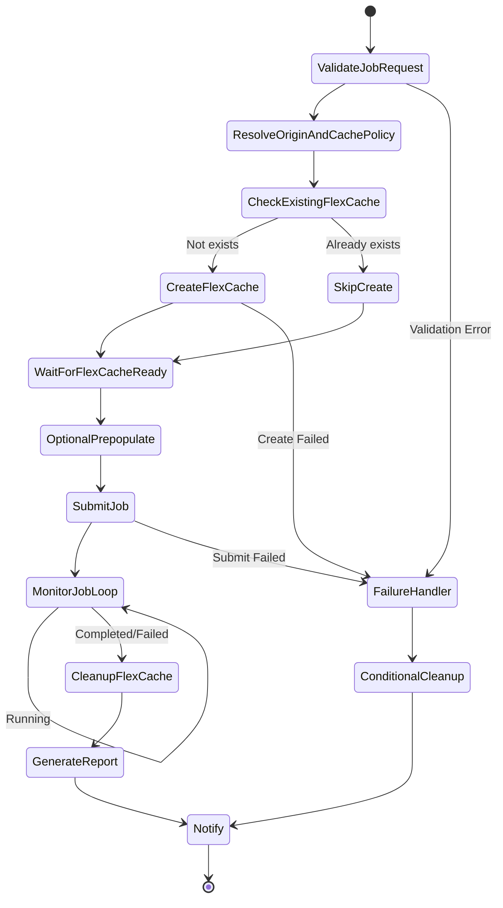

# Dynamic FlexCache Render / EDA Workflow

🌐 **Language / 言語**: [日本語](README.md) | English | [한국어](README.ko.md) | [简体中文](README.zh-CN.md) | [繁體中文](README.zh-TW.md) | [Français](README.fr.md) | [Deutsch](README.de.md) | [Español](README.es.md)

## Overview

A workflow that dynamically creates FlexCache volumes via the ONTAP REST API when a rendering/EDA/simulation job is submitted, and automatically deletes them after the job completes. Implements an NVIDIA-style per-job cache management pattern with AWS Step Functions.

## Why Create FlexCache Per Job

| Reason | Description |
|------|------|
| Cost optimization | Storage cost is incurred only during job execution |
| Data isolation | Cache is isolated per project/job |
| Security | No data remains after job completion |
| Operational simplicity | Prevents the creation of orphan volumes |
| Performance optimization | Prepopulate only the data the job needs |

## Why Delete FlexCache After Job Completion

- **Cost**: Avoid charges for unnecessary storage capacity
- **Security**: Prevent cached residue of sensitive data
- **Capacity management**: Prevent aggregate capacity exhaustion
- **Operations**: Prevent accumulation of orphan volumes

## Architecture



## Role of the User Portal

The user portal (API Gateway HTTP API) provides the following:
- Accepting job requests (JSON payload)
- Querying job status
- Checking FlexCache status
- Retrieving reports

## Role of the ONTAP REST API

- FlexCache create: `POST /api/storage/flexcache/flexcaches`
- FlexCache delete: `DELETE /api/storage/flexcache/flexcaches/{uuid}`
- Job monitoring: `GET /api/cluster/jobs/{uuid}`
- Prepopulate: `PATCH /api/storage/flexcache/flexcaches/{uuid}`

## Role of FSx for ONTAP S3 AP

- Data reads during job execution (via Lambda)
- Job result analysis and report generation
- Metadata extraction and quality checks

## Directory Structure

```
dynamic-flexcache-render-workflow/
├── README.md
├── template.yaml                      # CloudFormation template
├── src/
│   ├── portal_api/handler.py          # Job request intake API
│   ├── create_flexcache/handler.py    # FlexCache create Lambda
│   ├── submit_job/handler.py          # Job submission Lambda
│   ├── monitor_job/handler.py         # Job monitoring Lambda
│   ├── cleanup_flexcache/handler.py   # FlexCache delete Lambda
│   └── report/handler.py             # Report generation Lambda
├── events/
│   ├── sample-render-job-request.json
│   ├── sample-eda-job-request.json
│   └── sample-cleanup-request.json
├── tests/
│   ├── test_create_flexcache.py
│   ├── test_cleanup_flexcache.py
│   └── test_monitor_job.py
└── docs/
    ├── architecture.md
    ├── workflow-design.md
    ├── ontap-rest-api-design.md
    ├── poc-checklist.md
    ├── demo-guide.md
    ├── failure-handling.md
    ├── security-design.md
    └── cost-optimization.md
```

## Quick Start

### Deployment

```bash
# Prerequisite: AWS SAM CLI is required. 'sam build' automatically packages the code and shared layer.
sam build

sam deploy \
  --stack-name dynamic-flexcache-workflow-demo \
  --capabilities CAPABILITY_NAMED_IAM \
  --resolve-s3 \
  --parameter-overrides \
    OntapManagementIp=10.0.0.1 \
    OntapSecretName=fsxn/ontap-credentials \
    OriginSvmName=svm1 \
    OriginVolumeName=render_assets \
    CacheSvmName=svm1 \
    SimulationMode=true
```

> **Note**: `template.yaml` is used with the SAM CLI (`sam build` + `sam deploy`).
> To deploy directly with the `aws cloudformation deploy` command, use `template-deploy.yaml` (pre-packaging of the Lambda zip files and upload to S3 is required).

### Job Submission

```bash
aws stepfunctions start-execution \
  --state-machine-arn <STATE_MACHINE_ARN> \
  --input file://events/sample-render-job-request.json
```

## Cost Optimization

- FlexCache exists only during job execution → minimizes storage cost
- Limit the prepopulate scope to only the required directories
- Periodic detection and deletion of orphan FlexCache
- Only Lambda/Step Functions execution cost (serverless)

## Security

- Manage ONTAP credentials in Secrets Manager
- IAM least privilege
- ONTAP RBAC least-privilege role
- Automatic data deletion after job completion
- TLS verification enabled by default

## Future Extensions

- AWS Deadline Cloud integration
- AWS Batch integration
- IBM Spectrum LSF integration
- Slurm integration
- EDA regression scheduler integration

## Related Links

- [FlexCache AnyCast / DR pattern](../flexcache-anycast-dr/README.md)
- [Support matrix](../docs/support-matrix-fsx-ontap-flexcache-s3ap.md)
- [Industry / workload mapping](../docs/industry-workload-mapping.md)
- [media-vfx/](../media-vfx/README.md)
- [semiconductor-eda/](../semiconductor-eda/README.md)

## Success Metrics

### Outcome
Dynamic per-job creation and deletion of FlexCache avoids I/O contention in rendering/EDA workflows and achieves cost optimization.

### Metrics
| Metric | Target (example) |
|-----------|------------|
| FlexCache creation time | < 30 seconds |
| Reduction in job completion time | > 20% |
| FlexCache deletion success rate | 100% |
| Cost / job | 30% reduction vs. baseline |
| Human Review rate | N/A (automated pattern) |

### Measurement Method
Step Functions execution history, ONTAP REST API responses, CloudWatch Metrics, and cost comparison.

---

## Cost Estimate (Monthly Approximation)

> **Note**: The following are approximate figures for the ap-northeast-1 region; actual costs vary by usage. Check the latest pricing with the [AWS Pricing Calculator](https://calculator.aws/).

### Serverless Components (Pay-as-you-go)

| Service | Unit price | Assumed usage | Monthly estimate |
|---------|------|-----------|---------|
| Lambda | $0.0000166667/GB-sec | 4 functions × 10 jobs/day | ~$1-5 |
| S3 API (GetObject/ListObjects) | $0.0047/10K requests | ~10K requests/day | ~$1.5 |
| Step Functions | $0.025/1K state transitions | ~1K transitions/day | ~$0.75 |
| Bedrock (Nova Lite) | $0.00006/1K input tokens | N/A | ~$3-10 |
| Athena | $5/TB scanned | N/A | ~$0.5-2 |
| SNS | $0.50/100K notifications | ~100 notifications/day | ~$0.15 |
| CloudWatch Logs | $0.76/GB ingested | ~1 GB/month | ~$0.76 |
| FlexCache volume | Included in FSx for ONTAP storage pricing |

### Fixed Costs (FSx for ONTAP — assumes existing environment)

| Component | Monthly |
|--------------|------|
| FSx for ONTAP (128 MBps, 1 TB) | ~$230 (shared existing environment) |
| S3 Access Point | No additional charge (S3 API pricing only) |

### Total Estimate

| Configuration | Monthly estimate |
|------|---------|
| Minimal (once daily) | ~$5-15 |
| Standard (hourly) | ~$15-50 |
| Large scale (high frequency + alarms) | ~$50-150 |

> **Governance Caveat**: Cost estimates are approximate and not guaranteed. Actual charges vary by usage pattern, data volume, and region.

---

## Local Testing

### Prerequisites Check

```bash
# Verify prerequisites
aws --version          # AWS CLI v2
sam --version          # SAM CLI
python3 --version      # Python 3.9+
docker --version       # Docker (for sam local)
aws sts get-caller-identity  # AWS credentials
```

### sam local invoke

```bash
# Build
# Prerequisite: AWS SAM CLI is required. 'sam build' automatically packages the code and shared layer.
sam build

# Run the Discovery Lambda locally
sam local invoke DiscoveryFunction --event events/discovery-event.json

# With environment variable overrides
sam local invoke DiscoveryFunction \
  --event events/discovery-event.json \
  --env-vars env.json
```

### Unit Tests

```bash
python3 -m pytest tests/ -v
```

For details, see [Local Testing Quick Start](../docs/local-testing-quick-start.md).

---

## Output Sample

Example output of FlexCache dynamic provisioning + a rendering job:

```json
{
  "flexcache_provision": {
    "cache_name": "render-job-2026-0523-001",
    "origin_volume": "vfx-assets-vol1",
    "cache_size_gb": 100,
    "status": "online",
    "provision_time_sec": 45
  },
  "job_execution": {
    "job_id": "render-2026-0523-001",
    "frames_total": 240,
    "frames_completed": 240,
    "status": "completed",
    "duration_sec": 1800
  },
  "cleanup": {
    "cache_deleted": true,
    "cleanup_time_sec": 12
  },
  "cost_estimate": {
    "cache_hours": 0.5,
    "estimated_cost_usd": 0.15
  }
}
```

> **Note**: The above is sample output; actual values vary by environment and input data. Benchmark figures are a sizing reference, not a service limit.

---

## Performance Considerations

- FSx for ONTAP throughput capacity is shared across NFS/SMB/S3AP
- Latency through the S3 Access Point incurs an overhead of tens of milliseconds
- For large-scale file processing, control the degree of parallelism with the MaxConcurrency of the Step Functions Map state
- Increasing Lambda memory size also improves network bandwidth

> **Note**: The performance figures for this pattern are a sizing reference, not a service limit. Real-world performance varies by FSx for ONTAP throughput capacity, network configuration, and concurrent workloads.

---

## Governance Note

> This pattern provides technical architecture guidance. It is not legal, compliance, or regulatory advice. Organizations should consult qualified professionals.
