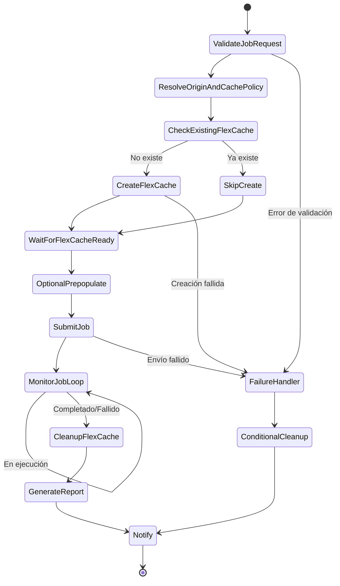

# Dynamic FlexCache Render / EDA Workflow

🌐 **Language / 言語**: [日本語](README.md) | [English](README.en.md) | [한국어](README.ko.md) | [简体中文](README.zh-CN.md) | [繁體中文](README.zh-TW.md) | [Français](README.fr.md) | [Deutsch](README.de.md) | Español

## Descripción general

Un flujo de trabajo que crea dinámicamente volúmenes FlexCache mediante la API REST de ONTAP cuando se envía un trabajo de renderizado/EDA/simulación y los elimina automáticamente tras finalizar el trabajo. Implementa un patrón de gestión de caché por trabajo al estilo NVIDIA con AWS Step Functions.

## Por qué crear FlexCache por trabajo

| Razón | Descripción |
|------|------|
| Optimización de costos | El costo de almacenamiento solo se genera durante la ejecución del trabajo |
| Aislamiento de datos | La caché se aísla por proyecto/trabajo |
| Seguridad | No quedan datos tras finalizar el trabajo |
| Simplicidad operativa | Evita la creación de volúmenes huérfanos (orphan volume) |
| Optimización del rendimiento | Prepopulate solo los datos necesarios para el trabajo |

## Por qué eliminar FlexCache tras finalizar el trabajo

- **Costo**: Evitar cargos por capacidad de almacenamiento innecesaria
- **Seguridad**: Evitar residuos en caché de datos confidenciales
- **Gestión de capacidad**: Evitar el agotamiento de la capacidad del agregado (aggregate)
- **Operación**: Evitar la acumulación de volúmenes huérfanos (orphan volume)

## Arquitectura



## Función del portal de usuario

El portal de usuario (API Gateway HTTP API) ofrece lo siguiente:
- Recepción de solicitudes de trabajo (carga útil JSON)
- Consulta del estado del trabajo
- Verificación del estado de FlexCache
- Obtención de informes

## Función de la API REST de ONTAP

- Crear FlexCache: `POST /api/storage/flexcache/flexcaches`
- Eliminar FlexCache: `DELETE /api/storage/flexcache/flexcaches/{uuid}`
- Supervisión del trabajo: `GET /api/cluster/jobs/{uuid}`
- Prepopulate: `PATCH /api/storage/flexcache/flexcaches/{uuid}`

## Función de FSx for ONTAP S3 AP

- Lecturas de datos durante la ejecución del trabajo (a través de Lambda)
- Análisis de los resultados del trabajo y generación de informes
- Extracción de metadatos y controles de calidad

## Estructura de directorios

```
dynamic-flexcache-render-workflow/
├── README.md
├── template.yaml                      # Plantilla de CloudFormation
├── src/
│   ├── portal_api/handler.py          # API de recepción de solicitudes de trabajo
│   ├── create_flexcache/handler.py    # Lambda de creación de FlexCache
│   ├── submit_job/handler.py          # Lambda de envío de trabajo
│   ├── monitor_job/handler.py         # Lambda de supervisión de trabajo
│   ├── cleanup_flexcache/handler.py   # Lambda de eliminación de FlexCache
│   └── report/handler.py             # Lambda de generación de informes
├── events/
│   ├── sample-render-job-request.json
│   ├── sample-eda-job-request.json
│   └── sample-cleanup-request.json
├── tests/
│   ├── test_create_flexcache.py
│   ├── test_cleanup_flexcache.py
│   └── test_monitor_job.py
└── docs/
    ├── architecture.md
    ├── workflow-design.md
    ├── ontap-rest-api-design.md
    ├── poc-checklist.md
    ├── demo-guide.md
    ├── failure-handling.md
    ├── security-design.md
    └── cost-optimization.md
```

## Inicio rápido

### Despliegue

```bash
# Requisito previo: se necesita AWS SAM CLI. 'sam build' empaqueta el código y la capa compartida automáticamente.
sam build

sam deploy \
  --stack-name dynamic-flexcache-workflow-demo \
  --capabilities CAPABILITY_NAMED_IAM \
  --resolve-s3 \
  --parameter-overrides \
    OntapManagementIp=10.0.0.1 \
    OntapSecretName=fsxn/ontap-credentials \
    OriginSvmName=svm1 \
    OriginVolumeName=render_assets \
    CacheSvmName=svm1 \
    SimulationMode=true
```

> **Nota**: `template.yaml` se usa con la SAM CLI (`sam build` + `sam deploy`).
> Para desplegar directamente con el comando `aws cloudformation deploy`, use `template-deploy.yaml` (se requiere el empaquetado previo de los archivos zip de Lambda y su carga a S3).

### Envío de trabajo

```bash
aws stepfunctions start-execution \
  --state-machine-arn <STATE_MACHINE_ARN> \
  --input file://events/sample-render-job-request.json
```

## Optimización de costos

- FlexCache existe solo durante la ejecución del trabajo → minimiza el costo de almacenamiento
- Limite el alcance de Prepopulate solo a los directorios necesarios
- Detección y eliminación periódicas de FlexCache huérfanos
- Solo el costo de ejecución de Lambda/Step Functions (serverless)

## Seguridad

- Gestionar las credenciales de ONTAP en Secrets Manager
- IAM least privilege
- Rol de privilegio mínimo de ONTAP RBAC
- Eliminación automática de datos tras finalizar el trabajo
- Verificación TLS habilitada de forma predeterminada

## Ampliaciones futuras

- Integración con AWS Deadline Cloud
- Integración con AWS Batch
- Integración con IBM Spectrum LSF
- Integración con Slurm
- Integración con EDA regression scheduler

## Enlaces relacionados

- [Patrón FlexCache AnyCast / DR](../flexcache-anycast-dr/README.md)
- [Matriz de compatibilidad](../docs/support-matrix-fsx-ontap-flexcache-s3ap.md)
- [Mapeo de sector·carga de trabajo](../docs/industry-workload-mapping.md)
- [media-vfx/](../media-vfx/README.md)
- [semiconductor-eda/](../semiconductor-eda/README.md)

## Success Metrics

### Outcome
La creación y eliminación dinámica de FlexCache por trabajo evita la contención de E/S en los flujos de trabajo de renderizado/EDA y logra la optimización de costos.

### Metrics
| Métrica | Valor objetivo (ejemplo) |
|-----------|------------|
| Tiempo de creación de FlexCache | < 30 seconds |
| Reducción del tiempo de finalización del trabajo | > 20% |
| Tasa de éxito de eliminación de FlexCache | 100% |
| Costo / trabajo | Reducción del 30 % respecto a la referencia |
| Tasa de Human Review | N/A (patrón automatizado) |

### Measurement Method
Historial de ejecución de Step Functions, respuestas de la API REST de ONTAP, CloudWatch Metrics y comparación de costos.

---

## Estimación de costos (estimación mensual)

> **Nota**: Lo siguiente es una estimación para la región ap-northeast-1; los costos reales varían según el uso. Consulte los precios más recientes en la [AWS Pricing Calculator](https://calculator.aws/).

### Componentes serverless (facturación por uso)

| Servicio | Precio unitario | Uso previsto | Estimación mensual |
|---------|------|-----------|---------|
| Lambda | $0.0000166667/GB-sec | 4 funciones × 10 jobs/día | ~$1-5 |
| S3 API (GetObject/ListObjects) | $0.0047/10K requests | ~10K requests/día | ~$1.5 |
| Step Functions | $0.025/1K state transitions | ~1K transitions/día | ~$0.75 |
| Bedrock (Nova Lite) | $0.00006/1K input tokens | N/A | ~$3-10 |
| Athena | $5/TB scanned | N/A | ~$0.5-2 |
| SNS | $0.50/100K notifications | ~100 notifications/día | ~$0.15 |
| CloudWatch Logs | $0.76/GB ingested | ~1 GB/mes | ~$0.76 |
| Volumen FlexCache | Incluido en el precio de almacenamiento de FSx for ONTAP |

### Costos fijos (FSx for ONTAP — se presupone un entorno existente)

| Componente | Mensual |
|--------------|------|
| FSx for ONTAP (128 MBps, 1 TB) | ~$230 (se comparte un entorno existente) |
| S3 Access Point | Sin cargo adicional (solo el cargo de la API de S3) |

### Estimación total

| Configuración | Estimación mensual |
|------|---------|
| Configuración mínima (1 ejecución diaria) | ~$5-15 |
| Configuración estándar (ejecución por hora) | ~$15-50 |
| Configuración a gran escala (alta frecuencia + alarmas) | ~$50-150 |

> **Governance Caveat**: Las estimaciones de costos son aproximadas y no son valores garantizados. El monto facturado real varía según el patrón de uso, el volumen de datos y la región.

---

## Pruebas locales

### Verificación de Prerequisites

```bash
# Verificar los requisitos previos
aws --version          # AWS CLI v2
sam --version          # SAM CLI
python3 --version      # Python 3.9+
docker --version       # Docker (para sam local)
aws sts get-caller-identity  # Credenciales de AWS
```

### sam local invoke

```bash
# Compilación
# Requisito previo: se necesita AWS SAM CLI. 'sam build' empaqueta el código y la capa compartida automáticamente.
sam build

# Ejecución local del Lambda Discovery
sam local invoke DiscoveryFunction --event events/discovery-event.json

# Con sobrescritura de variables de entorno
sam local invoke DiscoveryFunction \
  --event events/discovery-event.json \
  --env-vars env.json
```

### Pruebas unitarias

```bash
python3 -m pytest tests/ -v
```

Para más detalles, consulte el [Inicio rápido de pruebas locales](../docs/local-testing-quick-start.md).

---

## Muestra de salida (Output Sample)

Ejemplo de salida del aprovisionamiento dinámico de FlexCache + un trabajo de renderizado:

```json
{
  "flexcache_provision": {
    "cache_name": "render-job-2026-0523-001",
    "origin_volume": "vfx-assets-vol1",
    "cache_size_gb": 100,
    "status": "online",
    "provision_time_sec": 45
  },
  "job_execution": {
    "job_id": "render-2026-0523-001",
    "frames_total": 240,
    "frames_completed": 240,
    "status": "completed",
    "duration_sec": 1800
  },
  "cleanup": {
    "cache_deleted": true,
    "cleanup_time_sec": 12
  },
  "cost_estimate": {
    "cache_hours": 0.5,
    "estimated_cost_usd": 0.15
  }
}
```

> **Nota**: Lo anterior es una salida de muestra; los valores reales varían según el entorno y los datos de entrada. Las cifras de referencia son una referencia de dimensionamiento (sizing reference), no un límite de servicio (service limit).

---

## Performance Considerations

- La capacidad de rendimiento de FSx for ONTAP se comparte entre NFS/SMB/S3AP
- La latencia a través del S3 Access Point genera una sobrecarga de decenas de milisegundos
- Al procesar grandes cantidades de archivos, controle el grado de paralelismo con el MaxConcurrency del Map state de Step Functions
- Aumentar el tamaño de la memoria de Lambda también contribuye a mejorar el ancho de banda de la red

> **Nota**: Las cifras de rendimiento de este patrón son una referencia de dimensionamiento (sizing reference), no un límite de servicio (service limit). El rendimiento real varía según la capacidad de rendimiento de FSx for ONTAP, la configuración de red y las cargas de trabajo concurrentes.

---

## Governance Note

> Este patrón proporciona orientación de arquitectura técnica. No constituye asesoramiento legal, de cumplimiento ni regulatorio. Las organizaciones deben consultar a profesionales cualificados.
