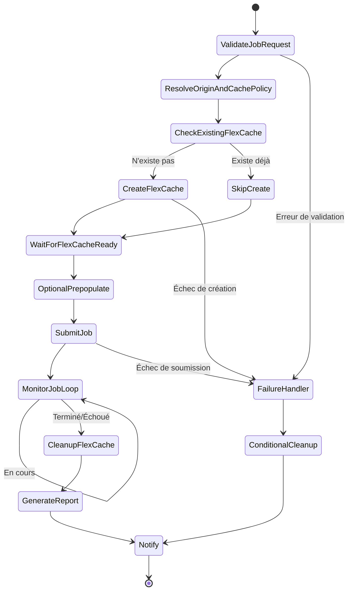

# Dynamic FlexCache Render / EDA Workflow

🌐 **Language / 言語**: [日本語](README.md) | [English](README.en.md) | [한국어](README.ko.md) | [简体中文](README.zh-CN.md) | [繁體中文](README.zh-TW.md) | Français | [Deutsch](README.de.md) | [Español](README.es.md)

## Aperçu

Un workflow qui crée dynamiquement des volumes FlexCache via l'API REST ONTAP lors de la soumission d'un travail de rendu/EDA/simulation, puis les supprime automatiquement après la fin du travail. Implémente un modèle de gestion de cache par travail de type NVIDIA avec AWS Step Functions.

## Pourquoi créer un FlexCache par travail

| Raison | Description |
|------|------|
| Optimisation des coûts | Le coût de stockage n'est engagé que pendant l'exécution du travail |
| Isolation des données | Le cache est isolé par projet/travail |
| Sécurité | Aucune donnée ne subsiste après la fin du travail |
| Simplicité opérationnelle | Empêche la création de volumes orphelins (orphan volume) |
| Optimisation des performances | Prepopulate uniquement les données nécessaires au travail |

## Pourquoi supprimer le FlexCache après la fin du travail

- **Coût** : Éviter la facturation d'une capacité de stockage inutile
- **Sécurité** : Empêcher la persistance en cache de données sensibles
- **Gestion de la capacité** : Empêcher l'épuisement de la capacité de l'agrégat (aggregate)
- **Exploitation** : Empêcher l'accumulation de volumes orphelins (orphan volume)

## Architecture



## Rôle du portail utilisateur

Le portail utilisateur (API Gateway HTTP API) fournit les éléments suivants :
- Réception des demandes de travail (charge utile JSON)
- Interrogation de l'état du travail
- Vérification de l'état du FlexCache
- Récupération des rapports

## Rôle de l'API REST ONTAP

- Création de FlexCache : `POST /api/storage/flexcache/flexcaches`
- Suppression de FlexCache : `DELETE /api/storage/flexcache/flexcaches/{uuid}`
- Surveillance du travail : `GET /api/cluster/jobs/{uuid}`
- Prepopulate : `PATCH /api/storage/flexcache/flexcaches/{uuid}`

## Rôle de FSx for ONTAP S3 AP

- Lectures de données pendant l'exécution du travail (via Lambda)
- Analyse des résultats du travail et génération de rapports
- Extraction de métadonnées et contrôles de qualité

## Structure des répertoires

```
dynamic-flexcache-render-workflow/
├── README.md
├── template.yaml                      # Modèle CloudFormation
├── src/
│   ├── portal_api/handler.py          # API de réception des demandes de travail
│   ├── create_flexcache/handler.py    # Lambda de création de FlexCache
│   ├── submit_job/handler.py          # Lambda de soumission de travail
│   ├── monitor_job/handler.py         # Lambda de surveillance de travail
│   ├── cleanup_flexcache/handler.py   # Lambda de suppression de FlexCache
│   └── report/handler.py             # Lambda de génération de rapport
├── events/
│   ├── sample-render-job-request.json
│   ├── sample-eda-job-request.json
│   └── sample-cleanup-request.json
├── tests/
│   ├── test_create_flexcache.py
│   ├── test_cleanup_flexcache.py
│   └── test_monitor_job.py
└── docs/
    ├── architecture.md
    ├── workflow-design.md
    ├── ontap-rest-api-design.md
    ├── poc-checklist.md
    ├── demo-guide.md
    ├── failure-handling.md
    ├── security-design.md
    └── cost-optimization.md
```

## Démarrage rapide

### Déploiement

```bash
# Prérequis : AWS SAM CLI est requis. 'sam build' empaquette automatiquement le code et la couche partagée.
sam build

sam deploy \
  --stack-name dynamic-flexcache-workflow-demo \
  --capabilities CAPABILITY_NAMED_IAM \
  --resolve-s3 \
  --parameter-overrides \
    OntapManagementIp=10.0.0.1 \
    OntapSecretName=fsxn/ontap-credentials \
    OriginSvmName=svm1 \
    OriginVolumeName=render_assets \
    CacheSvmName=svm1 \
    SimulationMode=true
```

> **Remarque** : `template.yaml` s'utilise avec la SAM CLI (`sam build` + `sam deploy`).
> Pour déployer directement avec la commande `aws cloudformation deploy`, utilisez `template-deploy.yaml` (l'empaquetage préalable des fichiers zip Lambda et leur téléversement vers S3 sont requis).

### Soumission de travail

```bash
aws stepfunctions start-execution \
  --state-machine-arn <STATE_MACHINE_ARN> \
  --input file://events/sample-render-job-request.json
```

## Optimisation des coûts

- Le FlexCache n'existe que pendant l'exécution du travail → minimise le coût de stockage
- Limiter la portée de Prepopulate aux seuls répertoires nécessaires
- Détection et suppression périodiques des FlexCache orphelins
- Uniquement le coût d'exécution Lambda/Step Functions (serverless)

## Sécurité

- Gérer les informations d'identification ONTAP dans Secrets Manager
- IAM least privilege
- Rôle à privilège minimal ONTAP RBAC
- Suppression automatique des données après la fin du travail
- Vérification TLS activée par défaut

## Extensions futures

- Intégration AWS Deadline Cloud
- Intégration AWS Batch
- Intégration IBM Spectrum LSF
- Intégration Slurm
- Intégration EDA regression scheduler

## Liens connexes

- [Modèle FlexCache AnyCast / DR](../flexcache-anycast-dr/README.md)
- [Matrice de prise en charge](../docs/support-matrix-fsx-ontap-flexcache-s3ap.md)
- [Cartographie secteur·charge de travail](../docs/industry-workload-mapping.md)
- [media-vfx/](../media-vfx/README.md)
- [semiconductor-eda/](../semiconductor-eda/README.md)

## Success Metrics

### Outcome
La création et la suppression dynamiques de FlexCache par travail évitent la contention d'E/S dans les workflows de rendu/EDA et permettent une optimisation des coûts.

### Metrics
| Métrique | Objectif (exemple) |
|-----------|------------|
| Temps de création du FlexCache | < 30 seconds |
| Réduction du temps d'achèvement du travail | > 20% |
| Taux de réussite de suppression du FlexCache | 100% |
| Coût / travail | Réduction de 30 % par rapport à la référence |
| Taux de Human Review | N/A (modèle automatisé) |

### Measurement Method
Historique d'exécution Step Functions, réponses de l'API REST ONTAP, CloudWatch Metrics et comparaison des coûts.

---

## Estimation des coûts (estimation mensuelle)

> **Note** : Ce qui suit est une estimation pour la région ap-northeast-1 ; les coûts réels varient selon l'utilisation. Vérifiez les tarifs les plus récents avec l'[AWS Pricing Calculator](https://calculator.aws/).

### Composants serverless (facturation à l'usage)

| Service | Prix unitaire | Utilisation supposée | Estimation mensuelle |
|---------|------|-----------|---------|
| Lambda | $0.0000166667/GB-sec | 4 fonctions × 10 jobs/jour | ~$1-5 |
| S3 API (GetObject/ListObjects) | $0.0047/10K requests | ~10K requests/jour | ~$1.5 |
| Step Functions | $0.025/1K state transitions | ~1K transitions/jour | ~$0.75 |
| Bedrock (Nova Lite) | $0.00006/1K input tokens | N/A | ~$3-10 |
| Athena | $5/TB scanned | N/A | ~$0.5-2 |
| SNS | $0.50/100K notifications | ~100 notifications/jour | ~$0.15 |
| CloudWatch Logs | $0.76/GB ingested | ~1 GB/mois | ~$0.76 |
| Volume FlexCache | Inclus dans la tarification du stockage FSx for ONTAP |

### Coûts fixes (FSx for ONTAP — environnement existant supposé)

| Composant | Mensuel |
|--------------|------|
| FSx for ONTAP (128 MBps, 1 TB) | ~$230 (partage d'un environnement existant) |
| S3 Access Point | Aucun frais supplémentaire (uniquement les frais d'API S3) |

### Estimation totale

| Configuration | Estimation mensuelle |
|------|---------|
| Configuration minimale (1 exécution quotidienne) | ~$5-15 |
| Configuration standard (exécution horaire) | ~$15-50 |
| Configuration à grande échelle (haute fréquence + alarmes) | ~$50-150 |

> **Governance Caveat** : Les estimations de coûts sont approximatives et ne sont pas garanties. Le montant facturé réel varie selon le profil d'utilisation, le volume de données et la région.

---

## Test local

### Vérification des Prerequisites

```bash
# Vérifier les prérequis
aws --version          # AWS CLI v2
sam --version          # SAM CLI
python3 --version      # Python 3.9+
docker --version       # Docker (pour sam local)
aws sts get-caller-identity  # Informations d'identification AWS
```

### sam local invoke

```bash
# Build
# Prérequis : AWS SAM CLI est requis. 'sam build' empaquette automatiquement le code et la couche partagée.
sam build

# Exécution locale du Lambda Discovery
sam local invoke DiscoveryFunction --event events/discovery-event.json

# Avec surcharge des variables d'environnement
sam local invoke DiscoveryFunction \
  --event events/discovery-event.json \
  --env-vars env.json
```

### Tests unitaires

```bash
python3 -m pytest tests/ -v
```

Pour plus de détails, consultez le [Démarrage rapide des tests locaux](../docs/local-testing-quick-start.md).

---

## Exemple de sortie (Output Sample)

Exemple de sortie du provisionnement dynamique de FlexCache + un travail de rendu :

```json
{
  "flexcache_provision": {
    "cache_name": "render-job-2026-0523-001",
    "origin_volume": "vfx-assets-vol1",
    "cache_size_gb": 100,
    "status": "online",
    "provision_time_sec": 45
  },
  "job_execution": {
    "job_id": "render-2026-0523-001",
    "frames_total": 240,
    "frames_completed": 240,
    "status": "completed",
    "duration_sec": 1800
  },
  "cleanup": {
    "cache_deleted": true,
    "cleanup_time_sec": 12
  },
  "cost_estimate": {
    "cache_hours": 0.5,
    "estimated_cost_usd": 0.15
  }
}
```

> **Note** : Ce qui précède est un exemple de sortie ; les valeurs réelles varient selon l'environnement et les données d'entrée. Les chiffres de référence sont une référence de dimensionnement (sizing reference), pas une limite de service (service limit).

---

## Performance Considerations

- La capacité de débit de FSx for ONTAP est partagée entre NFS/SMB/S3AP
- La latence via le S3 Access Point entraîne une surcharge de quelques dizaines de millisecondes
- Pour le traitement de fichiers à grande échelle, contrôlez le degré de parallélisme avec le MaxConcurrency de l'état Map de Step Functions
- Augmenter la taille de la mémoire Lambda améliore aussi la bande passante réseau

> **Note** : Les chiffres de performance de ce modèle sont une référence de dimensionnement (sizing reference), pas une limite de service (service limit). Les performances réelles varient selon la capacité de débit de FSx for ONTAP, la configuration réseau et les charges de travail concurrentes.

---

## Governance Note

> Ce modèle fournit des conseils d'architecture technique. Il ne constitue pas un avis juridique, de conformité ou réglementaire. Les organisations doivent consulter des professionnels qualifiés.
