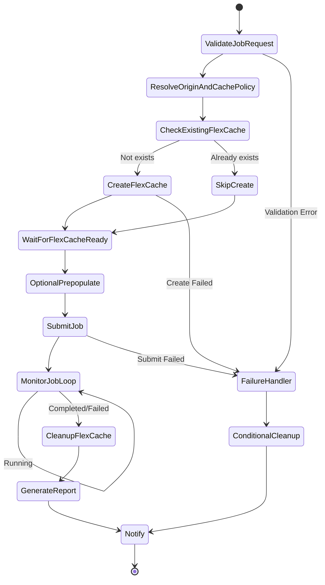

# Dynamic FlexCache Render / EDA Workflow

🌐 **Language / 言語**: [日本語](README.md) | [English](README.en.md) | 한국어 | [简体中文](README.zh-CN.md) | [繁體中文](README.zh-TW.md) | [Français](README.fr.md) | [Deutsch](README.de.md) | [Español](README.es.md)

## 개요

렌더링/EDA/시뮬레이션 작업이 제출될 때 ONTAP REST API로 FlexCache 볼륨을 동적으로 생성하고, 작업 완료 후 자동으로 삭제하는 워크플로. NVIDIA 형 작업 단위 캐시 관리 패턴을 AWS Step Functions로 구현한다.

## 왜 작업 단위로 FlexCache를 생성하는가

| 이유 | 설명 |
|------|------|
| 비용 최적화 | 작업 실행 시에만 스토리지 비용이 발생 |
| 데이터 분리 | 프로젝트/작업 단위로 캐시를 분리 |
| 보안 | 작업 완료 후 데이터가 남지 않음 |
| 운영 간소화 | orphan volume 발생을 방지 |
| 성능 최적화 | 작업에 필요한 데이터만 prepopulate |

## 작업 종료 후 FlexCache를 삭제하는 이유

- **비용**: 불필요한 스토리지 용량 과금을 회피
- **보안**: 기밀 데이터의 캐시 잔존을 방지
- **용량 관리**: 애그리게이트 용량 고갈을 방지
- **운영**: orphan volume 누적을 방지

## 아키텍처



## 사용자 포털의 역할

사용자 포털(API Gateway HTTP API)은 다음을 제공한다:
- 작업 요청 접수(JSON 페이로드)
- 작업 상태 조회
- FlexCache 상태 확인
- 리포트 취득

## ONTAP REST API의 역할

- FlexCache 생성: `POST /api/storage/flexcache/flexcaches`
- FlexCache 삭제: `DELETE /api/storage/flexcache/flexcaches/{uuid}`
- 작업 모니터링: `GET /api/cluster/jobs/{uuid}`
- Prepopulate: `PATCH /api/storage/flexcache/flexcaches/{uuid}`

## FSx for ONTAP S3 AP의 역할

- 작업 실행 중 데이터 읽기(Lambda 경유)
- 작업 결과 분석·리포트 생성
- 메타데이터 추출·품질 확인

## 디렉터리 구성

```
dynamic-flexcache-render-workflow/
├── README.md
├── template.yaml                      # CloudFormation 템플릿
├── src/
│   ├── portal_api/handler.py          # 작업 요청 접수 API
│   ├── create_flexcache/handler.py    # FlexCache 생성 Lambda
│   ├── submit_job/handler.py          # 작업 제출 Lambda
│   ├── monitor_job/handler.py         # 작업 모니터링 Lambda
│   ├── cleanup_flexcache/handler.py   # FlexCache 삭제 Lambda
│   └── report/handler.py             # 리포트 생성 Lambda
├── events/
│   ├── sample-render-job-request.json
│   ├── sample-eda-job-request.json
│   └── sample-cleanup-request.json
├── tests/
│   ├── test_create_flexcache.py
│   ├── test_cleanup_flexcache.py
│   └── test_monitor_job.py
└── docs/
    ├── architecture.md
    ├── workflow-design.md
    ├── ontap-rest-api-design.md
    ├── poc-checklist.md
    ├── demo-guide.md
    ├── failure-handling.md
    ├── security-design.md
    └── cost-optimization.md
```

## 빠른 시작

### 배포

```bash
# 전제: AWS SAM CLI가 필요합니다. 'sam build'가 코드와 공유 레이어를 자동으로 패키징합니다.
sam build

sam deploy \
  --stack-name dynamic-flexcache-workflow-demo \
  --capabilities CAPABILITY_NAMED_IAM \
  --resolve-s3 \
  --parameter-overrides \
    OntapManagementIp=10.0.0.1 \
    OntapSecretName=fsxn/ontap-credentials \
    OriginSvmName=svm1 \
    OriginVolumeName=render_assets \
    CacheSvmName=svm1 \
    SimulationMode=true
```

> **참고**: `template.yaml`은 SAM CLI(`sam build` + `sam deploy`)에서 사용합니다.
> `aws cloudformation deploy` 명령으로 직접 배포하는 경우에는 `template-deploy.yaml`을 사용하세요(Lambda zip 파일의 사전 패키징과 S3 업로드가 필요합니다).

### 작업 제출

```bash
aws stepfunctions start-execution \
  --state-machine-arn <STATE_MACHINE_ARN> \
  --input file://events/sample-render-job-request.json
```

## 비용 최적화

- 작업 실행 시에만 FlexCache가 존재 → 스토리지 비용 최소화
- Prepopulate 대상을 필요한 디렉터리로 한정
- orphan FlexCache의 정기 검출·삭제
- Lambda/Step Functions의 실행 비용만(서버리스)

## 보안

- Secrets Manager로 ONTAP 인증 정보 관리
- IAM least privilege
- ONTAP RBAC 최소 권한 롤
- 작업 완료 후 데이터 자동 삭제
- TLS 검증 기본 활성화

## 향후 확장

- AWS Deadline Cloud 연계
- AWS Batch 연계
- IBM Spectrum LSF 연계
- Slurm 연계
- EDA regression scheduler 연계

## 관련 링크

- [FlexCache AnyCast / DR 패턴](../flexcache-anycast-dr/README.md)
- [지원 매트릭스](../docs/support-matrix-fsx-ontap-flexcache-s3ap.md)
- [업계·워크로드 매핑](../docs/industry-workload-mapping.md)
- [media-vfx/](../media-vfx/README.md)
- [semiconductor-eda/](../semiconductor-eda/README.md)

## Success Metrics

### Outcome
작업 단위의 FlexCache 동적 생성·삭제를 통해 렌더링/EDA 워크플로의 I/O 경합을 회피하고 비용 최적화를 실현한다.

### Metrics
| 메트릭 | 목표값(예) |
|-----------|------------|
| FlexCache 생성 시간 | < 30 seconds |
| 작업 완료 시간 단축 | > 20% |
| FlexCache 삭제 성공률 | 100% |
| 비용 / 작업 | 기존 대비 30% 절감 |
| Human Review 대상률 | N/A(자동화 패턴) |

### Measurement Method
Step Functions 실행 이력, ONTAP REST API 응답, CloudWatch Metrics, 비용 비교.

---

## 비용 견적(월간 개산)

> **비고**: 아래는 ap-northeast-1 리전의 개산이며, 실제 비용은 사용량에 따라 다릅니다. 최신 요금은 [AWS Pricing Calculator](https://calculator.aws/)에서 확인하세요.

### 서버리스 구성 요소(종량 과금)

| 서비스 | 단가 | 예상 사용량 | 월간 개산 |
|---------|------|-----------|---------|
| Lambda | $0.0000166667/GB-sec | 4 함수 × 10 jobs/일 | ~$1-5 |
| S3 API (GetObject/ListObjects) | $0.0047/10K requests | ~10K requests/일 | ~$1.5 |
| Step Functions | $0.025/1K state transitions | ~1K transitions/일 | ~$0.75 |
| Bedrock (Nova Lite) | $0.00006/1K input tokens | N/A | ~$3-10 |
| Athena | $5/TB scanned | N/A | ~$0.5-2 |
| SNS | $0.50/100K notifications | ~100 notifications/일 | ~$0.15 |
| CloudWatch Logs | $0.76/GB ingested | ~1 GB/월 | ~$0.76 |
| FlexCache 볼륨 | FSx for ONTAP 스토리지 요금에 포함 |

### 고정 비용(FSx for ONTAP — 기존 환경 전제)

| 구성 요소 | 월간 |
|--------------|------|
| FSx for ONTAP (128 MBps, 1 TB) | ~$230 (기존 환경을 공유) |
| S3 Access Point | 추가 요금 없음(S3 API 요금만) |

### 합계 개산

| 구성 | 월간 개산 |
|------|---------|
| 최소 구성(일 1회 실행) | ~$5-15 |
| 표준 구성(시간별 실행) | ~$15-50 |
| 대규모 구성(고빈도 + 알람) | ~$50-150 |

> **Governance Caveat**: 비용 견적은 개산이며 보장값이 아닙니다. 실제 청구 금액은 사용 패턴, 데이터 양, 리전에 따라 다릅니다.

---

## 로컬 테스트

### Prerequisites 확인

```bash
# 전제 조건 확인
aws --version          # AWS CLI v2
sam --version          # SAM CLI
python3 --version      # Python 3.9+
docker --version       # Docker (sam local 용)
aws sts get-caller-identity  # AWS 인증 정보
```

### sam local invoke

```bash
# 빌드
# 전제: AWS SAM CLI가 필요합니다. 'sam build'가 코드와 공유 레이어를 자동으로 패키징합니다.
sam build

# Discovery Lambda의 로컬 실행
sam local invoke DiscoveryFunction --event events/discovery-event.json

# 환경 변수 오버라이드 포함
sam local invoke DiscoveryFunction \
  --event events/discovery-event.json \
  --env-vars env.json
```

### 단위 테스트

```bash
python3 -m pytest tests/ -v
```

자세한 내용은 [로컬 테스트 퀵 스타트](../docs/local-testing-quick-start.md)를 참조하세요.

---

## 출력 샘플 (Output Sample)

FlexCache 동적 프로비저닝 + 렌더링 작업의 출력 예:

```json
{
  "flexcache_provision": {
    "cache_name": "render-job-2026-0523-001",
    "origin_volume": "vfx-assets-vol1",
    "cache_size_gb": 100,
    "status": "online",
    "provision_time_sec": 45
  },
  "job_execution": {
    "job_id": "render-2026-0523-001",
    "frames_total": 240,
    "frames_completed": 240,
    "status": "completed",
    "duration_sec": 1800
  },
  "cleanup": {
    "cache_deleted": true,
    "cleanup_time_sec": 12
  },
  "cost_estimate": {
    "cache_hours": 0.5,
    "estimated_cost_usd": 0.15
  }
}
```

> **비고**: 위는 샘플 출력이며, 실제 값은 환경·입력 데이터에 따라 다릅니다. 벤치마크 수치는 sizing reference이며 service limit이 아닙니다.

---

## Performance Considerations

- FSx for ONTAP의 스루풋 용량은 NFS/SMB/S3AP에서 공유됩니다
- S3 Access Point 경유의 레이턴시는 수십 밀리초의 오버헤드가 발생합니다
- 대량 파일 처리 시에는 Step Functions Map state의 MaxConcurrency로 병렬도를 제어하세요
- Lambda 메모리 크기 증가는 네트워크 대역폭 향상에도 기여합니다

> **비고**: 본 패턴의 성능 수치는 sizing reference이며 service limit이 아닙니다. 실제 환경에서의 성능은 FSx for ONTAP 스루풋 용량, 네트워크 구성, 동시 실행 워크로드에 따라 다릅니다.

---

## Governance Note

> 본 패턴은 기술 아키텍처 가이던스를 제공합니다. 법적·컴플라이언스·규제상의 조언이 아닙니다. 조직은 적격한 전문가에게 상담하세요.
