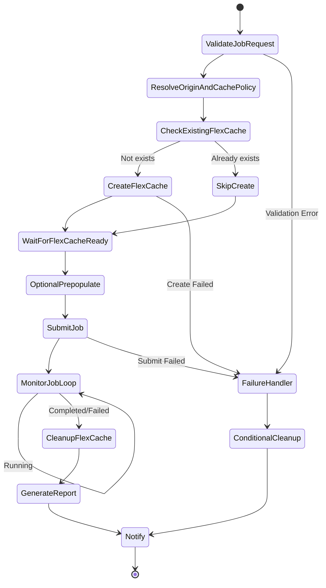

# Dynamic FlexCache Render / EDA Workflow

🌐 **Language / 言語**: [日本語](README.md) | [English](README.en.md) | [한국어](README.ko.md) | 简体中文 | [繁體中文](README.zh-TW.md) | [Français](README.fr.md) | [Deutsch](README.de.md) | [Español](README.es.md)

## 概述

在提交渲染/EDA/仿真作业时，通过 ONTAP REST API 动态创建 FlexCache 卷，并在作业完成后自动删除的工作流。使用 AWS Step Functions 实现 NVIDIA 式的按作业缓存管理模式。

## 为什么要按作业创建 FlexCache

| 理由 | 说明 |
|------|------|
| 成本优化 | 仅在作业执行时产生存储成本 |
| 数据隔离 | 按项目/作业隔离缓存 |
| 安全性 | 作业完成后不残留数据 |
| 运维简化 | 防止产生孤立卷（orphan volume） |
| 性能优化 | 仅 prepopulate 作业所需的数据 |

## 作业结束后删除 FlexCache 的理由

- **成本**: 避免为不必要的存储容量付费
- **安全性**: 防止敏感数据的缓存残留
- **容量管理**: 防止聚合（aggregate）容量耗尽
- **运维**: 防止孤立卷（orphan volume）累积

## 架构



## 用户门户的作用

用户门户（API Gateway HTTP API）提供以下功能:
- 接收作业请求（JSON 载荷）
- 查询作业状态
- 确认 FlexCache 状态
- 获取报告

## ONTAP REST API 的作用

- FlexCache 创建: `POST /api/storage/flexcache/flexcaches`
- FlexCache 删除: `DELETE /api/storage/flexcache/flexcaches/{uuid}`
- 作业监控: `GET /api/cluster/jobs/{uuid}`
- Prepopulate: `PATCH /api/storage/flexcache/flexcaches/{uuid}`

## FSx for ONTAP S3 AP 的作用

- 作业执行期间的数据读取（经由 Lambda）
- 作业结果分析与报告生成
- 元数据提取与质量检查

## 目录结构

```
dynamic-flexcache-render-workflow/
├── README.md
├── template.yaml                      # CloudFormation 模板
├── src/
│   ├── portal_api/handler.py          # 作业请求接收 API
│   ├── create_flexcache/handler.py    # FlexCache 创建 Lambda
│   ├── submit_job/handler.py          # 作业提交 Lambda
│   ├── monitor_job/handler.py         # 作业监控 Lambda
│   ├── cleanup_flexcache/handler.py   # FlexCache 删除 Lambda
│   └── report/handler.py             # 报告生成 Lambda
├── events/
│   ├── sample-render-job-request.json
│   ├── sample-eda-job-request.json
│   └── sample-cleanup-request.json
├── tests/
│   ├── test_create_flexcache.py
│   ├── test_cleanup_flexcache.py
│   └── test_monitor_job.py
└── docs/
    ├── architecture.md
    ├── workflow-design.md
    ├── ontap-rest-api-design.md
    ├── poc-checklist.md
    ├── demo-guide.md
    ├── failure-handling.md
    ├── security-design.md
    └── cost-optimization.md
```

## 快速开始

### 部署

```bash
# 前提: 需要 AWS SAM CLI。'sam build' 会自动打包代码和共享层。
sam build

sam deploy \
  --stack-name dynamic-flexcache-workflow-demo \
  --capabilities CAPABILITY_NAMED_IAM \
  --resolve-s3 \
  --parameter-overrides \
    OntapManagementIp=10.0.0.1 \
    OntapSecretName=fsxn/ontap-credentials \
    OriginSvmName=svm1 \
    OriginVolumeName=render_assets \
    CacheSvmName=svm1 \
    SimulationMode=true
```

> **注意**: `template.yaml` 用于 SAM CLI（`sam build` + `sam deploy`）。
> 若使用 `aws cloudformation deploy` 命令直接部署，请使用 `template-deploy.yaml`（需要预先打包 Lambda zip 文件并上传到 S3）。

### 作业提交

```bash
aws stepfunctions start-execution \
  --state-machine-arn <STATE_MACHINE_ARN> \
  --input file://events/sample-render-job-request.json
```

## 成本优化

- FlexCache 仅在作业执行时存在 → 最小化存储成本
- 将 Prepopulate 对象限定为必要目录
- 定期检测并删除孤立的 FlexCache
- 仅 Lambda/Step Functions 的执行成本（无服务器）

## 安全性

- 使用 Secrets Manager 管理 ONTAP 认证信息
- IAM least privilege
- ONTAP RBAC 最小权限角色
- 作业完成后自动删除数据
- 默认启用 TLS 验证

## 未来扩展

- AWS Deadline Cloud 集成
- AWS Batch 集成
- IBM Spectrum LSF 集成
- Slurm 集成
- EDA regression scheduler 集成

## 相关链接

- [FlexCache AnyCast / DR 模式](../flexcache-anycast-dr/README.md)
- [支持矩阵](../docs/support-matrix-fsx-ontap-flexcache-s3ap.md)
- [行业·工作负载映射](../docs/industry-workload-mapping.md)
- [media-vfx/](../media-vfx/README.md)
- [semiconductor-eda/](../semiconductor-eda/README.md)

## Success Metrics

### Outcome
通过按作业动态创建·删除 FlexCache，规避渲染/EDA 工作流的 I/O 争用，实现成本优化。

### Metrics
| 指标 | 目标值（示例） |
|-----------|------------|
| FlexCache 创建时间 | < 30 seconds |
| 作业完成时间缩短 | > 20% |
| FlexCache 删除成功率 | 100% |
| 成本 / 作业 | 较传统降低 30% |
| Human Review 对象率 | N/A（自动化模式） |

### Measurement Method
Step Functions 执行历史、ONTAP REST API 响应、CloudWatch Metrics、成本比较。

---

## 成本估算（月度概算）

> **备注**: 以下为 ap-northeast-1 区域的概算，实际成本因使用量而异。最新价格请在 [AWS Pricing Calculator](https://calculator.aws/) 确认。

### 无服务器组件（按量计费）

| 服务 | 单价 | 预计使用量 | 月度概算 |
|---------|------|-----------|---------|
| Lambda | $0.0000166667/GB-sec | 4 函数 × 10 jobs/天 | ~$1-5 |
| S3 API (GetObject/ListObjects) | $0.0047/10K requests | ~10K requests/天 | ~$1.5 |
| Step Functions | $0.025/1K state transitions | ~1K transitions/天 | ~$0.75 |
| Bedrock (Nova Lite) | $0.00006/1K input tokens | N/A | ~$3-10 |
| Athena | $5/TB scanned | N/A | ~$0.5-2 |
| SNS | $0.50/100K notifications | ~100 notifications/天 | ~$0.15 |
| CloudWatch Logs | $0.76/GB ingested | ~1 GB/月 | ~$0.76 |
| FlexCache 卷 | 包含在 FSx for ONTAP 存储费用中 |

### 固定成本（FSx for ONTAP — 以现有环境为前提）

| 组件 | 月度 |
|--------------|------|
| FSx for ONTAP (128 MBps, 1 TB) | ~$230 (共享现有环境) |
| S3 Access Point | 无额外费用（仅 S3 API 费用） |

### 合计概算

| 配置 | 月度概算 |
|------|---------|
| 最小配置（每日 1 次执行） | ~$5-15 |
| 标准配置（每小时执行） | ~$15-50 |
| 大规模配置（高频 + 告警） | ~$50-150 |

> **Governance Caveat**: 成本估算为概算，并非保证值。实际账单金额因使用模式、数据量、区域而异。

---

## 本地测试

### Prerequisites 检查

```bash
# 确认前提条件
aws --version          # AWS CLI v2
sam --version          # SAM CLI
python3 --version      # Python 3.9+
docker --version       # Docker (sam local 用)
aws sts get-caller-identity  # AWS 认证信息
```

### sam local invoke

```bash
# 构建
# 前提: 需要 AWS SAM CLI。'sam build' 会自动打包代码和共享层。
sam build

# 本地执行 Discovery Lambda
sam local invoke DiscoveryFunction --event events/discovery-event.json

# 带环境变量覆盖
sam local invoke DiscoveryFunction \
  --event events/discovery-event.json \
  --env-vars env.json
```

### 单元测试

```bash
python3 -m pytest tests/ -v
```

详情请参阅 [本地测试快速开始](../docs/local-testing-quick-start.md)。

---

## 输出示例 (Output Sample)

FlexCache 动态预置 + 渲染作业的输出示例:

```json
{
  "flexcache_provision": {
    "cache_name": "render-job-2026-0523-001",
    "origin_volume": "vfx-assets-vol1",
    "cache_size_gb": 100,
    "status": "online",
    "provision_time_sec": 45
  },
  "job_execution": {
    "job_id": "render-2026-0523-001",
    "frames_total": 240,
    "frames_completed": 240,
    "status": "completed",
    "duration_sec": 1800
  },
  "cleanup": {
    "cache_deleted": true,
    "cleanup_time_sec": 12
  },
  "cost_estimate": {
    "cache_hours": 0.5,
    "estimated_cost_usd": 0.15
  }
}
```

> **备注**: 上述为示例输出，实际值因环境·输入数据而异。基准数值为 sizing reference，并非 service limit。

---

## Performance Considerations

- FSx for ONTAP 的吞吐容量在 NFS/SMB/S3AP 之间共享
- 经由 S3 Access Point 的延迟会产生数十毫秒的开销
- 处理大量文件时，请通过 Step Functions Map state 的 MaxConcurrency 控制并行度
- 增大 Lambda 内存大小也有助于提升网络带宽

> **备注**: 本模式的性能数值为 sizing reference，并非 service limit。实际环境中的性能因 FSx for ONTAP 吞吐容量、网络配置、并发工作负载而异。

---

## Governance Note

> 本模式提供技术架构指导。它不是法律、合规或监管建议。组织应咨询合格的专业人士。
