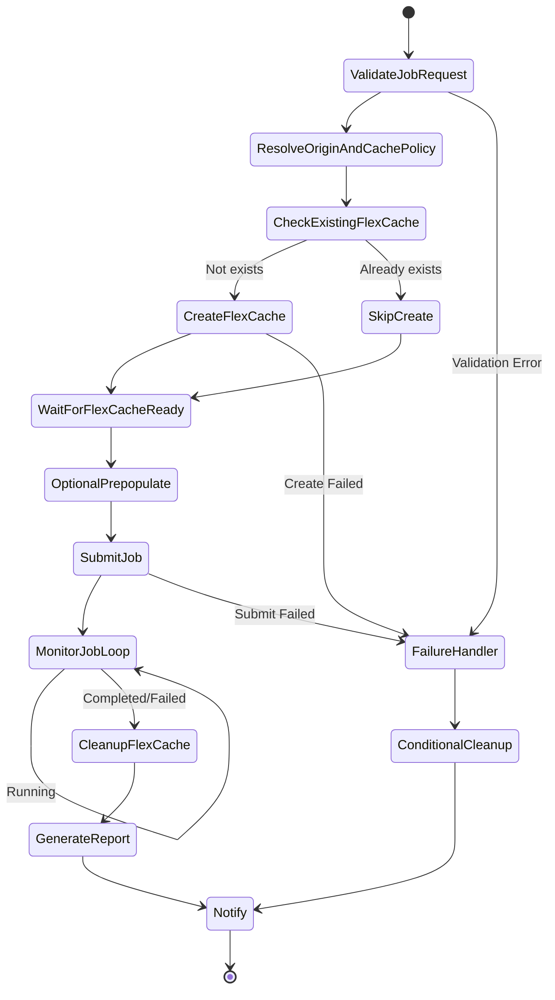

# Dynamic FlexCache Render / EDA Workflow

🌐 **Language / 言語**: [日本語](README.md) | [English](README.en.md) | [한국어](README.ko.md) | [简体中文](README.zh-CN.md) | 繁體中文 | [Français](README.fr.md) | [Deutsch](README.de.md) | [Español](README.es.md)

## 概述

在提交算圖/EDA/模擬作業時，透過 ONTAP REST API 動態建立 FlexCache 磁碟區，並在作業完成後自動刪除的工作流程。使用 AWS Step Functions 實作 NVIDIA 式的按作業快取管理模式。

## 為什麼要按作業建立 FlexCache

| 理由 | 說明 |
|------|------|
| 成本最佳化 | 僅在作業執行時產生儲存成本 |
| 資料隔離 | 按專案/作業隔離快取 |
| 安全性 | 作業完成後不殘留資料 |
| 維運簡化 | 防止產生孤立磁碟區（orphan volume） |
| 效能最佳化 | 僅 prepopulate 作業所需的資料 |

## 作業結束後刪除 FlexCache 的理由

- **成本**: 避免為不必要的儲存容量付費
- **安全性**: 防止機密資料的快取殘留
- **容量管理**: 防止彙總（aggregate）容量耗盡
- **維運**: 防止孤立磁碟區（orphan volume）累積

## 架構



## 使用者入口網站的角色

使用者入口網站（API Gateway HTTP API）提供以下功能:
- 接收作業請求（JSON 酬載）
- 查詢作業狀態
- 確認 FlexCache 狀態
- 取得報告

## ONTAP REST API 的角色

- FlexCache 建立: `POST /api/storage/flexcache/flexcaches`
- FlexCache 刪除: `DELETE /api/storage/flexcache/flexcaches/{uuid}`
- 作業監控: `GET /api/cluster/jobs/{uuid}`
- Prepopulate: `PATCH /api/storage/flexcache/flexcaches/{uuid}`

## FSx for ONTAP S3 AP 的角色

- 作業執行期間的資料讀取（經由 Lambda）
- 作業結果分析與報告產生
- 中繼資料擷取與品質檢查

## 目錄結構

```
dynamic-flexcache-render-workflow/
├── README.md
├── template.yaml                      # CloudFormation 範本
├── src/
│   ├── portal_api/handler.py          # 作業請求接收 API
│   ├── create_flexcache/handler.py    # FlexCache 建立 Lambda
│   ├── submit_job/handler.py          # 作業提交 Lambda
│   ├── monitor_job/handler.py         # 作業監控 Lambda
│   ├── cleanup_flexcache/handler.py   # FlexCache 刪除 Lambda
│   └── report/handler.py             # 報告產生 Lambda
├── events/
│   ├── sample-render-job-request.json
│   ├── sample-eda-job-request.json
│   └── sample-cleanup-request.json
├── tests/
│   ├── test_create_flexcache.py
│   ├── test_cleanup_flexcache.py
│   └── test_monitor_job.py
└── docs/
    ├── architecture.md
    ├── workflow-design.md
    ├── ontap-rest-api-design.md
    ├── poc-checklist.md
    ├── demo-guide.md
    ├── failure-handling.md
    ├── security-design.md
    └── cost-optimization.md
```

## 快速開始

### 部署

```bash
# 前提: 需要 AWS SAM CLI。'sam build' 會自動封裝程式碼和共用層。
sam build

sam deploy \
  --stack-name dynamic-flexcache-workflow-demo \
  --capabilities CAPABILITY_NAMED_IAM \
  --resolve-s3 \
  --parameter-overrides \
    OntapManagementIp=10.0.0.1 \
    OntapSecretName=fsxn/ontap-credentials \
    OriginSvmName=svm1 \
    OriginVolumeName=render_assets \
    CacheSvmName=svm1 \
    SimulationMode=true
```

> **注意**: `template.yaml` 用於 SAM CLI（`sam build` + `sam deploy`）。
> 若使用 `aws cloudformation deploy` 命令直接部署，請使用 `template-deploy.yaml`（需要預先封裝 Lambda zip 檔案並上傳到 S3）。

### 作業提交

```bash
aws stepfunctions start-execution \
  --state-machine-arn <STATE_MACHINE_ARN> \
  --input file://events/sample-render-job-request.json
```

## 成本最佳化

- FlexCache 僅在作業執行時存在 → 最小化儲存成本
- 將 Prepopulate 對象限定為必要目錄
- 定期偵測並刪除孤立的 FlexCache
- 僅 Lambda/Step Functions 的執行成本（無伺服器）

## 安全性

- 使用 Secrets Manager 管理 ONTAP 認證資訊
- IAM least privilege
- ONTAP RBAC 最小權限角色
- 作業完成後自動刪除資料
- 預設啟用 TLS 驗證

## 未來擴充

- AWS Deadline Cloud 整合
- AWS Batch 整合
- IBM Spectrum LSF 整合
- Slurm 整合
- EDA regression scheduler 整合

## 相關連結

- [FlexCache AnyCast / DR 模式](../flexcache-anycast-dr/README.md)
- [支援矩陣](../docs/support-matrix-fsx-ontap-flexcache-s3ap.md)
- [產業·工作負載對應](../docs/industry-workload-mapping.md)
- [media-vfx/](../media-vfx/README.md)
- [semiconductor-eda/](../semiconductor-eda/README.md)

## Success Metrics

### Outcome
透過按作業動態建立·刪除 FlexCache，規避算圖/EDA 工作流程的 I/O 爭用，實現成本最佳化。

### Metrics
| 指標 | 目標值（範例） |
|-----------|------------|
| FlexCache 建立時間 | < 30 seconds |
| 作業完成時間縮短 | > 20% |
| FlexCache 刪除成功率 | 100% |
| 成本 / 作業 | 較傳統降低 30% |
| Human Review 對象率 | N/A（自動化模式） |

### Measurement Method
Step Functions 執行歷程、ONTAP REST API 回應、CloudWatch Metrics、成本比較。

---

## 成本估算（月費概算）

> **備註**: 以下為 ap-northeast-1 區域的概算，實際成本因使用量而異。最新價格請於 [AWS Pricing Calculator](https://calculator.aws/) 確認。

### 無伺服器元件（按量計費）

| 服務 | 單價 | 預計使用量 | 月費概算 |
|---------|------|-----------|---------|
| Lambda | $0.0000166667/GB-sec | 4 函式 × 10 jobs/天 | ~$1-5 |
| S3 API (GetObject/ListObjects) | $0.0047/10K requests | ~10K requests/天 | ~$1.5 |
| Step Functions | $0.025/1K state transitions | ~1K transitions/天 | ~$0.75 |
| Bedrock (Nova Lite) | $0.00006/1K input tokens | N/A | ~$3-10 |
| Athena | $5/TB scanned | N/A | ~$0.5-2 |
| SNS | $0.50/100K notifications | ~100 notifications/天 | ~$0.15 |
| CloudWatch Logs | $0.76/GB ingested | ~1 GB/月 | ~$0.76 |
| FlexCache 磁碟區 | 包含在 FSx for ONTAP 儲存費用中 |

### 固定成本（FSx for ONTAP — 以現有環境為前提）

| 元件 | 月費 |
|--------------|------|
| FSx for ONTAP (128 MBps, 1 TB) | ~$230 (共用現有環境) |
| S3 Access Point | 無額外費用（僅 S3 API 費用） |

### 合計概算

| 組態 | 月費概算 |
|------|---------|
| 最小組態（每日 1 次執行） | ~$5-15 |
| 標準組態（每小時執行） | ~$15-50 |
| 大規模組態（高頻 + 警示） | ~$50-150 |

> **Governance Caveat**: 成本估算為概算，並非保證值。實際帳單金額因使用模式、資料量、區域而異。

---

## 本機測試

### Prerequisites 檢查

```bash
# 確認前提條件
aws --version          # AWS CLI v2
sam --version          # SAM CLI
python3 --version      # Python 3.9+
docker --version       # Docker (sam local 用)
aws sts get-caller-identity  # AWS 認證資訊
```

### sam local invoke

```bash
# 建置
# 前提: 需要 AWS SAM CLI。'sam build' 會自動封裝程式碼和共用層。
sam build

# 本機執行 Discovery Lambda
sam local invoke DiscoveryFunction --event events/discovery-event.json

# 附帶環境變數覆寫
sam local invoke DiscoveryFunction \
  --event events/discovery-event.json \
  --env-vars env.json
```

### 單元測試

```bash
python3 -m pytest tests/ -v
```

詳情請參閱 [本機測試快速開始](../docs/local-testing-quick-start.md)。

---

## 輸出範例 (Output Sample)

FlexCache 動態佈建 + 算圖作業的輸出範例:

```json
{
  "flexcache_provision": {
    "cache_name": "render-job-2026-0523-001",
    "origin_volume": "vfx-assets-vol1",
    "cache_size_gb": 100,
    "status": "online",
    "provision_time_sec": 45
  },
  "job_execution": {
    "job_id": "render-2026-0523-001",
    "frames_total": 240,
    "frames_completed": 240,
    "status": "completed",
    "duration_sec": 1800
  },
  "cleanup": {
    "cache_deleted": true,
    "cleanup_time_sec": 12
  },
  "cost_estimate": {
    "cache_hours": 0.5,
    "estimated_cost_usd": 0.15
  }
}
```

> **備註**: 上述為範例輸出，實際值因環境·輸入資料而異。基準數值為 sizing reference，並非 service limit。

---

## Performance Considerations

- FSx for ONTAP 的輸送量容量在 NFS/SMB/S3AP 之間共用
- 經由 S3 Access Point 的延遲會產生數十毫秒的額外負擔
- 處理大量檔案時，請透過 Step Functions Map state 的 MaxConcurrency 控制平行度
- 增大 Lambda 記憶體大小也有助於提升網路頻寬

> **備註**: 本模式的效能數值為 sizing reference，並非 service limit。實際環境中的效能因 FSx for ONTAP 輸送量容量、網路組態、並行工作負載而異。

---

## Governance Note

> 本模式提供技術架構指導。它不是法律、合規或法規建議。組織應諮詢合格的專業人士。
