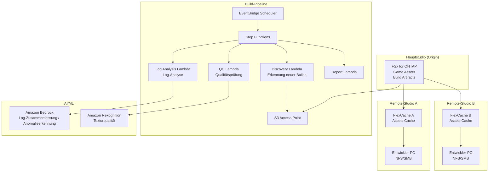

# Gaming Build Pipeline — Gemeinsame Nutzung von Spiel-Assets und Build-Pipeline

🌐 **Language / 言語**: [日本語](README.md) | [English](README.en.md) | [한국어](README.ko.md) | [简体中文](README.zh-CN.md) | [繁體中文](README.zh-TW.md) | [Français](README.fr.md) | Deutsch | [Español](README.es.md)

## Überblick

Ein Muster, das Spiel-Assets (Texturen, Modelle, Shader, Build-Artefakte) auf dem Dateiserver eines Spielentwicklungsstudios (FSx for ONTAP) mit FlexCache studioübergreifend gemeinsam nutzt und die Qualitätsprüfung sowie Log-Analyse der Build-Pipeline über S3 Access Points automatisiert.

## Gelöste Herausforderungen

| Herausforderung | Lösung durch dieses Muster |
|------|-------------------|
| Asset-Synchronisationsverzögerung zwischen globalen Studios | Standortübergreifendes Caching mit FlexCache |
| Manuelle Qualitätsprüfung von Build-Artefakten | Automatisiertes QC mit S3 AP + Lambda |
| Analyse von Shader-Kompilierungslogs | Automatisierte Analyse mit Athena + Bedrock |
| Speicher-Engpass der CI/CD-Pipeline | Beschleunigtes Lesen mit FlexCache |
| Zunehmende Komplexität der Asset-Versionsverwaltung | Automatische Metadatenextraktion und Katalogisierung |

## Architektur



## Klassifizierung von Spiel-Assets

| Asset-Typ | Zugriffsmuster | FlexCache anwendbar | S3-AP-Nutzung |
|------------|---------------|:---:|:---:|
| Texturen (.png, .tga, .dds) | Leselastig | ✅ | ✅ Qualitätsprüfung |
| 3D-Modelle (.fbx, .obj, .usd) | Leselastig | ✅ | ⚠️ Binär |
| Shader (.hlsl, .glsl) | Leselastig | ✅ | ✅ Kompilierungslogs |
| Build-Artefakte (.exe, .pak) | Schreiben → Verteilen | ❌ | ✅ Metadaten |
| CI-Logs (.log, .json) | Schreiben → Analysieren | ❌ | ✅ Analyse |
| Animationen (.anim, .fbx) | Leselastig | ✅ | ⚠️ Binär |

## Rolle von FlexCache

- Cacht Assets des Hauptstudios auf Remote-Studios
- Beschleunigt umfangreiche Lesevorgänge von Build-Servern
- Verbessert die Arbeitsumgebung der Artists (geringe Latenz)
- Speist die Automatisierung der Build-Pipeline über S3 AP

## Erwartete Vorteile

| KPI | Ohne FlexCache | Mit FlexCache | Verbesserung |
|-----|--------------|---------------|--------|
| Asset-Synchronisationszeit | 30-60 Min. | 3-5 Min. | 90% |
| Build-Zeit | 45 Min. | 25 Min. | 44% |
| Wartezeit der Artists | 5-10 Min./Datei | <1 Min. | 80% |
| WAN-Transfer/Tag | 200GB | 20GB | 90% |

## Verzeichnisstruktur

```
gaming-build-pipeline/
├── README.md
├── template.yaml
├── functions/
│   ├── discovery/handler.py
│   ├── quality_check/handler.py
│   ├── log_analysis/handler.py
│   └── report/handler.py
├── tests/
├── events/
│   └── sample-input.json
└── docs/
    ├── architecture.md
    ├── demo-guide.md
    └── poc-checklist.md
```

## Unterstützte Spiel-Engines

- Unreal Engine 5
- Unity
- Godot
- Benutzerdefinierte Engines

## Verwandte Links

- [media-vfx/](../media-vfx/README.md) — Rendering-Pipeline
- [Dynamic FlexCache Render Workflow](../dynamic-flexcache-render-workflow/README.md)
- [FlexCache AnyCast / DR](../flexcache-anycast-dr/README.md)
- [Branchen-·Workload-Zuordnung](../docs/industry-workload-mapping.md)


## Success Metrics

### Outcome
Optimierung des Qualitätsmanagements der Build-Pipeline durch Automatisierung der Qualitätsprüfung von Spiel-Assets und der Log-Analyse.

### Metrics
| Metrik | Zielwert (Beispiel) |
|-----------|------------|
| Von QC verarbeitete Assets / Ausführung | > 500 assets |
| Bestehensquote der Qualitätsprüfung | > 95% |
| Verarbeitungszeit der Log-Analyse | < 5 Min. |
| Früherkennungsrate von Build-Qualitätsproblemen | > 80% |
| Human-Review-Quote | < 10% (qualitativ nicht bestandene Assets) |

### Measurement Method
Step-Functions-Ausführungsverlauf, QC-Ergebnismetadaten, Log-Analyseberichte, CloudWatch Metrics.


---

## Links zur AWS-Dokumentation

| Dienst | Dokumentation |
|---------|------------|
| FSx for ONTAP | [Benutzerhandbuch](https://docs.aws.amazon.com/fsx/latest/ONTAPGuide/what-is-fsx-ontap.html) |
| S3 Access Points for FSx for ONTAP | [S3-AP-Leitfaden](https://docs.aws.amazon.com/fsx/latest/ONTAPGuide/s3-access-points.html) |
| Amazon Rekognition | [Entwicklerhandbuch](https://docs.aws.amazon.com/rekognition/latest/dg/what-is.html) |
| Amazon Bedrock | [Benutzerhandbuch](https://docs.aws.amazon.com/bedrock/latest/userguide/what-is-bedrock.html) |
| Amazon GameLift | [Entwicklerhandbuch](https://docs.aws.amazon.com/gamelift/latest/developerguide/gamelift-intro.html) |
| Step Functions | [Entwicklerhandbuch](https://docs.aws.amazon.com/step-functions/latest/dg/welcome.html) |

### Well-Architected-Framework-Konformität

| Säule | Konformität |
|----|------|
| Operative Exzellenz | Strukturierte Logs, CloudWatch Metrics, Build-Log-Analyse |
| Sicherheit | IAM mit geringsten Rechten, KMS-Verschlüsselung, Asset-Schutz |
| Zuverlässigkeit | Step Functions Retry/Catch, Map-state-Parallelverarbeitung |
| Leistungseffizienz | Lambda ARM64, parallelisierte Texturqualitätsprüfungen |
| Kostenoptimierung | Serverlos, On-Demand-Ausführung |
| Nachhaltigkeit | Automatisches Löschen nicht benötigter Build-Artefakte |

### Verwandte AWS-Lösungen

- [AWS for Games](https://aws.amazon.com/gametech/)
- [Amazon GameLift](https://aws.amazon.com/gamelift/)
- [AWS Game Tech Blog](https://aws.amazon.com/blogs/gametech/)


---

## Kostenschätzung (monatliche Näherung)

> **Hinweis**: Die folgenden Werte sind Näherungen für die Region ap-northeast-1; die tatsächlichen Kosten variieren je nach Nutzung. Prüfen Sie die aktuellen Preise mit dem [AWS Pricing Calculator](https://calculator.aws/).

### Serverlose Komponenten (nutzungsbasiert)

| Dienst | Stückpreis | Geschätzte Nutzung | Monatliche Näherung |
|---------|------|-----------|---------|
| Lambda | $0.0000166667/GB-sec | 4 Funktionen × 50 assets/Tag | ~$1-5 |
| S3 API (GetObject/ListObjects) | $0.0047/10K requests | ~10K requests/Tag | ~$1.5 |
| Step Functions | $0.025/1K state transitions | ~1K transitions/Tag | ~$0.75 |
| Bedrock (Nova Lite) | $0.00006/1K input tokens | ~30K tokens/Ausführung | ~$3-10 |
| Athena | $5/TB scanned | N/A | ~$0.5-2 |
| SNS | $0.50/100K notifications | ~100 notifications/Tag | ~$0.15 |
| CloudWatch Logs | $0.76/GB ingested | ~1 GB/Monat | ~$0.76 |
| Rekognition | $0.001/image |


### Fixkosten (FSx for ONTAP — vorhandene Umgebung vorausgesetzt)

| Komponente | Monatlich |
|--------------|------|
| FSx for ONTAP (128 MBps, 1 TB) | ~$230 (gemeinsame Nutzung einer vorhandenen Umgebung) |
| S3 Access Point | Keine zusätzlichen Gebühren (nur S3-API-Gebühren) |

### Gesamtnäherung

| Konfiguration | Monatliche Näherung |
|------|---------|
| Minimalkonfiguration (einmal täglich) | ~$5-15 |
| Standardkonfiguration (stündliche Ausführung) | ~$15-50 |
| Großkonfiguration (hohe Frequenz + Alarme) | ~$50-150 |

> **Governance Caveat**: Kostenschätzungen sind Näherungswerte, keine garantierten Werte. Die tatsächliche Abrechnung variiert je nach Nutzungsmuster, Datenvolumen und Region.

---

## Lokales Testen

### Prerequisites-Prüfung

```bash
# Voraussetzungen prüfen
aws --version          # AWS CLI v2
sam --version          # SAM CLI
python3 --version      # Python 3.9+
docker --version       # Docker (für sam local)
aws sts get-caller-identity  # AWS-Anmeldeinformationen
```

### sam local invoke

```bash
# Build
# Voraussetzung: AWS SAM CLI erforderlich. 'sam build' paketiert den Code automatisch.
sam build

# Discovery Lambda lokal ausführen
sam local invoke DiscoveryFunction --event events/discovery-event.json

# Mit Überschreibung von Umgebungsvariablen
sam local invoke DiscoveryFunction \
  --event events/discovery-event.json \
  --env-vars env.json
```

### Unit-Tests

```bash
python3 -m pytest tests/ -v
```

Weitere Einzelheiten finden Sie im [Schnellstart für lokales Testen](../docs/local-testing-quick-start.md).

---

## Ausgabebeispiel (Output Sample)

Beispielausgabe einer Qualitätsprüfung der Spiel-Build-Pipeline:

```json
{
  "discovery": {
    "status": "completed",
    "object_count": 30,
    "categories": {"texture": 15, "model": 8, "build_log": 7}
  },
  "texture_qc": [
    {
      "key": "builds/v2.1/textures/character_hero.dds",
      "resolution": "4096x4096",
      "format": "BC7",
      "mip_levels": 12,
      "quality_score": 0.95,
      "issues": []
    }
  ],
  "build_log_analysis": {
    "total_warnings": 23,
    "total_errors": 0,
    "critical_issues": [],
    "build_time_sec": 1847,
    "asset_count": 1234
  },
  "report": {
    "build_version": "v2.1",
    "overall_quality": "PASS",
    "textures_passed": 14,
    "textures_failed": 1,
    "recommendation": "1 texture below minimum resolution - review before release"
  }
}
```

> **Hinweis**: Das Obige ist eine Beispielausgabe; die tatsächlichen Werte variieren je nach Umgebung und Eingabedaten. Benchmark-Zahlen sind eine sizing reference, kein service limit.

---

## Performance Considerations

- Die Durchsatzkapazität von FSx for ONTAP wird von NFS/SMB/S3AP gemeinsam genutzt
- Der Zugriff über einen S3 Access Point verursacht einen Latenz-Overhead von einigen zehn Millisekunden
- Steuern Sie bei der Verarbeitung großer Dateimengen den Parallelitätsgrad über MaxConcurrency des Step Functions Map state
- Eine Erhöhung der Lambda-Speichergröße trägt auch zur Verbesserung der Netzwerkbandbreite bei

> **Hinweis**: Die Leistungszahlen dieses Musters sind eine sizing reference, kein service limit. Die tatsächliche Leistung variiert je nach Durchsatzkapazität von FSx for ONTAP, Netzwerkkonfiguration und gleichzeitigen Workloads.

---

## Bereitstellung

Stellen Sie mit dem AWS SAM CLI bereit (ersetzen Sie die Platzhalter entsprechend Ihrer Umgebung):

```bash
# Voraussetzung: AWS SAM CLI erforderlich. 'sam build' paketiert den Code automatisch.
sam build

sam deploy \
  --stack-name fsxn-gaming-build-pipeline \
  --parameter-overrides \
    S3AccessPointAlias=<your-s3ap-alias> \
    S3AccessPointName=<your-s3ap-name> \
    NotificationEmail=<your-email@example.com> \
  --capabilities CAPABILITY_NAMED_IAM \
  --resolve-s3 \
  --region <your-region>
```

> **Hinweis**: `template.yaml` ist für die Verwendung mit dem SAM CLI (`sam build` + `sam deploy`) vorgesehen.
> Um direkt mit dem Befehl `aws cloudformation deploy` bereitzustellen, verwenden Sie stattdessen `template-deploy.yaml` (erfordert das Vor-Paketieren der Lambda-Zip-Dateien und deren Hochladen zu S3).

## Governance Note

> Dieses Muster bietet technische Architekturberatung. Es stellt keine rechtliche, Compliance- oder regulatorische Beratung dar. Organisationen sollten qualifizierte Fachleute konsultieren.
