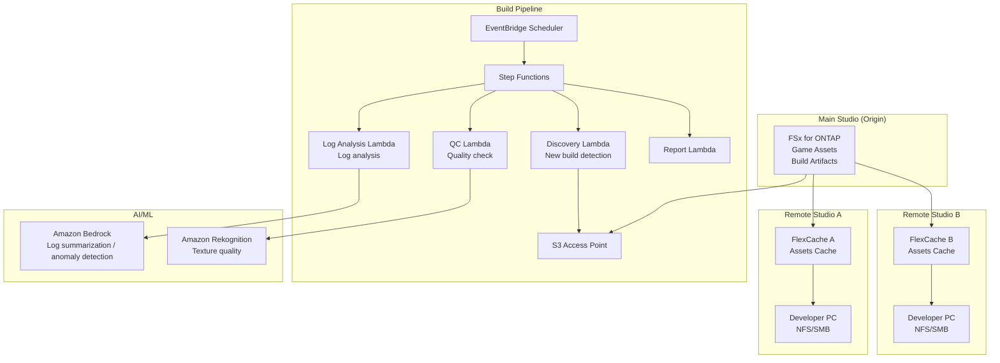

# Gaming Build Pipeline — Game Asset Sharing & Build Pipeline

🌐 **Language / 言語**: [日本語](README.md) | English | [한국어](README.ko.md) | [简体中文](README.zh-CN.md) | [繁體中文](README.zh-TW.md) | [Français](README.fr.md) | [Deutsch](README.de.md) | [Español](README.es.md)

## Overview

A pattern that shares game assets (textures, models, shaders, build artifacts) on a game development studio's file server (FSx for ONTAP) across global studios with FlexCache, and automates build pipeline quality checks and log analysis via S3 Access Points.

## Problems Solved

| Problem | Solution with this pattern |
|------|-------------------|
| Asset sync latency between global studios | Site-to-site caching with FlexCache |
| Manual quality checks of build artifacts | Automated QC with S3 AP + Lambda |
| Shader compile log analysis | Automated analysis with Athena + Bedrock |
| Storage bottleneck in the CI/CD pipeline | Faster reads with FlexCache |
| Growing complexity of asset version management | Automatic metadata extraction and cataloging |

## Architecture



## Game Asset Categories

| Asset type | Access pattern | FlexCache applies | S3 AP usage |
|------------|---------------|:---:|:---:|
| Textures (.png, .tga, .dds) | Read-heavy | ✅ | ✅ Quality check |
| 3D models (.fbx, .obj, .usd) | Read-heavy | ✅ | ⚠️ Binary |
| Shaders (.hlsl, .glsl) | Read-heavy | ✅ | ✅ Compile logs |
| Build artifacts (.exe, .pak) | Write → distribute | ❌ | ✅ Metadata |
| CI logs (.log, .json) | Write → analyze | ❌ | ✅ Analysis |
| Animations (.anim, .fbx) | Read-heavy | ✅ | ⚠️ Binary |

## Role of FlexCache

- Caches main-studio assets to remote studios
- Accelerates high-volume reads from build servers
- Improves the artists' working environment (low latency)
- Feeds build pipeline automation via S3 AP

## Expected Benefits

| KPI | Without FlexCache | With FlexCache | Improvement |
|-----|--------------|---------------|--------|
| Asset sync time | 30-60 min | 3-5 min | 90% |
| Build time | 45 min | 25 min | 44% |
| Artist wait time | 5-10 min/file | <1 min | 80% |
| WAN transfer/day | 200GB | 20GB | 90% |

## Directory Structure

```
gaming-build-pipeline/
├── README.md
├── template.yaml
├── functions/
│   ├── discovery/handler.py
│   ├── quality_check/handler.py
│   ├── log_analysis/handler.py
│   └── report/handler.py
├── tests/
├── events/
│   └── sample-input.json
└── docs/
    ├── architecture.md
    ├── demo-guide.md
    └── poc-checklist.md
```

## Target Game Engines

- Unreal Engine 5
- Unity
- Godot
- Custom engines

## Related Links

- [media-vfx/](../media-vfx/README.md) — Rendering pipeline
- [Dynamic FlexCache Render Workflow](../dynamic-flexcache-render-workflow/README.md)
- [FlexCache AnyCast / DR](../flexcache-anycast-dr/README.md)
- [Industry & Workload Mapping](../docs/industry-workload-mapping.md)


## Success Metrics

### Outcome
Streamline build pipeline quality management by automating game asset quality checks and log analysis.

### Metrics
| Metric | Target (example) |
|-----------|------------|
| Assets processed by QC / execution | > 500 assets |
| Quality check pass rate | > 95% |
| Log analysis processing time | < 5 min |
| Early detection rate of build quality issues | > 80% |
| Human Review rate | < 10% (quality-failed assets) |

### Measurement Method
Step Functions execution history, QC result metadata, log analysis reports, CloudWatch Metrics.


---

## AWS Documentation Links

| Service | Documentation |
|---------|------------|
| FSx for ONTAP | [User Guide](https://docs.aws.amazon.com/fsx/latest/ONTAPGuide/what-is-fsx-ontap.html) |
| S3 Access Points for FSx for ONTAP | [S3 AP Guide](https://docs.aws.amazon.com/fsx/latest/ONTAPGuide/s3-access-points.html) |
| Amazon Rekognition | [Developer Guide](https://docs.aws.amazon.com/rekognition/latest/dg/what-is.html) |
| Amazon Bedrock | [User Guide](https://docs.aws.amazon.com/bedrock/latest/userguide/what-is-bedrock.html) |
| Amazon GameLift | [Developer Guide](https://docs.aws.amazon.com/gamelift/latest/developerguide/gamelift-intro.html) |
| Step Functions | [Developer Guide](https://docs.aws.amazon.com/step-functions/latest/dg/welcome.html) |

### Well-Architected Framework Alignment

| Pillar | Alignment |
|----|------|
| Operational Excellence | Structured logging, CloudWatch Metrics, build log analysis |
| Security | IAM least privilege, KMS encryption, asset protection |
| Reliability | Step Functions Retry/Catch, Map state parallelism |
| Performance Efficiency | Lambda ARM64, parallelized texture quality checks |
| Cost Optimization | Serverless, on-demand execution |
| Sustainability | Automatic deletion of unneeded build artifacts |

### Related AWS Solutions

- [AWS for Games](https://aws.amazon.com/gametech/)
- [Amazon GameLift](https://aws.amazon.com/gamelift/)
- [AWS Game Tech Blog](https://aws.amazon.com/blogs/gametech/)


---

## Cost Estimate (Monthly Approximation)

> **Note**: The following are approximations for the ap-northeast-1 region; actual costs vary by usage. Check the latest pricing with the [AWS Pricing Calculator](https://calculator.aws/).

### Serverless Components (Pay-as-you-go)

| Service | Unit price | Estimated usage | Monthly approx. |
|---------|------|-----------|---------|
| Lambda | $0.0000166667/GB-sec | 4 functions × 50 assets/day | ~$1-5 |
| S3 API (GetObject/ListObjects) | $0.0047/10K requests | ~10K requests/day | ~$1.5 |
| Step Functions | $0.025/1K state transitions | ~1K transitions/day | ~$0.75 |
| Bedrock (Nova Lite) | $0.00006/1K input tokens | ~30K tokens/execution | ~$3-10 |
| Athena | $5/TB scanned | N/A | ~$0.5-2 |
| SNS | $0.50/100K notifications | ~100 notifications/day | ~$0.15 |
| CloudWatch Logs | $0.76/GB ingested | ~1 GB/month | ~$0.76 |
| Rekognition | $0.001/image |


### Fixed Costs (FSx for ONTAP — Assumes Existing Environment)

| Component | Monthly |
|--------------|------|
| FSx for ONTAP (128 MBps, 1 TB) | ~$230 (shared existing environment) |
| S3 Access Point | No additional charge (S3 API charges only) |

### Total Approximation

| Configuration | Monthly approx. |
|------|---------|
| Minimal (once daily) | ~$5-15 |
| Standard (hourly) | ~$15-50 |
| Large-scale (high frequency + alarms) | ~$50-150 |

> **Governance Caveat**: Cost estimates are approximations, not guaranteed values. Actual billing varies by usage pattern, data volume, and region.

---

## Local Testing

### Prerequisites Check

```bash
# Check prerequisites
aws --version          # AWS CLI v2
sam --version          # SAM CLI
python3 --version      # Python 3.9+
docker --version       # Docker (for sam local)
aws sts get-caller-identity  # AWS credentials
```

### sam local invoke

```bash
# Build
# Prerequisite: AWS SAM CLI required. 'sam build' packages the code automatically.
sam build

# Run the Discovery Lambda locally
sam local invoke DiscoveryFunction --event events/discovery-event.json

# With environment variable overrides
sam local invoke DiscoveryFunction \
  --event events/discovery-event.json \
  --env-vars env.json
```

### Unit Tests

```bash
python3 -m pytest tests/ -v
```

See [Local Testing Quick Start](../docs/local-testing-quick-start.md) for details.

---

## Output Sample

Example output of a game build pipeline quality check:

```json
{
  "discovery": {
    "status": "completed",
    "object_count": 30,
    "categories": {"texture": 15, "model": 8, "build_log": 7}
  },
  "texture_qc": [
    {
      "key": "builds/v2.1/textures/character_hero.dds",
      "resolution": "4096x4096",
      "format": "BC7",
      "mip_levels": 12,
      "quality_score": 0.95,
      "issues": []
    }
  ],
  "build_log_analysis": {
    "total_warnings": 23,
    "total_errors": 0,
    "critical_issues": [],
    "build_time_sec": 1847,
    "asset_count": 1234
  },
  "report": {
    "build_version": "v2.1",
    "overall_quality": "PASS",
    "textures_passed": 14,
    "textures_failed": 1,
    "recommendation": "1 texture below minimum resolution - review before release"
  }
}
```

> **Note**: The above is sample output; actual values vary by environment and input data. Benchmark figures are a sizing reference, not a service limit.

---

## Performance Considerations

- FSx for ONTAP throughput capacity is shared across NFS/SMB/S3AP
- Access via an S3 Access Point incurs tens of milliseconds of latency overhead
- When processing large numbers of files, control the degree of parallelism with the Step Functions Map state MaxConcurrency
- Increasing Lambda memory size also improves network bandwidth

> **Note**: The performance figures in this pattern are a sizing reference, not a service limit. Real-world performance varies by FSx for ONTAP throughput capacity, network configuration, and concurrent workloads.

---

## Deployment

Deploy with the AWS SAM CLI (replace the placeholders for your environment):

```bash
# Prerequisite: AWS SAM CLI required. 'sam build' packages the code automatically.
sam build

sam deploy \
  --stack-name fsxn-gaming-build-pipeline \
  --parameter-overrides \
    S3AccessPointAlias=<your-s3ap-alias> \
    S3AccessPointName=<your-s3ap-name> \
    NotificationEmail=<your-email@example.com> \
  --capabilities CAPABILITY_NAMED_IAM \
  --resolve-s3 \
  --region <your-region>
```

> **Note**: `template.yaml` is for use with the SAM CLI (`sam build` + `sam deploy`).
> To deploy directly with the `aws cloudformation deploy` command, use `template-deploy.yaml` instead (requires pre-packaging Lambda zip files and uploading them to S3).

## Governance Note

> This pattern provides technical architecture guidance. It is not legal, compliance, or regulatory advice. Organizations should consult qualified professionals.
