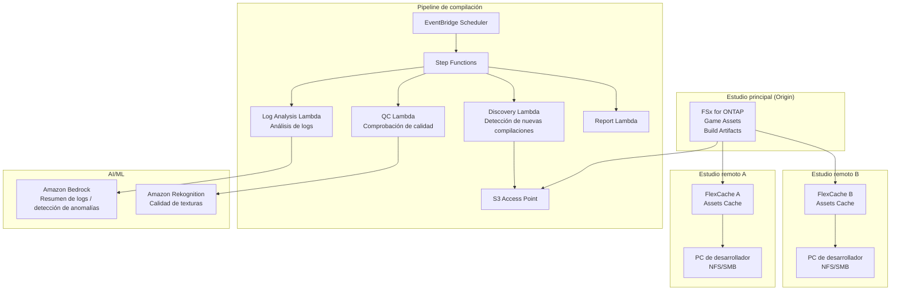

# Gaming Build Pipeline — Uso compartido de activos de juego y pipeline de compilación

🌐 **Language / 言語**: [日本語](README.md) | [English](README.en.md) | [한국어](README.ko.md) | [简体中文](README.zh-CN.md) | [繁體中文](README.zh-TW.md) | [Français](README.fr.md) | [Deutsch](README.de.md) | Español

## Descripción general

Un patrón que comparte activos de juego (texturas, modelos, shaders, artefactos de compilación) del servidor de archivos de un estudio de desarrollo de juegos (FSx for ONTAP) entre estudios globales con FlexCache, y automatiza las comprobaciones de calidad y el análisis de logs del pipeline de compilación mediante S3 Access Points.

## Problemas resueltos

| Problema | Solución con este patrón |
|------|-------------------|
| Latencia de sincronización de activos entre estudios globales | Almacenamiento en caché entre sitios con FlexCache |
| Comprobación manual de calidad de artefactos de compilación | QC automatizado con S3 AP + Lambda |
| Análisis de logs de compilación de shaders | Análisis automatizado con Athena + Bedrock |
| Cuello de botella de almacenamiento del pipeline CI/CD | Lectura acelerada con FlexCache |
| Creciente complejidad de la gestión de versiones de activos | Extracción y catalogación automáticas de metadatos |

## Arquitectura



## Clasificación de activos de juego

| Tipo de activo | Patrón de acceso | FlexCache aplicable | Uso de S3 AP |
|------------|---------------|:---:|:---:|
| Texturas (.png, .tga, .dds) | Lectura intensiva | ✅ | ✅ Comprobación de calidad |
| Modelos 3D (.fbx, .obj, .usd) | Lectura intensiva | ✅ | ⚠️ Binario |
| Shaders (.hlsl, .glsl) | Lectura intensiva | ✅ | ✅ Logs de compilación |
| Artefactos de compilación (.exe, .pak) | Escritura → distribución | ❌ | ✅ Metadatos |
| Logs de CI (.log, .json) | Escritura → análisis | ❌ | ✅ Análisis |
| Animaciones (.anim, .fbx) | Lectura intensiva | ✅ | ⚠️ Binario |

## Rol de FlexCache

- Almacena en caché los activos del estudio principal en los estudios remotos
- Acelera las lecturas masivas desde los servidores de compilación
- Mejora el entorno de trabajo de los artistas (baja latencia)
- Alimenta la automatización del pipeline de compilación mediante S3 AP

## Beneficios esperados

| KPI | Sin FlexCache | Con FlexCache | Mejora |
|-----|--------------|---------------|--------|
| Tiempo de sincronización de activos | 30-60 min | 3-5 min | 90% |
| Tiempo de compilación | 45 min | 25 min | 44% |
| Tiempo de espera de los artistas | 5-10 min/archivo | <1 min | 80% |
| Transferencia WAN/día | 200GB | 20GB | 90% |

## Estructura de directorios

```
gaming-build-pipeline/
├── README.md
├── template.yaml
├── functions/
│   ├── discovery/handler.py
│   ├── quality_check/handler.py
│   ├── log_analysis/handler.py
│   └── report/handler.py
├── tests/
├── events/
│   └── sample-input.json
└── docs/
    ├── architecture.md
    ├── demo-guide.md
    └── poc-checklist.md
```

## Motores de juego compatibles

- Unreal Engine 5
- Unity
- Godot
- Motores personalizados

## Enlaces relacionados

- [media-vfx/](../media-vfx/README.md) — Pipeline de renderizado
- [Dynamic FlexCache Render Workflow](../dynamic-flexcache-render-workflow/README.md)
- [FlexCache AnyCast / DR](../flexcache-anycast-dr/README.md)
- [Mapeo de sectores·cargas de trabajo](../docs/industry-workload-mapping.md)


## Success Metrics

### Outcome
Optimizar la gestión de calidad del pipeline de compilación mediante la automatización de las comprobaciones de calidad de los activos de juego y el análisis de logs.

### Metrics
| Métrica | Valor objetivo (ejemplo) |
|-----------|------------|
| Activos procesados por QC / ejecución | > 500 assets |
| Tasa de aprobación de la comprobación de calidad | > 95% |
| Tiempo de procesamiento del análisis de logs | < 5 min |
| Tasa de detección temprana de problemas de calidad de compilación | > 80% |
| Tasa de Human Review | < 10% (activos no conformes) |

### Measurement Method
Historial de ejecución de Step Functions, metadatos de resultados de QC, informes de análisis de logs, CloudWatch Metrics.


---

## Enlaces a la documentación de AWS

| Servicio | Documentación |
|---------|------------|
| FSx for ONTAP | [Guía del usuario](https://docs.aws.amazon.com/fsx/latest/ONTAPGuide/what-is-fsx-ontap.html) |
| S3 Access Points for FSx for ONTAP | [Guía de S3 AP](https://docs.aws.amazon.com/fsx/latest/ONTAPGuide/s3-access-points.html) |
| Amazon Rekognition | [Guía para desarrolladores](https://docs.aws.amazon.com/rekognition/latest/dg/what-is.html) |
| Amazon Bedrock | [Guía del usuario](https://docs.aws.amazon.com/bedrock/latest/userguide/what-is-bedrock.html) |
| Amazon GameLift | [Guía para desarrolladores](https://docs.aws.amazon.com/gamelift/latest/developerguide/gamelift-intro.html) |
| Step Functions | [Guía para desarrolladores](https://docs.aws.amazon.com/step-functions/latest/dg/welcome.html) |

### Conformidad con Well-Architected Framework

| Pilar | Conformidad |
|----|------|
| Excelencia operativa | Logs estructurados, CloudWatch Metrics, análisis de logs de compilación |
| Seguridad | IAM de privilegio mínimo, cifrado KMS, protección de activos |
| Fiabilidad | Step Functions Retry/Catch, procesamiento en paralelo con Map state |
| Eficiencia del rendimiento | Lambda ARM64, paralelización de las comprobaciones de calidad de texturas |
| Optimización de costos | Sin servidor, ejecución bajo demanda |
| Sostenibilidad | Eliminación automática de artefactos de compilación innecesarios |

### Soluciones de AWS relacionadas

- [AWS for Games](https://aws.amazon.com/gametech/)
- [Amazon GameLift](https://aws.amazon.com/gamelift/)
- [AWS Game Tech Blog](https://aws.amazon.com/blogs/gametech/)


---

## Estimación de costos (aproximación mensual)

> **Nota**: Los siguientes son valores aproximados para la región ap-northeast-1; los costos reales varían según el uso. Consulte los precios más recientes con la [AWS Pricing Calculator](https://calculator.aws/).

### Componentes sin servidor (pago por uso)

| Servicio | Precio unitario | Uso estimado | Aprox. mensual |
|---------|------|-----------|---------|
| Lambda | $0.0000166667/GB-sec | 4 funciones × 50 assets/día | ~$1-5 |
| S3 API (GetObject/ListObjects) | $0.0047/10K requests | ~10K requests/día | ~$1.5 |
| Step Functions | $0.025/1K state transitions | ~1K transitions/día | ~$0.75 |
| Bedrock (Nova Lite) | $0.00006/1K input tokens | ~30K tokens/ejecución | ~$3-10 |
| Athena | $5/TB scanned | N/A | ~$0.5-2 |
| SNS | $0.50/100K notifications | ~100 notifications/día | ~$0.15 |
| CloudWatch Logs | $0.76/GB ingested | ~1 GB/mes | ~$0.76 |
| Rekognition | $0.001/image |


### Costos fijos (FSx for ONTAP — se asume entorno existente)

| Componente | Mensual |
|--------------|------|
| FSx for ONTAP (128 MBps, 1 TB) | ~$230 (uso compartido de un entorno existente) |
| S3 Access Point | Sin cargo adicional (solo cargos de S3 API) |

### Aproximación total

| Configuración | Aprox. mensual |
|------|---------|
| Configuración mínima (una vez al día) | ~$5-15 |
| Configuración estándar (ejecución por hora) | ~$15-50 |
| Configuración a gran escala (alta frecuencia + alarmas) | ~$50-150 |

> **Governance Caveat**: Las estimaciones de costos son aproximaciones, no valores garantizados. La facturación real varía según el patrón de uso, el volumen de datos y la región.

---

## Pruebas locales

### Comprobación de Prerequisites

```bash
# Comprobar los requisitos previos
aws --version          # AWS CLI v2
sam --version          # SAM CLI
python3 --version      # Python 3.9+
docker --version       # Docker (para sam local)
aws sts get-caller-identity  # Credenciales de AWS
```

### sam local invoke

```bash
# Compilación
# Requisito previo: se necesita AWS SAM CLI. 'sam build' empaqueta el código automáticamente.
sam build

# Ejecutar la Discovery Lambda localmente
sam local invoke DiscoveryFunction --event events/discovery-event.json

# Con sobrescritura de variables de entorno
sam local invoke DiscoveryFunction \
  --event events/discovery-event.json \
  --env-vars env.json
```

### Pruebas unitarias

```bash
python3 -m pytest tests/ -v
```

Para más detalles, consulte el [Inicio rápido de pruebas locales](../docs/local-testing-quick-start.md).

---

## Muestra de salida (Output Sample)

Ejemplo de salida de una comprobación de calidad del pipeline de compilación de juego:

```json
{
  "discovery": {
    "status": "completed",
    "object_count": 30,
    "categories": {"texture": 15, "model": 8, "build_log": 7}
  },
  "texture_qc": [
    {
      "key": "builds/v2.1/textures/character_hero.dds",
      "resolution": "4096x4096",
      "format": "BC7",
      "mip_levels": 12,
      "quality_score": 0.95,
      "issues": []
    }
  ],
  "build_log_analysis": {
    "total_warnings": 23,
    "total_errors": 0,
    "critical_issues": [],
    "build_time_sec": 1847,
    "asset_count": 1234
  },
  "report": {
    "build_version": "v2.1",
    "overall_quality": "PASS",
    "textures_passed": 14,
    "textures_failed": 1,
    "recommendation": "1 texture below minimum resolution - review before release"
  }
}
```

> **Nota**: Lo anterior es una salida de muestra; los valores reales varían según el entorno y los datos de entrada. Las cifras de referencia son una sizing reference, no un service limit.

---

## Performance Considerations

- La capacidad de rendimiento de FSx for ONTAP se comparte entre NFS/SMB/S3AP
- El acceso a través de un S3 Access Point genera una sobrecarga de latencia de decenas de milisegundos
- Al procesar grandes cantidades de archivos, controle el grado de paralelismo con MaxConcurrency del Step Functions Map state
- Aumentar el tamaño de memoria de Lambda también contribuye a mejorar el ancho de banda de red

> **Nota**: Las cifras de rendimiento de este patrón son una sizing reference, no un service limit. El rendimiento en entornos reales varía según la capacidad de rendimiento de FSx for ONTAP, la configuración de red y las cargas de trabajo concurrentes.

---

## Implementación

Implemente con el AWS SAM CLI (reemplace los marcadores de posición según su entorno):

```bash
# Requisito previo: se necesita AWS SAM CLI. 'sam build' empaqueta el código automáticamente.
sam build

sam deploy \
  --stack-name fsxn-gaming-build-pipeline \
  --parameter-overrides \
    S3AccessPointAlias=<your-s3ap-alias> \
    S3AccessPointName=<your-s3ap-name> \
    NotificationEmail=<your-email@example.com> \
  --capabilities CAPABILITY_NAMED_IAM \
  --resolve-s3 \
  --region <your-region>
```

> **Nota**: `template.yaml` está diseñado para su uso con el SAM CLI (`sam build` + `sam deploy`).
> Para implementar directamente con el comando `aws cloudformation deploy`, use `template-deploy.yaml` en su lugar (requiere empaquetar previamente los archivos zip de Lambda y subirlos a S3).

## Governance Note

> Este patrón proporciona orientación de arquitectura técnica. No constituye asesoramiento legal, de cumplimiento ni regulatorio. Las organizaciones deben consultar a profesionales cualificados.
