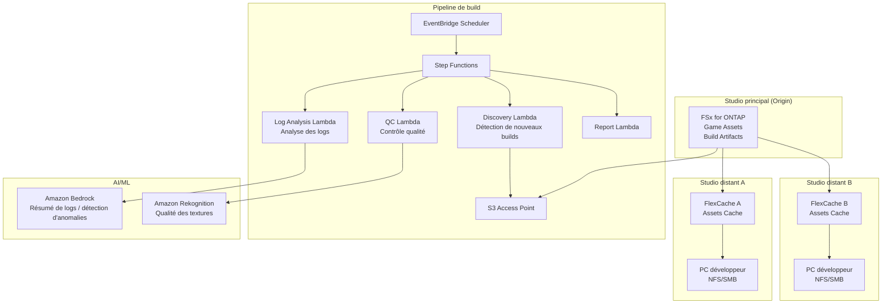

# Gaming Build Pipeline — Partage d'assets de jeu et pipeline de build

🌐 **Language / 言語**: [日本語](README.md) | [English](README.en.md) | [한국어](README.ko.md) | [简体中文](README.zh-CN.md) | [繁體中文](README.zh-TW.md) | Français | [Deutsch](README.de.md) | [Español](README.es.md)

## Aperçu

Un modèle qui partage les assets de jeu (textures, modèles, shaders, artefacts de build) présents sur le serveur de fichiers d'un studio de développement de jeux (FSx for ONTAP) entre studios mondiaux avec FlexCache, et automatise les contrôles qualité et l'analyse des logs du pipeline de build via S3 Access Points.

## Problèmes résolus

| Problème | Résolution par ce modèle |
|------|-------------------|
| Latence de synchronisation des assets entre studios mondiaux | Mise en cache inter-sites avec FlexCache |
| Contrôle qualité manuel des artefacts de build | QC automatisé avec S3 AP + Lambda |
| Analyse des logs de compilation des shaders | Analyse automatisée avec Athena + Bedrock |
| Goulet d'étranglement de stockage du pipeline CI/CD | Lecture accélérée avec FlexCache |
| Complexité croissante de la gestion des versions d'assets | Extraction et catalogage automatiques des métadonnées |

## Architecture



## Classification des assets de jeu

| Type d'asset | Modèle d'accès | FlexCache applicable | Usage de S3 AP |
|------------|---------------|:---:|:---:|
| Textures (.png, .tga, .dds) | Lecture intensive | ✅ | ✅ Contrôle qualité |
| Modèles 3D (.fbx, .obj, .usd) | Lecture intensive | ✅ | ⚠️ Binaire |
| Shaders (.hlsl, .glsl) | Lecture intensive | ✅ | ✅ Logs de compilation |
| Artefacts de build (.exe, .pak) | Écriture → distribution | ❌ | ✅ Métadonnées |
| Logs CI (.log, .json) | Écriture → analyse | ❌ | ✅ Analyse |
| Animations (.anim, .fbx) | Lecture intensive | ✅ | ⚠️ Binaire |

## Rôle de FlexCache

- Met en cache les assets du studio principal vers les studios distants
- Accélère les lectures massives depuis les serveurs de build
- Améliore l'environnement de travail des artistes (faible latence)
- Alimente l'automatisation du pipeline de build via S3 AP

## Bénéfices attendus

| KPI | Sans FlexCache | Avec FlexCache | Amélioration |
|-----|--------------|---------------|--------|
| Temps de synchronisation des assets | 30-60 min | 3-5 min | 90% |
| Temps de build | 45 min | 25 min | 44% |
| Temps d'attente des artistes | 5-10 min/fichier | <1 min | 80% |
| Transfert WAN/jour | 200GB | 20GB | 90% |

## Structure des répertoires

```
gaming-build-pipeline/
├── README.md
├── template.yaml
├── functions/
│   ├── discovery/handler.py
│   ├── quality_check/handler.py
│   ├── log_analysis/handler.py
│   └── report/handler.py
├── tests/
├── events/
│   └── sample-input.json
└── docs/
    ├── architecture.md
    ├── demo-guide.md
    └── poc-checklist.md
```

## Moteurs de jeu pris en charge

- Unreal Engine 5
- Unity
- Godot
- Moteurs personnalisés

## Liens connexes

- [media-vfx/](../media-vfx/README.md) — Pipeline de rendu
- [Dynamic FlexCache Render Workflow](../dynamic-flexcache-render-workflow/README.md)
- [FlexCache AnyCast / DR](../flexcache-anycast-dr/README.md)
- [Cartographie secteurs·workloads](../docs/industry-workload-mapping.md)


## Success Metrics

### Outcome
Rationaliser la gestion de la qualité du pipeline de build en automatisant les contrôles qualité des assets de jeu et l'analyse des logs.

### Metrics
| Métrique | Valeur cible (exemple) |
|-----------|------------|
| Assets traités par QC / exécution | > 500 assets |
| Taux de réussite du contrôle qualité | > 95% |
| Temps de traitement de l'analyse des logs | < 5 min |
| Taux de détection précoce des problèmes de qualité de build | > 80% |
| Taux de Human Review | < 10% (assets non conformes) |

### Measurement Method
Historique d'exécution Step Functions, métadonnées des résultats QC, rapports d'analyse des logs, CloudWatch Metrics.


---

## Liens vers la documentation AWS

| Service | Documentation |
|---------|------------|
| FSx for ONTAP | [Guide de l'utilisateur](https://docs.aws.amazon.com/fsx/latest/ONTAPGuide/what-is-fsx-ontap.html) |
| S3 Access Points for FSx for ONTAP | [Guide S3 AP](https://docs.aws.amazon.com/fsx/latest/ONTAPGuide/s3-access-points.html) |
| Amazon Rekognition | [Guide du développeur](https://docs.aws.amazon.com/rekognition/latest/dg/what-is.html) |
| Amazon Bedrock | [Guide de l'utilisateur](https://docs.aws.amazon.com/bedrock/latest/userguide/what-is-bedrock.html) |
| Amazon GameLift | [Guide du développeur](https://docs.aws.amazon.com/gamelift/latest/developerguide/gamelift-intro.html) |
| Step Functions | [Guide du développeur](https://docs.aws.amazon.com/step-functions/latest/dg/welcome.html) |

### Conformité au Well-Architected Framework

| Pilier | Conformité |
|----|------|
| Excellence opérationnelle | Logs structurés, CloudWatch Metrics, analyse des logs de build |
| Sécurité | IAM moindre privilège, chiffrement KMS, protection des assets |
| Fiabilité | Step Functions Retry/Catch, traitement parallèle Map state |
| Efficacité des performances | Lambda ARM64, parallélisation des contrôles qualité des textures |
| Optimisation des coûts | Sans serveur, exécution à la demande |
| Durabilité | Suppression automatique des artefacts de build inutiles |

### Solutions AWS connexes

- [AWS for Games](https://aws.amazon.com/gametech/)
- [Amazon GameLift](https://aws.amazon.com/gamelift/)
- [AWS Game Tech Blog](https://aws.amazon.com/blogs/gametech/)


---

## Estimation des coûts (approximation mensuelle)

> **Remarque** : Les valeurs ci-dessous sont des approximations pour la région ap-northeast-1 ; les coûts réels varient selon l'utilisation. Vérifiez les derniers tarifs avec le [AWS Pricing Calculator](https://calculator.aws/).

### Composants sans serveur (paiement à l'usage)

| Service | Prix unitaire | Utilisation estimée | Approx. mensuelle |
|---------|------|-----------|---------|
| Lambda | $0.0000166667/GB-sec | 4 fonctions × 50 assets/jour | ~$1-5 |
| S3 API (GetObject/ListObjects) | $0.0047/10K requests | ~10K requests/jour | ~$1.5 |
| Step Functions | $0.025/1K state transitions | ~1K transitions/jour | ~$0.75 |
| Bedrock (Nova Lite) | $0.00006/1K input tokens | ~30K tokens/exécution | ~$3-10 |
| Athena | $5/TB scanned | N/A | ~$0.5-2 |
| SNS | $0.50/100K notifications | ~100 notifications/jour | ~$0.15 |
| CloudWatch Logs | $0.76/GB ingested | ~1 GB/mois | ~$0.76 |
| Rekognition | $0.001/image |


### Coûts fixes (FSx for ONTAP — environnement existant supposé)

| Composant | Mensuel |
|--------------|------|
| FSx for ONTAP (128 MBps, 1 TB) | ~$230 (partage d'un environnement existant) |
| S3 Access Point | Aucun frais supplémentaire (uniquement frais S3 API) |

### Approximation totale

| Configuration | Approx. mensuelle |
|------|---------|
| Configuration minimale (une fois par jour) | ~$5-15 |
| Configuration standard (exécution horaire) | ~$15-50 |
| Configuration à grande échelle (haute fréquence + alarmes) | ~$50-150 |

> **Governance Caveat** : Les estimations de coûts sont des approximations, pas des valeurs garanties. La facturation réelle varie selon le modèle d'utilisation, le volume de données et la région.

---

## Tests locaux

### Vérification des Prerequisites

```bash
# Vérifier les prérequis
aws --version          # AWS CLI v2
sam --version          # SAM CLI
python3 --version      # Python 3.9+
docker --version       # Docker (pour sam local)
aws sts get-caller-identity  # Identifiants AWS
```

### sam local invoke

```bash
# Build
# Prérequis : AWS SAM CLI requis. 'sam build' empaquette le code automatiquement.
sam build

# Exécuter la Discovery Lambda localement
sam local invoke DiscoveryFunction --event events/discovery-event.json

# Avec surcharge des variables d'environnement
sam local invoke DiscoveryFunction \
  --event events/discovery-event.json \
  --env-vars env.json
```

### Tests unitaires

```bash
python3 -m pytest tests/ -v
```

Pour plus de détails, consultez le [Démarrage rapide des tests locaux](../docs/local-testing-quick-start.md).

---

## Exemple de sortie (Output Sample)

Exemple de sortie d'un contrôle qualité du pipeline de build de jeu :

```json
{
  "discovery": {
    "status": "completed",
    "object_count": 30,
    "categories": {"texture": 15, "model": 8, "build_log": 7}
  },
  "texture_qc": [
    {
      "key": "builds/v2.1/textures/character_hero.dds",
      "resolution": "4096x4096",
      "format": "BC7",
      "mip_levels": 12,
      "quality_score": 0.95,
      "issues": []
    }
  ],
  "build_log_analysis": {
    "total_warnings": 23,
    "total_errors": 0,
    "critical_issues": [],
    "build_time_sec": 1847,
    "asset_count": 1234
  },
  "report": {
    "build_version": "v2.1",
    "overall_quality": "PASS",
    "textures_passed": 14,
    "textures_failed": 1,
    "recommendation": "1 texture below minimum resolution - review before release"
  }
}
```

> **Remarque** : Ce qui précède est un exemple de sortie ; les valeurs réelles varient selon l'environnement et les données d'entrée. Les chiffres de référence sont une sizing reference, pas une service limit.

---

## Performance Considerations

- La capacité de débit de FSx for ONTAP est partagée entre NFS/SMB/S3AP
- L'accès via un S3 Access Point entraîne une surcharge de latence de quelques dizaines de millisecondes
- Lors du traitement d'un grand nombre de fichiers, contrôlez le degré de parallélisme avec MaxConcurrency du Step Functions Map state
- L'augmentation de la taille mémoire de Lambda contribue aussi à améliorer la bande passante réseau

> **Remarque** : Les chiffres de performance de ce modèle sont une sizing reference, pas une service limit. Les performances réelles varient selon la capacité de débit de FSx for ONTAP, la configuration réseau et les charges de travail concurrentes.

---

## Déploiement

Déployez avec le AWS SAM CLI (remplacez les espaces réservés selon votre environnement) :

```bash
# Prérequis : AWS SAM CLI requis. 'sam build' empaquette le code automatiquement.
sam build

sam deploy \
  --stack-name fsxn-gaming-build-pipeline \
  --parameter-overrides \
    S3AccessPointAlias=<your-s3ap-alias> \
    S3AccessPointName=<your-s3ap-name> \
    NotificationEmail=<your-email@example.com> \
  --capabilities CAPABILITY_NAMED_IAM \
  --resolve-s3 \
  --region <your-region>
```

> **Note** : `template.yaml` est destiné à être utilisé avec le SAM CLI (`sam build` + `sam deploy`).
> Pour déployer directement avec la commande `aws cloudformation deploy`, utilisez `template-deploy.yaml` (nécessite un pré-empaquetage des fichiers zip Lambda et leur téléversement vers S3).

## Governance Note

> Ce modèle fournit des conseils d'architecture technique. Il ne s'agit pas de conseils juridiques, de conformité ou réglementaires. Les organisations doivent consulter des professionnels qualifiés.
