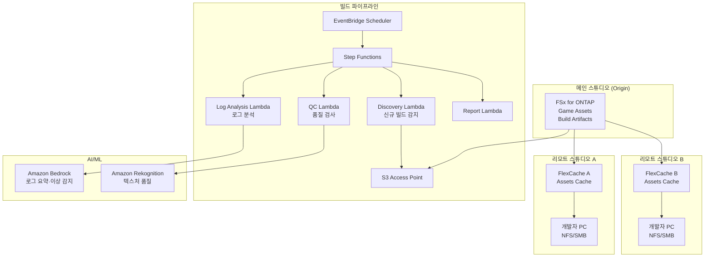

# Gaming Build Pipeline — 게임 에셋 공유·빌드 파이프라인

🌐 **Language / 言語**: [日本語](README.md) | [English](README.en.md) | 한국어 | [简体中文](README.zh-CN.md) | [繁體中文](README.zh-TW.md) | [Français](README.fr.md) | [Deutsch](README.de.md) | [Español](README.es.md)

## 개요

게임 개발 스튜디오의 파일 서버(FSx for ONTAP)에 있는 게임 에셋(텍스처, 모델, 셰이더, 빌드 산출물)을 FlexCache로 글로벌 스튜디오 간 공유하고, S3 Access Points를 통해 빌드 파이프라인의 품질 검사·로그 분석을 자동화하는 패턴입니다.

## 해결하는 과제

| 과제 | 본 패턴을 통한 해결 |
|------|-------------------|
| 글로벌 스튜디오 간 에셋 동기화 지연 | FlexCache로 거점 간 캐싱 |
| 빌드 산출물 품질 검사의 수작업화 | S3 AP + Lambda로 자동 QC |
| 셰이더 컴파일 로그 분석 | Athena + Bedrock으로 자동 분석 |
| CI/CD 파이프라인의 스토리지 병목 | FlexCache로 읽기 고속화 |
| 에셋 버전 관리의 복잡화 | 메타데이터 자동 추출·카탈로그화 |

## 아키텍처



## 게임 에셋 분류

| 에셋 종류 | 액세스 패턴 | FlexCache 적용 | S3 AP 사용 |
|------------|---------------|:---:|:---:|
| 텍스처 (.png, .tga, .dds) | 읽기 중심 | ✅ | ✅ 품질 검사 |
| 3D 모델 (.fbx, .obj, .usd) | 읽기 중심 | ✅ | ⚠️ 바이너리 |
| 셰이더 (.hlsl, .glsl) | 읽기 중심 | ✅ | ✅ 컴파일 로그 |
| 빌드 산출물 (.exe, .pak) | 쓰기 → 배포 | ❌ | ✅ 메타데이터 |
| CI 로그 (.log, .json) | 쓰기 → 분석 | ❌ | ✅ 분석 |
| 애니메이션 (.anim, .fbx) | 읽기 중심 | ✅ | ⚠️ 바이너리 |

## FlexCache의 역할

- 메인 스튜디오의 에셋을 리모트 스튜디오에 캐싱
- 빌드 서버의 대량 읽기를 고속화
- 아티스트의 작업 환경 개선(저지연)
- S3 AP를 통해 빌드 파이프라인 자동화에 제공

## 기대 효과

| KPI | FlexCache 없음 | FlexCache 있음 | 개선율 |
|-----|--------------|---------------|--------|
| 에셋 동기화 시간 | 30-60분 | 3-5분 | 90% |
| 빌드 시간 | 45분 | 25분 | 44% |
| 아티스트 대기 시간 | 5-10분/파일 | <1분 | 80% |
| WAN 전송량/일 | 200GB | 20GB | 90% |

## 디렉터리 구성

```
gaming-build-pipeline/
├── README.md
├── template.yaml
├── functions/
│   ├── discovery/handler.py
│   ├── quality_check/handler.py
│   ├── log_analysis/handler.py
│   └── report/handler.py
├── tests/
├── events/
│   └── sample-input.json
└── docs/
    ├── architecture.md
    ├── demo-guide.md
    └── poc-checklist.md
```

## 대상 게임 엔진

- Unreal Engine 5
- Unity
- Godot
- 커스텀 엔진

## 관련 링크

- [media-vfx/](../media-vfx/README.md) — 렌더링 파이프라인
- [Dynamic FlexCache Render Workflow](../dynamic-flexcache-render-workflow/README.md)
- [FlexCache AnyCast / DR](../flexcache-anycast-dr/README.md)
- [산업·워크로드 매핑](../docs/industry-workload-mapping.md)


## Success Metrics

### Outcome
게임 에셋 품질 검사·로그 분석의 자동화를 통해 빌드 파이프라인의 품질 관리를 효율화합니다.

### Metrics
| 메트릭 | 목표값(예시) |
|-----------|------------|
| QC 처리 에셋 수 / 실행 | > 500 assets |
| 품질 검사 통과율 | > 95% |
| 로그 분석 처리 시간 | < 5분 |
| 빌드 품질 문제의 조기 감지율 | > 80% |
| Human Review 대상 비율 | < 10%(품질 불합격 에셋) |

### Measurement Method
Step Functions 실행 이력, QC 결과 메타데이터, 로그 분석 리포트, CloudWatch Metrics.


---

## AWS 문서 링크

| 서비스 | 문서 |
|---------|------------|
| FSx for ONTAP | [사용 설명서](https://docs.aws.amazon.com/fsx/latest/ONTAPGuide/what-is-fsx-ontap.html) |
| S3 Access Points for FSx for ONTAP | [S3 AP 가이드](https://docs.aws.amazon.com/fsx/latest/ONTAPGuide/s3-access-points.html) |
| Amazon Rekognition | [개발자 가이드](https://docs.aws.amazon.com/rekognition/latest/dg/what-is.html) |
| Amazon Bedrock | [사용 설명서](https://docs.aws.amazon.com/bedrock/latest/userguide/what-is-bedrock.html) |
| Amazon GameLift | [개발자 가이드](https://docs.aws.amazon.com/gamelift/latest/developerguide/gamelift-intro.html) |
| Step Functions | [개발자 가이드](https://docs.aws.amazon.com/step-functions/latest/dg/welcome.html) |

### Well-Architected Framework 대응

| 기둥 | 대응 |
|----|------|
| 운영 우수성 | 구조화 로그, CloudWatch Metrics, 빌드 로그 분석 |
| 보안 | IAM 최소 권한, KMS 암호화, 에셋 보호 |
| 신뢰성 | Step Functions Retry/Catch, Map state 병렬 처리 |
| 성능 효율성 | Lambda ARM64, 텍스처 품질 검사 병렬화 |
| 비용 최적화 | 서버리스, 온디맨드 실행 |
| 지속 가능성 | 불필요한 빌드 아티팩트의 자동 삭제 |

### 관련 AWS 솔루션

- [AWS for Games](https://aws.amazon.com/gametech/)
- [Amazon GameLift](https://aws.amazon.com/gamelift/)
- [AWS Game Tech Blog](https://aws.amazon.com/blogs/gametech/)


---

## 비용 견적(월간 개산)

> **참고**: 아래는 ap-northeast-1 리전의 개산이며, 실제 비용은 사용량에 따라 다릅니다. 최신 요금은 [AWS Pricing Calculator](https://calculator.aws/)에서 확인하세요.

### 서버리스 컴포넌트(종량제)

| 서비스 | 단가 | 예상 사용량 | 월간 개산 |
|---------|------|-----------|---------|
| Lambda | $0.0000166667/GB-sec | 4 함수 × 50 assets/일 | ~$1-5 |
| S3 API (GetObject/ListObjects) | $0.0047/10K requests | ~10K requests/일 | ~$1.5 |
| Step Functions | $0.025/1K state transitions | ~1K transitions/일 | ~$0.75 |
| Bedrock (Nova Lite) | $0.00006/1K input tokens | ~30K tokens/실행 | ~$3-10 |
| Athena | $5/TB scanned | N/A | ~$0.5-2 |
| SNS | $0.50/100K notifications | ~100 notifications/일 | ~$0.15 |
| CloudWatch Logs | $0.76/GB ingested | ~1 GB/월 | ~$0.76 |
| Rekognition | $0.001/image |


### 고정 비용(FSx for ONTAP — 기존 환경 전제)

| 컴포넌트 | 월간 |
|--------------|------|
| FSx for ONTAP (128 MBps, 1 TB) | ~$230 (기존 환경 공유) |
| S3 Access Point | 추가 요금 없음(S3 API 요금만) |

### 합계 개산

| 구성 | 월간 개산 |
|------|---------|
| 최소 구성(일 1회 실행) | ~$5-15 |
| 표준 구성(시간별 실행) | ~$15-50 |
| 대규모 구성(고빈도 + 알람) | ~$50-150 |

> **Governance Caveat**: 비용 견적은 개산이며 보증값이 아닙니다. 실제 청구 금액은 사용 패턴, 데이터 양, 리전에 따라 다릅니다.

---

## 로컬 테스트

### Prerequisites 체크

```bash
# 전제 조건 확인
aws --version          # AWS CLI v2
sam --version          # SAM CLI
python3 --version      # Python 3.9+
docker --version       # Docker (sam local 용)
aws sts get-caller-identity  # AWS 자격 증명
```

### sam local invoke

```bash
# 빌드
# 전제: AWS SAM CLI가 필요합니다. sam build가 코드를 자동으로 패키징합니다.
sam build

# Discovery Lambda 로컬 실행
sam local invoke DiscoveryFunction --event events/discovery-event.json

# 환경 변수 오버라이드 포함
sam local invoke DiscoveryFunction \
  --event events/discovery-event.json \
  --env-vars env.json
```

### 유닛 테스트

```bash
python3 -m pytest tests/ -v
```

자세한 내용은 [로컬 테스트 퀵 스타트](../docs/local-testing-quick-start.md)를 참조하세요.

---

## 출력 샘플 (Output Sample)

게임 빌드 파이프라인 품질 검사의 출력 예시:

```json
{
  "discovery": {
    "status": "completed",
    "object_count": 30,
    "categories": {"texture": 15, "model": 8, "build_log": 7}
  },
  "texture_qc": [
    {
      "key": "builds/v2.1/textures/character_hero.dds",
      "resolution": "4096x4096",
      "format": "BC7",
      "mip_levels": 12,
      "quality_score": 0.95,
      "issues": []
    }
  ],
  "build_log_analysis": {
    "total_warnings": 23,
    "total_errors": 0,
    "critical_issues": [],
    "build_time_sec": 1847,
    "asset_count": 1234
  },
  "report": {
    "build_version": "v2.1",
    "overall_quality": "PASS",
    "textures_passed": 14,
    "textures_failed": 1,
    "recommendation": "1 texture below minimum resolution - review before release"
  }
}
```

> **참고**: 위는 샘플 출력이며, 실제 값은 환경·입력 데이터에 따라 다릅니다. 벤치마크 수치는 sizing reference이며 service limit이 아닙니다.

---

## Performance Considerations

- FSx for ONTAP의 스루풋 용량은 NFS/SMB/S3AP에서 공유됩니다
- S3 Access Point를 통한 레이턴시는 수십 밀리초의 오버헤드가 발생합니다
- 대량 파일 처리 시에는 Step Functions Map state의 MaxConcurrency로 병렬도를 제어하세요
- Lambda 메모리 크기 증가는 네트워크 대역폭 향상에도 기여합니다

> **참고**: 본 패턴의 성능 수치는 sizing reference이며 service limit이 아닙니다. 실제 환경에서의 성능은 FSx for ONTAP 스루풋 용량, 네트워크 구성, 동시 실행 워크로드에 따라 다릅니다.

---

## 배포

AWS SAM CLI로 배포합니다(플레이스홀더는 환경에 맞게 교체하세요):

```bash
# 전제: AWS SAM CLI가 필요합니다. sam build가 코드를 자동으로 패키징합니다.
sam build

sam deploy \
  --stack-name fsxn-gaming-build-pipeline \
  --parameter-overrides \
    S3AccessPointAlias=<your-s3ap-alias> \
    S3AccessPointName=<your-s3ap-name> \
    NotificationEmail=<your-email@example.com> \
  --capabilities CAPABILITY_NAMED_IAM \
  --resolve-s3 \
  --region <your-region>
```

> **주의**: `template.yaml`은 SAM CLI(`sam build` + `sam deploy`)로 사용합니다.
> `aws cloudformation deploy` 명령으로 직접 배포하려면 `template-deploy.yaml`을 사용하세요(Lambda zip 파일의 사전 패키징과 S3 업로드가 필요합니다).

## Governance Note

> 본 패턴은 기술 아키텍처 가이던스를 제공합니다. 법적·컴플라이언스·규제 관련 조언이 아닙니다. 조직은 적격한 전문가에게 상담하십시오.
