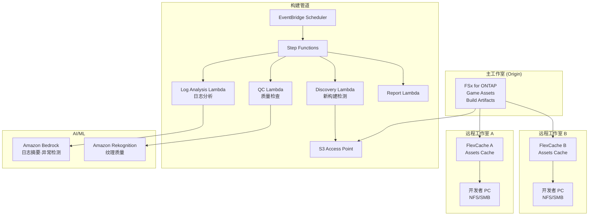

# Gaming Build Pipeline — 游戏资产共享·构建管道

🌐 **Language / 言語**: [日本語](README.md) | [English](README.en.md) | [한국어](README.ko.md) | 简体中文 | [繁體中文](README.zh-TW.md) | [Français](README.fr.md) | [Deutsch](README.de.md) | [Español](README.es.md)

## 概述

将游戏开发工作室文件服务器（FSx for ONTAP）上的游戏资产（纹理、模型、着色器、构建产物）通过 FlexCache 在全球工作室间共享，并通过 S3 Access Points 自动化构建管道的质量检查和日志分析的模式。

## 解决的课题

| 课题 | 本模式的解决方案 |
|------|-------------------|
| 全球工作室间的资产同步延迟 | 使用 FlexCache 进行站点间缓存 |
| 构建产物质量检查的手动化 | 使用 S3 AP + Lambda 自动 QC |
| 着色器编译日志分析 | 使用 Athena + Bedrock 自动分析 |
| CI/CD 管道的存储瓶颈 | 使用 FlexCache 加速读取 |
| 资产版本管理的复杂化 | 元数据自动提取·编目 |

## 架构



## 游戏资产分类

| 资产类型 | 访问模式 | FlexCache 适用 | S3 AP 使用 |
|------------|---------------|:---:|:---:|
| 纹理 (.png, .tga, .dds) | 读取为主 | ✅ | ✅ 质量检查 |
| 3D 模型 (.fbx, .obj, .usd) | 读取为主 | ✅ | ⚠️ 二进制 |
| 着色器 (.hlsl, .glsl) | 读取为主 | ✅ | ✅ 编译日志 |
| 构建产物 (.exe, .pak) | 写入 → 分发 | ❌ | ✅ 元数据 |
| CI 日志 (.log, .json) | 写入 → 分析 | ❌ | ✅ 分析 |
| 动画 (.anim, .fbx) | 读取为主 | ✅ | ⚠️ 二进制 |

## FlexCache 的作用

- 将主工作室的资产缓存到远程工作室
- 加速构建服务器的大量读取
- 改善美术师的工作环境（低延迟）
- 通过 S3 AP 为构建管道自动化提供数据

## 预期效果

| KPI | 无 FlexCache | 有 FlexCache | 改善率 |
|-----|--------------|---------------|--------|
| 资产同步时间 | 30-60分 | 3-5分 | 90% |
| 构建时间 | 45分 | 25分 | 44% |
| 美术师等待时间 | 5-10分/文件 | <1分 | 80% |
| WAN 传输量/天 | 200GB | 20GB | 90% |

## 目录结构

```
gaming-build-pipeline/
├── README.md
├── template.yaml
├── functions/
│   ├── discovery/handler.py
│   ├── quality_check/handler.py
│   ├── log_analysis/handler.py
│   └── report/handler.py
├── tests/
├── events/
│   └── sample-input.json
└── docs/
    ├── architecture.md
    ├── demo-guide.md
    └── poc-checklist.md
```

## 目标游戏引擎

- Unreal Engine 5
- Unity
- Godot
- 自定义引擎

## 相关链接

- [media-vfx/](../media-vfx/README.md) — 渲染管道
- [Dynamic FlexCache Render Workflow](../dynamic-flexcache-render-workflow/README.md)
- [FlexCache AnyCast / DR](../flexcache-anycast-dr/README.md)
- [行业·工作负载映射](../docs/industry-workload-mapping.md)


## Success Metrics

### Outcome
通过游戏资产质量检查·日志分析的自动化，提高构建管道的质量管理效率。

### Metrics
| 指标 | 目标值（示例） |
|-----------|------------|
| QC 处理资产数 / 执行 | > 500 assets |
| 质量检查通过率 | > 95% |
| 日志分析处理时间 | < 5 分 |
| 构建质量问题的早期检测率 | > 80% |
| Human Review 对象比率 | < 10%（质量不合格资产） |

### Measurement Method
Step Functions 执行历史、QC 结果元数据、日志分析报告、CloudWatch Metrics。


---

## AWS 文档链接

| 服务 | 文档 |
|---------|------------|
| FSx for ONTAP | [用户指南](https://docs.aws.amazon.com/fsx/latest/ONTAPGuide/what-is-fsx-ontap.html) |
| S3 Access Points for FSx for ONTAP | [S3 AP 指南](https://docs.aws.amazon.com/fsx/latest/ONTAPGuide/s3-access-points.html) |
| Amazon Rekognition | [开发者指南](https://docs.aws.amazon.com/rekognition/latest/dg/what-is.html) |
| Amazon Bedrock | [用户指南](https://docs.aws.amazon.com/bedrock/latest/userguide/what-is-bedrock.html) |
| Amazon GameLift | [开发者指南](https://docs.aws.amazon.com/gamelift/latest/developerguide/gamelift-intro.html) |
| Step Functions | [开发者指南](https://docs.aws.amazon.com/step-functions/latest/dg/welcome.html) |

### Well-Architected Framework 对应

| 支柱 | 对应 |
|----|------|
| 卓越运营 | 结构化日志、CloudWatch Metrics、构建日志分析 |
| 安全性 | IAM 最小权限、KMS 加密、资产保护 |
| 可靠性 | Step Functions Retry/Catch、Map state 并行处理 |
| 性能效率 | Lambda ARM64、纹理质量检查并行化 |
| 成本优化 | 无服务器、按需执行 |
| 可持续性 | 自动删除不需要的构建产物 |

### 相关 AWS 解决方案

- [AWS for Games](https://aws.amazon.com/gametech/)
- [Amazon GameLift](https://aws.amazon.com/gamelift/)
- [AWS Game Tech Blog](https://aws.amazon.com/blogs/gametech/)


---

## 成本估算（月度概算）

> **注记**: 以下为 ap-northeast-1 区域的概算，实际成本因使用量而异。最新价格请在 [AWS Pricing Calculator](https://calculator.aws/) 确认。

### 无服务器组件（按量付费）

| 服务 | 单价 | 预估使用量 | 月度概算 |
|---------|------|-----------|---------|
| Lambda | $0.0000166667/GB-sec | 4 函数 × 50 assets/天 | ~$1-5 |
| S3 API (GetObject/ListObjects) | $0.0047/10K requests | ~10K requests/天 | ~$1.5 |
| Step Functions | $0.025/1K state transitions | ~1K transitions/天 | ~$0.75 |
| Bedrock (Nova Lite) | $0.00006/1K input tokens | ~30K tokens/执行 | ~$3-10 |
| Athena | $5/TB scanned | N/A | ~$0.5-2 |
| SNS | $0.50/100K notifications | ~100 notifications/天 | ~$0.15 |
| CloudWatch Logs | $0.76/GB ingested | ~1 GB/月 | ~$0.76 |
| Rekognition | $0.001/image |


### 固定成本（FSx for ONTAP — 以现有环境为前提）

| 组件 | 月度 |
|--------------|------|
| FSx for ONTAP (128 MBps, 1 TB) | ~$230 (共享现有环境) |
| S3 Access Point | 无额外费用（仅 S3 API 费用） |

### 合计概算

| 配置 | 月度概算 |
|------|---------|
| 最小配置（每日 1 次执行） | ~$5-15 |
| 标准配置（每小时执行） | ~$15-50 |
| 大规模配置（高频 + 告警） | ~$50-150 |

> **Governance Caveat**: 成本估算为概算，并非保证值。实际账单金额因使用模式、数据量、区域而异。

---

## 本地测试

### Prerequisites 检查

```bash
# 确认前提条件
aws --version          # AWS CLI v2
sam --version          # SAM CLI
python3 --version      # Python 3.9+
docker --version       # Docker (sam local 用)
aws sts get-caller-identity  # AWS 凭证
```

### sam local invoke

```bash
# 构建
# 前提：需要 AWS SAM CLI。sam build 会自动打包代码。
sam build

# 本地执行 Discovery Lambda
sam local invoke DiscoveryFunction --event events/discovery-event.json

# 带环境变量覆盖
sam local invoke DiscoveryFunction \
  --event events/discovery-event.json \
  --env-vars env.json
```

### 单元测试

```bash
python3 -m pytest tests/ -v
```

详情请参阅 [本地测试快速入门](../docs/local-testing-quick-start.md)。

---

## 输出示例 (Output Sample)

游戏构建管道质量检查的输出示例:

```json
{
  "discovery": {
    "status": "completed",
    "object_count": 30,
    "categories": {"texture": 15, "model": 8, "build_log": 7}
  },
  "texture_qc": [
    {
      "key": "builds/v2.1/textures/character_hero.dds",
      "resolution": "4096x4096",
      "format": "BC7",
      "mip_levels": 12,
      "quality_score": 0.95,
      "issues": []
    }
  ],
  "build_log_analysis": {
    "total_warnings": 23,
    "total_errors": 0,
    "critical_issues": [],
    "build_time_sec": 1847,
    "asset_count": 1234
  },
  "report": {
    "build_version": "v2.1",
    "overall_quality": "PASS",
    "textures_passed": 14,
    "textures_failed": 1,
    "recommendation": "1 texture below minimum resolution - review before release"
  }
}
```

> **注记**: 以上为示例输出，实际值因环境·输入数据而异。基准数值为 sizing reference，并非 service limit。

---

## Performance Considerations

- FSx for ONTAP 的吞吐容量在 NFS/SMB/S3AP 之间共享
- 通过 S3 Access Point 的延迟会产生数十毫秒的开销
- 处理大量文件时，请通过 Step Functions Map state 的 MaxConcurrency 控制并行度
- 增加 Lambda 内存大小也有助于提升网络带宽

> **注记**: 本模式的性能数值为 sizing reference，并非 service limit。实际环境中的性能因 FSx for ONTAP 吞吐容量、网络配置、并发执行工作负载而异。

---

## 部署

使用 AWS SAM CLI 部署（请将占位符替换为您的环境值）:

```bash
# 前提：需要 AWS SAM CLI。sam build 会自动打包代码。
sam build

sam deploy \
  --stack-name fsxn-gaming-build-pipeline \
  --parameter-overrides \
    S3AccessPointAlias=<your-s3ap-alias> \
    S3AccessPointName=<your-s3ap-name> \
    NotificationEmail=<your-email@example.com> \
  --capabilities CAPABILITY_NAMED_IAM \
  --resolve-s3 \
  --region <your-region>
```

> **注意**: `template.yaml` 用于 SAM CLI（`sam build` + `sam deploy`）。
> 如需使用 `aws cloudformation deploy` 命令直接部署，请使用 `template-deploy.yaml`（需要预先打包 Lambda zip 文件并上传到 S3）。

## Governance Note

> 本模式提供技术架构指导。不构成法律·合规·监管建议。组织应咨询合格的专业人员。
