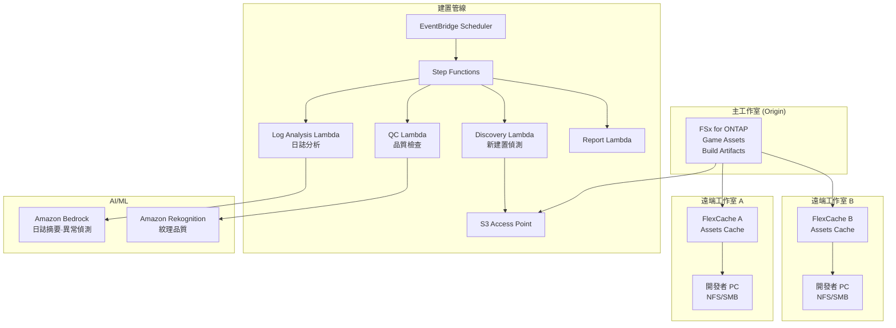

# Gaming Build Pipeline — 遊戲資產共享·建置管線

🌐 **Language / 言語**: [日本語](README.md) | [English](README.en.md) | [한국어](README.ko.md) | [简体中文](README.zh-CN.md) | 繁體中文 | [Français](README.fr.md) | [Deutsch](README.de.md) | [Español](README.es.md)

## 概述

將遊戲開發工作室檔案伺服器（FSx for ONTAP）上的遊戲資產（紋理、模型、著色器、建置產物）透過 FlexCache 在全球工作室間共享，並透過 S3 Access Points 自動化建置管線的品質檢查與日誌分析的模式。

## 解決的課題

| 課題 | 本模式的解決方案 |
|------|-------------------|
| 全球工作室間的資產同步延遲 | 使用 FlexCache 進行據點間快取 |
| 建置產物品質檢查的手動化 | 使用 S3 AP + Lambda 自動 QC |
| 著色器編譯日誌分析 | 使用 Athena + Bedrock 自動分析 |
| CI/CD 管線的儲存瓶頸 | 使用 FlexCache 加速讀取 |
| 資產版本管理的複雜化 | 中繼資料自動擷取·編目 |

## 架構



## 遊戲資產分類

| 資產類型 | 存取模式 | FlexCache 適用 | S3 AP 使用 |
|------------|---------------|:---:|:---:|
| 紋理 (.png, .tga, .dds) | 讀取為主 | ✅ | ✅ 品質檢查 |
| 3D 模型 (.fbx, .obj, .usd) | 讀取為主 | ✅ | ⚠️ 二進位 |
| 著色器 (.hlsl, .glsl) | 讀取為主 | ✅ | ✅ 編譯日誌 |
| 建置產物 (.exe, .pak) | 寫入 → 發佈 | ❌ | ✅ 中繼資料 |
| CI 日誌 (.log, .json) | 寫入 → 分析 | ❌ | ✅ 分析 |
| 動畫 (.anim, .fbx) | 讀取為主 | ✅ | ⚠️ 二進位 |

## FlexCache 的作用

- 將主工作室的資產快取到遠端工作室
- 加速建置伺服器的大量讀取
- 改善美術師的工作環境（低延遲）
- 透過 S3 AP 為建置管線自動化提供資料

## 預期效果

| KPI | 無 FlexCache | 有 FlexCache | 改善率 |
|-----|--------------|---------------|--------|
| 資產同步時間 | 30-60分 | 3-5分 | 90% |
| 建置時間 | 45分 | 25分 | 44% |
| 美術師等待時間 | 5-10分/檔案 | <1分 | 80% |
| WAN 傳輸量/日 | 200GB | 20GB | 90% |

## 目錄結構

```
gaming-build-pipeline/
├── README.md
├── template.yaml
├── functions/
│   ├── discovery/handler.py
│   ├── quality_check/handler.py
│   ├── log_analysis/handler.py
│   └── report/handler.py
├── tests/
├── events/
│   └── sample-input.json
└── docs/
    ├── architecture.md
    ├── demo-guide.md
    └── poc-checklist.md
```

## 目標遊戲引擎

- Unreal Engine 5
- Unity
- Godot
- 自訂引擎

## 相關連結

- [media-vfx/](../media-vfx/README.md) — 算圖管線
- [Dynamic FlexCache Render Workflow](../dynamic-flexcache-render-workflow/README.md)
- [FlexCache AnyCast / DR](../flexcache-anycast-dr/README.md)
- [產業·工作負載對應](../docs/industry-workload-mapping.md)


## Success Metrics

### Outcome
透過遊戲資產品質檢查·日誌分析的自動化，提高建置管線的品質管理效率。

### Metrics
| 指標 | 目標值（範例） |
|-----------|------------|
| QC 處理資產數 / 執行 | > 500 assets |
| 品質檢查通過率 | > 95% |
| 日誌分析處理時間 | < 5 分 |
| 建置品質問題的早期偵測率 | > 80% |
| Human Review 對象比率 | < 10%（品質不合格資產） |

### Measurement Method
Step Functions 執行歷程、QC 結果中繼資料、日誌分析報告、CloudWatch Metrics。


---

## AWS 文件連結

| 服務 | 文件 |
|---------|------------|
| FSx for ONTAP | [使用者指南](https://docs.aws.amazon.com/fsx/latest/ONTAPGuide/what-is-fsx-ontap.html) |
| S3 Access Points for FSx for ONTAP | [S3 AP 指南](https://docs.aws.amazon.com/fsx/latest/ONTAPGuide/s3-access-points.html) |
| Amazon Rekognition | [開發人員指南](https://docs.aws.amazon.com/rekognition/latest/dg/what-is.html) |
| Amazon Bedrock | [使用者指南](https://docs.aws.amazon.com/bedrock/latest/userguide/what-is-bedrock.html) |
| Amazon GameLift | [開發人員指南](https://docs.aws.amazon.com/gamelift/latest/developerguide/gamelift-intro.html) |
| Step Functions | [開發人員指南](https://docs.aws.amazon.com/step-functions/latest/dg/welcome.html) |

### Well-Architected Framework 對應

| 支柱 | 對應 |
|----|------|
| 卓越營運 | 結構化日誌、CloudWatch Metrics、建置日誌分析 |
| 安全性 | IAM 最小權限、KMS 加密、資產保護 |
| 可靠性 | Step Functions Retry/Catch、Map state 平行處理 |
| 效能效率 | Lambda ARM64、紋理品質檢查平行化 |
| 成本最佳化 | 無伺服器、隨需執行 |
| 永續性 | 自動刪除不需要的建置產物 |

### 相關 AWS 解決方案

- [AWS for Games](https://aws.amazon.com/gametech/)
- [Amazon GameLift](https://aws.amazon.com/gamelift/)
- [AWS Game Tech Blog](https://aws.amazon.com/blogs/gametech/)


---

## 成本估算（每月概算）

> **附註**: 以下為 ap-northeast-1 區域的概算，實際成本因使用量而異。最新價格請於 [AWS Pricing Calculator](https://calculator.aws/) 確認。

### 無伺服器元件（依用量計費）

| 服務 | 單價 | 預估使用量 | 每月概算 |
|---------|------|-----------|---------|
| Lambda | $0.0000166667/GB-sec | 4 函式 × 50 assets/日 | ~$1-5 |
| S3 API (GetObject/ListObjects) | $0.0047/10K requests | ~10K requests/日 | ~$1.5 |
| Step Functions | $0.025/1K state transitions | ~1K transitions/日 | ~$0.75 |
| Bedrock (Nova Lite) | $0.00006/1K input tokens | ~30K tokens/執行 | ~$3-10 |
| Athena | $5/TB scanned | N/A | ~$0.5-2 |
| SNS | $0.50/100K notifications | ~100 notifications/日 | ~$0.15 |
| CloudWatch Logs | $0.76/GB ingested | ~1 GB/月 | ~$0.76 |
| Rekognition | $0.001/image |


### 固定成本（FSx for ONTAP — 以現有環境為前提）

| 元件 | 每月 |
|--------------|------|
| FSx for ONTAP (128 MBps, 1 TB) | ~$230 (共享現有環境) |
| S3 Access Point | 無額外費用（僅 S3 API 費用） |

### 合計概算

| 組態 | 每月概算 |
|------|---------|
| 最小組態（每日 1 次執行） | ~$5-15 |
| 標準組態（每小時執行） | ~$15-50 |
| 大規模組態（高頻率 + 警示） | ~$50-150 |

> **Governance Caveat**: 成本估算為概算，並非保證值。實際帳單金額因使用模式、資料量、區域而異。

---

## 本機測試

### Prerequisites 檢查

```bash
# 確認前提條件
aws --version          # AWS CLI v2
sam --version          # SAM CLI
python3 --version      # Python 3.9+
docker --version       # Docker (sam local 用)
aws sts get-caller-identity  # AWS 認證資訊
```

### sam local invoke

```bash
# 建置
# 前提：需要 AWS SAM CLI。sam build 會自動封裝程式碼。
sam build

# 本機執行 Discovery Lambda
sam local invoke DiscoveryFunction --event events/discovery-event.json

# 附帶環境變數覆寫
sam local invoke DiscoveryFunction \
  --event events/discovery-event.json \
  --env-vars env.json
```

### 單元測試

```bash
python3 -m pytest tests/ -v
```

詳情請參閱 [本機測試快速入門](../docs/local-testing-quick-start.md)。

---

## 輸出範例 (Output Sample)

遊戲建置管線品質檢查的輸出範例:

```json
{
  "discovery": {
    "status": "completed",
    "object_count": 30,
    "categories": {"texture": 15, "model": 8, "build_log": 7}
  },
  "texture_qc": [
    {
      "key": "builds/v2.1/textures/character_hero.dds",
      "resolution": "4096x4096",
      "format": "BC7",
      "mip_levels": 12,
      "quality_score": 0.95,
      "issues": []
    }
  ],
  "build_log_analysis": {
    "total_warnings": 23,
    "total_errors": 0,
    "critical_issues": [],
    "build_time_sec": 1847,
    "asset_count": 1234
  },
  "report": {
    "build_version": "v2.1",
    "overall_quality": "PASS",
    "textures_passed": 14,
    "textures_failed": 1,
    "recommendation": "1 texture below minimum resolution - review before release"
  }
}
```

> **附註**: 以上為範例輸出，實際值因環境·輸入資料而異。基準數值為 sizing reference，並非 service limit。

---

## Performance Considerations

- FSx for ONTAP 的輸送量容量在 NFS/SMB/S3AP 之間共享
- 透過 S3 Access Point 的延遲會產生數十毫秒的額外負擔
- 處理大量檔案時，請透過 Step Functions Map state 的 MaxConcurrency 控制平行度
- 增加 Lambda 記憶體大小也有助於提升網路頻寬

> **附註**: 本模式的效能數值為 sizing reference，並非 service limit。實際環境中的效能因 FSx for ONTAP 輸送量容量、網路組態、並行執行工作負載而異。

---

## 部署

使用 AWS SAM CLI 部署（請將預留位置替換為您的環境值）:

```bash
# 前提：需要 AWS SAM CLI。sam build 會自動封裝程式碼。
sam build

sam deploy \
  --stack-name fsxn-gaming-build-pipeline \
  --parameter-overrides \
    S3AccessPointAlias=<your-s3ap-alias> \
    S3AccessPointName=<your-s3ap-name> \
    NotificationEmail=<your-email@example.com> \
  --capabilities CAPABILITY_NAMED_IAM \
  --resolve-s3 \
  --region <your-region>
```

> **注意**: `template.yaml` 用於 SAM CLI（`sam build` + `sam deploy`）。
> 如需使用 `aws cloudformation deploy` 命令直接部署，請使用 `template-deploy.yaml`（需要預先封裝 Lambda zip 檔案並上傳到 S3）。

## Governance Note

> 本模式提供技術架構指導。不構成法律·合規·法規建議。組織應諮詢合格的專業人員。
