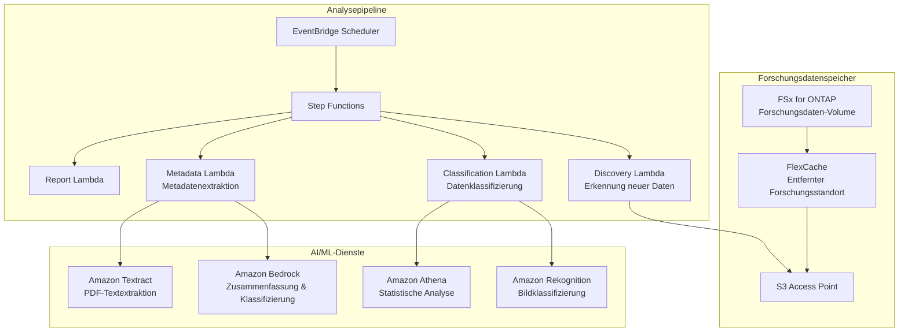

# Life Sciences Research — Muster für Forschungsdatenanalyse

🌐 **Language / 言語**: [日本語](README.md) | [English](README.en.md) | [한국어](README.ko.md) | [简体中文](README.zh-CN.md) | [繁體中文](README.zh-TW.md) | [Français](README.fr.md) | Deutsch | [Español](README.es.md)

## Übersicht

Ein Muster zur serverlosen Analyse von Forschungsdaten (Bilder, Sequenzierungsergebnisse, Artikel-PDFs) auf dem Dateiserver (FSx for ONTAP) einer Life-Sciences-Forschungseinrichtung über S3 Access Points. FlexCache beschleunigt den Datenzugriff zwischen Forschungsstandorten.

## Gelöste Herausforderungen

| Herausforderung | Lösung durch dieses Muster |
|------|-------------------|
| Latenz bei der Datenfreigabe zwischen Forschungsstandorten | Standortübergreifendes Caching mit FlexCache |
| Manuelle Klassifizierung großer Mengen von Forschungsbildern | Automatische Klassifizierung mit S3 AP + Rekognition |
| Metadatenverwaltung von Artikel-PDFs | Automatische Extraktion mit S3 AP + Textract + Bedrock |
| Qualitätsprüfung von Sequenzierungsdaten | Automatisches QC mit Lambda + Athena |
| Compliance (Datenaufbewahrung) | Audit-Protokolle + automatische Berichte |

## Architektur



## Zieldaten

| Datentyp | Erweiterungen | Verarbeitung | FlexCache angewendet |
|-----------|--------|---------|:---:|
| Mikroskopiebilder | .tiff, .nd2, .czi | Bildklassifizierung, Qualitätsprüfung | ✅ |
| Sequenzierungsergebnisse | .fastq, .bam, .vcf | QC, Aggregation von Variant Calls | ✅ |
| Artikel-PDFs | .pdf | Textextraktion, Zusammenfassung, Zitationsanalyse | ✅ |
| Experimentprotokolle | .csv, .xlsx | Statistische Analyse, Anomalieerkennung | ⚠️ Hohe Aktualisierungsfrequenz |
| Protokolle | .docx, .md | Metadatenextraktion | ✅ |

## Bezug zu bestehenden Anwendungsfällen

| Zugehöriger UC | Bezugspunkt |
|---------|------------|
| [healthcare-dicom/](../healthcare-dicom/) | Gemeinsames Muster für medizinische Bildverarbeitung |
| [genomics-pipeline/](../genomics-pipeline/) | Gemeinsames Muster für Sequenzierungsdatenverarbeitung |
| [education-research/](../education-research/) | Gemeinsames Muster für Artikel-PDF-Klassifizierung |
| [genai-rag-enterprise-files/](../genai-rag-enterprise-files/) | Gemeinsame RAG-Pipeline |

## Rolle von FlexCache

- Forschungsdaten der Zentrale im FlexCache jedes Standorts zwischenspeichern
- WAN-Übertragung großer Bilddaten reduzieren
- Daten in der Nähe der AI-Verarbeitungsumgebung platzieren
- Über S3 AP für die serverlose Analyse bereitstellen

## Verzeichnisstruktur

```
life-sciences-research/
├── README.md
├── template.yaml
├── functions/
│   ├── discovery/handler.py
│   ├── classification/handler.py
│   ├── metadata_extraction/handler.py
│   └── report/handler.py
├── tests/
├── events/
│   └── sample-input.json
└── docs/
    ├── architecture.md
    ├── demo-guide.md
    └── poc-checklist.md
```

## Verwandte Links

- [FlexCache AnyCast / DR](../flexcache-anycast-dr/README.md)
- [Branchen-/Workload-Zuordnung](../docs/industry-workload-mapping.md)
- [Support-Matrix](../docs/support-matrix-fsx-ontap-flexcache-s3ap.md)


## Success Metrics

### Outcome
Förderung der Nutzung von Forschungsdaten durch automatische Klassifizierung und Metadatenextraktion von Forschungsdaten (Bilder, Sequenzen, Artikel).

### Metrics
| Metrik | Zielwert (Beispiel) |
|-----------|------------|
| Klassifizierte Dateien pro Ausführung | > 100 files |
| Klassifizierungsgenauigkeit | > 85% |
| Erfolgsrate der Metadatenextraktion | > 90% |
| Verarbeitungszeit pro Datei | < 30 Sek. |
| Human-Review-Rate | < 20% (Daten mit unsicherer Klassifizierung) |

### Measurement Method
Step Functions-Ausführungsverlauf, Metadaten der Klassifizierungsergebnisse, CloudWatch Metrics.


---

## AWS-Dokumentationslinks

| Dienst | Dokumentation |
|---------|------------|
| FSx for ONTAP | [Benutzerhandbuch](https://docs.aws.amazon.com/fsx/latest/ONTAPGuide/what-is-fsx-ontap.html) |
| S3 Access Points for FSx for ONTAP | [S3 AP-Handbuch](https://docs.aws.amazon.com/fsx/latest/ONTAPGuide/s3-access-points.html) |
| AWS HealthOmics | [Benutzerhandbuch](https://docs.aws.amazon.com/omics/latest/dev/what-is-service.html) |
| Amazon Rekognition | [Entwicklerhandbuch](https://docs.aws.amazon.com/rekognition/latest/dg/what-is.html) |
| Amazon Comprehend | [Entwicklerhandbuch](https://docs.aws.amazon.com/comprehend/latest/dg/what-is.html) |
| Amazon Bedrock | [Benutzerhandbuch](https://docs.aws.amazon.com/bedrock/latest/userguide/what-is-bedrock.html) |
| Step Functions | [Entwicklerhandbuch](https://docs.aws.amazon.com/step-functions/latest/dg/welcome.html) |

### Well-Architected Framework-Zuordnung

| Säule | Zuordnung |
|----|------|
| Operational Excellence | Strukturierte Protokollierung, CloudWatch Metrics, Nachverfolgung von Klassifizierungsergebnissen |
| Sicherheit | IAM-Least-Privilege, KMS-Verschlüsselung, Schutz von Forschungsdaten |
| Zuverlässigkeit | Step Functions Retry/Catch, Map-State-Parallelverarbeitung |
| Leistungseffizienz | Lambda ARM64, Verarbeitungsoptimierung nach Dateityp |
| Kostenoptimierung | Serverless, On-Demand-Ausführung |
| Nachhaltigkeit | Empfohlene Archivierung unnötiger Daten, Lebenszyklusverwaltung |

### Verwandte AWS-Lösungen

- [AWS for Health & Life Sciences](https://aws.amazon.com/health/)
- [AWS HealthOmics](https://aws.amazon.com/omics/)
- [Genomics Workflows on AWS](https://aws.amazon.com/solutions/implementations/genomics-secondary-analysis-using-aws-step-functions-and-aws-batch/)


---

## Kostenschätzung (monatlicher Näherungswert)

> **Hinweis**: Die folgenden Angaben sind Näherungswerte für die Region ap-northeast-1; die tatsächlichen Kosten variieren je nach Nutzung. Prüfen Sie die aktuellen Preise mit dem [AWS Pricing Calculator](https://calculator.aws/).

### Serverlose Komponenten (nutzungsbasiert)

| Dienst | Stückpreis | Angenommene Nutzung | Monatlicher Näherungswert |
|---------|------|-----------|---------|
| Lambda | $0.0000166667/GB-sec | 4 Funktionen × 30 files/Tag | ~$1-5 |
| S3 API (GetObject/ListObjects) | $0.0047/10K requests | ~10K requests/Tag | ~$1.5 |
| Step Functions | $0.025/1K state transitions | ~1K transitions/Tag | ~$0.75 |
| Bedrock (Nova Lite) | $0.00006/1K input tokens | ~20K tokens/Ausführung | ~$3-10 |
| Athena | $5/TB scanned | N/A | ~$0.5-2 |
| SNS | $0.50/100K notifications | ~100 notifications/Tag | ~$0.15 |
| CloudWatch Logs | $0.76/GB ingested | ~1 GB/Monat | ~$0.76 |

### Fixkosten (FSx for ONTAP — vorhandene Umgebung vorausgesetzt)

| Komponente | Monatlich |
|--------------|------|
| FSx for ONTAP (128 MBps, 1 TB) | ~$230 (mit vorhandener Umgebung geteilt) |
| S3 Access Point | Keine zusätzlichen Gebühren (nur S3-API-Gebühren) |

### Gesamtschätzung

| Konfiguration | Monatlicher Näherungswert |
|------|---------|
| Minimale Konfiguration (1× täglich) | ~$5-15 |
| Standardkonfiguration (stündlich) | ~$15-50 |
| Große Konfiguration (hohe Frequenz + Alarme) | ~$50-150 |

> **Governance Caveat**: Kostenschätzungen sind Näherungswerte, keine garantierten Werte. Die tatsächliche Abrechnung variiert je nach Nutzungsmuster, Datenvolumen und Region.

---

## Lokales Testen

### Prerequisites-Prüfung

```bash
# Voraussetzungen prüfen
aws --version          # AWS CLI v2
sam --version          # SAM CLI
python3 --version      # Python 3.9+
docker --version       # Docker (für sam local)
aws sts get-caller-identity  # AWS-Anmeldeinformationen
```

### sam local invoke

```bash
# Build
# Voraussetzung: AWS SAM CLI erforderlich. „sam build“ packt den Code automatisch.
sam build

# Discovery Lambda lokal ausführen
sam local invoke DiscoveryFunction --event events/discovery-event.json

# Mit Überschreibung der Umgebungsvariablen
sam local invoke DiscoveryFunction \
  --event events/discovery-event.json \
  --env-vars env.json
```

### Unit-Tests

```bash
python3 -m pytest tests/ -v
```

Weitere Informationen finden Sie im [Schnellstart für lokales Testen](../docs/local-testing-quick-start.md).

---

## Ausgabebeispiel (Output Sample)

Beispielausgabe der Klassifizierungspipeline für Life-Sciences-Forschungsdaten:

```json
{
  "discovery": {
    "status": "completed",
    "object_count": 20,
    "categories": {"microscopy": 8, "sequence": 7, "research_pdf": 5}
  },
  "classification": [
    {
      "key": "research/experiment-001/image-confocal.tiff",
      "data_type": "confocal_microscopy",
      "resolution": "2048x2048",
      "channels": 4,
      "metadata_extracted": true
    },
    {
      "key": "research/experiment-001/reads.fastq.gz",
      "data_type": "rna_seq",
      "read_count": 15000000,
      "quality_score_avg": 35.2
    }
  ],
  "report": {
    "total_classified": 20,
    "categories_found": 3,
    "storage_recommendation": "archive microscopy raw data after 90 days"
  }
}
```

> **Hinweis**: Das Obige ist eine Beispielausgabe; die tatsächlichen Werte variieren je nach Umgebung und Eingabedaten. Benchmark-Zahlen sind eine sizing reference, kein service limit.

---

## Performance Considerations

- Die Durchsatzkapazität von FSx for ONTAP wird von NFS/SMB/S3AP gemeinsam genutzt
- Der Zugriff über S3 Access Point verursacht einen Latenz-Overhead von einigen zehn Millisekunden
- Steuern Sie bei der Verarbeitung großer Dateimengen den Parallelitätsgrad über die MaxConcurrency des Step Functions Map state
- Eine Erhöhung der Lambda-Speichergröße trägt auch zur Verbesserung der Netzwerkbandbreite bei

> **Hinweis**: Die Leistungszahlen dieses Musters sind eine sizing reference, kein service limit. Die Leistung in realen Umgebungen variiert je nach Durchsatzkapazität von FSx for ONTAP, Netzwerkkonfiguration und gleichzeitig laufenden Workloads.

---

## Branchenreferenzfälle / Industry Reference Cases

> **Evidence Tier**: Public (aus offiziellen Blogs / Konferenzsessions)

### AstraZeneca: Multi-Agent-System (DAIS 2026)

AstraZeneca hat ein Multi-Agent-System aufgebaut, mit dem kommerzielle Teams therapiebereichsübergreifend auf Arzneimitteldaten (strukturiert + unstrukturiert, 400.000+ klinische Dokumente) zugreifen. Ein Supervisor Agent koordiniert therapiebereichsspezifische Sub-Agenten unter Wahrung der Berechtigungsgrenzen und skaliert von 5 → 20+ Agenten.

- **Ergebnisse**: 10x-Skalierung der Agenten (5 PoC → 20+ Produktion, 50+ entworfen)
- **Architektur**: Supervisor Agent + therapiebereichsspezifische Sub-Agenten + strukturierte Datenabfrage + RAG für unstrukturierte Dokumente + Zeilen-/Spaltenebene-Sicherheit
- **Wichtigste Erkenntnisse**: Berechtigungserhaltende Gestaltung, Kriterien für Supervisor-Aufteilung vs. Hinzufügen von Agenten, Human-in-the-Loop-Tests, Bedeutung der Datenqualität
- **Bezug zu FSx for ONTAP**: Große Mengen klinischer Dokumente auf NAS-Freigaben speichern → AI-Pipeline greift über S3 AP zu → ACL-Metadaten extrahieren und in die Vektor-DB propagieren → Suche mit therapiebereichsspezifischen Berechtigungsfiltern

Dieses Muster (UC7) bietet eine Architektur, die dieselbe Problemklasse (AI-Analyse + Klassifizierung von Forschungsdokumenten) mit FSx for ONTAP S3 AP + AWS Bedrock löst. Die Multi-Agent-Erweiterung kann über therapiebereichsspezifisches Routing mit Step Functions realisiert werden.

Detaillierte Analyse: [DAIS 2026 Agent Bricks Fallanalyse](../docs/investigations/dais2026-agent-bricks-industry-cases.md)

Sources:
- [DAIS 2026 Session: AstraZeneca's Multi-Agent System](https://www.databricks.com/dataaisummit/session/astrazenecas-multi-agent-system-lessons-scaling-agents-10x-agent-bricks)
- [Agent Bricks DAIS 2026 Blog](https://www.databricks.com/blog/agent-bricks-dais-2026)

---

## Bereitstellung

Bereitstellung mit dem AWS SAM CLI (ersetzen Sie die Platzhalter entsprechend Ihrer Umgebung):

```bash
# Voraussetzung: AWS SAM CLI erforderlich. „sam build“ packt den Code automatisch.
sam build

sam deploy \
  --stack-name fsxn-life-sciences-research \
  --parameter-overrides \
    S3AccessPointAlias=<your-s3ap-alias> \
    S3AccessPointName=<your-s3ap-name> \
    NotificationEmail=<your-email@example.com> \
  --capabilities CAPABILITY_NAMED_IAM \
  --resolve-s3 \
  --region <your-region>
```

> **Achtung**: `template.yaml` ist für die Verwendung mit dem SAM CLI (`sam build` + `sam deploy`) vorgesehen.
> Um direkt mit dem Befehl `aws cloudformation deploy` bereitzustellen, verwenden Sie stattdessen `template-deploy.yaml` (erfordert das Vorab-Packen der Lambda-Zip-Dateien und deren Upload nach S3).

## Governance Note

> Dieses Muster bietet technische Architekturhinweise. Es stellt keine rechtliche, Compliance- oder regulatorische Beratung dar. Organisationen sollten qualifizierte Fachleute konsultieren.
