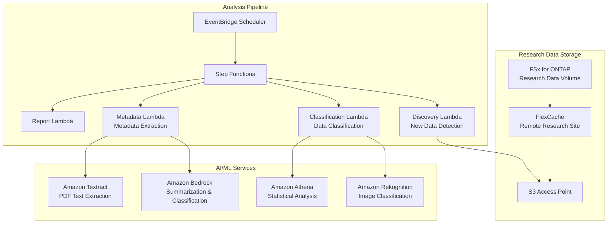

# Life Sciences Research — Research Data Analysis Pattern

🌐 **Language / 言語**: [日本語](README.md) | English | [한국어](README.ko.md) | [简体中文](README.zh-CN.md) | [繁體中文](README.zh-TW.md) | [Français](README.fr.md) | [Deutsch](README.de.md) | [Español](README.es.md)

## Overview

A pattern for serverlessly analyzing research data (images, sequence results, research paper PDFs) on a life sciences research organization's file server (FSx for ONTAP) via S3 Access Points. FlexCache accelerates data access between research sites.

## Problems Solved

| Problem | Solution with This Pattern |
|------|-------------------|
| Data sharing latency between research sites | Inter-site caching with FlexCache |
| Manual classification of large volumes of research images | Automated classification with S3 AP + Rekognition |
| Metadata management for research paper PDFs | Automated extraction with S3 AP + Textract + Bedrock |
| Quality checks for sequence data | Automated QC with Lambda + Athena |
| Compliance (data retention) | Audit logs + automated reports |

## Architecture



## Target Data

| Data Type | Extensions | Processing | FlexCache Applied |
|-----------|--------|---------|:---:|
| Microscopy images | .tiff, .nd2, .czi | Image classification, quality checks | ✅ |
| Sequence results | .fastq, .bam, .vcf | QC, variant call aggregation | ✅ |
| Research paper PDFs | .pdf | Text extraction, summarization, citation analysis | ✅ |
| Experiment logs | .csv, .xlsx | Statistical analysis, anomaly detection | ⚠️ High update frequency |
| Protocols | .docx, .md | Metadata extraction | ✅ |

## Related Use Cases

| Related UC | Relevance |
|---------|------------|
| [healthcare-dicom/](../healthcare-dicom/) | Shared medical imaging processing pattern |
| [genomics-pipeline/](../genomics-pipeline/) | Shared sequence data processing pattern |
| [education-research/](../education-research/) | Shared research paper PDF classification pattern |
| [genai-rag-enterprise-files/](../genai-rag-enterprise-files/) | Shared RAG pipeline |

## Role of FlexCache

- Cache headquarters research data in each site's FlexCache
- Reduce WAN transfer of large image data
- Place data near the AI processing environment
- Provide to serverless analysis via S3 AP

## Directory Structure

```
life-sciences-research/
├── README.md
├── template.yaml
├── functions/
│   ├── discovery/handler.py
│   ├── classification/handler.py
│   ├── metadata_extraction/handler.py
│   └── report/handler.py
├── tests/
├── events/
│   └── sample-input.json
└── docs/
    ├── architecture.md
    ├── demo-guide.md
    └── poc-checklist.md
```

## Related Links

- [FlexCache AnyCast / DR](../flexcache-anycast-dr/README.md)
- [Industry / Workload Mapping](../docs/industry-workload-mapping.md)
- [Support Matrix](../docs/support-matrix-fsx-ontap-flexcache-s3ap.md)


## Success Metrics

### Outcome
Promote research data utilization through automated classification and metadata extraction of research data (images, sequences, papers).

### Metrics
| Metric | Target (example) |
|-----------|------------|
| Files classified per execution | > 100 files |
| Classification accuracy | > 85% |
| Metadata extraction success rate | > 90% |
| Processing time per file | < 30 sec |
| Human Review rate | < 20% (low-confidence data) |

### Measurement Method
Step Functions execution history, classification result metadata, CloudWatch Metrics.


---

## AWS Documentation Links

| Service | Documentation |
|---------|------------|
| FSx for ONTAP | [User Guide](https://docs.aws.amazon.com/fsx/latest/ONTAPGuide/what-is-fsx-ontap.html) |
| S3 Access Points for FSx for ONTAP | [S3 AP Guide](https://docs.aws.amazon.com/fsx/latest/ONTAPGuide/s3-access-points.html) |
| AWS HealthOmics | [User Guide](https://docs.aws.amazon.com/omics/latest/dev/what-is-service.html) |
| Amazon Rekognition | [Developer Guide](https://docs.aws.amazon.com/rekognition/latest/dg/what-is.html) |
| Amazon Comprehend | [Developer Guide](https://docs.aws.amazon.com/comprehend/latest/dg/what-is.html) |
| Amazon Bedrock | [User Guide](https://docs.aws.amazon.com/bedrock/latest/userguide/what-is-bedrock.html) |
| Step Functions | [Developer Guide](https://docs.aws.amazon.com/step-functions/latest/dg/welcome.html) |

### Well-Architected Framework Alignment

| Pillar | Implementation |
|----|------|
| Operational Excellence | Structured logging, CloudWatch Metrics, classification result tracking |
| Security | IAM least privilege, KMS encryption, research data protection |
| Reliability | Step Functions Retry/Catch, Map state parallel processing |
| Performance Efficiency | Lambda ARM64, per-file-type processing optimization |
| Cost Optimization | Serverless, on-demand execution |
| Sustainability | Recommended archival of unnecessary data, lifecycle management |

### Related AWS Solutions

- [AWS for Health & Life Sciences](https://aws.amazon.com/health/)
- [AWS HealthOmics](https://aws.amazon.com/omics/)
- [Genomics Workflows on AWS](https://aws.amazon.com/solutions/implementations/genomics-secondary-analysis-using-aws-step-functions-and-aws-batch/)


---

## Cost Estimate (Monthly Approximate)

> **Note**: The following are approximate figures for the ap-northeast-1 region; actual costs vary by usage. Check the latest pricing with the [AWS Pricing Calculator](https://calculator.aws/).

### Serverless Components (Pay-as-you-go)

| Service | Unit Price | Assumed Usage | Monthly Estimate |
|---------|------|-----------|---------|
| Lambda | $0.0000166667/GB-sec | 4 functions × 30 files/day | ~$1-5 |
| S3 API (GetObject/ListObjects) | $0.0047/10K requests | ~10K requests/day | ~$1.5 |
| Step Functions | $0.025/1K state transitions | ~1K transitions/day | ~$0.75 |
| Bedrock (Nova Lite) | $0.00006/1K input tokens | ~20K tokens/execution | ~$3-10 |
| Athena | $5/TB scanned | N/A | ~$0.5-2 |
| SNS | $0.50/100K notifications | ~100 notifications/day | ~$0.15 |
| CloudWatch Logs | $0.76/GB ingested | ~1 GB/month | ~$0.76 |

### Fixed Costs (FSx for ONTAP — assumes existing environment)

| Component | Monthly |
|--------------|------|
| FSx for ONTAP (128 MBps, 1 TB) | ~$230 (shared with existing environment) |
| S3 Access Point | No additional charge (S3 API charges only) |

### Total Estimate

| Configuration | Monthly Estimate |
|------|---------|
| Minimal (once daily) | ~$5-15 |
| Standard (hourly) | ~$15-50 |
| Large-scale (high frequency + alarms) | ~$50-150 |

> **Governance Caveat**: Cost estimates are approximate, not guaranteed values. Actual billing varies by usage pattern, data volume, and region.

---

## Local Testing

### Prerequisites Check

```bash
# Check prerequisites
aws --version          # AWS CLI v2
sam --version          # SAM CLI
python3 --version      # Python 3.9+
docker --version       # Docker (for sam local)
aws sts get-caller-identity  # AWS credentials
```

### sam local invoke

```bash
# Build
# Prerequisite: AWS SAM CLI required. 'sam build' packages the function code automatically.
sam build

# Run the Discovery Lambda locally
sam local invoke DiscoveryFunction --event events/discovery-event.json

# With environment variable overrides
sam local invoke DiscoveryFunction \
  --event events/discovery-event.json \
  --env-vars env.json
```

### Unit Tests

```bash
python3 -m pytest tests/ -v
```

For details, see the [Local Testing Quick Start](../docs/local-testing-quick-start.md).

---

## Output Sample (Output Sample)

Example output of the life sciences research data classification pipeline:

```json
{
  "discovery": {
    "status": "completed",
    "object_count": 20,
    "categories": {"microscopy": 8, "sequence": 7, "research_pdf": 5}
  },
  "classification": [
    {
      "key": "research/experiment-001/image-confocal.tiff",
      "data_type": "confocal_microscopy",
      "resolution": "2048x2048",
      "channels": 4,
      "metadata_extracted": true
    },
    {
      "key": "research/experiment-001/reads.fastq.gz",
      "data_type": "rna_seq",
      "read_count": 15000000,
      "quality_score_avg": 35.2
    }
  ],
  "report": {
    "total_classified": 20,
    "categories_found": 3,
    "storage_recommendation": "archive microscopy raw data after 90 days"
  }
}
```

> **Note**: The above is sample output; actual values vary by environment and input data. Benchmark figures are a sizing reference, not a service limit.

---

## Performance Considerations

- FSx for ONTAP throughput capacity is shared across NFS/SMB/S3AP
- Access via S3 Access Point incurs tens of milliseconds of latency overhead
- For large-scale file processing, control the degree of parallelism with the Step Functions Map state MaxConcurrency
- Increasing Lambda memory size also improves network bandwidth

> **Note**: Performance figures for this pattern are a sizing reference, not a service limit. Real-world performance varies by FSx for ONTAP throughput capacity, network configuration, and concurrent workloads.

---

## Industry Reference Cases

> **Evidence Tier**: Public (from official blogs / conference sessions)

### AstraZeneca: Multi-Agent System (DAIS 2026)

AstraZeneca built a multi-agent system for commercial teams to access pharmaceutical data (structured + unstructured, 400K+ clinical documents) across therapeutic areas. A Supervisor Agent coordinates therapeutic-area-specific sub-agents while preserving permission boundaries, scaling from 5 PoC agents to 20+ production agents.

- **Results**: 10x agent scale (5 PoC → 20+ production, 50+ designed)
- **Architecture**: Supervisor Agent + therapeutic-area sub-agents + structured data query + unstructured document RAG + row/column-level security
- **Key lessons**: Permission-preserving design, criteria for supervisor split vs. agent addition, human-in-the-loop testing, importance of data quality
- **FSx for ONTAP relevance**: Store large volumes of clinical documents on NAS shares → AI pipeline accesses via S3 AP → extract ACL metadata and propagate to vector DB → search with therapeutic-area permission filters

This pattern (UC7) provides an architecture that solves the same class of problem (AI analysis + classification of research documents) using FSx for ONTAP S3 AP + AWS Bedrock. Multi-agent extension can be realized via therapeutic-area routing with Step Functions.

Detailed analysis: [DAIS 2026 Agent Bricks Case Analysis](../docs/investigations/dais2026-agent-bricks-industry-cases.md)

Sources:
- [DAIS 2026 Session: AstraZeneca's Multi-Agent System](https://www.databricks.com/dataaisummit/session/astrazenecas-multi-agent-system-lessons-scaling-agents-10x-agent-bricks)
- [Agent Bricks DAIS 2026 Blog](https://www.databricks.com/blog/agent-bricks-dais-2026)

---

## Deployment

Deploy with the AWS SAM CLI (replace the placeholders for your environment):

```bash
# Prerequisite: AWS SAM CLI required. 'sam build' packages the function code automatically.
sam build

sam deploy \
  --stack-name fsxn-life-sciences-research \
  --parameter-overrides \
    S3AccessPointAlias=<your-s3ap-alias> \
    S3AccessPointName=<your-s3ap-name> \
    NotificationEmail=<your-email@example.com> \
  --capabilities CAPABILITY_NAMED_IAM \
  --resolve-s3 \
  --region <your-region>
```

> **Note**: `template.yaml` is designed for use with the SAM CLI (`sam build` + `sam deploy`).
> To deploy directly with the `aws cloudformation deploy` command, use `template-deploy.yaml` instead (requires pre-packaging Lambda zip files and uploading them to S3).

## Governance Note

> This pattern provides technical architecture guidance. It does not constitute legal, compliance, or regulatory advice. Organizations should consult qualified professionals.
